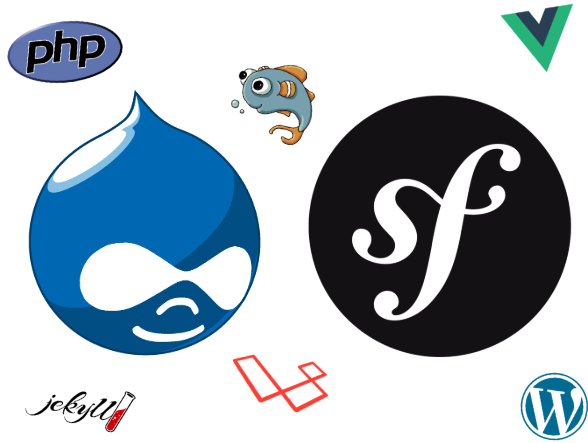

.. footer:: @opdavies

Deploying PHP with Ansible, Ansible Vault, and Ansistrano
#########################################################

|

.. class:: titleslideinfo

Oliver Davies, Inviqa

.. raw:: pdf

    TextAnnotation "Full stack Developer and Systems Administrator"
    TextAnnotation "Organiser of PHP South Wales"

.. page:: imagePage

.. include:: sections/building-a-lamp-stack.rst
.. include:: sections/basic-deployment.rst
.. include:: sections/ansible-vault.rst
.. include:: sections/ansistrano.rst

.. page:: titlePage

.. class:: centredtitle

Demo

.. include:: sections/generating-settings-files.rst
.. include:: sections/multiple-environments.rst

.. page:: standardPage

Thanks!
=======

References:

- https://oliverdavies.link/ansible-repos
- https://docs.ansible.com
- https://www.ansistrano.com
- https://symfonycasts.com/screencast/ansistrano

|

Me:

* https://www.oliverdavies.uk
