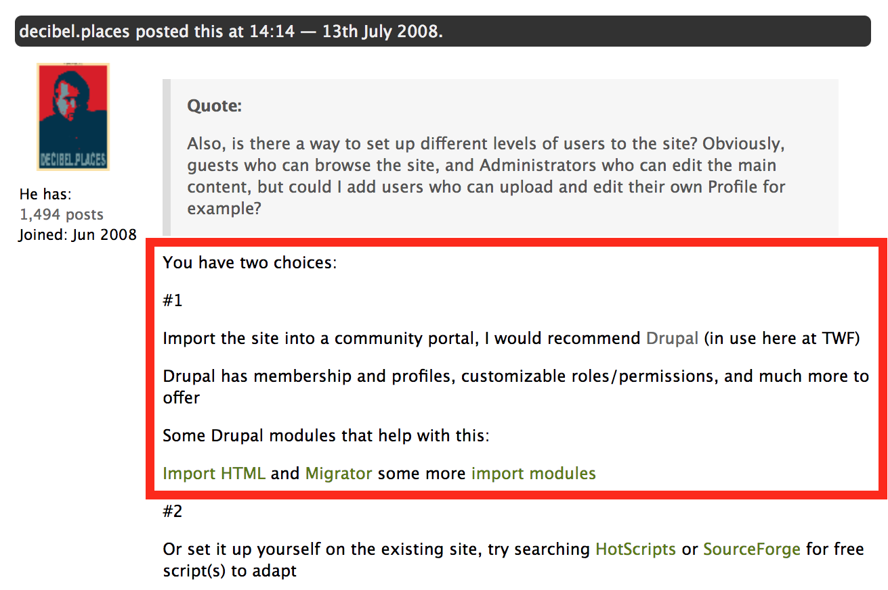
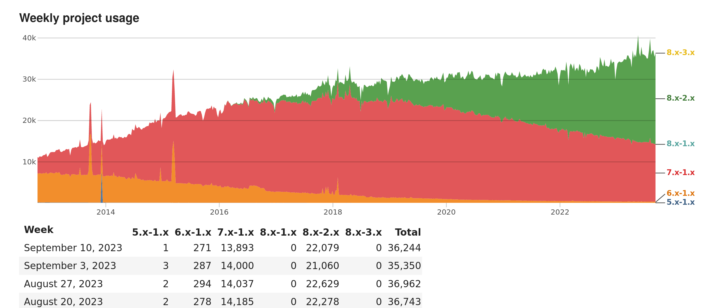
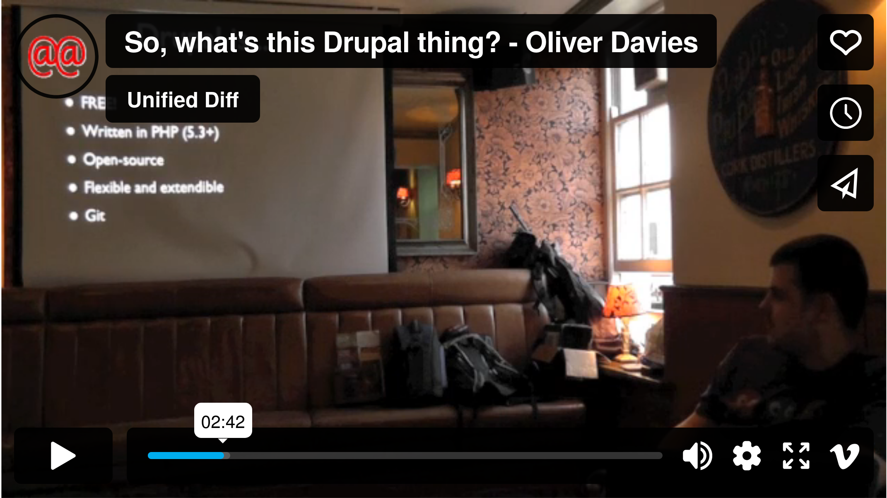
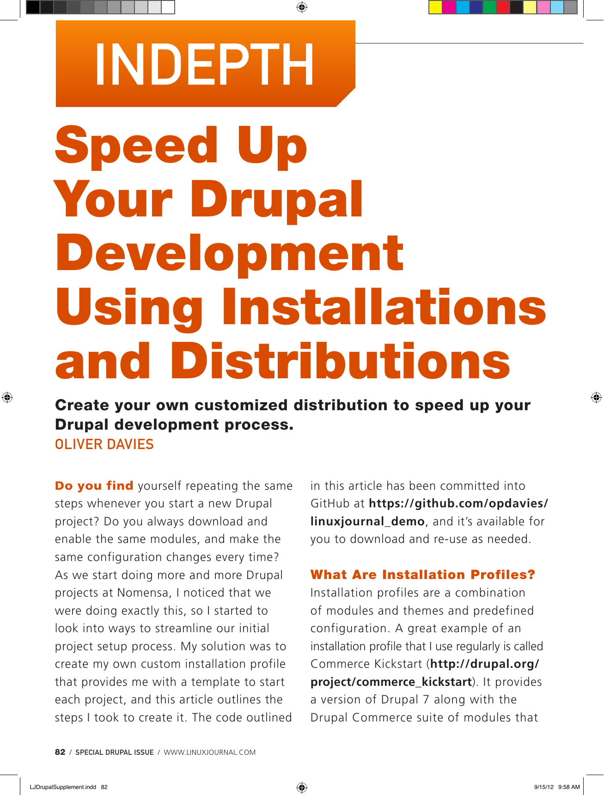
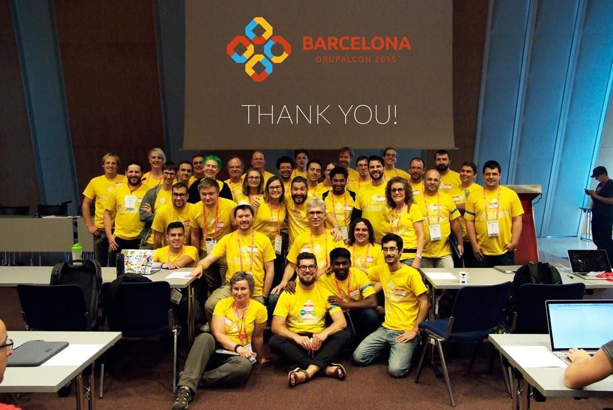
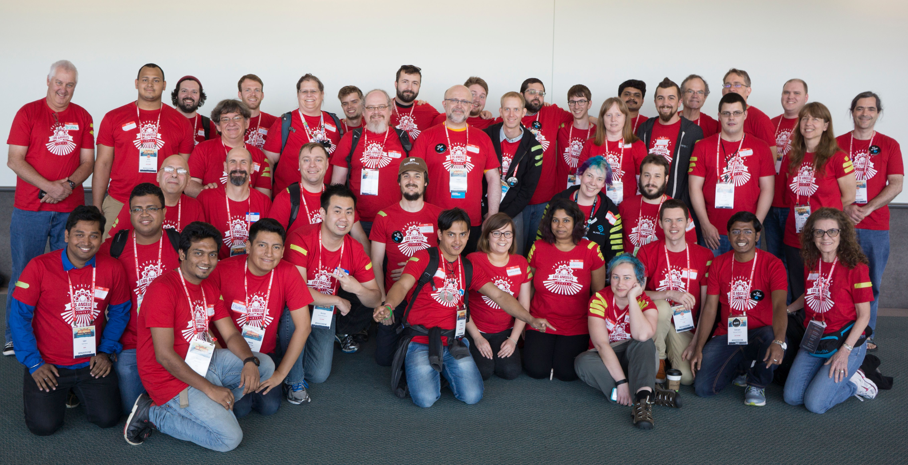
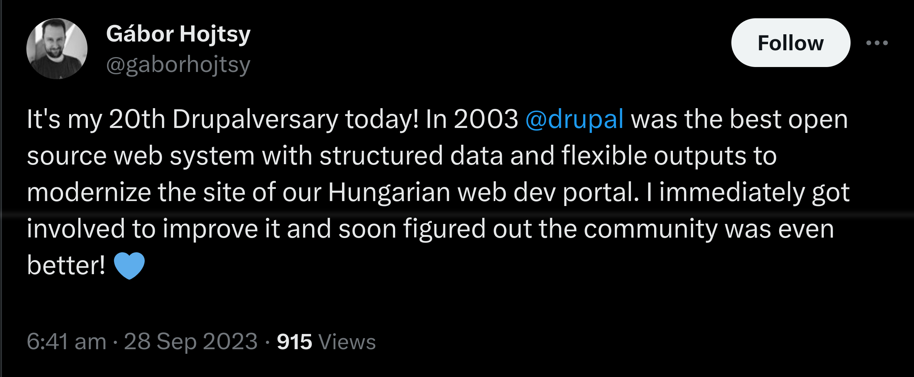
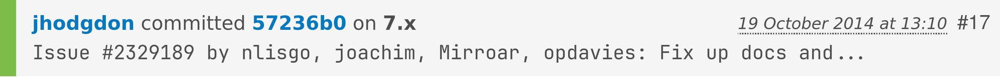
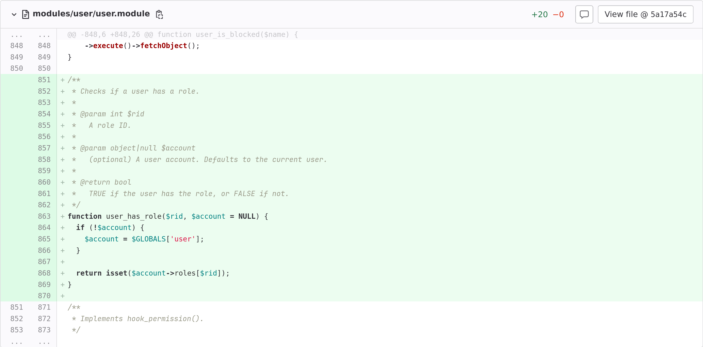

.. footer::

   @opdavies

Communities and Contribution
############################

|

.. class:: titleslideinfo

Oliver Davies (@opdavies)

.. raw:: pdf

   PageBreak standardPage

About Me
========

* Self-taught software developer (started in 2007).
* Full Stack Software Consultant.
* Web Development Manager at Transport for Wales.
* PHP and Drupal specialist.
* Open-source software maintainer and contributor.
* Meetup and conference organiser.
* School of Code mentor (BC14 and BC15).

.. raw:: pdf

   TextAnnotation "I'm a self-saught Software Developer. I started learning in 2007 and went full-time in 2010."
   TextAnnotation "Started at Transport for Wales as Lead Software Developer and I'm currently the Web Development Manager."
   TextAnnotation "T-shaped Developer."
   TextAnnotation "Used to organise Drupal and PHP meetups, DrupalCamp Bristol and I've been on the speaker selection committee for DrupalCon."

How I Started
=============

* Built a website for a Tae Kwon-Do school (HTML and CSS) in 2007.
* Learning from online resources like blogs, forums, YouTube, Lynda.com and Total Training.
* Learned more as the project developed, including PHP.
* Introduced to Drupal in an answer to a forum post.
* Started some freelance work and went full-time in 2010.

.. raw:: pdf

   TextAnnotation "This became my playground project."
   TextAnnotation "Started with HTML and CSS to build the first version and learned more as I needed to, e.g. adding a dynamic news section, instead of trying to learn everything upfront."
   TextAnnotation ""
   TextAnnotation "Getting time in the saddle and gaining experience."

   PageBreak imagePage

.. image:: images/timmillwood-ono.png
   :width: 22cm

.. raw:: pdf

   TextAnnotation "A few years later, I took an opportunity to maintain a popular Drupal module."

.. raw:: pdf

   TextAnnotation "Used on just over 9,000 websites in April 2012."
   TextAnnotation "Currently used on 36,000 active Drupal websites."

My first talk
=============

.. raw:: pdf

   TextAnnotation "September 2012."
   TextAnnotation "I've since given 92 talks at meetups and conferences, including this one."

   PageBreak

Writing for Linux Journal
=========================

.. raw:: pdf

   TextAnnotation "September 2012 as well?"
   TextAnnotation "Writing an article for Linux Journal as part of their special Drupal edition."

Attending DrupalCon
===================

.. image:: images/drupalcon-prague.jpeg
   :width: 18cm

.. raw:: pdf

   TextAnnotation "DrupalCon Prague 2013."
   TextAnnotation "1,800 attendees. ~2,000 for Europe and ~3,000 for U.S."
   TextAnnotation "Spoken at DrupalCon in 2019 and 2020."
   TextAnnotation "Worked for the Drupal Association as a Developer on Drupal.org."

Mentoring at DrupalCon
======================

.. raw:: pdf

   TextAnnotation "Mentoring new contributors at contribution days at DrupalCons."
   TextAnnotation ""
   TextAnnotation "I was interested in contributing but was asked to join as a mentor."
   TextAnnotation "3-6 people per table, working on their first contributions to Drupal core."

Mentoring at DrupalCon
======================

.. raw:: pdf

   TextAnnotation "Prague, Amsterdam, Los Angeles, Barcelona, Vienna, Amsterdam."

   PageBreak imagePage

.. raw:: pdf

   PageBreak standardPage

Contributing to Drupal core
===========================

.. raw:: pdf

   TextAnnotation "Later, I got my own commits to Drupal core."
   TextAnnotation "First was a documentation fix, the second was adding a new function."

Communities
===========

* Drupal and PHP
* JavaScript
* Linux and DevOps
* Tailwind CSS
* Neovim
* Accessibility and security
* School of Code (students and mentors)

.. raw:: pdf

   TextAnnotation "I found out about School of Code at a meetup!"
   TextAnnotation "Communities exist online and offline with mailing lists, forums, Slack and Discord groups, in-person and remote meetups and conferences."
   TextAnnotation "Communities and sub-communities e.g. PHP/Drupal, Linux/Nix."
   TextAnnotation "Mini-communities such as rst2pdf."

Why?
====

* Paying it forward.
* Giving something back.
* Helping me and others learn.
* Developing a personal brand.
* Building and growing a network.
* Improving opportunities.

.. raw:: pdf

   TextAnnotation "If I make money with free software, I can at least contribute back."
   TextAnnotation "Helping others helps me, and helping others to learn helps me learn."
   TextAnnotation "Developing 'soft/interpersonal skills'."
   TextAnnotation "Better career and work opportunities."

Summary
=======

* Software is not just about code.
* Communities are great for getting experience, learning and networking.
* Open-source, public speaking, blogging, mentoring look good on a CV.

Thanks!
=======

References:

* https://www.oliverdavies.uk/talks
* https://www.drupal.org
* https://meetup.com
* https://www.phpconference.co.uk

|

Me:

* https://www.oliverdavies.uk
* @opdavies
