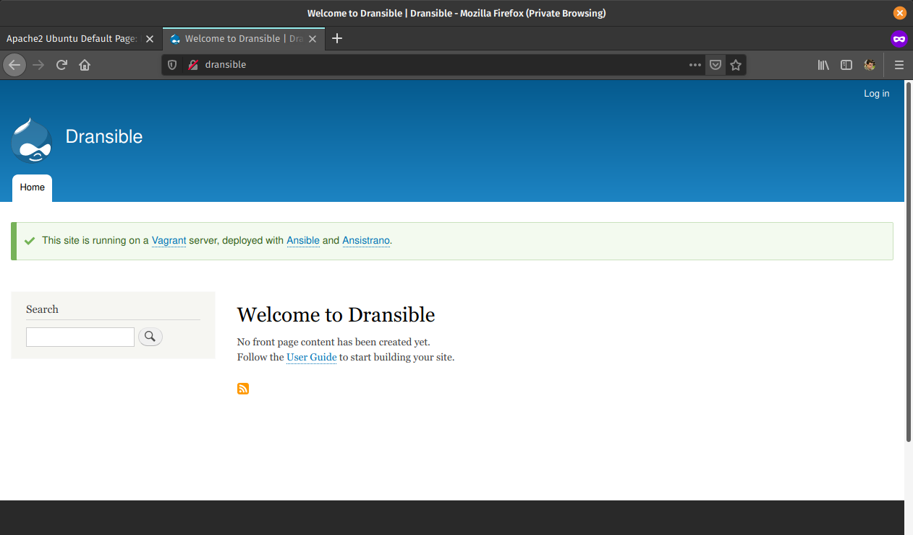

.. footer:: @opdavies

Deploying PHP with Ansible, Ansible Vault, and Ansistrano
#########################################################

|

.. class:: titleslideinfo

Oliver Davies, Inviqa

.. raw:: pdf

    TextAnnotation "Full stack Developer and Systems Administrator"
    TextAnnotation "Organiser of PHP South Wales"

.. page:: imagePage

.. image:: images/techs.png
  :width: 14cm

.. page:: standardPage

Things we'll be looking at
==========================

- **Ansible** crash course
- Keeping secrets with **Ansible Vault**
- Deployments with **Ansistrano**

.. page:: imagePage

|

|

.. page::

|

.. image:: images/logo-linode.png
  :width: 6cm

|

.. page:: standardPage

What is Ansible?
================

.. class:: text-lg

Ansible is an open-source **software provisioning**, **configuration management**, and **application-deployment** tool.

|

https://en.wikipedia.org/wiki/Ansible_(software)

.. page::

What is Ansible?
================

- CLI tool
- Configured with YAML
- Agentless, connects via SSH
- Jinja2 for templating
- Executes ad-hoc remote commands
- Installs software packages
- Performs deployment steps
- Batteries included

.. raw:: pdf

  TextAnnotation "- Written in Python but configured with Yaml."
  TextAnnotation "Drupal, Symfony and a lot of other projects use YAML."
  TextAnnotation "Nothing needed on the server, other than Python."
  TextAnnotation "First-party modules (SSH keys, file and directory management, package repositories, stopping/starting/restarting services, DO/Linode/AWS integration)."

.. page::

Why Ansible?
============

- Familiar syntax (Drupal 8, Symfony, Sculpin)
- Easily readable
- No server dependencies
- Easy to add to an existing project
- Includes relevant modules (Git, Composer)
- Idempotency, resulting in cleaner scripts

.. page:: titlePage

.. class:: centredtitle

Hosts / Inventories

.. page:: standardPage

hosts.ini
=========

.. code:: ini

    [webservers]
    192.168.33.10

    [webservers:vars]
    ansible_ssh_port=22
    ansible_ssh_user=opdavies

.. raw:: pdf

  TextAnnotation "Vagrant IP address."
  TextAnnotation "Supports wildcards and ranges"

hosts.yml
=========

.. code-block:: yaml

    ---
    all:
      children:
        webservers:
          hosts:
            192.168.33.10:
          vars:
            ansible_ssh_port: 22
            ansible_ssh_user: opdavies

.. raw:: pdf

  TextAnnotation "My prefered format."
  TextAnnotation "More consistency across the project, easier to copy variables from other places such as playbooks."

.. page:: titlePage

.. class:: centredtitle

Ad-hoc Commands

.. page::

.. class:: centredtitle

``ansible all -i hosts.yml
-m ping``

.. raw:: pdf

  TextAnnotation "Single ad-hoc command."
  TextAnnotation "-i = inventory"
  TextAnnotation "-m = module"

.. page:: standardPage

.. code:: json

    webservers | SUCCESS => {
        "ansible_facts": {
            "discovered_interpreter_python": "/usr/bin/python"
        },
        "changed": false,
        "ping": "pong"
    }

.. page:: titlePage

.. class:: centredtitle

``ansible all -i hosts.yml
-m command
-a "git pull --chdir=/app"``

.. raw:: pdf

  TextAnnotation "Update a codebase using "git pull""
  TextAnnotation "-a = (additional) arguments"
  TextAnnotation "--chdir = change directory"

.. page::

.. class:: centredtitle

``ansible all -i hosts.yml
-m git
-a "repo=https://github.com
/opdavies/dransible
--chdir=/app"``

.. raw:: pdf

  TextAnnotation "Same example, but using the core "Git" module"

.. page:: titlePage

.. class:: centredtitle

Playbooks

.. page:: standardPage

.. code-block:: yaml

  ---
  - hosts: webservers

    vars:
      git_repo: https://github.com/opdavies/dransible
      project_root_dir: /app

      tasks:
        - name: Update the code
          git:
            repo: '{{ git_repo }}'
            dest: '{{ project_root_dir }}'

.. raw:: pdf

  TextAnnotation "YAML file"
  TextAnnotation "Collection of multiple tasks"
  TextAnnotation "Can add and use variables"

.. page:: titlePage

.. class:: centredtitle

``ansible-playbook main.yml
-i hosts.yml``

.. raw:: pdf

  TextAnnotation "How do we run a playbook?"
  TextAnnotation "Use the ansible-playbook command and specify the name of the playbook."

.. page:: titlePage

.. class:: centredtitle

Roles: configuring a LAMP stack

.. page:: standardPage

requirements.yml
================

.. code-block:: yaml

    ---
    - src: geerlingguy.apache
    - src: geerlingguy.composer
    - src: geerlingguy.mysql
    - src: geerlingguy.php
    - src: geerlingguy.php-mysql

.. raw:: pdf

  TextAnnotation "Requirements file for Ansible roles"
  TextAnnotation "Typically requirements.yml"
  TextAnnotation "Pulled from Ansible Galaxy"
  TextAnnotation "Equivilent to composer.json/Packagist in PHP"

.. page:: titlePage

.. class:: centredtitle

``ansible-galaxy install
-r requirements.yml``

.. page:: standardPage

.. code-block:: yaml

    # playbook.yml

    ---
    - hosts: webservers

      roles:
        - geerlingguy.apache
        - geerlingguy.mysql
        - geerlingguy.php
        - geerlingguy.php-mysql
        - geerlingguy.composer

.. raw:: pdf

  TextAnnotation "How do we use them?"
  TextAnnotation "Add them to the playbook under 'roles'."
  TextAnnotation "Ordering matters here!"
  TextAnnotation "If these were ordered alphabetically then Composer install would fail because it would run before PHP is installed."

.. page::

.. code-block:: yaml

    # playbook.yml

    ---
    vars:
      apache_vhosts:
        - servername: dransible
          documentroot: /app/web

.. raw:: pdf

  TextAnnotation "configuring the Apache role to install virtual hosts."

.. page::

.. code-block:: yaml

  # playbook.yml

  ---
  vars:
    php_version: 7.4
    php_packages_extra:
      - libapache2-mod-php{{ php_version }}
      - libpcre3-dev

.. raw:: pdf

  TextAnnotation "configuring PHP."

.. page::

.. code-block:: yaml

  # playbook.yml

  ---
  vars:
    mysql_databases:
      - name: main

    mysql_users:
      - name: user
        password: secret
        priv: main.*:ALL

.. raw:: pdf

  TextAnnotation "configuring MySQL databases and users."

.. page:: titlePage

.. class:: centredtitle

``ansible-playbook provision.yml
-i hosts.yml``

.. page:: standardPage

.. code-block::

  PLAY [Provision the webserver machines] ********************************************************************************

  TASK [Gathering Facts] *************************************************************************************************
  ok: [webservers]

  TASK [geerlingguy.apache : Include OS-specific variables.] *************************************************************
  ok: [webservers]

  TASK [geerlingguy.apache : Include variables for Amazon Linux.]
  skipping: [webservers]

  TASK [geerlingguy.apache : Define apache_packages.] ********************************************************************
  ok: [webservers]

  TASK [geerlingguy.apache : include_tasks] ******************************************************************************
  included: /Users/opdavies/.ansible/roles/geerlingguy.apache/tasks/setup-Debian.yml for webservers

  TASK [geerlingguy.apache : Update apt cache.] **************************************************************************
  changed: [webservers]

.. page::

.. code-block::

  TASK [geerlingguy.composer : Ensure composer directory exists.] ********************************************************
  ok: [webservers]

  TASK [geerlingguy.composer : include_tasks] ****************************************************************************
  skipping: [webservers]

  TASK [geerlingguy.composer : include_tasks] ****************************************************************************
  skipping: [webservers]

  RUNNING HANDLER [geerlingguy.apache : restart apache] ******************************************************************
  changed: [webservers]

  RUNNING HANDLER [geerlingguy.mysql : restart mysql] ********************************************************************
  changed: [webservers]

  RUNNING HANDLER [geerlingguy.php : restart webserver] ******************************************************************
  changed: [webservers]

  RUNNING HANDLER [geerlingguy.php : restart php-fpm] ********************************************************************
  skipping: [webservers]

  PLAY RECAP *************************************************************************************************************
  webservers                 : ok=111  changed=32   unreachable=0    failed=0    skipped=78   rescued=0    ignored=0

.. page::

.. image:: images/after-provision-1.png
  :width: 24cm

.. raw:: pdf

  TextAnnotation "IP address of server, Apache is installed and running."

.. page::

.. image:: images/after-provision-2.png
  :width: 24cm

.. raw:: pdf

  TextAnnotation "No application code on the server yet."

.. page:: titlePage

.. class:: centredtitle

Basic deployment

.. page:: standardPage

.. class:: small

.. code-block:: yaml

  # deploy.yml

  ---
  tasks:
    - name: Creating project directory
      file:
        path: /app
        state: directory

    - name: Uploading application
      synchronize:
        src: '{{ playbook_dir }}/../'
        dest: /app

    - name: Installing Composer dependencies
      composer:
        command: install
        working_dir: /app

.. raw:: pdf

  TextAnnotation "Using file module to create the directory"
  TextAnnotation "Using synchronize module/rsync to upload the files"
  TextAnnotation "Using Composer module to install dependencies. There are other possible values."

.. page:: titlePage

.. class:: centredtitle

``ansible-playbook deploy.yml
-i hosts.yml``

.. page:: standardPage

.. page:: standardPage

Disadvantages
=============

- Sensitive data stored in plain text
- Single point of failure
- No ability to roll back

.. page:: titlePage

.. class:: centredtitle

Keeping secrets with Ansible Vault

.. page:: standardPage

.. code-block:: yaml

  ---
  vars:
    mysql_databases:
      - name: main

    mysql_users:
      - name: user
        password: secret
        priv: main.*:ALL

.. page::

.. code-block:: yaml

  # provision_vault.yml

  ---
  vault_database_name: main
  vault_database_user: user
  vault_database_password: secret

.. page:: titlePage

.. class:: centredtitle

``ansible-vault encrypt
provision_vault.yml``

.. class:: centredtitle

``New Vault password: 
Confirm New Vault password: 
Encryption successful``

.. page:: standardPage

.. code-block::

  $ANSIBLE_VAULT;1.1;AES256
  63656632326165643137646334343537396533656565313032363262623962393861666438393539
  6366336638316133373061306332303761383565343035330a373637373830356430353630356161
  32313831663039343733343539636365386333303862363635323138346137666166356639323338
  3264636538356634390a343766353661386666376362376439386630363664616166643364366335
  62373530393933373830306338386539626565313364643133666131613138383431353638636334
  39376437633462373934313236363662633832643138386433646230313465383337373031373137
  61353963623364393134386335373731356337366464633531656435383161656435313530363234
  37373865393839616534353165656463313961333532363537383263343364646534333032336337
  3235

.. page::

.. code-block:: yaml

  # provision_vars.yml

  ---
  database_name: '{{ vault_database_name }}'
  database_user: '{{ vault_database_user }}'
  database_password: '{{ vault_database_password }}'

.. page::

.. code-block:: yaml

  # provision.yml

  ---
  vars_files:
    - vars/provision_vault.yml
    - vars/provision_vars.yml

  vars:
    mysql_databases:
      - '{{ database_name }}'

    mysql_users:
      - name: '{{ database_user }}'
        password: '{{ database_password }}'
        priv: '{{ database_name }}.*:ALL'

.. page:: titlePage

.. class:: centredtitle

``ansible-playbook deploy.yml
-i hosts.yml
--ask-vault-pass``

.. page:: 
.. class:: centredtitle

``ansible-playbook deploy.yml
-i hosts.yml
--vault-password-file secret.txt``

.. page::
.. class:: centredtitle

Better deployments with Ansistrano

.. page:: standardPage

.. image:: images/ansistrano.png
  :width: 24cm

.. page::

Features
========

- Multiple release directories
- Shared paths and files
- Customisable
- Multiple deployment strategies
- Multi-stage environments
- Prune old releases
- Rollbacks

.. page::

.. code-block:: yaml

  # requirements.yml

  ---
  - src: ansistrano.deploy
  - src: ansistrano.rollback

.. raw:: pdf

  TextAnnotation "to install Ansistrano, add the additional roles to the requirements.yml file"

.. page::

.. code-block:: yaml

  # deploy.yml

  ---
  - hosts: all

    roles:
      - ansistrano.deploy

.. raw:: pdf

  TextAnnotation "add to roles within the playbook"

.. page::

.. code-block:: yaml

  # deploy.yml

  ---
  vars:
    project_deploy_dir: /app

    ansistrano_deploy_to: '{{ project_deploy_dir }}'
    ansistrano_deploy_via: git
    ansistrano_git_branch: master
    ansistrano_git_repo: 'git@github.com:opdavies/dransible'

.. page::
.. code-block::

  PLAY [webservers] ******************************************************************************************************

  TASK [Gathering Facts] *************************************************************************************************
  ok: [webservers]

  TASK [ansistrano.deploy : include_tasks] *******************************************************************************

  TASK [ansistrano.deploy : include_tasks] *******************************************************************************
  included: /Users/opdavies/.ansible/roles/ansistrano.deploy/tasks/setup.yml for webservers

  TASK [ansistrano.deploy : ANSISTRANO | Ensure deployment base path exists] *********************************************
  ok: [webservers]

  TASK [ansistrano.deploy : ANSISTRANO | Ensure releases folder exists] **************************************************
  ok: [webservers]

  TASK [ansistrano.deploy : ANSISTRANO | Ensure shared elements folder exists] *******************************************
  ok: [webservers]

  TASK [ansistrano.deploy : ANSISTRANO | Ensure shared paths exists] *****************************************************
  ok: [webservers] => (item=web/sites/default/files)

.. page::

.. code-block::

  TASK [ansistrano.deploy : Update file permissions] *********************************************************************
  changed: [webservers]

  TASK [ansistrano.deploy : include_tasks] *******************************************************************************

  TASK [ansistrano.deploy : include_tasks] *******************************************************************************
  included: /Users/opdavies/.ansible/roles/ansistrano.deploy/tasks/cleanup.yml for webservers

  TASK [ansistrano.deploy : ANSISTRANO | Clean up releases] **************************************************************
  changed: [webservers]

  TASK [ansistrano.deploy : include_tasks] *******************************************************************************

  TASK [ansistrano.deploy : include_tasks] *******************************************************************************
  included: /Users/opdavies/.ansible/roles/ansistrano.deploy/tasks/anon-stats.yml for webservers

  TASK [ansistrano.deploy : ANSISTRANO | Send anonymous stats] ***********************************************************
  skipping: [webservers]

  PLAY RECAP *************************************************************************************************************
  webservers                 : ok=33   changed=14   unreachable=0    failed=0    skipped=7    rescued=0    ignored=0

.. page::

.. code-block::

  vagrant@dransible:/app$ ls -l
  total 8

  lrwxrwxrwx 1   26 Jul 19 00:15 current -> ./releases/20190719001241Z
  drwxr-xr-x 5 4096 Jul 22 20:30 releases
  drwxr-xr-x 4 4096 Jul 19 00:00 shared

.. page::

.. code-block::

  vagrant@dransible:/app/releases$ ls -l
  total 20

  drwxr-xr-x  5 4096 Jul 22 20:30 .
  drwxr-xr-x  4 4096 Jul 19 00:15 ..
  drwxr-xr-x 10 4096 Jul 19 00:02 20190719000013Z
  drwxr-xr-x 10 4096 Jul 19 00:14 20190719001241Z
  drwxr-xr-x  9 4096 Jul 22 20:30 20190722203038Z

.. page::

.. code-block:: yaml

  # rollback.yml

  ---
  - hosts: all

    roles:
      - ansistrano.rollback

    vars:
      ansistrano_deploy_to: '{{ project_deploy_dir }}'

.. page:: titlePage

.. class:: centredtitle

``ansible-playbook rollback.yml
-i hosts.yml``

.. page::

.. class:: centredtitle

Customising Ansistrano:
Build Hooks

.. page:: imagePage

.. image:: images/ansistrano-flow.png
  :width: 18cm

.. raw:: pdf

  TextAnnotation "Each step has a 'before' and 'after' step Ansistrano allows us to add more things by providing a path to a playbook and adding additional steps."

.. page:: standardPage

.. code-block:: yaml

  # deploy.yml

  ---
  vars:
    ansistrano_after_symlink_shared_tasks_file: >
      '{{ playbook_dir }}/deploy/after-symlink-shared.yml'
    ansistrano_after_symlink_tasks_file: >
      '{{ playbook_dir }}/deploy/after-symlink.yml'
    ansistrano_after_update_code_tasks_file: >
      '{{ playbook_dir }}/deploy/after-update-code.yml'

    release_web_path: '{{ ansistrano_release_path.stdout }}/web'
    release_drush_path: '{{ ansistrano_release_path.stdout }}/bin/drush'

.. page::

.. code-block:: yaml

  # deploy/after-update-code.yml

  ---
  - name: Install Composer dependencies
    composer:
      command: install
      working_dir: '{{ ansistrano_release_path.stdout }}'

.. page::

.. code-block:: yaml
  
  # deploy/after-symlink-shared.yml

  ---
  - name: Run database updates
    command: >
      {{ release_drush_path }}
      --root {{ release_web_path }}
      updatedb

.. page::

.. code-block:: yaml

  # deploy/after-symlink.yml

  ---
  - name: Rebuild Drupal cache
    command: >
      {{ release_drush_path }}
      --root {{ release_web_path }}
      cache-rebuild

.. page:: titlePage

.. class:: centredtitle

Demo

.. page::

.. class:: centredtitle

Generating settings files per deployment

.. page:: standardPage

.. code-block:: yaml

  # deploy_vars.yml
  ---
  drupal_settings:
    - drupal_root: /app/web
      sites:
        - name: default
          settings:
            databases:
              default:
                default:
                  driver: mysql
                  host: localhost
                  database: '{{ database_name }}'
                  username: '{{ database_user }}'
                  password: '{{ database_password }}'
            hash_salt: '{{ hash_salt }}'
            config_directories:
              sync: ../config/sync

.. page::

.. code-block:: jinja

    {# templates/settings.php.j2 #}

    
    
    $databases['{{ key }}']['{{ target }}'] = array(
      'driver' => '{{ values.driver|default('mysql') }}',
      'host' => '{{ values.host|default('localhost') }}',
      'database' => '{{ values.database }}',
      'username' => '{{ values.username }}',
      'password' => '{{ values.password }}',
    );

    
    

    
    $base_url = '{{ item.1.settings.base_url }}';
    

.. page::

.. code-block:: yaml

  # tasks/main.yml

  ---
  - name: Ensure directory exists
    file:
      state: directory
      path: '{{ item.0.drupal_root }}/sites/{{ item.1.name|default("default") }}'
    with_subelements:
      - '{{ drupal_settings }}'
      - sites
    no_log: true

  - name: Create settings files
    template:
      src: settings.php.j2
      dest:
        '{{ item.0.drupal_root }}/sites/{{ item.1.name|default("default") }}/{{
        item.1.filename|default("settings.php") }}'
    with_subelements:
      - '{{ drupal_settings }}'
      - sites
    no_log: true

.. page:: titlePage

.. class:: centredtitle

Multiple environments development, test, production

.. page:: standardPage

.. code-block:: yaml

  # vars.yml

  ---
  vars:
    mysql_databases:
      - name: production
      - name: staging

    mysql_users:
      - name: production
        password: '{{ live_db_password }}'
        priv: '{{ live_db_name }}.*:ALL'

      - name: staging
        password: '{{ staging_db_password }}'
        priv: staging.*:ALL

.. page::

.. code-block:: yaml

  # hosts.yml

  ---
  production:
    children:
      hosts:
        webservers:
          ansible_ssh_host: 192.168.33.10
          ansible_ssh_port: 22

          project_deploy_path: /app
          git_branch: production

          drupal_hash_salt: '{{ vault_drupal_hash_salt }}'
          drupal_install: false

          drupal_settings:
            # ...

.. page::

.. code-block:: yaml

  # hosts.yml

  ---
  staging:
    children:
      hosts:
        webservers:
          ansible_ssh_host: 192.168.33.10
          ansible_ssh_port: 22

          project_deploy_path: /app-staging
          git_branch: staging

          drupal_hash_salt: '{{ vault_drupal_hash_salt }}'
          drupal_install: true

          drupal_settings:
            # ...

.. page:: titlePage

.. class:: centredtitle

``ansible-playbook deploy.yml
-i hosts.yml
--limit staging``

.. page::

.. class:: centredtitle

``ansible-playbook deploy.yml
-i hosts.yml
--limit production``

.. page:: standardPage

Thanks!
=======

References:

- https://oliverdavies.link/ansible-repos
- https://docs.ansible.com
- https://www.ansistrano.com
- https://symfonycasts.com/screencast/ansistrano

|

Me:

* https://www.oliverdavies.uk
