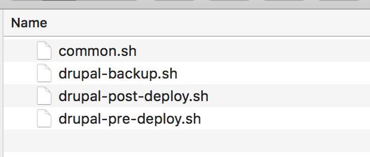
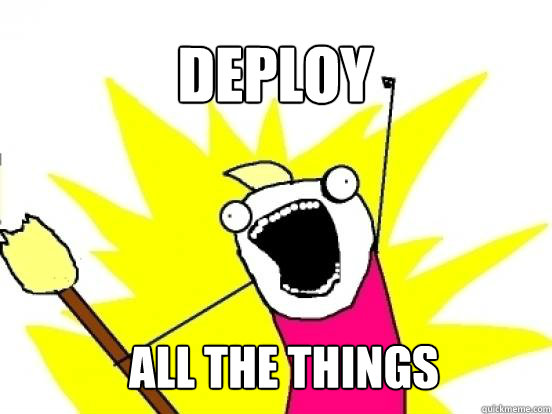

build-lists: true
theme: poster, 8

# [fit] Deploying PHP<br>applications<br>*(and anything else)<br>*with Fabric

---

[.build-lists: false]

## opdavies

- Web Developer
- System Administrator
- Senior Developer at *Microserve*
- Drupal, Symfony, Silex, Sculpin


^ Not a Python Developer

---

# *What is* Fabric*?*

---

- Python CLI tool
- Runs commands on *local* and *remote* hosts
- Flexible
- Combine *multiple* scripts

^ Previously had multiple scripts (pre, post build) per project

---



---

## Installing Fabric

```bash
$ pip install fabric

# macOS
$ brew install fabric

# Debian, Ubuntu
$ apt-get install fabric
$ apt-get install python-fabric
```

---

# Writing your first *fabfile*

---

```python, [.highlight: 1-3]
# fabfile.py

from fabric.api import env, run, cd

env.hosts = ['example.com']
env.use_ssh_config = True

project_dir = '/var/www/html'

# Do stuff...
```

---

```python, [.highlight: 1-3]
# fabfile.py

from fabric.api import *

env.hosts = ['example.com']
env.use_ssh_config = True

project_dir = '/var/www/html'

# Do stuff...
```

---

```python, [.highlight: 5-6]
# fabfile.py

from fabric.api import *

env.hosts = ['example.com']
env.use_ssh_config = True

project_dir = '/var/www/html'

# Do stuff...
```

---

```python, [.highlight: 8]
# fabfile.py

from fabric.api import *

env.hosts = ['example.com']
env.use_ssh_config = True

project_dir = '/var/www/html'

# Do stuff...
```

---

```python, [.highlight: 10]
# fabfile.py

from fabric.api import *

env.hosts = ['example.com']
env.use_ssh_config = True

project_dir = '/var/www/html'

# Do stuff...
```

---

# *Adding* Tasks

---

## Adding tasks

```python

def build():
    with cd('/var/www/html'):
        run('git pull')
        run('composer install')
```

---

## Adding parameters to tasks

```python, [.highlight: 1, 4-6]
def build(run_composer=True):
    with cd('/var/www/html'):
        run('git pull')

        if run_composer:
            run('composer install')
```

---

## Adding parameters to tasks

```python, [.highlight: 1, 4-9]
def build(run_composer=True, env='prod'):
    with cd('/var/www/html'):
        run('git pull')

        if run_composer:
            if env == 'prod':
                run('composer install --no-dev')
            else:
                run('composer install')
```
---

## Calling other tasks

```python, [.highlight: 6-12]
@task
def build():
    with cd('/var/www/html'):
        run('git pull')
        run('composer install')
        drupal_post_install_tasks()
      
def drupal_post_install_tasks():
    run('drush updatedb -y')
    run('drush entup -y')
    run('drush cache-rebuild')
```
---

## Running Tasks

```bash
$ fab --list

$ fab <task>

$ fab <task> --fabfile=/path/to/fabfile

$ fab <task>:build_number=$BUILD_ID,build_type=drupal
```

^ fabfile.py in the current directory is found automatically.

---


## Building Front-End Assets

```python
def build_assets(run_gulp=True):
    with cd('themes/custom/example'):
        run('yarn --pure-lockfile')
        
        if run_gulp:
            run('node_modules/.bin/gulp --production')
```

^ lcd = change directory locally

---

# Error reporting

```python
print '===> Checking the site is alive.'
if run('drush status | egrep "Connected|Successful"').failed:
    print 'Could not connect to the database.'

print '===> Building the site.'
if run('vendor/bin/sculpin generate').return_code == 0:
    print 'Site built. Yay! :)'
```

---

# Making Fabfiles *smarter*

---

# Conditional tasks

```python
def build_assets():
    with cd('themes/custom/example'):
        if exists('package.json') and not exists('node_modules'):
            run('yarn --pure-lockfile')

        if exists('gulpfile.js'):
            print '===> Building front-end assets with Gulp...'
            run('node_modules/.bin/gulp --production')

        elif exists('gruntfile.js'):
            print '===> Building front-end assets with Grunt...'
            run('node_modules/.bin/grunt build')
```

---

# Project settings file

```yml
# app.yml

drupal:
  config: { import: yes, name: sync }
  root: web
  theme:
    build:
      npm: no
      type: gulp
      yarn: yes
    path: 'themes/custom/drupalbristol'
  version: 8

composer:
  install: true
```

---

# Project settings file

```python, [.highlight 3]
# fabfile.py

from fabric.api import *
import yaml

with open('app.yml', 'r') as file:
    config = yaml.load(file.read())
```

---

# Project settings file

```python
# fabfile.py

...

theme_config = config['theme']

with cd(theme_config['path']):
    if theme_config['build']['npm'] == True:
        print '===> Installing dependencies via npm.'
        run('npm install')

    elif theme_config['build']['yarn'] == True:
        print '===> Installing dependencies via yarn.'
        run('yarn --pure-lockfile')
```

---

# Project settings file v2

```yml
# app.yml

commands:
    build: |
        cd web/themes/custom/drupalbristol
        yarn --pure-lockfile
        node_modules/.bin/gulp --production

    deploy: |
        cd web
        drush cache-rebuild -y
```

---

# Project settings file v2

```python
# fabfile.py

for hook in config['commands'].get('build', '').split("\n"):
    run(hook)

...

for hook in config['commands'].get('deploy', '').split("\n"):
    run(hook)
```

---
  

# Building on Prod == *:(*

---

[.build-lists: false]

# *Not* Building on Prod

1. Build locally and deploy.
1. Build in a separate directory and switch after build.

---

## Running Tasks Locally

```python
# Runs remotely.

from fabric.api import run

run('git pull')
run('composer install')

# Runs locally.

from fabric.api import local

local('git pull')
local('composer install')
```

---



---

# rsync

```python, [.highlight: 1, 5-11]
from fabric.contrib.project import rsync_project

...

def deploy():
    rsync_project(
        local_dir='./',
        remote_dir='/var/www/html'
        default_opts='-vzcrSLh',
        exclude=('.git', 'node_modules/', '.sass-cache/')
    )
```

---

[.build-lists: false]

# *Not* Building on Prod

1. ~~Build locally and deploy.~~
1. Build in a separate directory and switch after build.

---

# Deploying into a *different directory*

```python
from fabric.api import *
from time import time

project_dir = '/var/www/html'
next_release = "%(time).0f" % { 'time': time() }

def init():
    if not exists(project_dir):
        run('mkdir -p %s/shared' % project_dir)
        run('mkdir -p %s/releases' % project_dir)
```

---

# Deploying into a *different directory*

```python
current_release = '%s/%s' % (releases_dir, next_release)

run('git clone %s %s' % (git_repo, current_release))

def build():
    with cd(current_release):
        build_site_pre_tasks()
        build_site()
        build_site_post_tasks()
```

---

# Deploying into a *different directory*

```python
def update_symlinks():
    run('ln -nfs %s/releases/%s %s/current'
    % (project_dir, next_release, project_dir))

# /var/www/html/current
```

---

# Other things

- Database backup pre-build
- Rollback on failure
- Run Drush/console/artisan commands
- Verify file permissions
- Restart services
- Anything you can do on the command line...

---

[.build-lists: false]

- https://www.oliverdavies.uk/talks/deploying-php-fabric
- http://fabfile.org
- https://github.com/opdavies/fabric-example-sculpin
- https://github.com/opdavies/fabric-example-drupal
- https://deploy.serversforhackers.com

---

https://joind.in/talk/a5ff3

---

## @opdavies
## *oliverdavies.uk*
