theme: plain jane

# **Drupal Developer Days  2018 Recap**

---

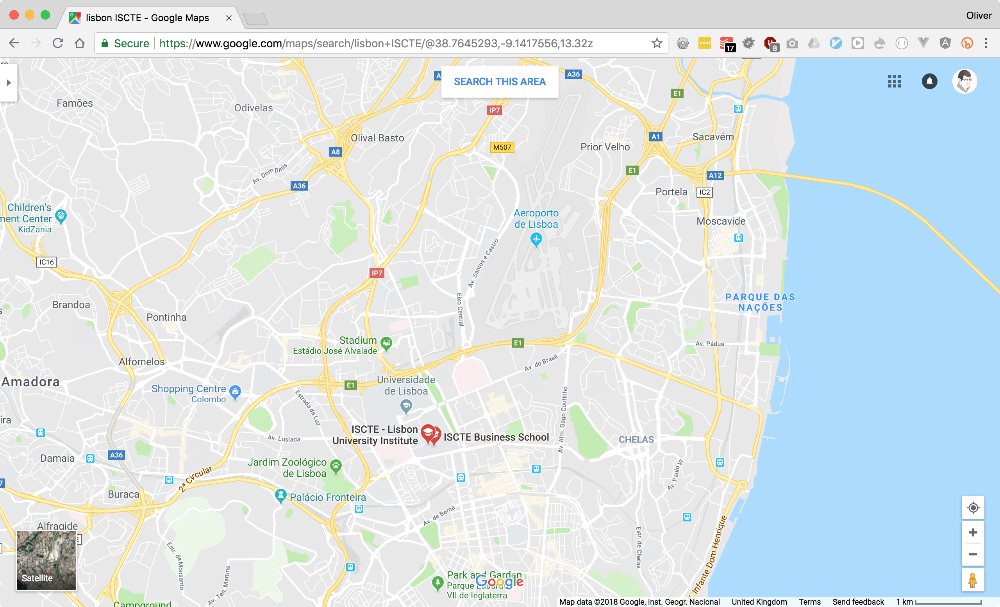

---

---

^ 400 people

---

^ sprints

---

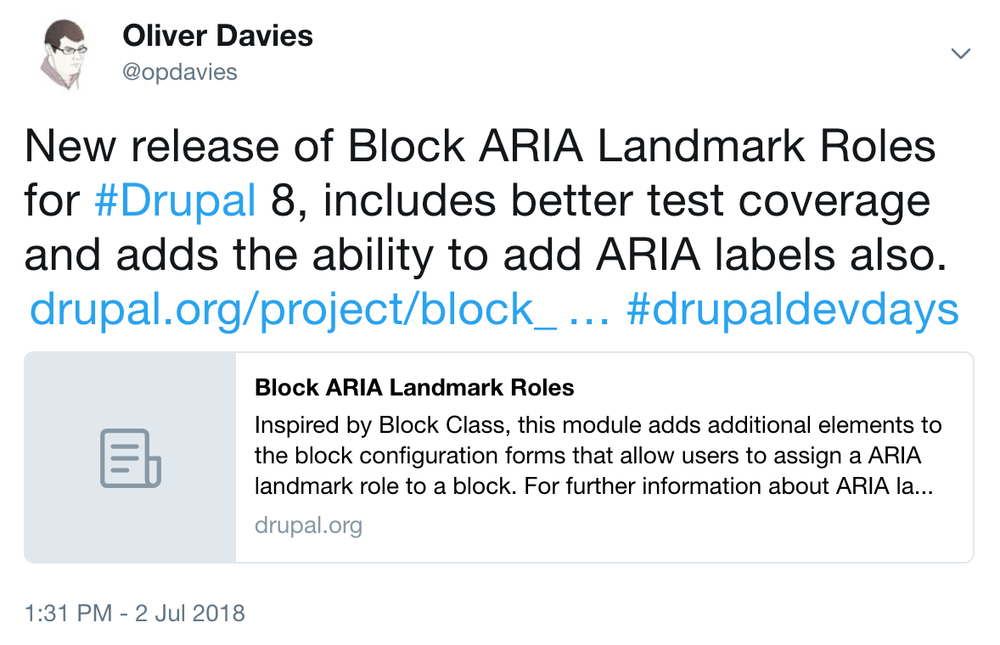

---

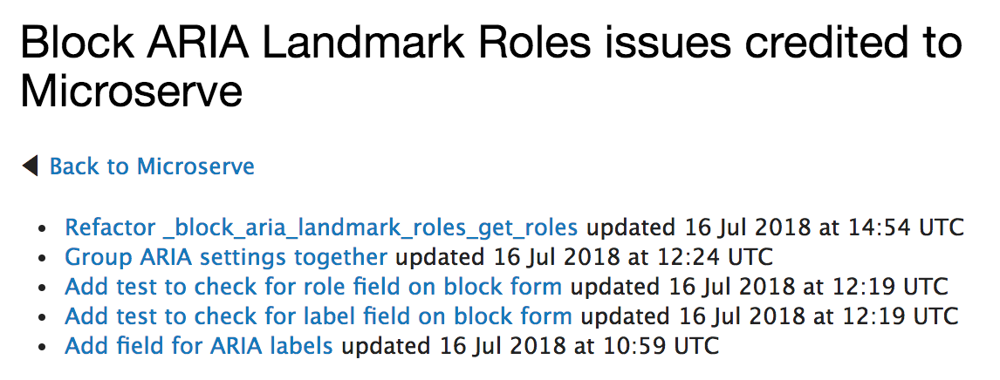

^ Yay, commit credits!

---

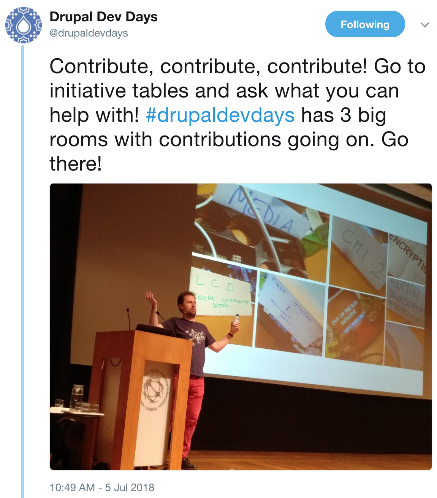

^ Composer, JS in core, admin UI, API first
Signs on tables, online meetings and Slack channels
Find the right people
Get involved with something that interests you rather than searching for random issues

---

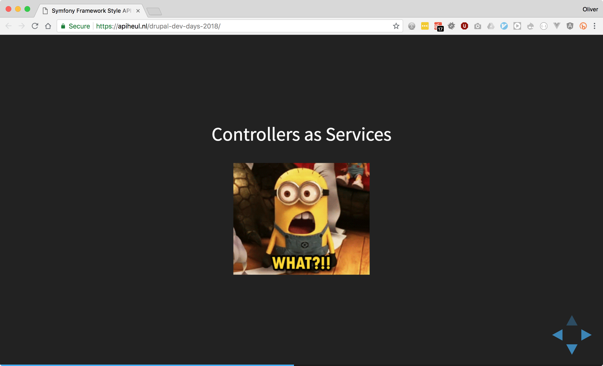

^ Symfony Framework style API building in Drupal
symfony guy
things i've done in symfony that I didn't know you could do in D8
great to see cross-community knowledge sharing

---

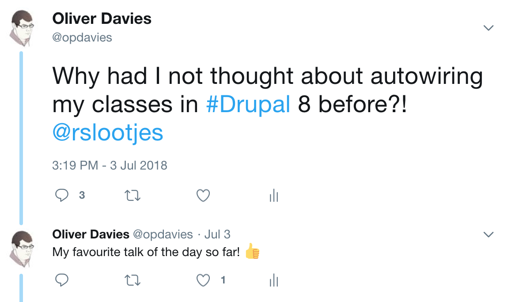

---

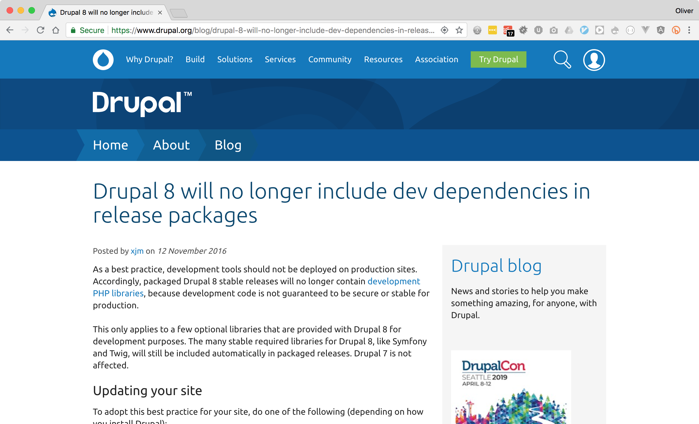

^ Jess (xjm) - D8 release manager
Responsible disclosure, cross-project collaboration, and Drupal 8 security
Don't include dev dependencies in prod code!
ODL was doing this!
immediate ROI

---

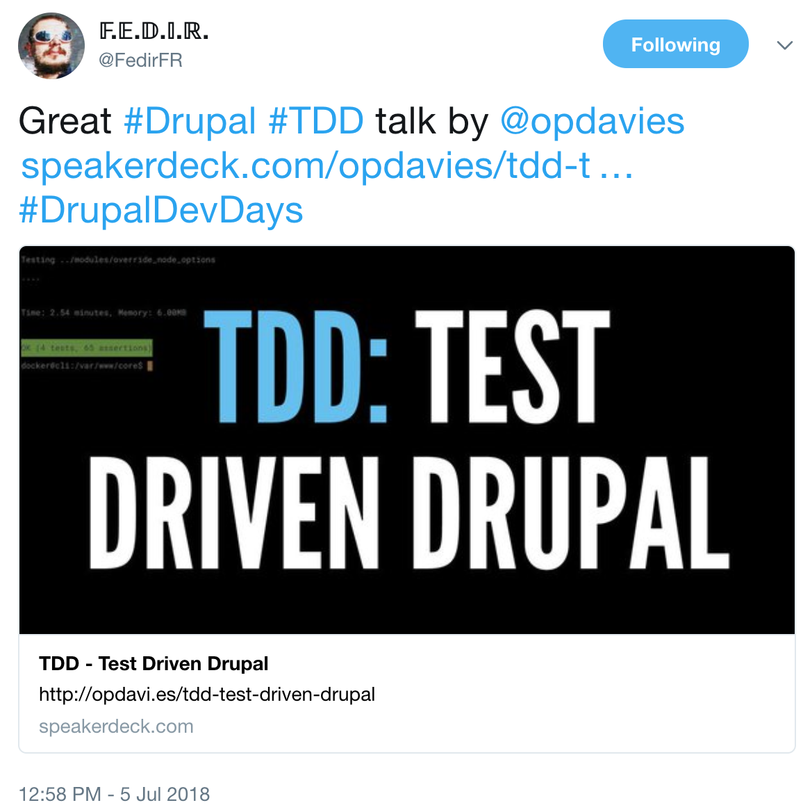

---

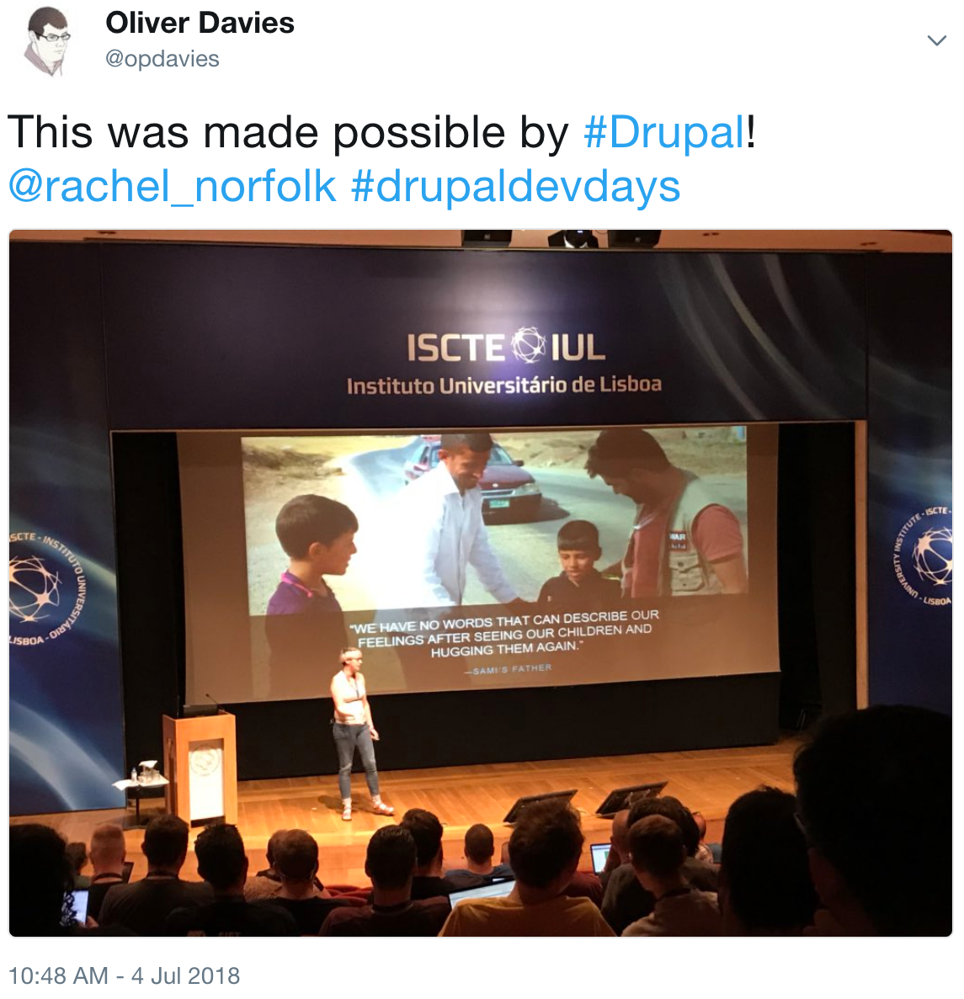

---

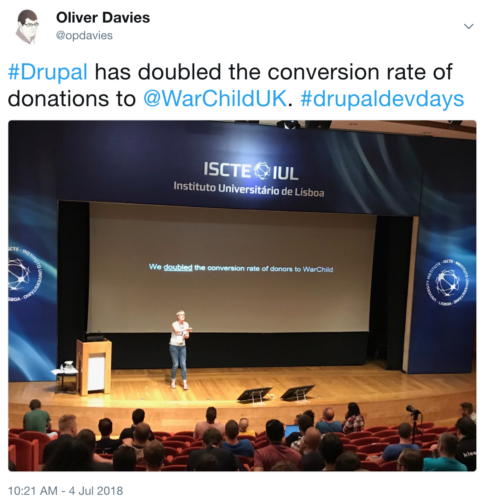

---

^ Great to chat about the DA with Rachel

---

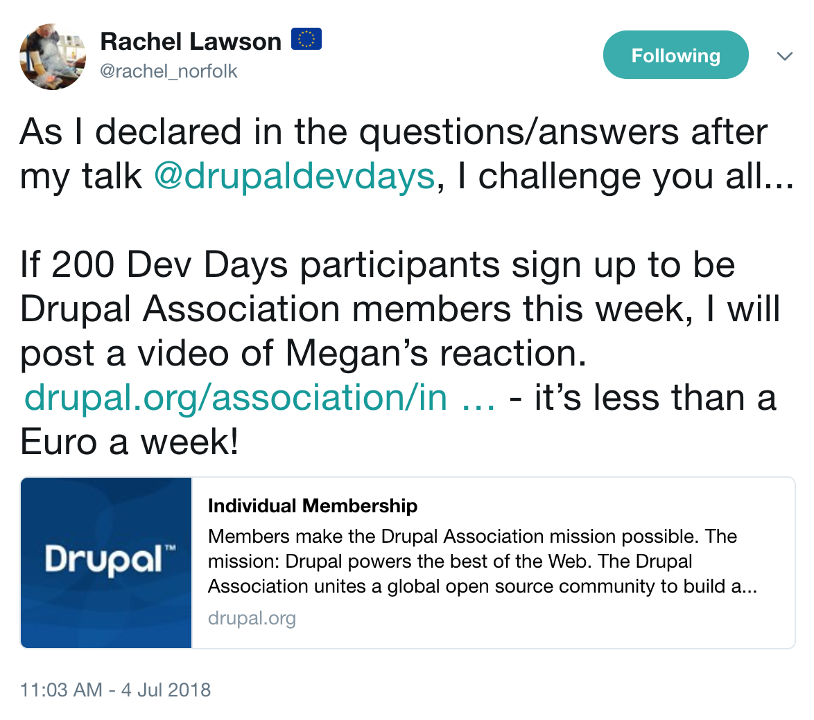

^ Membership drive

---

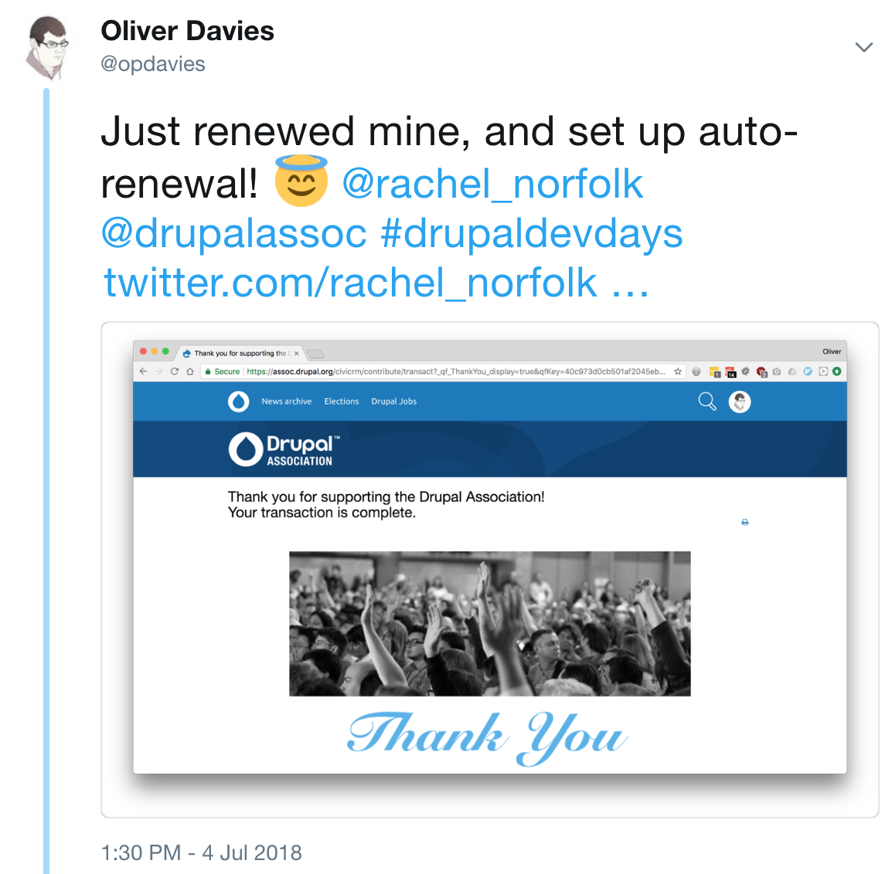

---

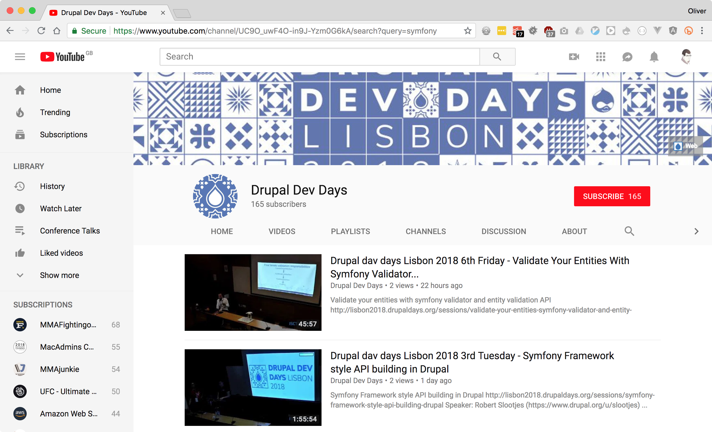

^ Videos are now online
