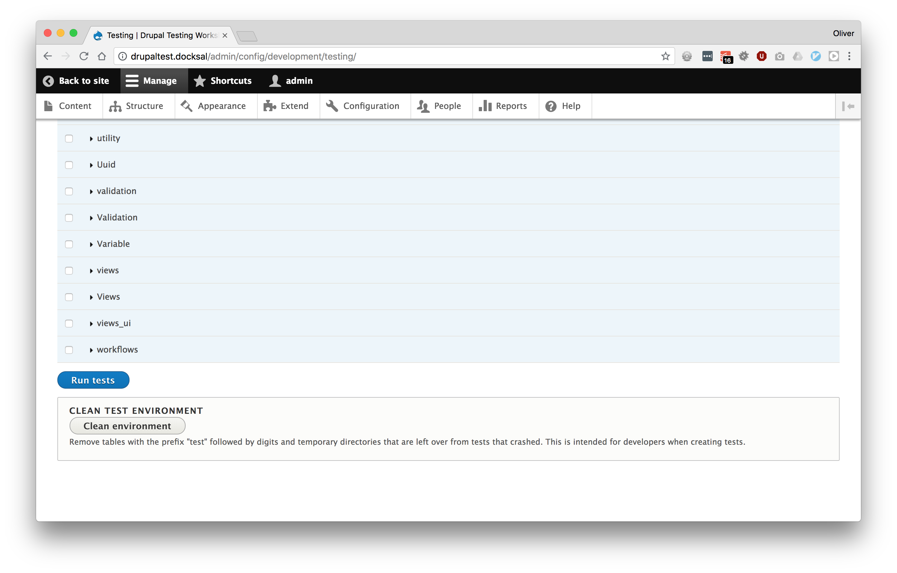
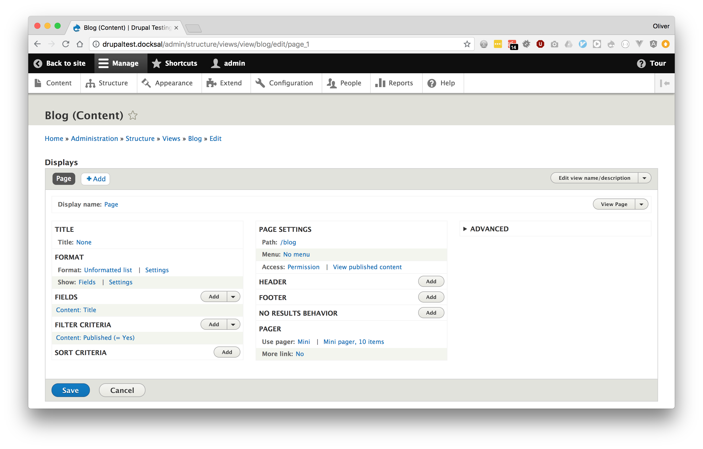

autoscale: true
build-lists: true
header-emphasis: #3D85C6
header: alignment(left)
text: alignment(left)
text-emphasis: #3D85C6
theme: poster, 8
code: Monaco, #6699FF, #999999, #6666FF, #66FF66, #66FF66, line-height(1.5)

[.header: alignment(center)]


# [fit] Drupal Testing Workshop
### _September 2018_

---

[.header: alignment(center)]

## _Why_ write tests?

---

## _Why write tests?_

- Catch bugs earlier
- Peace of mind
- Prevent regressions
- Write less code
- Documentation
- Drupal core requirement - _<https://www.drupal.org/core/gates#testing>_
- More important with regular D8 releases

^ Dave Liddament talk - better and cheaper to catch bugs earlier (e.g. whilst developing rather than after it's been released)
Refer to tests when writing implementation code
ONO merge conflict

---

[.header: alignment(center)]

## [fit] _Having tests does not mean_
## [fit] there will be no bugs

---

[.header: alignment(center)]

## [fit] _Testing may add time now_
## [fit] but save more time in the future

---

## _Testing in Drupal_

- _Drupal 7_ - Simpletest (testing) module provided as part of core
- _Drupal 8_ - PHPUnit added as a core dependency
- _PHPUnit Initiative_ - Simpletest to be deprecated and removed

^ Focussing on PHPUnit today

---

[.header: #3D85C6]

## Writing Tests (Drupal 8)

- PHP class with _.php_ extension
- _tests/src_ directory within each module
- Within the *Drupal\Tests\module_name* namespace
- Class name must match the filename
- Namespace must match the directory structure
- One test class per feature
- Each method must start with _test_

^ Different to D7

---

### _Exercise 1_
## Local site setup

---

[.header: #3D85C6]

## Docksal

- Docker based local development environment
- Microserve standard
- Open source
- Per site configuration and customisation
- fin CLI, Apache, MySQL, Solr, Varnish, Mailhog, PHPMyAdmin etc
- Virtualbox or native Docker
- Can slow down tests
- Provides consistency

---

- https://github.com/opdavies/drupal-testing-workshop
- https://docksal.io/installation
- git clone
- fin init
- http://drupaltest.docksal

^ Contains Drupal 8 with Composer, examples module

---

### _Exercise 2_
## Running Tests

---

### _Option 1_
## Simpletest module (UI)

---


---



---


---


---


---


---


---

### _Option 2_
## Command line

---

## Prerequisite _(creating a phpunit.xml file)_

- Configures PHPUnit
- Needed to run some types of tests
- Ignored by Git by default
- Copy _core/phpunit.xml.dist_ to _core/phpunit.xml_
- Add and change as needed
  - `SIMPLETEST_BASE_URL`, `SIMPLETEST_DB`, `BROWSERTEST_OUTPUT_DIRECTORY`
  - `stopOnFailure="true"`

---

```
cd web

../vendor/bin/phpunit -c core \
modules/contrib/examples/phpunit_example
```

---

```
cd web/core

../../vendor/bin/phpunit \
../modules/contrib/examples/phpunit_example
```

---

## Pro-tip: Add paths to _$PATH_

```bash
# ~/.zshrc

export PATH=$HOME/bin:/usr/local/bin:$PATH

export PATH=vendor/bin:$PATH
export PATH=../vendor/bin:$PATH
export PATH=node_modules/.bin:$PATH
```

---

### _Option 2_
## CLI with Docksal

---

```
fin bash

cd web

../vendor/bin/phpunit -c core \
modules/contrib/examples/phpunit_example
```

---

```
fin bash

cd web/core

../../vendor/bin/phpunit \
../modules/contrib/examples/phpunit_example
```

---

### _Option 3_
## Docksal PHPUnit addon

---

- Custom Docksal command
- Submitted to the Docksal addons repo
- _fin addon install phpunit_
- Wrapper around phpunit command
- Copies a stub phpunit.xml file if exists, or duplicates phpunit.xml.dist
- Shorter command, combines two actions

^ Checks for core/phpunit.xml on each test run
Will create one if is not present

---

```
fin phpunit web/modules/contrib/examples/phpunit_example
```

---

```
Copying stubs from /var/www/.docksal/addons/phpunit/stubs
```

---

```
PHPUnit 6.5.8 by Sebastian Bergmann and contributors.

Testing web/modules/contrib/examples/phpunit_example
..................................                                34 / 34 (100%)

Time: 46.8 seconds, Memory: 6.00MB

OK (34 tests, 41 assertions)
```

---

```
fin phpunit web/modules/contrib/examples/phpunit_example


Copying /var/www/web/core/phpunit.xml.dist to /var/www/web/core/phpunit.xml.
Please edit it's values as needed and re-run 'fin phpunit'.
```
---

```
fin phpunit web/modules/contrib/examples/phpunit_example


PHPUnit 6.5.8 by Sebastian Bergmann and contributors.

Testing web/modules/contrib/examples/phpunit_example
..................................                                34 / 34 (100%)

Time: 48.62 seconds, Memory: 6.00MB

OK (34 tests, 41 assertions)
```

---

### _Option 4_
## IDE/text editor integration

---


---

[.header: alignment(center)]

## Types of tests

---

[.header: #3D85C6]

## Functional tests

- Tests functionality
- Interacts with database
- Full Drupal installation
- With/without JavaScript

^ testing profile

---


[.header: #3D85C6]

## Functional tests

- Slower to run
- Easiest to start with
- Provide most value

^ Less setup steps
No mocking etc.

---

### _Exercise_
## Let's write a <br>functional test

---

- Create a _web/modules/custom/workshop_ directory
- Create a `workshop.info.yml` file

---

```
# workshop.info.yml

name: Drupal Testing Workshop
core: 8.x
type: module
```

---

- Create a _tests/src/Functional_ directory
- Create an _ExampleFunctionalTest.php_ file

---


```php
// ExampleFunctionalTest.php

namespace Drupal\Tests\workshop\Functional;

use Drupal\Tests\BrowserTestBase;

class ExampleFunctionalTest extends BrowserTestBase {

}

```

---

```php

// ExampleFunctionalTest.php

public function testExamplePageExists() {

}
```

---

```php

// ExampleFunctionalTest.php

public function test_example_page_exists() {

}
```

^ Snake case test method names
Still works because it has the 'test' prefix
More readable than camel case?
Works with Simpletest/D7

---

```php

// ExampleFunctionalTest.php

/** @test */
public function example_page_exists() {

}
```

^ Remove the prefix, use annotation
PHPUnit only

---

```php

// ExampleFunctionalTest.php

/** @test */
public function example_page_exists() {
  // Arrange

  // Act

  // Assert
}
```

---

```php

// ExampleFunctionalTest.php

/** @test */
public function example_page_exists() {
  // Given that I am an anonymous user.

  // When I go to /blog.

  // I should see the blog page.
}
```

---

```php
// ExampleFunctionalTest.php

/** @test */
public function example_page_exists() {
  $this->drupalGet('/example-one');

  $this->assertSession()->statusCodeEquals(200);
}
```

---

```php
// ExampleFunctionalTest.php

protected static $modules = ['workshop'];
```

---

```
PHPUnit 6.5.8 by Sebastian Bergmann and contributors.

Testing Drupal\Tests\workshop\Functional\ExampleFunctionalTest

Behat\Mink\Exception\ExpectationException : Current response status code is 404, but 200 expected.
 /var/www/vendor/behat/mink/src/WebAssert.php:768
 /var/www/vendor/behat/mink/src/WebAssert.php:130
 /var/www/web/modules/custom/workshop/tests/src/Functional/ExampleFunctionalTest.php:14

Time: 18.2 seconds, Memory: 6.00MB

ERRORS!
Tests: 1, Assertions: 2, Errors: 1.
```

---

- Create a _workshop.routing.yml_ file
- Create a Controller

---

```yaml
# workshop.routing.yml

workshop.example:
  path: '/example-one'
  defaults:
    _controller: 'Drupal\workshop\Controller\ExampleController::index'
  requirements:
    _access: 'TRUE'
```

---

```php
// src/Controller/ExampleController.php

namespace Drupal\workshop\Controller;

class ExampleController {

  public function index() {
    return [];
  }

}
```

---

```
Time: 25.22 seconds, Memory: 6.00MB

OK (1 test, 3 assertions)
```

---

[.header: #3D85C6]

## Kernel tests

- Integration tests
- Can install modules, interact with services, container, database
- Minimal Drupal bootstrap
- Faster than functional tests
- More setup required

---

### _Exercise_
## Let's write a <br>kernel test

---

- Create a _tests/src/Kernel_ directory
- Create an _ExampleKernelTest.php_ file
- Create a Service
- Use the service within the test to perform an action

---

```php
// tests/src/Kernel/ExampleKernelTest.php

namespace Drupal\Tests\workshop\Kernel;

use Drupal\KernelTests\Core\Entity\EntityKernelTestBase;
use Drupal\user\Entity\User;

class ExampleKernelTest extends EntityKernelTestBase {

  public static $modules = ['workshop'];

}

```

---

```php
// tests/src/Kernel/ExampleKernelTest.php

public function testUserDeleter {
  $user = $this->createUser();

  $user_deleter = \Drupal::service(UserDeleter::class);
  $user_deleter->delete($user);

  $user = $this->reloadEntity($user);

  $this->assertNull($user);
}
```

---

```yaml
# workshop.services.yml

services:
  workshop.user_deleter:
    class: Drupal\workshop\Service\UserDeleter
```

---

```yaml
# workshop.services.yml

services:
  Drupal\workshop\Service\UserDeleter: ~
```

---

```
Symfony\Component\DependencyInjection\Exception\ServiceNotFoundException :
You have requested a non-existent service
"Drupal\Tests\workshop\Kernel\UserDeleter".
```

---

```php
// src/Service/UserDeleter.php

namespace Drupal\workshop\Service;

use Drupal\Core\Session\AccountInterface;

class UserDeleter {

  public function delete(AccountInterface $user) {
    user_delete($user->id());
  }

}
```

---

```php
// tests/src/Kernel/ExampleKernelTest.php

namespace Drupal\Tests\workshop\Kernel;

use Drupal\workshop\Service\UserDeleter;
use Drupal\KernelTests\Core\Entity\EntityKernelTestBase;
use Drupal\user\Entity\User;

...
```

^ Import new UserDeleter

---

```
Drupal\Core\Entity\EntityStorageException : SQLSTATE[HY000]:
General error: 1 no such table:
test89378988.users_data: DELETE FROM {users_data}
WHERE uid IN (:db_condition_placeholder_0); Array
(
    [:db_condition_placeholder_0] => 1
)
```

---

```php
// tests/src/Kernel/ExampleKernelTest.php

protected function setUp() {
  parent::setUp();

  $this->installSchema('user', ['users_data']);
}
```

---

```
OK (1 test, 5 assertions)
```

---

[.header: #3D85C6]

## Unit tests

- Tests PHP logic
- No database interaction
- Fast to run
- Tightly coupled
- Mocking dependencies
- Hard to refactor

---

### _Exercise_
## Let's write a <br>unit test

---

```php
// tests/src/Unit/Service/ExampleUnitTest.php

namespace Drupal\Tests\workshop\Unit;

use Drupal\Tests\UnitTestCase;

class ExampleUnitTest extends UnitTestCase {

  public function testAdd() {
    $this->assertEquals(5, (new Calculator(3))->add(2)->calculate());
  }
}
```

---

```
Error : Class 'Drupal\Tests\workshop\Unit\Calculator' not found
 /var/www/web/modules/custom/workshop/tests/src/Unit/Service/ExampleUnitTest.php:10
```

---

```php
// src/Service/Calculator.php

namespace Drupal\workshop\Service;

class Calculator {

  private $total;

  public function __construct($value) {
    $this->total = $value;
  }

  public function add($value) {
    $this->total += $value;

    return $this;
  }

  public function calculate() {
    return $this->total;
  }

}
```

---

```php
// tests/src/Unit/Service/ExampleUnitTest.php

namespace Drupal\Tests\workshop\Unit;

use Drupal\workshop\Service\Calculator;
use Drupal\Tests\UnitTestCase;

...
```

---

```
Time: 4.55 seconds, Memory: 4.00MB

OK (1 test, 1 assertion)
```

---

[.header: alignment(center)]

## Test driven <br>development _(TDD)_

---


## _Test Driven Development_

- Write a failing test
- Write code until passes
- Refactor
- Repeat

---

[.background-color: #FFFFFF]
[.footer: https://github.com/foundersandcoders/testing-tdd-intro]
[.footer-style: #2F2F2F]


---

## _How I Write Tests - "Outside In"_

- Start with functional tests
- Drop down to kernel or unit tests where needed
- Programming by wishful thinking
- Write comments first, then fill in the code
- Sometimes write assertions first

---

### _Exercise_
## Let's build a blog using test driven development


---

## _Acceptance criteria_

- As a site visitor
- I want to see a list of published articles at /blog
- Ordered by post date

---

## _Tasks_

- Ensure the blog page exists
- Ensure only published articles are shown
- Ensure the articles are shown in the correct order

---

## _Implementation_

- Use views module
- Do the mininum amount at each step, make no assumptions, let the tests guide us
- Start with functional test

---

### _Step 1_
## Create the module

---

```yml
# tdd_blog.info.yml

name: 'TDD Blog'
core: '8.x'
type: 'module'
```

---

### _Step 2_
## Ensure the blog page exists

---

```php
// tests/src/Functional/BlogPageTest.php

namespace Drupal\Tests\tdd_blog\Functional;

use Drupal\Tests\BrowserTestBase;

class BlogPageTest extends BrowserTestBase {

  protected static $modules = ['tdd_blog'];

}
```

---


```php
public function testBlogPageExists() {
  $this->drupalGet('/blog');

  $this->assertSession()->statusCodeEquals(200);
}
```

---


```
There was 1 error:

1) Drupal\Tests\tdd_blog\Functional\BlogPageTest::testBlogPageExists
Behat\Mink\Exception\ExpectationException: Current response status code is 404, but 200 expected.
```

---

- _The view has not been created_
- Create a new view, page display
- Set the path
- Export the config
- Copy it into the module's `config/install` directory

---


---



---

```
drush cex -y

cp ../config/default/views.view.blog.yml \
  modules/custom/tdd_blog/config/install
```

---

```diff
# views.view.blog.yml

- uuid: 84305edf-7aef-4109-bc93-e87f685fb678
langcode: en
status: true
dependencies:
  config:
    - node.type.article
  module:
    - node
    - user
- _core:
-   default_config_hash: iGZkqLWpwWNORq6_fy6v_Kn_KE4BjYHqj9vpgQsWJCs
id: blog
...
```

---

```
1) Drupal\Tests\tdd_blog\Functional\BlogPageTest::testBlogPageExists
Drupal\Core\Config\UnmetDependenciesException: Configuration objects provided 
by <em class="placeholder">tdd_blog</em>
have unmet dependencies: <em class="placeholder">views.view.blog
(node.type.article, node, views)</em>
```

---


```yml,[.highlight: 1, 7-10]
# tdd_blog.info.yml

name: 'TDD Blog'
description: 'A demo module to show test driven module development.'
core: 8.x
type: module

dependencies:
  - 'drupal:node'
  - 'drupal:views'
```

---


```
1) Drupal\Tests\tdd_blog\Functional\BlogPageTest::testBlogPageExists
Drupal\Core\Config\UnmetDependenciesException: Configuration objects provided 
by <em class="placeholder">tdd_blog</em> have unmet dependencies:
<em class="placeholder">views.view.blog (node.type.article)</em>
```

---

- Add the article content type

---


```
OK (1 test, 3 assertions)
```

---

[.build-lists: false]

## _Tasks_

- ~~Ensure the blog page exists~~
- Ensure only published articles are shown
- Ensure the articles are shown in the correct order

---

### _Step 3_
## Ensure only published articles are shown

---


```php
public function testOnlyPublishedArticlesAreShown() {
  // Given I have a mixture of published and unpublished articles,
  // as well as other types of content.

  // When I view the blog page.

  // I should only see the published articles.
}
```

---

### _Option 1_
## Functional tests

---


```php
// modules/custom/tdd_blog/tests/src/Functional/BlogPageTest.php

public function testOnlyPublishedArticlesAreShown() {
  // Given I have a mixture of published and unpublished articles,
  // as well as other types of content.
  $node1 = $this->drupalCreateNode(['type' => 'page', 'status' => 1]);
  $node2 = $this->drupalCreateNode(['type' => 'article', 'status' => 1]);
  $node3 = $this->drupalCreateNode(['type' => 'article', 'status' => 0]);

  // When I view the blog page.
  $this->drupalGet('/blog');

  // I should only see the published articles.
  $assert = $this->assertSession();
  $assert->pageTextContains($node2->label());
  $assert->pageTextNotContains($node1->label());
  $assert->pageTextNotContains($node3->label());
}
```

^ Different ways to achieve this. This is taking the functional test approach.

---

### _Option 2_
## Kernel tests

---


```php
namespace Drupal\Tests\tdd_blog\Kernel;

use Drupal\KernelTests\Core\Entity\EntityKernelTestBase;
use Drupal\Tests\node\Traits\NodeCreationTrait;

class BlogPageTest extends EntityKernelTestBase {

  use NodeCreationTrait;

  public static $modules = ['node'];

}
```

---

```php

public function testOnlyPublishedArticlesAreShown() {
  $this->createNode(['type' => 'page', 'status' => 1]);
  $this->createNode(['type' => 'article', 'status' => 1]);
  $this->createNode(['type' => 'article', 'status' => 0]);
}
```

^ Kernel test approach
Dropping down a level
No need for the brower, not asserting against HTML
Faster to run

---

```
1) Drupal\Tests\tdd_blog\Kernel\BlogPageTest::testOnlyPublishedArticlesAreShown
Error: Call to a member function id() on boolean

/var/www/web/core/modules/filter/filter.module:212
/var/www/web/core/modules/node/tests/src/Traits/NodeCreationTrait.php:73
/var/www/web/modules/custom/tdd_blog/tests/src/Kernel/BlogPageTest.php:13
```

---

```php
$this->installConfig(['filter']);
```

---

```php
public function testOnlyPublishedArticlesAreShown() {
  ...

  $results = views_get_view_result('blog');
}
```

---

```php
public function testOnlyPublishedArticlesAreShown() {
  ...

  $results = views_get_view_result('blog');

  $this->assertCount(1, $results);
  $this->assertEquals(2, $results[0]->_entity->id());
}
```

---

```php
public static $modules = [
  'node',
  'tdd_blog',
  'views',
];
```

---

```php
public function setUp() {
  parent::setUp();

  $this->installConfig(['filter', 'tdd_blog']);
}
```

---

```
There was 1 failure:

1) Drupal\Tests\tdd_blog\Kernel\BlogPageTest::testOnlyPublishedArticlesAreShown
Failed asserting that actual size 2 matches expected size 1.

/Users/opdavies/Code/drupal-testing-workshop/web/modules/custom/tdd_blog/tests/src/Kernel/BlogPageTest.php:23
```

---


---

>- _There is no content type filter on the view_
- Add the filter
- Re-export and save the view

---


---

```
OK (1 test, 6 assertions)
```

---

[.build-lists: false]

## _Tasks_

- ~~Ensure the blog page exists~~
- ~~Ensure only published articles are shown~~
- Ensure the articles are shown in the correct order

---

### _Step 4_
## Ensure the articles are ordered by date

---


```php
// modules/custom/tdd_blog/tests/src/Kernel/BlogPageTest.php

public function testArticlesAreOrderedByDate() {
  // Given that I have numerous articles with different post dates.

  // When I go to the blog page.

  // The articles are ordered by post date.
}
```

---


```php
// modules/custom/tdd_blog/tests/src/Kernel/BlogPageTest.php

public function testArticlesAreOrderedByDate() {
  // Given that I have numerous articles with different post dates.
  $this->createNode(['type' => 'article', 'created' => (new DrupalDateTime('+1 day'))->getTimestamp()]);
  $this->createNode(['type' => 'article', 'created' => (new DrupalDateTime('+1 month'))->getTimestamp()]);
  $this->createNode(['type' => 'article', 'created' => (new DrupalDateTime('+3 days'))->getTimestamp()]);
  $this->createNode(['type' => 'article', 'created' => (new DrupalDateTime('+1 hour'))->getTimestamp()]);

  // When I go to the blog page.

  // The articles are ordered by post date.
}
```

---

```php
$this->createNode([
  'type' => 'article',
  'created' => (new DrupalDateTime('+1 day'))->getTimestamp(),
]);
```

^ Array of default values

---


```php
// modules/custom/tdd_blog/tests/src/Kernel/BlogPageTest.php

public function testArticlesAreOrderedByDate() {
  ...

  // When I go to the blog page.
  $results = views_get_view_result('blog');

  // The articles are ordered by post date.
}
```

---

```php
// modules/custom/tdd_blog/tests/src/Kernel/BlogPageTest.php

public function testArticlesAreOrderedByDate() {
  ...

  // When I go to the blog page.
  $results = views_get_view_result('blog');

  $nids = array_map(function(ResultRow $result) {
    return $result->_entity->id();
  }, $results);

  // The articles are ordered by post date.
}
```

---


```php
// modules/custom/tdd_blog/tests/src/Kernel/BlogPageTest.php

public function testArticlesAreOrderedByDate() {
  ...

  // The articles are ordered by post date.
  $this->assertEquals([4, 1, 3, 2], $nids);
}
```

---


```
There was 1 failure:

1) Drupal\Tests\tdd_blog\Kernel\BlogPageTest::testArticlesAreOrderedByDate
Failed asserting that two arrays are equal.
--- Expected
+++ Actual
@@ @@
 Array (
-    0 => 4
-    1 => 1
-    2 => 3
-    3 => 2
+    0 => '1'
+    1 => '2'
+    2 => '3'
+    3 => '4'
```

---


---

- _There is no sort order defined on the view_
- Add the sort order
- Re-export the view

---


---

```
OK (1 test, 5 assertions)
```

---

[.build-lists: false]

## _Tasks_

- ~~Ensure the blog page exists~~
- ~~Ensure only published articles are shown~~
- ~~Ensure the articles are shown in the correct order~~

---

[.header: alignment(center)]

## Take Aways

---

- Testing has made me a _better developer_
- Testing can produce _better quality code_
- Use the _right type of test_ for the right situation
- Use the _right base class_, use available _traits_
- Writing tests is an _investment_
- OK to _start small_, introduce tests gradually
- Easier to _refactor_
- Tests can pass, but things can _still be broken_. Tests only report on what they cover.

^ Made me think about how I'm going to do something more starting to do it
Less cruft, only write code that serves a purpose
Spending time writing tests pays dividends later on
Start by introducing tests for new features or regression tests when fixing bugs
If you know things pass, then you can refactor code knowing if something is broken
Manual testing is still important

---

[.header: alignment(center)]

## Questions?

---

[.header: alignment(center)]

## Thanks
