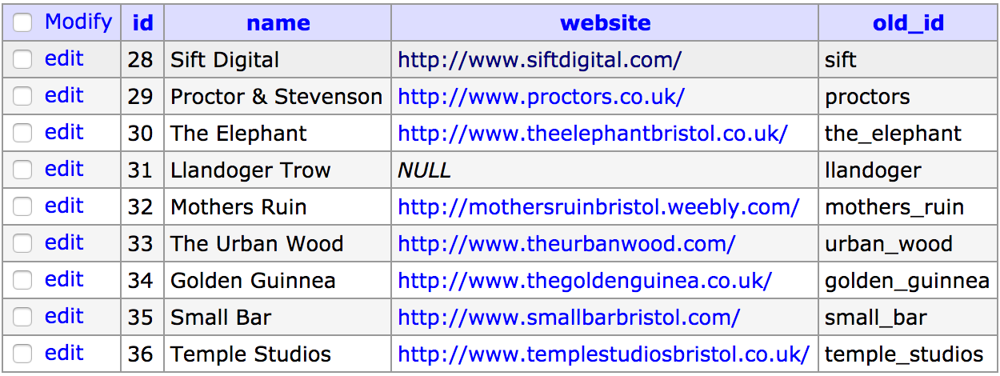
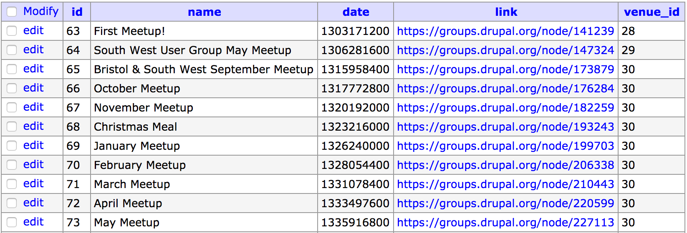
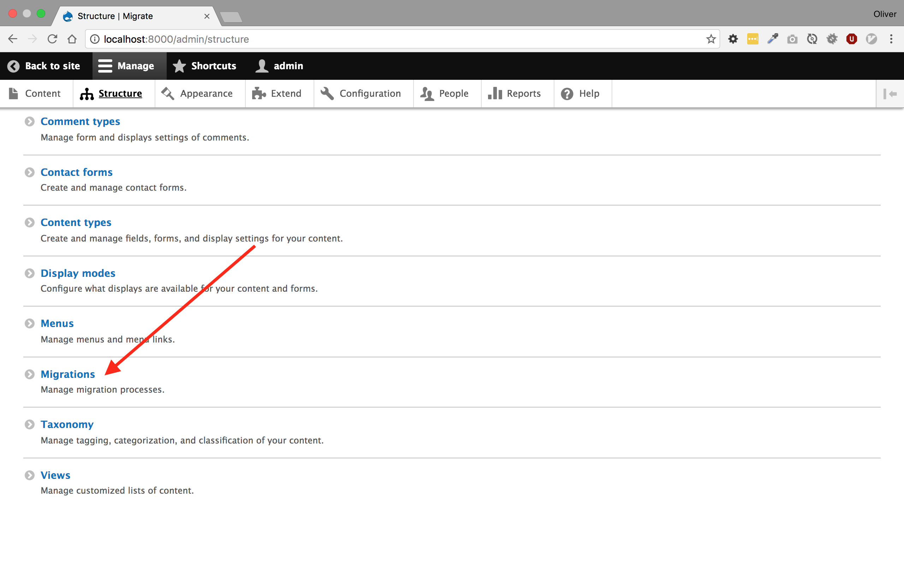
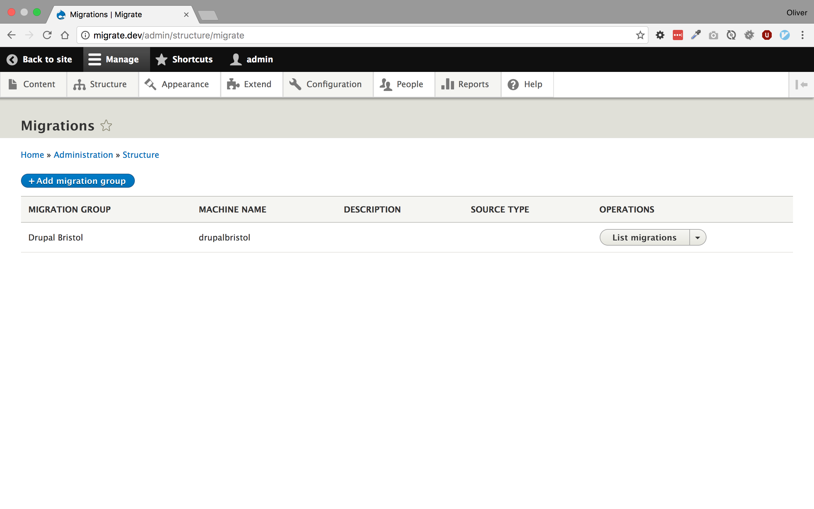
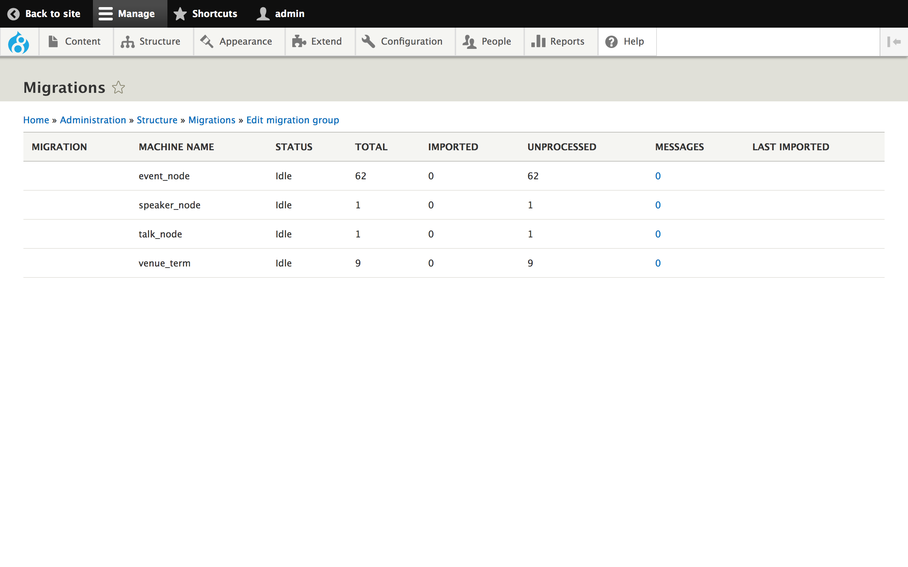
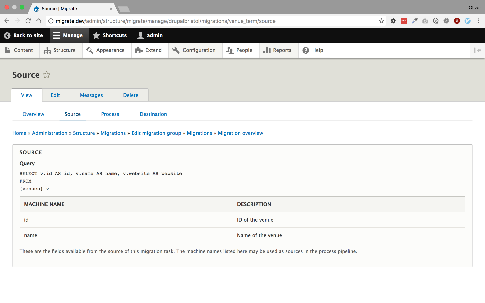

autoscale: true
build-lists: true
footer: @opdavies | oliverdavies.uk
theme: next, 8

[.hide-footer]

# Getting (Your Data) into Drupal 8

---

## opdavies

- Web Developer and System Administrator
- Senior Drupal Developer, Appnovation
- Drupal core contributor, mentor, contrib module maintainer
- Drupal Bristol, PHPSW, DrupalCamp Bristol co-organiser

---

## Drupal 6 -> 7

---

## Upgrade Path (Core)

- Replace files in-place, run updates
- Legacy data carried into new site

---

## Migration (contrib)

- Provided by `migrate` and `migrate_d2d` modules
- Start from scratch, import data
- Provide base classes to extend

---

[.hide-footer]

## Configuring a Migration

```php
// my_migration_module.migrate.inc

function my_migration_module_migrate_api() {
  return array(
    'api' => 2,
    'groups' => array(
      'beer' => array(
        'title' => t('Beer Imports')
      ),
      'wine' => array(
        'title' => t('Wine Imports')
      ),
    )
```

---

[.hide-footer]

## Configuring a Migration

```php
// my_migration_module.migrate.inc

...

'migrations' => array(
  'BeerTerm' => array(
    'class_name' => 'BeerTermMigration',
    'group_name' => 'beer',
  ),
  'BeerUser' => array(
    'class_name' => 'BeerUserMigration',
    'group_name' => 'beer',
  ),
)
```

---

[.hide-footer]

## Adding a Migration

```php
class BeerTermMigration extends BasicExampleMigration {
  ...

  $this
    ->addFieldMapping('parent_name', 'style_parent')
    ->description(t('The incoming style_parent field is the name of the term parent'));


  $this->addFieldMapping(NULL, 'region')
    ->description('Will a field be added to the vocabulary for this?')
    ->issueGroup(t('Client Issues'))
    ->issuePriority(MigrateFieldMapping::ISSUE_PRIORITY_MEDIUM)
    ->issueNumber(770064);

  ...
}
```

---

## Migrations in Drupal 7

- A lot of verbose PHP code
- Nested arrays
- Descriptive, but long method names

---

## Drupal 8

---

## D8 Migrate

- No upgrade path.
- `migrate`, `migrate_drupal`, `migrate_drupal_ui` modules in core.
- Additional modules in contrib.
- PHP classes, annotations, YAML

---

[.hide-footer]


---

## Experimental Modules

> Like other features, new experimental modules can only be added in minor releases, but unlike other features, they may change between patch releases while they are still experimental, **including API changes**.
-- <https://www.drupal.org/core/experimental>

---

## Building a Source Database

---

## Sculpin => MySQL

- Data extracted from YAML.
- Imported into MySQL database.
- Tables
  - venues
  - events
  - speakers
  - talks

---

[.hide-footer]

## Venues

```yaml
venues:
    sift:
        name: 'Sift Digital'
        website: http://www.siftdigital.com/

    proctors:
        name: 'Proctor & Stevenson'
        website: http://www.proctors.co.uk/
```

---

[.hide-footer]



---

[.hide-footer]

## Events

```yaml
events:
    - title: 'First Meetup!'
      date: '2011-04-19'
      link: 'https://groups.drupal.org/node/141239'
      location: sift

    - title: 'South West User Group May Meetup'
      date: '2011-05-25'
      link: 'https://groups.drupal.org/node/147324'
      location: proctors
```

---

[.hide-footer]



---

[.hide-footer]

## Adding the Source Database

```php
// settings.local.php

$databases['default']['default'] = [
  'driver' => 'mysql',
  'host' => 'localhost',
  'database' => 'drupal',
  'username' => 'drupal',
  'password' => 'drupal',
];

$databases['migrate']['default'] = [
  'driver' => 'mysql',
  'host' => 'localhost',
  'database' => 'migrate',
  'username' => 'migrate',
  'password' => 'migrate',
];
```

---

## Building a Custom Migration

---

[.hide-footer]

## Drupal 8 Module Structure

```bash
├── config
│   └── install
│       ├── migrate_plus.migration.event_node.yml
│       ├── migrate_plus.migration.venue_term.yml
│       └── migrate_plus.migration_group.drupalbristol.yml
├── drupalbristol_migrate.info.yml
├── drupalbristol_migrate.install
└── src
    └── Plugin
        └── migrate
            └── source
                ├── EventNode.php
                ├── SpeakerNode.php
                ├── TalkNode.php
                └── VenueTerm.php
```

---

[.hide-footer]

## drupalbristol_migrate.info.yml

```yaml
name: 'Drupal Bristol Migrate'
description: 'Migrate content from Sculpin.'
type: module
core: '8.x'
package: 'Drupal Bristol'
dependencies:
  - drupal:migrate
  - migrate_plus:migrate_plus
  - migrate_tools:migrate_tools
```

---

[.hide-footer]

## Adding a Migration Group

```yaml
# config/install/migrate_plus.migration_group.drupalbristol.yml

id: drupalbristol
label: 'Drupal Bristol'
```

---

[.hide-footer]

## Adding a Migration Source (1)

```php
// src/Plugin/migrate/source/VenueTerm.php

namespace Drupal\drupalbristol_migrate\Plugin\migrate\source;

use Drupal\migrate\Plugin\migrate\source\SqlBase;

/**
 * Source plugin for speakers.
 *
 * @MigrateSource(id="venue_term")
 */
class VenueTerm extends SqlBase {
}
```

---

[.hide-footer]

## Adding a Migration Source (2)

```php
...

public function query() {
  return $this
    ->select('venues', 'v')
    ->fields('v', ['id', 'name', 'website']);
}
```

---

[.hide-footer]

## Adding a Migration Source (3)

```php
...

public function getIds() {
  return [
    'id' => [
      'type' => 'integer',
      'alias' => 'v'
    ]
  ];
}
```

---

[.hide-footer]

## Adding a Migration Source (4)

```php
...

public function fields() {
  return [
    'id' => $this->t('ID of the venue'),
    'name' => $this->t('Name of the venue'),
  ];
}
```

---

[.hide-footer]

## Adding a Migration Source (5)

```php
public function prepareRow(Row $row) {
  if (parent::prepareRow($row) === FALSE) {
    return FALSE;
  }

  $speakerIds = $row->getSourceProperty('speaker_ids');

  // Explode comma separated speaker IDs into an array.
  $row->setSourceProperty('speaker_ids', explode(',', $speakerIds));
}
```

---

[.hide-footer]

## Adding a Migration

```yaml
# config/install/migrate_plus.migration.venue_term.yml

id: venue_term
label: 'Venue terms'
migration_group: drupalbristol

source:
  plugin: venue_term

destination:
  plugin: entity:taxonomy_term

process:
  name: name
  vid:
    plugin: default_value
    default_value: venues
  field_website/uri: website
```

---

[.hide-footer]



---

[.hide-footer]



---

[.hide-footer]



---

[.hide-footer]



---

## Running a Migration

---

[.hide-footer]

## Running with Drush (1)

```bash
drush migrate-status

drush ms
```

---

[.hide-footer]

## Running with Drush (2)

```bash
drush migrate-import venue_term

drush migrate-import --group=drupalbristol

drush mi --all
```

---

[.hide-footer]

## Running with Drush (3)

```bash
drush migrate-rollback --group=drupalbristol

drush mr --group=drupalbristol
```


---

[.hide-footer]

## Running with Drush (4)

```bash
drush migrate-stop (mst)

drush migrate-reset-status (mrs)
```

---

## Demo

---

## Take Aways

- <https://github.com/opdavies/drupalbristol_migrate>
- Similar but different
- Migrate docs are excellent

---

## Questions?
