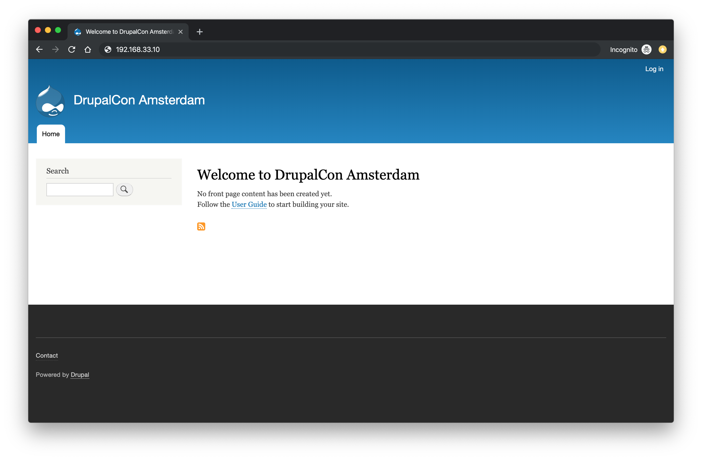

autoscale: true
build-lists: true
code: line-height(1.2)
header-emphasis: #53B0EB
text: alignment(left)
theme: plain jane, 8

# [fit] **Deploying PHP applications** <br>using Ansible, Ansible Vault <br>and Ansistrano

^ Ansible crash course
Basic deployment
Better deployment

---

[.build-lists: false]
[.header: #111111]


- Full Stack Web Developer & System Administrator
- **Senior Software Engineer** at **Inviqa**
- Acquia certified **Drupal 8 Grand Master**
- Open sourcer
- Drupal 7 & 8 **core contributor**
- @opdavies
- www.oliverdavies.uk

^ Maintain Drupal modules, PHP CLI tools and libraries
Blog on my website
I work for Inviqa, but this based on my personal and side projects, though I've implemented similar solutions in the past.

---


^ Large, well-known managed hosting companies
Optimised servers for PHP/Drupal applications
Include some sort of deployment system

---


^ More applicable to virtual or dedicated servers with no existing deployment process
Not enough budget for fully-managed, or using internal infrastructure

---

## **What we'll be looking at**

* **Ansible** crash course
* Keeping secrets with **Ansible Vault**
* Deployments with **Ansistrano**

---

# **What is Ansible?**

---

## Ansible is **open source software** that automates **software provisioning**, <br>**configuration management**, <br>and **application deployment**.


---


### **What is Ansible?**

* CLI tool
* Written in Python
* Configured with YAML
* Executes remote commands
* Installs software packages
* Performs deployment steps
* Batteries included

^ Written in Python but you don't need to write or know Python to use it

---


### **What is Ansible?**

* Hosts/Inventories
* Commands
* Playbooks
* Tasks
* Roles

---


### **Why Ansible?**

* Familiar syntax
* Easily readable
* No server dependencies
* Easy to add to an existing project
* Includes relevant modules (e.g. Composer)

^ Drupal 8, Symfony, Ansible all use YAML
Runs on any server with Python
Plugins into Drupal via CLI apps like Drush and Drupal Console

---

# **Hosts / Inventories**

---

```ini
# hosts.ini

[webservers]
192.168.33.10
```

---

```yaml
# hosts.yml

webservers:
  hosts:
    192.168.33.10:
```

---

# **Commands**

---

# `ansible all -m ping`

---

```
webservers | SUCCESS => {
    "ansible_facts": {
        "discovered_interpreter_python": "/usr/bin/python"
    },
    "changed": false,
    "ping": "pong"
}
```

---

# `ansible all `<br>`-m command `<br>`-a 'git pull `<br>`--chdir=/app'`

---

# `ansible all `<br>`-m git -a 'repo=https://github.com/opdavies/dransible dest=/app`'

---

# **Tasks and Playbooks**

---

```yaml
# playbook.yml

---
- hosts: all

  vars:
    git_repo: https://github.com/opdavies/dransible

  tasks:
    - name: Update the code
      git:
        repo: '{{ git_repo }}'
        dest: /app
        version: master
        update: true
```

---

# `ansible-playbook `<br>`ansible/playbook.yml `<br>`-i hosts.yml`

---

# **Roles**

^ Collections of tasks, variables and handlers

---

```yaml
# requirements.yml

---
- src: geerlingguy.apache
- src: geerlingguy.composer
- src: geerlingguy.mysql
- src: geerlingguy.php
- src: geerlingguy.php-mysql
```

^ Provisioning LAMP stack and Composer

---

# `ansible-galaxy -r`<br>`ansible/requirements.yml install`

---

```yaml
# playbook.yml

---
- hosts: all

  roles:
    - geerlingguy.apache
    - geerlingguy.mysql
    - geerlingguy.php
    - geerlingguy.php-mysql
    - geerlingguy.composer
```

^ Role order matters!

---

```yaml
# ansible/provision.yml

tasks:
  - name: Create a database
    mysql_db:
      name: mydatabase
      state: present

  - name: Add the database user
    mysql_user:
      name: drupal
      password: secret
      priv: 'mydatabase.*:ALL'
      state: present
```

---

# **Basic deployment**

---

```yaml
# ansible/deploy.yml

tasks:
  - name: Creating project directory
    file:
      path: /app
      state: directory

  - name: Uploading application
    synchronize:
      src: "{{ playbook_dir }}/../"
      dest: /app

  - name: Installing Composer dependencies
    composer:
      command: install
      working_dir: /app
```

---

# Disadvantages

* Single point of failure
* No ability to roll back
* Sensitive data stored in plain text

---

# **Keeping secrets: <br>Ansible Vault**

---

# `ansible-vault create` <br>`ansible/vault.yml`

---

```yaml
# ansible/vars/vault.yml

---
vault_database_name: mydatabase
vault_database_user: drupal
vault_database_password: secret
```

^ Optional, but easier to see where variables are set

---

```
$ANSIBLE_VAULT;1.1;AES256
36656233323539616336393838396137343939623233393338666530313
73037323366326363306531336333353163643063663335396139363762
39383133330a35636566623262353733373066363837393264616134613
16366376266646437373366373738303931616333626332353839353332
32663432346662613438330a38643539343232376138613733373636343
63864666430313866623539333039363138646331326565386263386666
35306264396230633939346532356665306564626431353936643135376
23834346635366637613235656165643361316663396530383263333064
33326264316235396431666262346637366563376330363238373331373
43533386165366531626462643662666266316639306262666539373236
343662313265376261316636623963353933613366353737363435
```

---

```yaml
# ansible/vars/vars.yml

---
database_name: "{{ vault_database_name }}"
database_user: "{{ vault_database_user }}"
database_password: "{{ vault_database_password }}"
```

---

```yaml
# ansible/provision.yml

tasks:
  - name: Create a database
    mysql_db:
      name: '{{ database_name }}'
      state: present
```

---

# `ansible-vault edit ansible/vault.yml`

---

# `ansible-playbook` <br>`-i hosts.yml` <br>`ansible/deploy.yml`<br>`--ask-vault-pass`

---

# **Better deployments**

---


^ Just another role, specifically for deployments
Ansible port of Capistrano

---

# Features

* Multiple release directories
* Shared paths and files
* Customisable
* Multiple deployment strategies
* Multi-stage environments
* Prune old releases
* Rollbacks

^ rsync, Git, SVN etc

---

```yaml
# ansible/requirements.yml

---
...
- ansistrano.deploy
- ansistrano.rollback
```

---

```yaml
# ansible/deploy.yml

---
- hosts: all

  roles:
    - ansistrano.deploy
```

---

```yaml
# ansible/deploy.yml

---
  ...
  vars:
    project_deploy_dir: /var/www

    ansistrano_deploy_to: '{{ project_deploy_dir }}'
    ansistrano_deploy_via: git
    ansistrano_git_branch: master
    ansistrano_git_repo: 'git@github.com:opdavies/dransible'
```

---

# `ansible-playbook` <br>`-i hosts.yml` <br>`ansible/deploy.yml`

---

```bash
vagrant@dransible:/app$ ls -l
total 8

lrwxrwxrwx 1   26 Jul 19 00:15 current -> ./releases/20190719001241Z
drwxr-xr-x 5 4096 Jul 22 20:30 releases
drwxr-xr-x 4 4096 Jul 19 00:00 shared
```

---

```
vagrant@dransible:/app/releases$ ls -l
total 20

drwxr-xr-x  5 4096 Jul 22 20:30 .
drwxr-xr-x  4 4096 Jul 19 00:15 ..
drwxr-xr-x 10 4096 Jul 19 00:02 20190719000013Z
drwxr-xr-x 10 4096 Jul 19 00:14 20190719001241Z
drwxr-xr-x  9 4096 Jul 22 20:30 20190722203038Z
```

---

```yaml
# ansible/rollback.yml

---
- hosts: all

  roles:
    - ansistrano.rollback

  vars:
    ansistrano_deploy_to: '{{ project_deploy_dir }}'
```

---

# `ansible-playbook` <br>`-i hosts.yml` <br>`ansible/rollback.yml`

---

# **Customising Ansistrano: <br>Build Hooks**

---


^ Shared = files directory, logs
Before/after symlink shared = run tests
Symlink = 'current' symlink, site is live
Clean up = remove node_modules, database export, sqlite testing DB

---

```yaml
# ansible/deploy.yml

vars:
  ...
  ansistrano_after_symlink_shared_tasks_file: "{{ playbook_dir }}/deploy/after-symlink-shared.yml"
  ansistrano_after_symlink_tasks_file: "{{ playbook_dir }}/deploy/after-symlink.yml"
  ansistrano_after_update_code_tasks_file: "{{ playbook_dir }}/deploy/after-update-code.yml"

  release_web_path: "{{ ansistrano_release_path.stdout }}/web"
  release_drush_path: "{{ ansistrano_release_path.stdout }}/vendor/bin/drush"
```

---

```yaml
# ansible/deploy/after-update-code.yml

---
- name: Install Composer dependencies
  composer:
    command: install
    working_dir: '{{ ansistrano_release_path.stdout }}'
```

---

```yaml
# ansible/deploy/after-symlink-shared.yml

---
- name: Run database updates
  command: '{{ release_drush_path }} --root {{ release_web_path }} updatedb'
```

---

```yaml
# ansible/deploy/after-symlink.yml

---
- name: Clear Drupal cache
  command: '{{ release_drush_path }} --root {{ release_web_path }} cache-rebuild'
```

---



---

# **Demo**

---

# **Questions?**

---


---


^ Please leave feedback via the DrupalCon app, or via Twitter

---

# **Managing data <br>across deployments**

---

```yaml
# ansible/deploy.yml

vars:
  # ...
  ansistrano_shared_paths:
    - "{{ drupal_root }}/sites/default/files"
```

---

```
vagrant@dransible:/app/shared/web/sites/default/files$ ls -la
total 28

drwxrwxrwx 6 4096 Jul 19 00:18 .
drwxr-xr-x 3 4096 Jul 19 00:00 ..
drwxrwxr-x 2 4096 Jul 22 21:24 css
-rwxrwxrwx 1  487 Jul 19 00:02 .htaccess
drwxrwxr-x 2 4096 Jul 19 00:19 js
drwxrwxrwx 3 4096 Jul 19 00:18 php
drwxrwxrwx 2 4096 Jul 19 00:03 styles
```

---

```
vagrant@dransible:/app/current/web/sites/default$ ls -la
total 48
dr-xr-xr-x 2  4096 Jul 19 00:14 .
drwxr-xr-x 3  4096 Jan 22 17:30 ..
-rw-r--r-- 1  6762 Jul 19 00:14 default.services.yml
-rw-r--r-- 1 31342 Jul 19 00:14 default.settings.php
lrwxrwxrwx 1    45 Jul 19 00:14 files -> ../../../../../shared/web/sites/default/files
lrwxrwxrwx 1    35 Jul 19 00:12 settings.php -> /tmp/app/sites/default/settings.php
```

---

# **Generating Drupal settings <br>files per deployment**

---

```yaml
# ansible/vars/vault.yml

---
vault_database_name: drupal
vault_database_user: drupal
vault_database_password: drupal
vault_hash_salt: dfgiy$fd2!34gsf2*34g74
```
---

```yaml
# ansible/vars/vars.yml

---
database_name: "{{ vault_database_name }}"
database_password: "{{ vault_database_password }}"
database_user: "{{ vault_database_user }}"
hash_salt: "{{ vault_hash_salt }}"
```

---

```yaml
# ansible/vars/vars.yml

---
drupal_settings:
  - drupal_root: /tmp/app
    sites:
      - name: default
        settings:
          databases:
            default:
              default:
                driver: mysql
                host: localhost
                database: '{{ database_name }}'
                username: '{{ database_user }}'
                password: '{{ database_password }}'
          hash_salt: '{{ hash_salt }}'
          config_directories:
            sync: ../config/sync
```


---

```php
// templates/settings.php.j2
// {{ ansible_managed }}



$databases['{{ key }}']['{{ target }}'] = array(
  'driver' => '{{ values.driver|default('mysql') }}',
  'host' => '{{ values.host|default('localhost') }}',
  'database' => '{{ values.database }}',
  'username' => '{{ values.username }}',
  'password' => '{{ values.password }}',
);





$base_url = '{{ item.1.settings.base_url }}';

```

---

```yaml
- name: Remove settings.php
  file:
    path: '{{ ansistrano_release_path.stdout }}/web/sites/{{ item.1.name|default("default")}}/settings.php'
    state: absent
  with_subelements:
    - '{{ drupal_settings }}'
    - sites

- name: Link settings.php
  file:
    src: '/tmp/app/sites/{{ item.1.name|default("default")}}/settings.php'
    dest: '{{ ansistrano_release_path.stdout }}/web/sites/{{ item.1.name|default("default")}}/settings.php'
    state: link
  with_subelements:
    - '{{ drupal_settings }}'
    - sites
```
