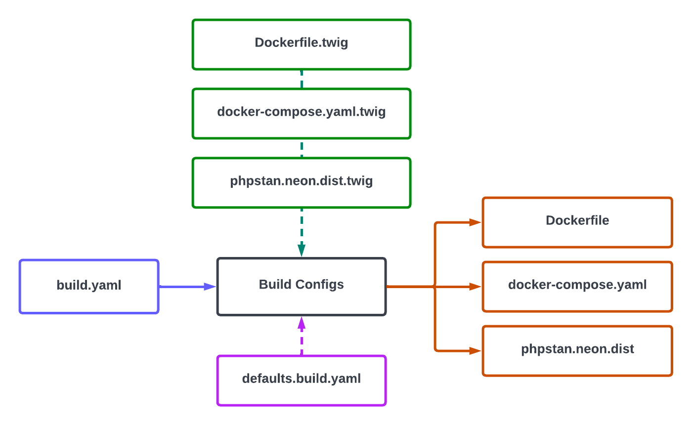

.. footer:: @opdavies

Building "Build Configs"
########################

.. class:: titleslideinfo

Oliver Davies (@opdavies)

.. raw:: pdf

   PageBreak standardPage

What is "Build Configs"?
========================

- Command-line tool.
- Inspired by Workspace, name from the TheAltF4Stream.
- Built with Symfony.
- Creates and manages build configuration files.
- Customisable per-project.
- Drupal, PHP library, Fractal (TypeScript).
- "Sprint zero in a box".

What Problem Does it Solve?
===========================

- I work on multiple similar projects.
- Different configuration values - e.g. ``web`` vs. ``docroot``.
- Different versions of PHP, node, etc.
- Different Docker Compose (``fpm`` vs. ``apache`` images).
- Each project was separate.
- Difficult to add new features and fix bugs across all projects.
- Inconsistencies across projects.
- Out of the box solutions didn't seem like the best fit.

.. raw:: pdf

    TextAnnotation "Multiple projects with similar but different configurations."
    TextAnnotation ""
    TextAnnotation "Out of the box solutions tend to focus on one technology, could be hard to customise, and usually had more than I nedeed."
    TextAnnotation ""
    TextAnnotation "Start small and build up instead of removing additional things."
    TextAnnotation ""
    TextAnnotation "More opportunities to learn the underlying technologies."

How Does it Work?
=================

What Files Does it Generate?
============================

- Dockerfile, Docker Compose, Nix Flake, php.ini, NGINX default.conf.
- ``run`` file.
- PHPUnit, PHPCS, PHPStan.
- GitHub Actions workflow.
- Git hooks.

Example
=======

build.yaml:

.. code-block:: yaml

   name: my-example-project
   type: drupal
   language: php

   php:
     version: 8.1-fpm-bullseye

|

Dockerfile:

.. raw:: pdf

   TextAnnotation "Abstract the project-specific values and configuration into this file."

.. code-block:: yaml

   FROM php:8.1-fpm-bullseye AS base

Configuring a Project
=====================

.. code-block:: yaml

   php:
     version: 8.1-fpm-bullseye

     # Which PHPCS standards should be used and on which paths?
     phpcs:
       paths: [web/modules/custom]
       standards: [Drupal, DrupalPractice]

     # What level should PHPStan run and on what paths?
     phpstan:
       level: max
       paths: [web/modules/custom]

.. raw:: pdf

   PageBreak

.. code-block:: yaml

   docker-compose:
     # Which Docker Compose services do we need?
     services:
       - database
       - php
       - web

   dockerfile:
     stages:
       build:
         # What commands do we need to run?
         commands:
           - composer validate --strict
           - composer install

.. raw:: pdf

   PageBreak

.. code-block:: yaml

   web:
     type: nginx # nginx, apache, caddy

   database:
     type: mariadb # mariadb, mysql
     version: 10

   # Where is Drupal located?
   drupal:
     docroot: web # web, docroot, null

   experimental:
     createGitHubActionsConfiguration: true
     runGitHooksBeforePush: true
     useNewDatabaseCredentials: true

.. raw:: pdf

  TextAnnotation "Experimental opt-in features that I want to trial on certain projects or to disable non-applicable features - e.g. GitHub Actions on Bitbucket."

  PageBreak
        
Overriding Values
=================

.. code-block:: yaml

   php:
     version: 8.1-fpm-bullseye
     # Disable PHPCS, PHPStan and PHPUnit.
     phpcs: false
     phpstan: false
     phpunit: false

   # Ignore more directories from Git.
   git:
     ignore:
       - /bin/
       - /libraries/
       - /web/profiles/contrib/

.. raw:: pdf

   TextAnnotation "Drupal Commerce Kickstart demo. No custom modules to test, and additional paths to ignore from Git."

   PageBreak

.. code-block:: yaml

   dockerfile:
     stages:
       build:
         # What additional directories do we need?
         extra_directories:
           - config
           - patches
           - scripts

         commands:
           - composer validate --strict
           - composer install

         # What additional PHP extensions do we need?
         extensions:
           install: [bcmath]

.. raw:: pdf

   TextAnnotation "Extra directories and PHP extensions that need to be added".

Dockerfile.twig
===============

.. code-block:: twig
  :linenos:

    FROM php:{{ php.version }} AS base

    COPY --from=composer:2 /usr/bin/composer /usr/bin/composer
    RUN which composer && composer -V

    ARG DOCKER_UID=1000
    ENV DOCKER_UID="${DOCKER_UID}"

    WORKDIR {{ project_root }}

    RUN adduser --disabled-password --uid "${DOCKER_UID}" app \
      && chown app:app -R {{ project_root }}

Dockerfile.twig
===============

.. code-block:: twig
   :linenos:

    
    RUN docker-php-ext-install
      {{ dockerfile.stages.build.extensions.install|join(' ') }}
    

    COPY --chown=app:app phpunit.xml* ./

    
    COPY --chown=app:app {{ dockerfile.stages.build.extra_files|join(" ") }} ./
    

    
    COPY --chown=app:app {{ directory }} {{ directory }}
    

docker-compose.yaml.twig
========================

.. code-block:: twig
   :linenos:

    services:
    
      web:
        <<: [*default-proxy, *default-app]
        build:
          context: .
          target: web
        depends_on:
          - php
        profiles: [web]
    

phpstan.neon.dist.twig
======================

.. code-block:: twig
   :linenos:

    parameters:
      level: {{ php.phpstan.level }}
      excludePaths:
        - *Test.php
        - *TestBase.php
      paths:
        
        - {{ path }}
        

    
    includes:
      - phpstan-baseline.neon
    

phpunit.xml.dist.twig
=====================

.. code-block:: twig
   :linenos:

    <phpunit
      beStrictAboutChangesToGlobalState="true"
      beStrictAboutOutputDuringTests="false"
      beStrictAboutTestsThatDoNotTestAnything="true"
      bootstrap="{{ drupal.docroot }}/core/tests/bootstrap.php"
      cacheResult="false"
      colors="true"
      failOnWarning="true"
      printerClass="\Drupal\Tests\Listeners\HtmlOutputPrinter"
    >

phpunit.xml.dist.twig
=====================

.. code-block:: twig
   :linenos:

    <testsuites>
      <testsuite name="functional">
        <directory>./{{ drupal.docroot }}/modules/custom/**/tests/**/Functional</directory>
      </testsuite>
      <testsuite name="kernel">
        <directory>./{{ drupal.docroot }}/modules/custom/**/tests/**/Kernel</directory>
      </testsuite>
      <testsuite name="unit">
        <directory>./{{ drupal.docroot }}/modules/custom/**/tests/**/Unit</directory>
      </testsuite>
    </testsuites>

.. raw:: pdf

   PageBreak titlePage

.. class:: centredtitle

Demo

.. raw:: pdf

   PageBreak standardPage

Result
======

- Easier and faster to create and onboard projects.
- One canonical source of truth.
- Easy to add new features and fixes for all projects.
- Automation is easier due to consistency (e.g. Docker Compose service names).

Thanks!
=======

References:

- https://opdavi.es/build-configs
- https://github.com/opdavies/docker-example-drupal
- https://github.com/opdavies/docker-example-drupal-commerce-kickstart
- https://github.com/opdavies/docker-example-drupal-localgov

|

Me:

- https://www.oliverdavies.uk
