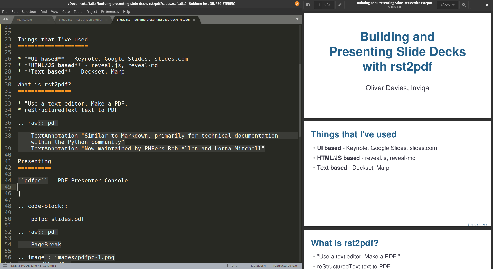
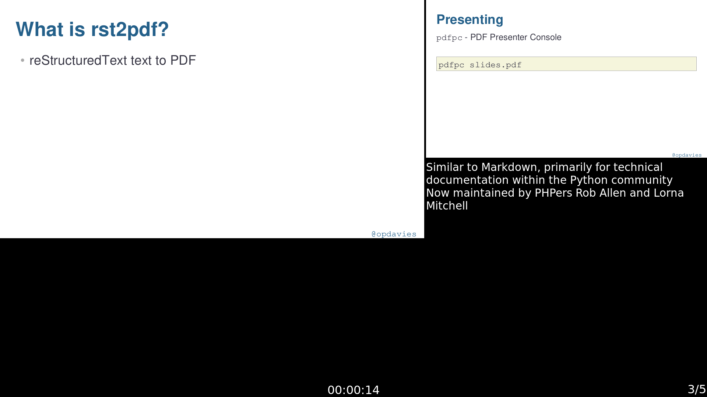
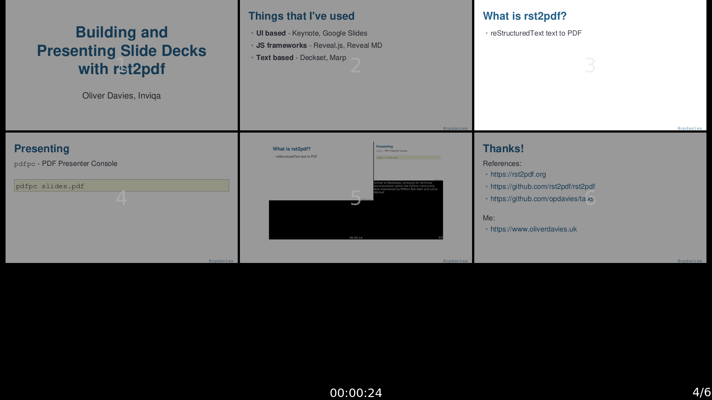

.. footer:: @opdavies

Building and presenting slide decks with rst2pdf
################################################

|

.. class:: titleslideinfo

Oliver Davies (@opdavies)

.. raw:: pdf

    TextAnnotation "Gave my first talk in 2012."
    TextAnnotation "A talk about a tool (rst2pdf) that I've been using for the last couple of talks."

.. page:: standardPage

What have I used before?
========================

* **UI based:** Keynote, Google Slides, slides.com
* **HTML/JavaScript:** reveal.js
* **Markdown:** Deckset, Marp, reveal-md

What is rst2pdf?
================

* "Use a text editor. Make a PDF."
* reStructuredText to PDF
* Each slide is a page
* Page templates for layouts
* Not just for slide decks
* Table of contents, page numbers, headers, footers

.. raw:: pdf

    TextAnnotation "Use the tools you're familiar with."
    TextAnnotation "Similar to Markdown."
    TextAnnotation "Primarily used for technical documentation within the Python community."
    TextAnnotation "Now maintained by PHPers Rob Allen and Lorna Jane Mitchell."
    TextAnnotation "Breaks at titles automatically, or you can add manual page breaks."

Advantages
==========

* Easy to start a new presentation, or update an existing one
* Version controllable
* Portable
* Content is searchable
* Easy to re-use content and/or styling
* Slides uploaded to SpeakerDeck straight away

.. page:: imagePage

.. page:: standardPage

Useful reStructuredText
=======================

.. code-block:: rst
    :include: code/useful-rst-1.txt
    :linenos:

Useful reStructuredText
=======================

.. code-block:: rst
    :include: code/useful-rst-2.txt
    :linenos:

Page Templates
==============

main.style:

.. code-block:: yaml 
    :include: code/page-templates-style.txt

slides.rst:

.. code-block:: rst
    :include: code/page-templates-rst.txt

Keeping things organised
========================

Split slides into different sections:

.. code-block:: rst
   :include: code/includes-sections.txt

|

Including code snippets from separate files:

.. code-block:: rst
    :include: code/includes-code.txt

.. raw:: pdf

    TextAnnotation "Includes!"

Styling
=======

.. code-block:: yaml
    :include: code/styling.txt
    :linenos:

Building
========

.. code-block::
    :include: code/building.txt

Watching
========

Re-compiling when something changes.

|

.. code-block:: bash
  :include: code/watching.txt

Presenting
==========

``pdfpc`` - PDF presenter console

|

.. code-block::

    pdfpc slides.pdf

.. page:: imagePage

.. raw:: pdf

    PageBreak

.. page:: standardPage

Thanks!
=======

References:

* https://rst2pdf.org
* https://github.com/rst2pdf/rst2pdf
* https://github.com/opdavies/talks
* https://oliverdavies.link/lorna-rst2pdf-talk

|

Me:

* https://www.oliverdavies.uk
