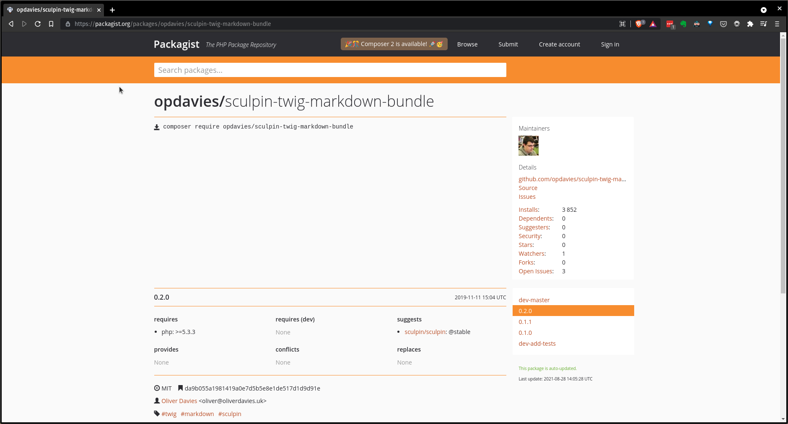

.. footer:: @opdavies

Building static websites with Sculpin
#####################################

|

.. class:: titleslideinfo

Oliver Davies (@opdavies)

.. page:: imagePage

.. image:: images/druplicon.png
   :width: 10cm

.. raw:: pdf

    PageBreak

.. page:: standardPage

What is Sculpin?
================

* Static site generator
* CLI tool
* Built on Symfony components
* Markdown + Twig = Static HTML

.. raw:: pdf

   TextAnnotation "Uses various Symfony components - Console, config, DI, Filesystem, Finder, HttpKernel, YAML."
   TextAnnotation "Uses Twig - Symfony's templating language."
   TextAnnotation ""
   TextAnnotation "Transforms markdown files and Twig templates into static HTML websites, 'generates' a static website that can easily be deployed."

Why use a static site generator?
================================

- Rapid development.
- Security.
- Performance.
- Easy and cheap to host.

.. raw:: pdf

   TextAnnotation "Static websites are fast and secure as they don't have a database and only need a simple hosting environment with a basic web server."

What do I use it for?
=====================

* My personal website.
* Some client websites.
* HTML prototypes and testing.
* Learning YAML and Twig (and some Symfony).

Installation
============

``composer require sculpin/sculpin``

|

``composer create-project sculpin/blog-skeleton my-blog``

|

``composer create-project opdavies/sculpin-skeleton my-site``

Using Sculpin
=============

* Configuration in ``app/config``
* Source files in ``source``.

   * Templates in ``source/_templates`` or ``source/_layouts``.
   * Includes in ``source/_includes`` or ``source/_partials``.

.. raw:: pdf

   PageBreak

.. code-block::
   :include: ./code/project-structure.txt

.. raw:: pdf

   TextAnnotation "The file structure of a Sculpin project."
   PageBreak

.. code-block:: shell
   :include: ./code/project-structure.txt
   :hl_lines: 6,7,14

.. raw:: pdf

   TextAnnotation "PHP-based project."
   PageBreak

.. code-block:: shell
   :include: ./code/project-structure.txt
   :hl_lines: 2,3,4,5

.. raw:: pdf

   TextAnnotation "Configuration."
   PageBreak

.. code-block:: shell
   :include: ./code/project-structure.txt
   :hl_lines: 10,11,12,13

.. raw:: pdf

   TextAnnotation "Source files."
   PageBreak

.. code-block:: shell
   :include: ./code/project-structure.txt
   :hl_lines: 8,9

.. raw:: pdf

   TextAnnotation "Output directories with generated files."

Generate a site
===============

* ``vendor/bin/sculpin generate``
* ``--server``
* ``--watch``
* ``--env``

source/index.md
===============

.. code-block:: markdown
    :include: code/index.md.txt
    :linenos:

source/index.md
===============

.. code-block:: markdown
    :include: code/index.md.txt
    :linenos:
    :hl_lines: 1,2,3,4

source/index.md
===============

.. code-block:: markdown
    :include: code/index.md.txt
    :linenos:
    :hl_lines: 2

source/index.md
===============

.. code-block:: markdown
    :include: code/index.md.txt
    :linenos:
    :hl_lines: 3

source/index.md
===============

.. code-block:: markdown
    :include: code/index.md.txt
    :linenos:
    :hl_lines: 6

output_dev/index.html
=====================

.. code-block:: html
   :include: ./code/index.html.txt
   :linenos:

output_dev/index.html
=====================

.. code-block:: html
   :include: ./code/index.html.txt
   :linenos:
   :hl_lines: 4

output_dev/index.html
=====================

.. code-block:: html
   :include: ./code/index.html.txt
   :linenos:
   :hl_lines: 7

Configuration
=============

- Stored in ``app/config``

   - ``sculpin_site.yml``
   - ``sculpin_site_{env}.yml``

- Key-value pairs

|

.. code-block:: yaml
    :linenos:
    :include: code/configuration.txt

Using on pages
==============

.. code-block:: html

   <!DOCTYPE html>
   <html>
       <head>
           <title>{{ site.name }}</title>
       </head>
   </html>

YAML front matter
=================

.. code-block:: yaml
    :include: ./code/front-matter1.txt

YAML front matter
=================

.. code-block:: yaml
    :include: ./code/front-matter1.txt
    :linenos:
    :hl_lines: 2

YAML front matter
=================

.. code-block:: yaml
    :include: ./code/front-matter1.txt
    :linenos:
    :hl_lines: 3

YAML front matter
=================

.. code-block:: yaml
    :include: ./code/front-matter1.txt
    :linenos:
    :hl_lines: 4

.. raw:: pdf

   TextAnnotation "Draft pages aren't generated when ENV=prod".

More front matter
=================

.. code-block:: yaml
    :linenos:
    :hl_lines: 5,6,7,8

    ---
    layout: post
    title: New blog post
    draft: yes
    tags:
        - drupal
        - php
        - sculpin
    ---

    # My new blog post

Even more front matter
======================

.. code-block:: yaml
    :linenos:
    :hl_lines: 9,10

    ---
    layout: post
    title: New blog post
    draft: yes
    tags:
        - drupal
        - php
        - sculpin
    tweets: yes
    foo: bar
    ---

    # My new blog post

Using on pages
==============

.. code-block:: twig
    :include: ./code/front-matter-on-pages.txt
    :linenos:

.. raw:: pdf

   PageBreak

Using on pages
==============

.. code-block:: bash
    :include: ./code/front-matter-on-pages.txt
    :linenos:
    :hl_lines: 3

.. raw:: pdf

   PageBreak

Using on pages
==============

.. code-block:: bash
    :include: ./code/front-matter-on-pages.txt
    :linenos:
    :hl_lines: 4,5,6

.. raw:: pdf

   PageBreak

Using on pages
==============

.. code-block:: bash
    :include: ./code/front-matter-on-pages.txt
    :linenos:
    :hl_lines: 9,12

.. raw:: pdf

   PageBreak

Using on pages
==============

.. code-block:: bash
    :include: ./code/front-matter-on-pages.txt
    :linenos:
    :hl_lines: 10

Using on pages
==============

.. code-block:: bash
    :include: ./code/front-matter-on-pages.txt
    :linenos:
    :hl_lines: 11

.. raw:: pdf

   TextAnnotation "`page.` instead of `site.`."

Layouts
=======

.. code-block:: twig
    :include: ./code/layout-base.txt
    :linenos:

Layouts
=======

.. code-block:: twig
    :include: ./code/layout-base.txt
    :linenos:
    :hl_lines: 4,6

Layouts
=======

.. code-block:: twig
    :include: ./code/layout-base.txt
    :linenos:
    :hl_lines: 9

Layouts
=======

.. code-block:: twig
    :include: ./code/layout-page.txt
    :linenos:

Layouts
=======

.. code-block:: twig
    :include: ./code/layout-page.txt
    :linenos:
    :hl_lines: 3

Layouts
=======

.. code-block:: twig
    :include: ./code/layout-page.txt
    :linenos:
    :hl_lines: 5,7

Layouts
=======

.. code-block:: twig
    :include: ./code/layout-page.txt
    :linenos:
    :hl_lines: 6

Includes
========

.. code-block:: twig

    

    
        
    

Content types
=============

.. code-block:: yaml

    # app/config/sculpin_kernel.yml

    sculpin_content_types:
        daily_emails:
            permalink: daily/:slug_title/

.. raw:: pdf

   TextAnnotation "A way to segregate content into different types - e.g. pages, talks, daily emails. Something that was familiar from working with Drupal."

Accessing custom content types
==============================

.. code-block:: yaml
    :include: ./code/content-types.txt
    :linenos:

Accessing custom content types
==============================

.. code-block:: yaml
    :include: ./code/content-types.txt
    :linenos:
    :hl_lines: 4,5

Accessing custom content types
==============================

.. code-block:: yaml
    :include: ./code/content-types.txt
    :linenos:
    :hl_lines: 8,9,10

.. raw:: pdf

   PageBreak titlePage

.. class:: centredtitle

Making things more dynamic

.. raw:: pdf

   PageBreak standardPage

.. code-block:: twig
    :include: ./code/twig-1.txt
    :hl_lines: 1

.. raw:: pdf

   TextAnnotation "'today' as a string."
   PageBreak

.. code-block:: twig
    :include: ./code/twig-1.txt
    :hl_lines: 3

.. raw:: pdf

   TextAnnotation "Current date as a string."
   PageBreak

.. code-block:: twig
    :include: ./code/twig-1.txt
    :hl_lines: 5

.. raw:: pdf

   TextAnnotation "Current year."
   PageBreak

.. code-block:: twig
    :include: ./code/twig-1.txt
    :hl_lines: 7

.. raw:: pdf

   PageBreak

.. code-block:: php
    :include: ./code/twig-2.txt
    :end-before: // end yaml

.. raw:: pdf

   PageBreak

.. code-block:: twig
    :include: ./code/twig-2.txt
    :start-after: // start twig

.. raw:: pdf

   PageBreak

.. code-block:: twig
    :include: ./code/twig-2.txt
    :start-after: // start twig
    :hl_lines: 1

.. raw:: pdf

   PageBreak

.. code-block:: javascript
    :include: ./code/twig-2.txt
    :hl_lines: 3,7
    :start-after: // start twig

.. raw:: pdf

   TextAnnotation "Get each talk from the talk content type."
   PageBreak

.. code-block:: twig
    :include: ./code/twig-2.txt
    :start-after: // start twig
    :hl_lines: 4,6

.. raw:: pdf

   PageBreak

.. code-block:: twig
    :include: ./code/twig-2.txt
    :start-after: // start twig
    :hl_lines: 5

.. raw:: pdf

   PageBreak

.. code-block:: javascript
    :include: ./code/twig-2.txt
    :start-after: // start twig
    :hl_lines: 9

.. raw:: pdf

   PageBreak

.. code-block:: javascript
    :include: ./code/twig-3.txt

.. raw:: pdf

   PageBreak

.. code-block:: javascript
    :include: ./code/twig-3.txt
    :hl_lines: 1,3,18

.. raw:: pdf

   PageBreak

.. code-block:: javascript
    :include: ./code/twig-3.txt
    :hl_lines: 5,6,10,11,12,13,14

.. page:: titlePage

.. class:: centredtitle

Demo

.. page:: standardPage

Extending Sculpin
=================

.. code-block:: yaml

    # app/config/sculpin_kernel.yml

    ...

    services:
        App\TwigExtension\TalkExtension:
            tags:
                - { name: twig.extension }

.. page:: imagePage

.. page:: standardPage

.. code-block:: php
   :startinline: true

    // app/SculpinKernel.php

    use Opdavies\Sculpin\Bundle\TwigMarkdownBundle\SculpinTwigMarkdownBundle;
    use Sculpin\Bundle\SculpinBundle\HttpKernel\AbstractKernel;

    final class SculpinKernel extends AbstractKernel
    {
        protected function getAdditionalSculpinBundles(): array
        {
            return [
                SculpinTwigMarkdownBundle::class,
            ];
        }
    }

Thanks!
=======

References:

* https://www.oliverdavies.uk/brumphp
* https://sculpin.io
* https://github.com/opdavies/phpsw-sculpin-demo
* https://github.com/opdavies/oliverdavies.uk

|

Me:

* https://www.oliverdavies.uk
* ``@opdavies``
