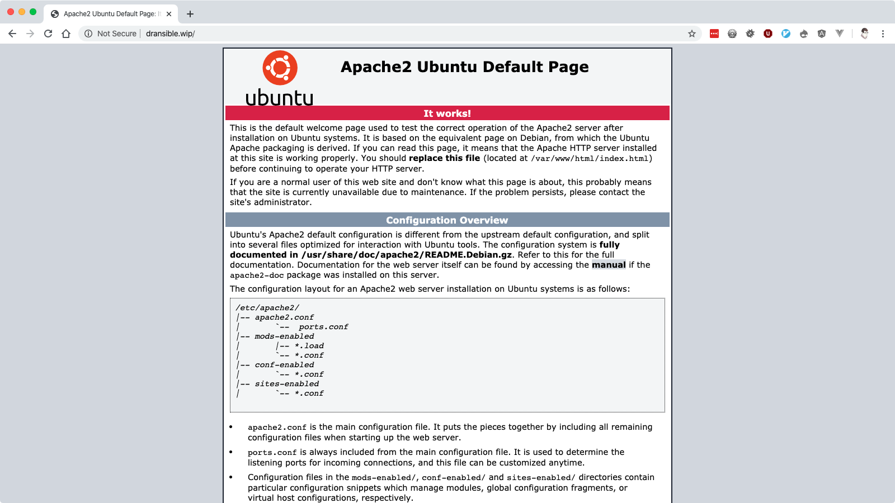
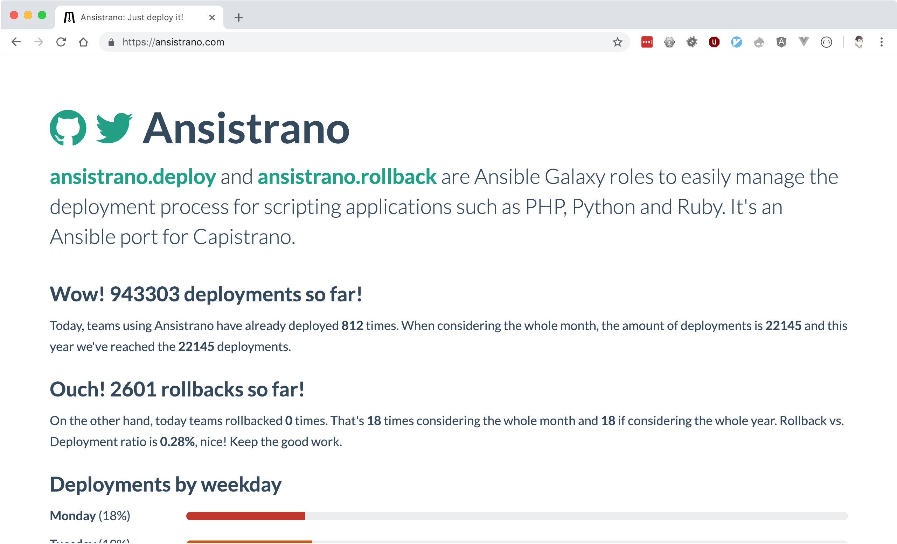

autoscale: true build-lists: true code: line-height(1.2) header-emphasis:
#53B0EB text: alignment(left) theme: simple, 8

# [fit] **Deploying PHP applications** <br>using Ansible, Ansible Vault <br>and Ansistrano

^ I work primarily with PHP, and there will be some PHP-isms in this talk (LAMP
stack, Composer). Will be using a Drupal 8 application as the example, but the
tools are tool and language agnostic.

---

# [fit] **Deploying ~~PHP~~ applications** <br>using Ansible, Ansible Vault <br>and Ansistrano

---

## **What we'll be looking at**

- **Ansible** crash course
- Keeping secrets with **Ansible Vault**
- Deployments with **Ansistrano**

---

[.build-lists: false][.header: #111111]


- Full Stack Software Developer & System Administrator
- **Senior Software Engineer** at **Inviqa**
- Acquia certified **Drupal 8 Grand Master** and **Cloud Pro**
- Open sourcer
- Drupal 7 & 8 **core contributor**
- @opdavies
- www.oliverdavies.uk

^ Maintain Drupal modules, PHP CLI tools and libraries, Ansible roles Blog on my
website I work primarily with Drupal and Symfony I work for Inviqa, but this
based on my personal and side projects. I've been using Ansible for a number of
years, initially only for provisioning and setting up my laptop, and later for
application deployments

---


 

^ Large, well-known managed hosting companies Optimised servers for PHP/Drupal
applications Include some sort of deployment system This workflow doesn't apply
to this scenario

---

 


^ More applicable to virtual or dedicated servers with no existing deployment
process Not enough budget for fully-managed, or using internal infrastructure
This is where the this workflow would be useful

---

# **What is Ansible?**

---

## Ansible is an open-source **software provisioning, configuration management, and application-deployment** tool.


[.footer: https://en.wikipedia.org/wiki/Ansible_(software)]

---


### **What is Ansible?**

- CLI tool
- Written in Python
- Configured with YAML
- Executes ad-hoc remote commands
- Installs software packages
- Performs deployment steps
- Batteries included

^ Written in Python but you don't need to write or know Python to use it Drupal,
Symfony and a lot of other projects use YAML First-party modules (SSH keys, file
and directory management, package repositories, stopping/starting/restarting
services, DO/Linode/AWS integration)

---


### **What is Ansible?**

- Hosts/Inventories
- Commands
- Playbooks
- Tasks
- Roles

^ Hosts: where your managed nodes/hosts are. Can be static or dynamic. Commands:
run from a control node onto managed nodes Playbooks and Tasks: YAML
representation of a series of commands/steps

---


### **Why Ansible?**

- Familiar syntax
- Easily readable
- No server dependencies
- Easy to add to an existing project
- Includes relevant modules (e.g. Composer)
- Idempotency

^ Drupal 8, Symfony, Ansible all use YAML Runs on any server with Python Plugins
into Drupal via CLI apps like Drush and Drupal Console Changes are only made
when needed (once)

---

# **Hosts / Inventories**

---

```ini
# hosts.ini

[webservers]
192.168.33.10
```

^ Supports wildcards and ranges.

---

```yaml
# hosts.yml

webservers:
  hosts:
    192.168.33.10:
```

---

# **Commands**

---

# `ansible all -i hosts.yml -m ping`

---

```json
webservers | SUCCESS => {
    "ansible_facts": {
        "discovered_interpreter_python": "/usr/bin/python"
    },
    "changed": false,
    "ping": "pong"
}
```

---

# `ansible all`<br>`-i hosts.yml`<br>`-m command`<br>`-a 'git pull`<br>`--chdir=/app'`

---

# `ansible all -i hosts.yml`<br>`-m git -a 'repo=https://github.com/opdavies/dransible dest=/app`'

---

# **Tasks and Playbooks**

---

```yaml
# playbook.yml
---
- hosts: webservers # or 'all'

  vars:
    git_repo: https://github.com/opdavies/dransible

  tasks:
    - name: Update the code
      git:
        repo: '{{ git_repo }}'
        dest: /app
        version: master
        update: true
```

---

# `ansible-playbook`<br>`playbook.yml -i hosts.yml`

---

# **Roles: <br>configuring a LAMP stack**

^ Collections of tasks, variables and handlers

---

```yaml
# requirements.yml
---
- src: geerlingguy.apache
- src: geerlingguy.composer
- src: geerlingguy.mysql
- src: geerlingguy.php
- src: geerlingguy.php-mysql
```

^ Provisioning LAMP stack and Composer

---

# `ansible-galaxy -r`<br>`requirements.yml install`

---

```yaml
# provision.yml
---
- hosts: webservers

  roles:
    - geerlingguy.apache
    - geerlingguy.mysql
    - geerlingguy.php
    - geerlingguy.php-mysql
    - geerlingguy.composer
```

^ Role order matters!

---

```yaml
# provision.yml
---
- hosts: webservers
  # ...

  vars:
    apache_vhosts:
      - servername: dransible.wip
        documentroot: /app/web
```

---

```yaml
# provision.yml
---
- hosts: webservers
  # ...

  vars:
    # ...
    php_version: '7.4'
    php_packages_extra:
      - libapache2-mod-php{{ php_version }}
      - libpcre3-dev
```

---

```yaml
# provision.yml
---
- hosts: webservers
  # ...

  vars:
    # ...
    mysql_databases:
      - name: main

    mysql_users:
      - name: user
        password: secret
        priv: main.*:ALL
```

---

# `ansible-playbook provision.yml -i hosts.yml`

---

```
PLAY [Provision the webserver machines] ********************************************************************************

TASK [Gathering Facts] *************************************************************************************************
ok: [webservers]

TASK [geerlingguy.apache : Include OS-specific variables.] *************************************************************
ok: [webservers]

TASK [geerlingguy.apache : Include variables for Amazon Linux.]
skipping: [webservers]

TASK [geerlingguy.apache : Define apache_packages.] ********************************************************************
ok: [webservers]

TASK [geerlingguy.apache : include_tasks] ******************************************************************************
included: /Users/opdavies/.ansible/roles/geerlingguy.apache/tasks/setup-Debian.yml for webservers

TASK [geerlingguy.apache : Update apt cache.] **************************************************************************
changed: [webservers]
```

---

```
TASK [geerlingguy.composer : Ensure composer directory exists.] ********************************************************
ok: [webservers]

TASK [geerlingguy.composer : include_tasks] ****************************************************************************
skipping: [webservers]

TASK [geerlingguy.composer : include_tasks] ****************************************************************************
skipping: [webservers]

RUNNING HANDLER [geerlingguy.apache : restart apache] ******************************************************************
changed: [webservers]

RUNNING HANDLER [geerlingguy.mysql : restart mysql] ********************************************************************
changed: [webservers]

RUNNING HANDLER [geerlingguy.php : restart webserver] ******************************************************************
changed: [webservers]

RUNNING HANDLER [geerlingguy.php : restart php-fpm] ********************************************************************
skipping: [webservers]

PLAY RECAP *************************************************************************************************************
webservers                 : ok=111  changed=32   unreachable=0    failed=0    skipped=78   rescued=0    ignored=0
```

---



---


---

# **Keeping secrets with <br>Ansible Vault**

---

```yaml
# provision.yml
---
- hosts: webservers
  # ...

  vars:
    # ...
    mysql_databases:
      - name: main

    mysql_users:
      - name: user
        password: secret
        priv: main.*:ALL
```

---

[.code-highlight: 11-14]

```yaml
# provision.yml
---
- hosts: webservers
  # ...

  vars:
    # ...
    mysql_databases:
      - name: main

    mysql_users:
      - name: user
        password: secret
        priv: main.*:ALL
```

---

# `ansible-vault create` <br>`vault.yml`

---

```yaml
# vars/vault.yml
---
vault_database_name: main
vault_database_user: user
vault_database_password: secret
```

^ Optional, but easier to see where variables are set

---

```
$ANSIBLE_VAULT;1.1;AES256
36656233323539616336393838396137343939623233393338666530313
73037323366326363306531336333353163643063663335396139363762
39383133330a35636566623262353733373066363837393264616134613
16366376266646437373366373738303931616333626332353839353332
32663432346662613438330a38643539343232376138613733373636343
63864666430313866623539333039363138646331326565386263386666
35306264396230633939346532356665306564626431353936643135376
23834346635366637613235656165643361316663396530383263333064
33326264316235396431666262346637366563376330363238373331373
43533386165366531626462643662666266316639306262666539373236
343662313265376261316636623963353933613366353737363435
```

---

```yaml
# vars/vars.yml
---
database_name: '{{ vault_database_name }}'
database_user: '{{ vault_database_user }}'
database_password: '{{ vault_database_password }}'
```

---

```yaml
# provision.yml
---
mysql_databases:
  - '{{ database_name }}'

mysql_users:
  - name: '{{ database_user }}'
    password: '{{ database_password }}'
    priv: '{{ database_name }}.*:ALL'
```

---

# `ansible-vault edit vault.yml`

---

# `ansible-playbook` <br>`-i hosts.yml` <br>`deploy.yml`<br>`--ask-vault-pass`

---

# **Basic deployment**

---

```yaml
# deploy.yml

tasks:
  - name: Creating project directory
    file:
      path: /app
      state: directory

  - name: Uploading application
    synchronize:
      src: '{{ playbook_dir }}/../'
      dest: /app

  - name: Installing Composer dependencies
    composer:
      command: install
      working_dir: /app
```

---

# Disadvantages

- Single point of failure
- No ability to roll back
- Sensitive data stored in plain text

---

# **Better deployments**

---



^ Just another role, specifically for deployments Ansible port of Capistrano

---

# Features

- Multiple release directories
- Shared paths and files
- Customisable
- Multiple deployment strategies
- Multi-stage environments
- Prune old releases
- Rollbacks

^ rsync, Git, SVN etc

---

```yaml
# requirements.yml
---
# ...
- ansistrano.deploy
- ansistrano.rollback
```

---

```yaml
# deploy.yml
---
- hosts: all

  roles:
    - ansistrano.deploy
```

---

```yaml
# deploy.yml
---
# ...
vars:
  project_deploy_dir: /app

  ansistrano_deploy_to: '{{ project_deploy_dir }}'
  ansistrano_deploy_via: git
  ansistrano_git_branch: master
  ansistrano_git_repo: 'git@github.com:opdavies/dransible'
```

---

# `ansible-playbook` <br>`-i hosts.yml` <br>`deploy.yml`

---

```
PLAY [webservers] ******************************************************************************************************

TASK [Gathering Facts] *************************************************************************************************
ok: [webservers]

TASK [ansistrano.deploy : include_tasks] *******************************************************************************

TASK [ansistrano.deploy : include_tasks] *******************************************************************************
included: /Users/opdavies/.ansible/roles/ansistrano.deploy/tasks/setup.yml for webservers

TASK [ansistrano.deploy : ANSISTRANO | Ensure deployment base path exists] *********************************************
ok: [webservers]

TASK [ansistrano.deploy : ANSISTRANO | Ensure releases folder exists] **************************************************
ok: [webservers]

TASK [ansistrano.deploy : ANSISTRANO | Ensure shared elements folder exists] *******************************************
ok: [webservers]

TASK [ansistrano.deploy : ANSISTRANO | Ensure shared paths exists] *****************************************************
ok: [webservers] => (item=web/sites/default/files)
```

---

```
TASK [ansistrano.deploy : Update file permissions] *********************************************************************
changed: [webservers]

TASK [ansistrano.deploy : include_tasks] *******************************************************************************

TASK [ansistrano.deploy : include_tasks] *******************************************************************************
included: /Users/opdavies/.ansible/roles/ansistrano.deploy/tasks/cleanup.yml for webservers

TASK [ansistrano.deploy : ANSISTRANO | Clean up releases] **************************************************************
changed: [webservers]

TASK [ansistrano.deploy : include_tasks] *******************************************************************************

TASK [ansistrano.deploy : include_tasks] *******************************************************************************
included: /Users/opdavies/.ansible/roles/ansistrano.deploy/tasks/anon-stats.yml for webservers

TASK [ansistrano.deploy : ANSISTRANO | Send anonymous stats] ***********************************************************
skipping: [webservers]

PLAY RECAP *************************************************************************************************************
webservers                 : ok=33   changed=14   unreachable=0    failed=0    skipped=7    rescued=0    ignored=0
```

---

```bash
vagrant@dransible:/app$ ls -l
total 8

lrwxrwxrwx 1   26 Jul 19 00:15 current -> ./releases/20190719001241Z
drwxr-xr-x 5 4096 Jul 22 20:30 releases
drwxr-xr-x 4 4096 Jul 19 00:00 shared
```

---

```
vagrant@dransible:/app/releases$ ls -l
total 20

drwxr-xr-x  5 4096 Jul 22 20:30 .
drwxr-xr-x  4 4096 Jul 19 00:15 ..
drwxr-xr-x 10 4096 Jul 19 00:02 20190719000013Z
drwxr-xr-x 10 4096 Jul 19 00:14 20190719001241Z
drwxr-xr-x  9 4096 Jul 22 20:30 20190722203038Z
```

---

# `ansible-playbook` <br>`-i hosts.yml` <br>`rollback.yml`

---

```yaml
# rollback.yml
---
- hosts: all

  roles:
    - ansistrano.rollback

  vars:
    ansistrano_deploy_to: '{{ project_deploy_dir }}'
```

---

# **Customising Ansistrano: <br>Build Hooks**

---


^ Shared = files directory, logs Before/after symlink shared = run tests Symlink
= 'current' symlink, site is live Clean up = remove node_modules, database
export, sqlite testing DB

---

```yaml
# deploy.yml
---
# ...

ansistrano_after_symlink_shared_tasks_file:
  '{{ playbook_dir }}/deploy/after-symlink-shared.yml'
ansistrano_after_symlink_tasks_file:
  '{{ playbook_dir }}/deploy/after-symlink.yml'
ansistrano_after_update_code_tasks_file:
  '{{ playbook_dir }}/deploy/after-update-code.yml'

release_web_path: '{{ ansistrano_release_path.stdout }}/web'
release_drush_path: '{{ ansistrano_release_path.stdout }}/vendor/bin/drush'
```

^ Each step has a 'before' and 'after' step Ansistrano allows us to add more
things by providing a path to a playbook and adding additional steps.

---

```yaml
# deploy/after-update-code.yml
---
- name: Install Composer dependencies
  composer:
    command: install
    working_dir: '{{ ansistrano_release_path.stdout }}'
```

---

```yaml
# deploy/after-symlink-shared.yml
---
- name: Run database updates
  command: '{{ release_drush_path }} --root {{ release_web_path }} updatedb'
```

---

```yaml
# deploy/after-symlink.yml
---
- name: Clear Drupal cache
  command:
    '{{ release_drush_path }} --root {{ release_web_path }} cache-rebuild'
```

---


---

# **Managing data <br>across deployments**

---

```yaml
# deploy.yml

vars:
  # ...
  ansistrano_shared_paths:
    - '{{ drupal_root }}/sites/default/files'
```

---

```
vagrant@dransible:/app/shared/web/sites/default/files$ ls -la
total 28

drwxrwxrwx 6 4096 Jul 19 00:18 .
drwxr-xr-x 3 4096 Jul 19 00:00 ..
drwxrwxr-x 2 4096 Jul 22 21:24 css
-rwxrwxrwx 1  487 Jul 19 00:02 .htaccess
drwxrwxr-x 2 4096 Jul 19 00:19 js
drwxrwxrwx 3 4096 Jul 19 00:18 php
drwxrwxrwx 2 4096 Jul 19 00:03 styles
```

---

```
vagrant@dransible:/app/current/web/sites/default$ ls -la
total 48
dr-xr-xr-x 2  4096 Jul 19 00:14 .
drwxr-xr-x 3  4096 Jan 22 17:30 ..
-rw-r--r-- 1  6762 Jul 19 00:14 default.services.yml
-rw-r--r-- 1 31342 Jul 19 00:14 default.settings.php
lrwxrwxrwx 1    45 Jul 19 00:14 files -> ../../../../../shared/web/sites/default/files
-rw-r--r-- 1    35 Jul 19 00:12 settings.php
```

---

# **Generating settings <br>files per deployment**

---

```yaml
# vars/vault.yml
---
vault_database_name: main
vault_database_user: user
vault_database_password: secret
vault_hash_salt: dfgiy$fd2!34gsf2*34g74
```

---

```yaml
# vars/vars.yml
---
database_name: '{{ vault_database_name }}'
database_password: '{{ vault_database_password }}'
database_user: '{{ vault_database_user }}'
hash_salt: '{{ vault_hash_salt }}'
```

---

```yaml
# vars/vars.yml
---
drupal_settings:
  - drupal_root: /app/web
    sites:
      - name: default
        settings:
          databases:
            default:
              default:
                driver: mysql
                host: localhost
                database: '{{ database_name }}'
                username: '{{ database_user }}'
                password: '{{ database_password }}'
          hash_salt: '{{ hash_salt }}'
          config_directories:
            sync: ../config/sync
```

---

```php
// templates/settings.php.j2

// {{ ansible_managed }}



$databases['{{ key }}']['{{ target }}'] = array(
  'driver' => '{{ values.driver|default('mysql') }}',
  'host' => '{{ values.host|default('localhost') }}',
  'database' => '{{ values.database }}',
  'username' => '{{ values.username }}',
  'password' => '{{ values.password }}',
);





$base_url = '{{ item.1.settings.base_url }}';


{# ... #}
```

---

```yaml
# tasks/main.yml
---
- name: Ensure directory exists
  file:
    state: directory
    path: '{{ item.0.drupal_root }}/sites/{{ item.1.name|default("default") }}'
  with_subelements:
    - '{{ drupal_settings }}'
    - sites
  no_log: true

- name: Create settings files
  template:
    src: settings.php.j2
    dest:
      '{{ item.0.drupal_root }}/sites/{{ item.1.name|default("default") }}/{{
      item.1.filename|default("settings.php") }}'
  with_subelements:
    - '{{ drupal_settings }}'
    - sites
  no_log: true
```

---

# **Multiple environments**

## Dev, test, production

---

```yaml
mysql_databases:
  - name: production
  - name: staging

mysql_users:
  - name: production
    password: '{{ live_db_password }}'
    priv: '{{ live_db_name }}.*:ALL'

  - name: staging
    password: '{{ staging_db_password }}'
    priv: staging.*:ALL
```

---

```yaml
# inventories/live.yml
---
all:
  hosts:
    webservers:
      ansible_ssh_host: 192.168.33.10
      ansible_ssh_port: 22

      project_deploy_path: /app
      git_branch: master

      drupal_hash_salt: '{{ vault_drupal_hash_salt }}'
      drupal_install: true

      drupal_settings:
        # ...
```

---

```yaml
# inventories/staging.yml
---
all:
  hosts:
    webservers:
      ansible_ssh_host: 192.168.33.10
      ansible_ssh_port: 22

      project_deploy_path: /app-test
      git_branch: develop

      drupal_hash_salt: '{{ vault_drupal_hash_salt }}'
      drupal_install: true

      drupal_settings:
        # ...
```

---

# `ansible-playbook deploy.yml -i inventories/staging.yml`

---

# `ansible-playbook deploy.yml -i inventories/live.yml`

---

# **Questions?**
