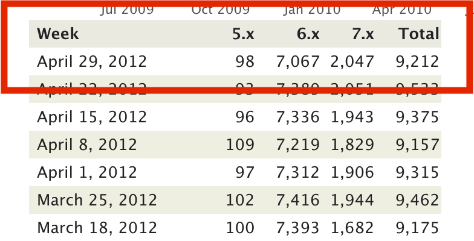
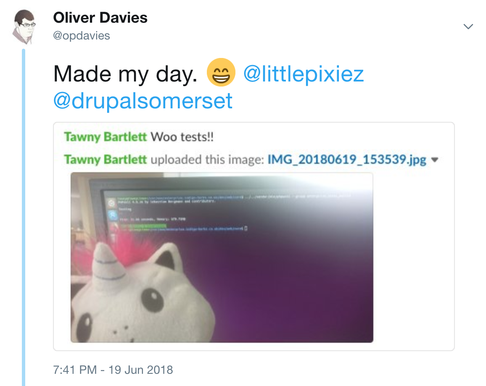
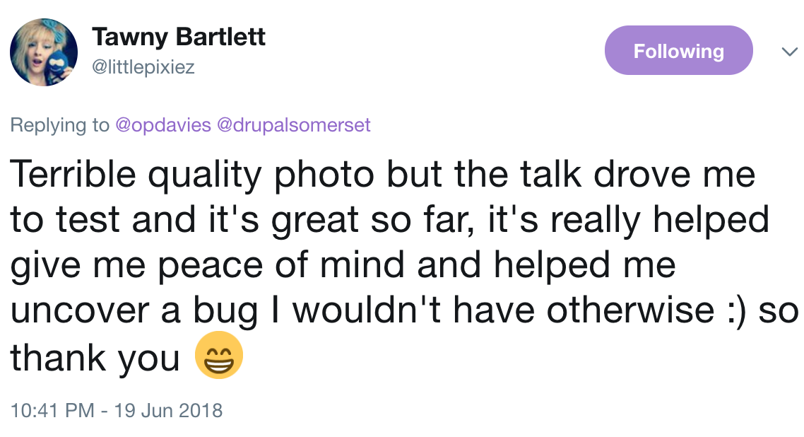

theme: Simple, 8
autoscale: true
build-lists: true
header: alignment(left), line-height(1.1), text-scale(1.3)
text: alignment(left)
text-emphasis: #53B0EB


[.header: alignment(center)]

# **TDD: Test <br>Driven Drupal**

---

- Why write tests, and what to test
- Types of tests
- How to run tests
- Example
- Building a new module with test driven development

---

[.background-color: #FFFFFF]
[.build-lists: false]
[.header: #111111]
[.text: #111111, alignment(left)]


- Full Stack Web Developer & System Administrator
- Senior Software Engineer at Inviqa
- PHP South Wales organiser
- @opdavies
- www.oliverdavies.uk

^ - Work at Inviqa.
- Organiser of the PHP South Wales user group. Formerly PHP South West, Drupal Bristol, SWDUG
- Maintain Drupal modules, PHP CLI tools and libraries
- Blog on my website

---

[.header: alignment(center)]

## Write **custom modules <br>and themes** for clients

---

[.header: alignment(center)]

## Contributor to **Drupal core**

^ - Drupal 7 and 8 core contributor
- Most recent patch submitted on a live stream

---

[.header: alignment(center)]

## Maintain and contribute <br>to **contrib projects**

^ Approaching this from a few different angles

---

[.background-color: #FFFFFF]


---

## Override Node Options

- Become maintainer in 2012
- **#232** most used module on Drupal.org (May 2020)
- Had some existing tests
- Crucial to preventing regressions

^ Preventing regressions when adding new features or fixing bugs, but also user
submitted patches First module I ported to Drupal 8, aided by tests

---


---



---


^ - D5 and D6 gone down, D7 up and a few different D8 versions including D9 compatibility.
- Around 30,000 sites

---

[.header: alignment(center)]

## **Why write tests?**

---

## Why write tests?

- Catch bugs earlier
- Peace of mind
- Prevent regressions
- Write less code
- Documentation
- Drupal core requirement
- More important with regular D8/D9 releases and supporting multiple versions

^ Dave Liddament talk - better and cheaper to catch bugs earlier (e.g. whilst developing rather than after it's been released)
Refer to tests when writing implementation code ONO merge conflict

---

## Core Testing Gate

| Description | When |
| --- | --- | 
| Check test coverage and ensure all tests pass | When changing/refactoring existing code |
| Add new tests | When adding new features |
| Upload a test case that fails | When fixing bugs in PHP code |
| Add JavaScript test | When making JS changes |
| Manually test in browsers and provide screenshots or screencasts | When making markup or CSS changes |
| Provide an example module | When a new feature is not implemented by Drupal core |

[.footer: https://opdavi.es/drupal-core-testing-gate]

---

## Testing in Drupal

- **Drupal 7** - SimpleTest (testing) module provided as part of core
- **Drupal 8** - PHPUnit added as a core dependency, later became the default via the PHPUnit initiative
- **Drupal 9** - SimpleTest removed, moved to contrib

---

## Writing Tests (Drupal 8)

- PHP class with **.php** extension
- **tests/src** directory within each module
- Within the **Drupal\Tests\module_name** namespace
- Class name must match the filename
- Namespace must match the directory structure
- One test class per feature

^ Different to D7

---

[.header: alignment(center)]

## **Arrange**

## **Act**

## **Assert**

---

[.header: alignment(center)]

## **Given**

## **When**

## **Then**

---

[.header: alignment(center)]

## **Given** the About page exists

## **When** I go to the page

## **Then** I should see "About Me"

---

```php, [.highlight: 1-3]
// modules/example/tests/src/Functional/ExampleTest.php

namespace Drupal\Tests\example\Functional;

use Drupal\Tests\BrowserTestBase;

class ExampleTest extends BrowserTestBase {

  public function testSomething() {
    // Given...
    // When...
    // Then...
  }

}
```

---

```php, [.highlight: 5-7]
// modules/example/tests/src/Functional/ExampleTest.php

namespace Drupal\Tests\example\Functional;

use Drupal\Tests\BrowserTestBase;

class ExampleTest extends BrowserTestBase {

  public function testSomething() {
    // Given...
    // When...
    // Then...
  }

}
```

---

```php, [.highlight: 9,13]
// modules/example/tests/src/Functional/ExampleTest.php

namespace Drupal\Tests\example\Functional;

use Drupal\Tests\BrowserTestBase;

class ExampleTest extends BrowserTestBase {

  public function testSomething() {
    // Given...
    // When...
    // Then...
  }

}
```

---

```php, [.highlight: 10-12]
// modules/example/tests/src/Functional/ExampleTest.php

namespace Drupal\Tests\example\Functional;

use Drupal\Tests\BrowserTestBase;

class ExampleTest extends BrowserTestBase {

  public function testSomething() {
    // Given...
    // When...
    // Then...
  }

}
```

---

```php
public function testSomething() {}

public function test_something() {}

/** @test */
public function it_does_something() {}
```

---

## What to test?

- Creating nodes with data from an API
- Calculating attendance figures for an event
- Determining if an event is purchasble
- Promotions and coupons for new users
- Cloning events
- Queuing private message requests
- Emails for new memberships
- Closed support tickets are re-opened when comments are added
- Custom form validation rules

^ Examples of some things that I tested on a previous project.

---

[.background-color: #FFFFFF]


---

[.header: alignment(center) ]

## **Types of Tests**

---

## Types of Tests

- **Functional** / **FunctionalJavascript** (web, browser, feature)
- **Kernel** (integration)
- **Unit**

---

## Functional Tests

- Tests end-to-end functionality
- UI testing
- Interacts with database
- Full Drupal installation
- Slower to run
- With/without JavaScript

^ testing profile Functional/FunctionalJavascript Nightwatch

---

```php
class BlockTest extends BlockTestBase {

  public function testBlockVisibility() {
    $block_name = 'system_powered_by_block';
    $title = $this->randomMachineName(8);

    $default_theme = $this->config('system.theme')->get('default');

    $edit = [
      'id' => strtolower($this->randomMachineName(8)),
      'region' => 'sidebar_first',
      'settings[label]' => $title,
      'settings[label_display]' => TRUE,
    ];

    $edit['visibility[request_path][pages]'] = '/user*';
    $edit['visibility[request_path][negate]'] = TRUE;
    $edit['visibility[user_role][roles][' . RoleInterface::AUTHENTICATED_ID . ']'] = TRUE;

    // ...
  }
```

---

```php, [.highlight: 4-18]
class BlockTest extends BlockTestBase {

  public function testBlockVisibility() {
    $block_name = 'system_powered_by_block';
    $title = $this->randomMachineName(8);

    $default_theme = $this->config('system.theme')->get('default');

    $edit = [
      'id' => strtolower($this->randomMachineName(8)),
      'region' => 'sidebar_first',
      'settings[label]' => $title,
      'settings[label_display]' => TRUE,
    ];

    $edit['visibility[request_path][pages]'] = '/user*';
    $edit['visibility[request_path][negate]'] = TRUE;
    $edit['visibility[user_role][roles][' . RoleInterface::AUTHENTICATED_ID . ']'] = TRUE;

    // ...
  }
```

^ Arrange step

---

```php

class BlockTest extends BlockTestBase {

  public function testBlockVisibility() {
    // ...

    $this->drupalGet('admin/structure/block/add/' . $block_name . '/' . $default_theme);
    $this->assertFieldChecked('edit-visibility-request-path-negate-0');

    $this->drupalPostForm(NULL, $edit, t('Save block'));
    $this->assertText('The block configuration has been saved.', 'Block was saved');

    $this->clickLink('Configure');
    $this->assertFieldChecked('edit-visibility-request-path-negate-1');

    $this->drupalGet('');
    $this->assertText($title, 'Block was displayed on the front page.');

    $this->drupalGet('user');
    $this->assertNoText($title, 'Block was not displayed according to block visibility rules.');

    // ...
  }
```

---

```php, [.highlight: 6,9,12,15,18]
class BlockTest extends BlockTestBase {

  public function testBlockVisibility() {
    // ...

    $this->drupalGet('admin/structure/block/add/' . $block_name . '/' . $default_theme);
    $this->assertFieldChecked('edit-visibility-request-path-negate-0');

    $this->drupalPostForm(NULL, $edit, t('Save block'));
    $this->assertText('The block configuration has been saved.', 'Block was saved');

    $this->clickLink('Configure');
    $this->assertFieldChecked('edit-visibility-request-path-negate-1');

    $this->drupalGet('');
    $this->assertText($title, 'Block was displayed on the front page.');

    $this->drupalGet('user');
    $this->assertNoText($title, 'Block was not displayed according to block visibility rules.');

    // ...
  }
```

---

```php, [.highlight: 7,10,13,16,19]
class BlockTest extends BlockTestBase {

  public function testBlockVisibility() {
    // ...

    $this->drupalGet('admin/structure/block/add/' . $block_name . '/' . $default_theme);
    $this->assertFieldChecked('edit-visibility-request-path-negate-0');

    $this->drupalPostForm(NULL, $edit, t('Save block'));
    $this->assertText('The block configuration has been saved.', 'Block was saved');

    $this->clickLink('Configure');
    $this->assertFieldChecked('edit-visibility-request-path-negate-1');

    $this->drupalGet('');
    $this->assertText($title, 'Block was displayed on the front page.');

    $this->drupalGet('user');
    $this->assertNoText($title, 'Block was not displayed according to block visibility rules.');

    // ...
  }
```

---

## Kernel Tests

- Integration tests
- Can install modules, interact with services, container, database
- Minimal Drupal bootstrap
- Faster than functional tests
- More setup required

---

```php

class BlockRebuildTest extends KernelTestBase {

  use BlockCreationTrait;

  public static $modules = ['block', 'system'];

  protected function setUp() {
    parent::setUp();

    $this->container->get('theme_installer')
      ->install(['stable', 'classy']);

    $this->container->get('config.factory')
      ->getEditable('system.theme')
      ->set('default', 'classy')
      ->save();
  }

  // ...

}
```

---

```php, [.highlight: 5, 10-16]

class BlockRebuildTest extends KernelTestBase {

  use BlockCreationTrait;

  public static $modules = ['block', 'system'];

  protected function setUp() {
    parent::setUp();

    $this->container->get('theme_installer')
      ->install(['stable', 'classy']);

    $this->container->get('config.factory')
      ->getEditable('system.theme')
      ->set('default', 'classy')
      ->save();
  }

  // ...

}
```

^ Still have access to the service container, via $this->container

---

```php
class BlockRebuildTest extends KernelTestBase {

  // ...

  public function testRebuildNoBlocks() {
    block_rebuild();

    $messages = \Drupal::messenger()->all();
    \Drupal::messenger()->deleteAll();

    $this->assertEquals([], $messages);
  }

}
```

^ Can still access services like \Drupal::messenger()

---

## Unit Tests

- Tests PHP logic
- No database interaction
- Fast to run
- Need to mock dependencies
- Can become tightly coupled
- Can be hard to refactor

---

```php
class BlockRepositoryTest extends UnitTestCase {

  public function testGetVisibleBlocksPerRegion(array $blocks_config, array $expected_blocks) {
    $blocks = [];

    foreach ($blocks_config as $block_id => $block_config) {
      $block = $this->getMock('Drupal\block\BlockInterface');

      $block->expects($this->once())
        ->method('access')
        ->will($this->returnValue($block_config[0]));

      $block->expects($block_config[0] ? $this->atLeastOnce() : $this->never())
        ->method('getRegion')
        ->willReturn($block_config[1]);

      $block->expects($this->any())
        ->method('label')
        ->willReturn($block_id);

      // ...

      $blocks[$block_id] = $block;
    }

    // ...
  }
}
```

---

```php, [.highlight: 7-20]

class BlockRepositoryTest extends UnitTestCase {

  public function testGetVisibleBlocksPerRegion(array $blocks_config, array $expected_blocks) {
    $blocks = [];

    foreach ($blocks_config as $block_id => $block_config) {
      $block = $this->getMock('Drupal\block\BlockInterface');

      $block->expects($this->once())
        ->method('access')
        ->will($this->returnValue($block_config[0]));

      $block->expects($block_config[0] ? $this->atLeastOnce() : $this->never())
        ->method('getRegion')
        ->willReturn($block_config[1]);

      $block->expects($this->any())
        ->method('label')
        ->willReturn($block_id);

      // ...

      $blocks[$block_id] = $block;
    }

    // ...
  }
}
```

---

```php
class BlockRepositoryTest extends UnitTestCase {

  public function testGetVisibleBlocksPerRegion(array $blocks_config, array $expected_blocks) {
    // ..

    $this->blockStorage->expects($this->once())
      ->method('loadByProperties')
      ->with(['theme' => $this->theme])
      ->willReturn($blocks);

    $result = [];
    $cacheable_metadata = [];

    foreach ($this->blockRepository->getVisibleBlocksPerRegion($cacheable_metadata) as $region => $resulting_blocks) {
      $result[$region] = [];

      foreach ($resulting_blocks as $plugin_id => $block) {
        $result[$region][] = $plugin_id;
      }
    }

    $this->assertEquals($expected_blocks, $result);
  }

}
```

---

```php, [.highlight: 14-22]
class BlockRepositoryTest extends UnitTestCase {

  public function testGetVisibleBlocksPerRegion(array $blocks_config, array $expected_blocks) {
    // ..

    $this->blockStorage->expects($this->once())
      ->method('loadByProperties')
      ->with(['theme' => $this->theme])
      ->willReturn($blocks);

    $result = [];
    $cacheable_metadata = [];

    foreach ($this->blockRepository->getVisibleBlocksPerRegion($cacheable_metadata) as $region => $resulting_blocks) {
      $result[$region] = [];

      foreach ($resulting_blocks as $plugin_id => $block) {
        $result[$region][] = $plugin_id;
      }
    }

    $this->assertEquals($expected_blocks, $result);
  }

}
```

---

[.header: alignment(center)]

# **Example**

---


---

## Specification

- Job adverts created in Broadbean UI, needs to create nodes in Drupal
- Application URL links users to separate application system
- Jobs need to be linked to offices
- Job length specified in number of days
- Path is specified as a field in the API
- Application URL constructed from domain, includes role ID as a GET parameter and optionally UTM parameters

---

[.background-color: #FFFFFF]


---

## Implementation

- Added route to accept data from API as XML
- Added system user with API role to authenticate
- **active_for** converted from number of days to UNIX timestamp
- **branch_name** and **locations** converted from plain text to entity reference (job node to office node)
- **url_alias** property mapped to **path**

---

```php
$data = [
  'command' => 'add',
  'username' => 'bobsmith',
  'password' => 'p455w0rd',
  'active_for' => '365',
  'application_email' => 'bob.12345.123@smith.aplitrak.com',
  'branch_address' => '123 Fake St, Bristol, BS1 2AB',
  'branch_name' => 'Test',
  'contract' => 'Temporary',
  'details' => 'This is the detailed description.',
  'job_id' => 'abc123_1234567',
  'job_title' => 'Healthcare Assistant (HCA)',
  'job_type' => 'Care at Home',
  'keywords' => 'flexible, Bristol, part-time',
  'locations' => 'Bath, Devizes',
  'role_id' => 'A/52/86',
  'salary' => '32,000.00 per annum',
  'salary_prefix' => 'Basic Salary',
  'status' => 'Part time',
  'summary' => 'This is the short description.',
  'url_alias' => 'healthcare-assistant-aldershot-june17',
];
```

---

```php, [.highlight: 5,8,15,21]
$data = [
  'command' => 'add',
  'username' => 'bobsmith',
  'password' => 'p455w0rd',
  'active_for' => '365',
  'application_email' => 'bob.12345.123@smith.aplitrak.com',
  'branch_address' => '123 Fake St, Bristol, BS1 2AB',
  'branch_name' => 'Test',
  'contract' => 'Temporary',
  'details' => 'This is the detailed description.',
  'job_id' => 'abc123_1234567',
  'job_title' => 'Healthcare Assistant (HCA)',
  'job_type' => 'Care at Home',
  'keywords' => 'flexible, Bristol, part-time',
  'locations' => 'Bath, Devizes',
  'role_id' => 'A/52/86',
  'salary' => '32,000.00 per annum',
  'salary_prefix' => 'Basic Salary',
  'status' => 'Part time',
  'summary' => 'This is the short description.',
  'url_alias' => 'healthcare-assistant-aldershot-june17',
];
```

---

## Implementation

- If no error, create the job node, return OK response to Broadbean
- If an Exception is thrown, return an error code and message

^ Required field missing Incorrect branch name

---

## Testing Goals

- Ensure job nodes are **successfully created**
- Ensure that fields are **mapped correctly**
- Ensure that **calculations are correct**
- Ensure that entity references are **linked correctly**

---

## Types of tests

- **Functional:** job nodes are created with the correct URL and the correct response code is returned
- **FunctionalJavaScript:** application URL is updated with JavaScript based on UTM parameters (hosting)

---

## Types of tests

- **Kernel:** job nodes can be added and deleted, expired job nodes are deleted, application URL is generated correctly
- **Unit:** ensure number of days are converted to timestamps correctly

---

## Results

- **0 bugs!**
- Easier to identify where issues occurred and responsibilities
- Reduced debugging time
- Added more tests for any bugs to prevent

---

[.header: alignment(center)]

## **Running Tests**

---

## Core script

```
$ php core/scripts/run-tests.sh

$ php core/scripts/run-tests.sh --module example

$ php core/scripts/run-tests.sh --class ExampleTest
```

---

## PHPUnit

```
$ vendor/bin/phpunit \
  -c core \
  modules/contrib/examples/phpunit_example
```

---

## Prerequisite (creating a phpunit.xml file)

- Configures PHPUnit
- Needed to run some types of tests
- Ignored by Git by default
- Copy **core/phpunit.xml.dist** to **core/phpunit.xml**
- Add and change as needed
  - `SIMPLETEST_BASE_URL`, `SIMPLETEST_DB`, `BROWSERTEST_OUTPUT_DIRECTORY`
  - `stopOnFailure="true"`

---

[.header: alignment(center)]

## **Test Driven<br> Development**

---

## Test Driven Development

- Write a test
- Test fails
- Write code
- Test passes
- Refactor
- Repeat

---

[.background-color: #FFFFFF]
[.footer: https://github.com/foundersandcoders/testing-tdd-intro]
[.footer-style: #2F2F2F]


---

[.header: alignment(center)]

## **Red, Green, Refactor**

---

## Porting Modules to Drupal 8

- Make a new branch
- Add/update the tests
- Write code to make the tests pass
- Refactor
- Repeat

---

## How I Write Tests - "Outside In"

- Start with functional tests
- Drop down to integration or unit tests where needed
- Programming by wishful thinking
- Write comments first, then fill in the code
- Sometimes write assertions first

---

[.header: alignment(center)]

## **Demo: Building a Blog module**

---

## Acceptance criteria

- As a site visitor
- I want to see a list of published articles at /blog
- Ordered by post date

---

## Tasks

- Ensure the blog page exists
- Ensure only published articles are shown
- Ensure the articles are shown in the correct order

---

[.background-color: #FFFFFF]



---

[.background-color: #FFFFFF]



---

[.header: alignment(center)]

## **TestDrivenDrupal.com**

---


---

[.header: alignment(center)]

# **Questions?**

### @opdavies
### oliverdavies.uk
