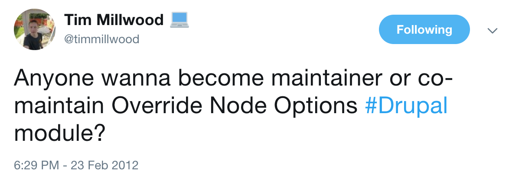
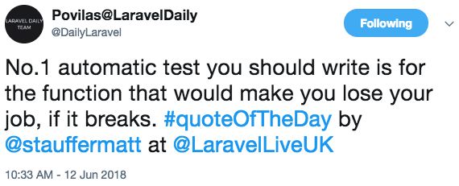

.. footer:: @opdavies

TDD: Test Driven Drupal
#######################

|

.. class:: titleslideinfo

Oliver Davies (@opdavies)

|

.. class:: titleslideinfo

https://opdavi.es/dcg

.. page:: titlePage

.. class:: centredtitle

Software Developer, Consultant, open-source maintainer

.. raw:: pdf

  TextAnnotation "I develop and consult on Drupal applications for clients."
  TextAnnotation "I contribute to and maintain open-source projects including Drupal core."
  TextAnnotation "Different perspectives."

.. page:: imagePage

.. raw:: pdf

  TextAnnotation "I saw this tweet by Tim Millwood and become the maintainer in 2012."

.. page:: imagePage

.. image:: images/override-node-options-1.png
  :width: 18cm

.. raw:: pdf

    PageBreak

   TextAnnotation "These were the usage statistics from Drupal.org when I became the maintainer."

|

|

.. raw:: pdf

    TextAnnotation "173rd most used module on Drupal.org"
    TextAnnotation "~38,000 sites - ~13,000 D7 and ~24,000 D8/9/10"
    TextAnnotation "Had some existing tests, crucial to preventing regressions"

.. page:: standardPage

Why write tests?
================

* Peace of mind
* Prevent regressions
* Catch bugs earlier
* Write less code
* Documentation
* Drupal core requirement
* More important with regular D10/D11 releases and supporting multiple versions

.. raw:: pdf

    TextAnnotation "I don't want to break 38,000 Drupal sites when rolling a new release, or causing a regression in a client codebase."
    TextAnnotation "TDD often results in writing less code as you're figuring things out whilst writing the test, only writing code that's needed for the tests."
    TextAnnotation "Drupal core gates. Testing gate requires new tests for new features, failing test cases for bug fixes, and code coverage when refactoring code."
    TextAnnotation "Same projects can work for Drupal 8, 9 and 10 etc."

Testing in Drupal
=================

* **Drupal 7** - SimpleTest (testing) module provided as part of core
* **Drupal 8** - PHPUnit added as a core dependency, later became the default via the PHPUnit initiative
* **Drupal 9** - SimpleTest removed from core, moved back to contrib

.. raw:: pdf

   TextAnnotation "Not speaking about Drupal 7 and SimpleTest in this talk, but a lot of the concepts are the same."

Writing PHPUnit Tests for Drupal
================================

* PHP class with ``.php`` extension
* ``tests/src`` directory within each module
* Within the ``Drupal\Tests\{module_name}`` namespace
* Class name must match the filename
* Namespace must match the directory structure
* One test class per feature

.. raw:: pdf

    TextAnnotation "Tests per module."
    TextAnnotation "PSR-4 autoloading."
    TextAnnotation "Different to D7."

.. page:: titlePage

.. class:: centredtitle

Arrange, Act, Assert

.. raw:: pdf

   TextAnnotation "What are the parts of a test?"
   TextAnnotation ""
   TextAnnotation "Set up the world, perform an action, then make assertions."

.. raw:: pdf

    PageBreak

.. class:: centredtitle

Given, When, Then

.. raw:: pdf

  TextAnnotation "Given the About page exists..."
  TextAnnotation "When I go to that page..."
  TextAnnotation "I should see 'About me' on the page."

.. page:: standardPage

What to test?
=============

* Creating nodes with data from an API
* Calculating attendance figures for an event
* Determining if an event is purchasable
* Promotions and coupons for new users
* Cloning events
* Queuing private message requests
* Re-opening closed support tickets when comments are added

.. raw:: pdf

  TextAnnotation "Examples of some things that I tested on previous projects."

.. page:: imagePage

|

.. page:: standardPage

What does a test look like?
===========================

.. code-block:: php
    :include: code/1-example-test.txt
    :linenos:
    :startinline: true

What does a test look like?
===========================

.. code-block:: php
    :include: code/1-example-test.txt
    :linenos:
    :startinline: true
    :hl_lines: 1,2,3,13

What does a test look like?
===========================

.. code-block:: php
    :include: code/1-example-test.txt
    :linenos:
    :startinline: true
    :hl_lines: 5,6,7

What does a test look like?
===========================

.. code-block:: php
    :include: code/1-example-test.txt
    :linenos:
    :startinline: true
    :hl_lines: 9,11

What does a test look like?
===========================

.. code-block:: php
    :include: code/1-example-test.txt
    :linenos:
    :startinline: true
    :hl_lines: 10

Writing test methods
====================

.. code-block:: php
    :include: code/2-test-methods.txt
    :linenos:
    :startinline: true

Writing test methods
====================

.. code-block:: php
    :include: code/2-test-methods.txt
    :hl_lines: 1
    :linenos:
    :startinline: true

Writing test methods
====================

.. code-block:: php
    :include: code/2-test-methods.txt
    :hl_lines: 3
    :linenos:
    :startinline: true

Writing test methods
====================

.. code-block:: php
    :include: code/2-test-methods.txt
    :hl_lines: 5, 6
    :linenos:
    :startinline: true

Types of Tests
==============

* **Functional/FunctionalJavascript** (web, browser, feature)
* **Kernel** (integration)
* **Unit**

.. raw:: pdf

   TextAnnotation "Not just unit tests."

Functional Tests
================

* Tests end-to-end functionality
* UI testing
* Interacts with database
* Full Drupal installation
* Slower to run
* With/without JavaScript

.. raw:: pdf

   TextAnnotation "Uses the `testing` profile with a fresh installation between tests."

Kernel tests
============

* Integration tests
* Can install modules, interact with services, container, database
* Minimal Drupal bootstrap
* Faster than functional tests
* More setup required

.. raw:: pdf

    TextAnnotation "Can still access services like \Drupal::messenger()."

Unit Tests
==========

* Tests PHP logic
* No database interaction
* Fast to run
* Need to mock dependencies
* Can become tightly coupled
* Can be hard to refactor

.. page:: titlePage

.. class:: centredtitle

Running Tests

.. page:: standardPage

Core script
===========

.. code-block:: shell

    $ php web/core/scripts/run-tests.sh

    $ php web/core/scripts/run-tests.sh \
      --all

    $ php web/core/scripts/run-tests.sh \
      --module example

    $ php web/core/scripts/run-tests.sh \
      --class ExampleTest

Core script
===========

.. code-block:: shell

    $ php web/core/scripts/run-tests.sh \
      --module example \
      --sqlite /dev/shm/test.sqlite \
      --url http://web

.. raw:: pdf

   PageBreak

.. code-block::

    Drupal test run
    ---------------

    Tests to be run:
      - Drupal\Tests\example\Functional\ExamplePageTest

    Test run started:
      Saturday, October 14, 2023 - 10:28

    Test summary
    ------------

    Drupal\Tests\example\Functional\ExamplePageTest                1 passes

    Test run duration: 7 sec

PHPUnit
=======

.. code-block:: shell

   $ export SIMPLETEST_BASE_URL=http://web

   $ web/vendor/bin/phpunit \
    -c web/core \
    modules/contrib/examples/modules/phpunit_example 

.. raw:: pdf

    TextAnnotation "Update the phpunit path and config file path for your project."
    TextAnnotation "-c not needed if the phpunit.xml.dist or phpunit.xml is in the same directory."

.. raw:: pdf

   PageBreak

.. code-block:: plain

    PHPUnit 9.6.13 by Sebastian Bergmann and contributors.

    Testing /app/web/modules/contrib/examples/modules/phpunit_example
    .................................                                 33 / 33 (100%)

    Time: 00:08.660, Memory: 10.00 MB

    OK (33 tests, 43 assertions)

Creating a phpunit.xml file
===========================

- Configures PHPUnit
- Needed to run some types of tests
- Ignored by Git by default
- Copy ``core/phpunit.xml.dist`` to ``core/phpunit.xml``
- Add and change as needed

    - ``SIMPLETEST_BASE_URL``, ``SIMPLETEST_DB``, ``BROWSERTEST_OUTPUT_DIRECTORY``
    - ``stopOnFailure="true"``

.. raw:: pdf

   TextAnnotation "For core. For projects, I create a customised phpunit.xml.dist in my project."

.. include:: example.rst

Test Driven Development
=======================

* Write a failing test
* Write code until the test passes
* Refactor
* Repeat

.. raw:: pdf

    TextAnnotation "Write enough of a test so that it fails."
    TextAnnotation "Write enough code so that the test passes."
    TextAnnotation "Refactor if needed."
    TextAnnotation "Repeat."

.. page:: titlePage

.. class:: centredtitle

Red, Green, Refactor

.. page:: standardPage

Porting Modules From Drupal 7
=============================

- Make a new branch
- Add/update the tests
- Write code to make the tests pass
- Refactor
- Repeat

.. raw:: pdf

    TextAnnotation "Similar to the TDD workflow."

How I Write Tests - "Outside In"
================================

- Start with functional tests
- Drop down to integration or unit tests where needed
- Programming by wishful thinking
- Write comments first, then fill in the code
- Sometimes write assertions first

.. raw:: pdf

    TextAnnotation "Write the code in your test that you wish you had, and let the tests tell you what's missing."

How I Write Tests - "Outside In"
================================

* Functional - 57 tests, 180 assertions
* Kernel - 38 tests, 495 assertions
* Unit - 5 tests, 18 assertions

|

Run in 2-3 minutes in a CI pipeline with GitHub Actions.

.. include:: demo.rst

.. page:: imagePage

.. image:: images/tawny-tweet-2.png
    :width: 18cm

.. page:: standardPage

Thanks!
=======

References:

* https://phpunit.de
* https://docs.phpunit.de
* https://www.drupal.org/docs/automated-testing

|

Me:

* https://www.oliverdavies.uk
* https://www.oliverdavies.uk/atdc
