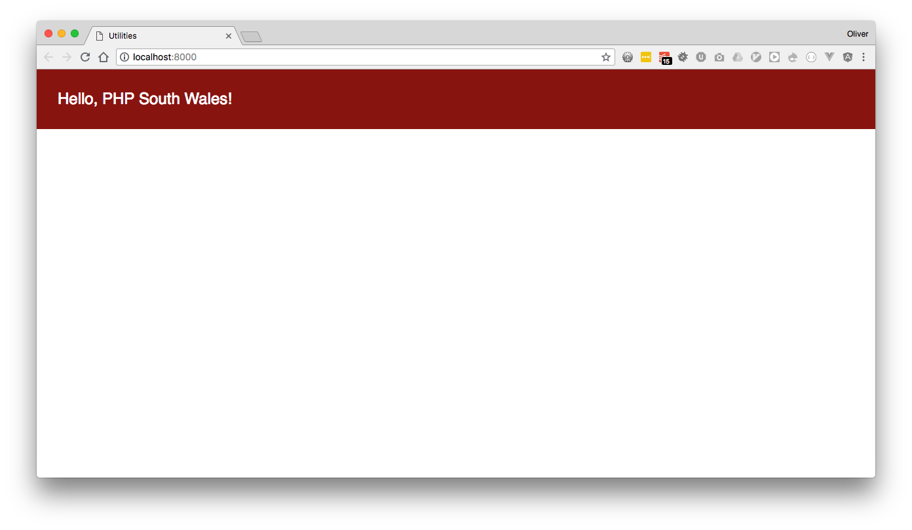
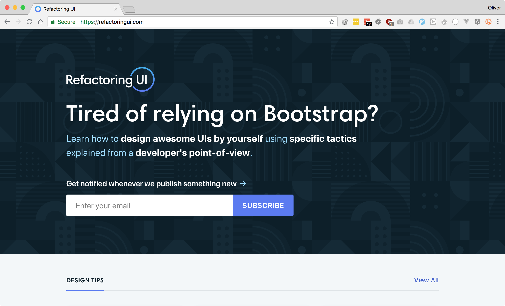
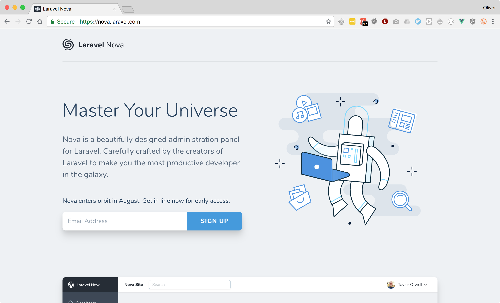
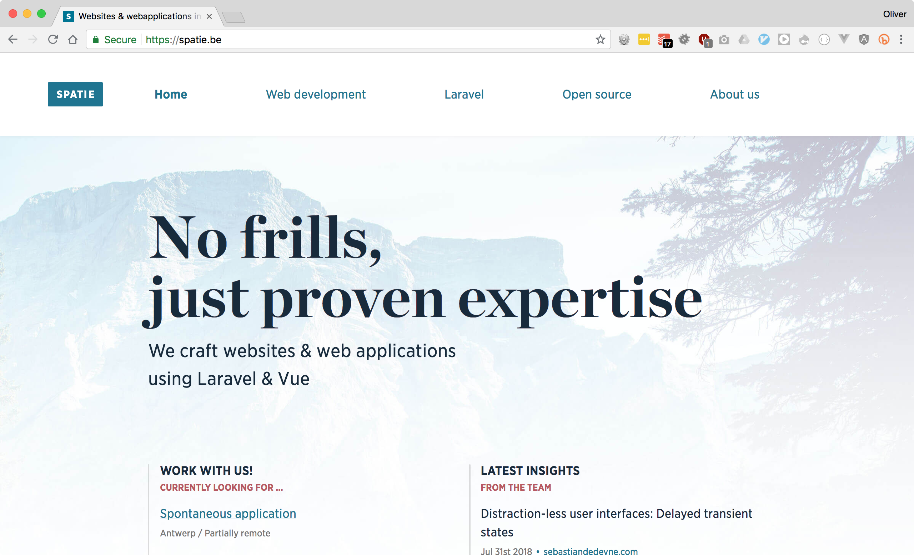
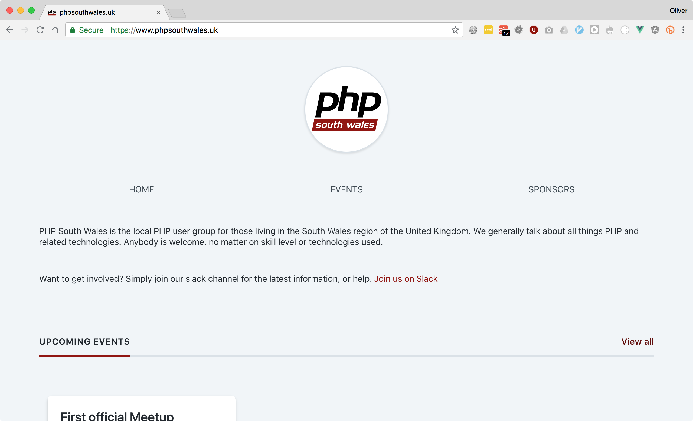

theme: poster, 8
autoscale: true
build-lists: true
header-emphasis: #53B0EB
header: alignment(left)
text: alignment(left)
text-emphasis: #53B0EB
code: Monaco, line-height(1.2)

[.hide-footer]
[.header: alignment(center)]

## _Taking Flight with_<br>Tailwind CSS

---

[.background-color: #FFFFFF]
[.build-lists: false]
[.header: #111111]
[.text: #111111, alignment(left)]


- Full Stack Web Developer & System Administrator
- Senior Developer at Microserve
- Part-time freelancer
- Acquia certified Drupal 8 Grand Master
- Drupal 7 & 8 core contributor
- Symfony, Laravel, ~~Silex,~~ Sculpin
- @opdavies
- www.oliverdavies.uk

^ Work at Microserve.
Maintain Drupal modules, PHP CLI tools and libraries
Blog on my website

---

[.background-color: #FFFFFF]
[.build-lists: false]
[.text: #111111, alignment(left)]


- https://microserve.io
- https://www.drupal.org/microserve
- https://github.com/microserve-io
- https://twitter.com/microserveltd
- https://www.linkedin.com/company/microserve-ltd

---

[.header: alignment(center)]

## A _Utility-First CSS Framework_ for Rapid UI Development

^ What is Tailwind?

---

[.header: alignment(center)]


## A CSS framework <br>_with no CSS_

---


[.header: alignment(center)]


## _A different way_ <br>to write CSS

---

[.build-lists: false]

- Developed by Adam Wathan and others
- Utility CSS class generator
- PostCSS
- Configured with JavaScript
- Some preprocessor features
- Can be used in addition to preprocessors
- Open source

^ Works with plain CSS or any preprocessor
Can be configured to enable/disable modules, configure colours etc.
Can use features like variables if using plain CSS.

---

```css
.title {
    background-color: #3490DC;
    color: #FFF;
    display: block;
    font-size: 1.5rem;
    padding: 2rem;
}
```

---

```css
.text-2xl {
    font-size: 1.5rem;
}

.bg-red {
    background-color: #93140B;
}

.text-white {
    color: #FFF;
}
```

---

```html
<div class="text-2xl bg-red text-white p-8">
    <p>Hello, PHP South Wales!</p>
</div>
```

---



---

[.header: alignment(center)]

# Installation

---

[.header: #53B0EB]

# Option 1

```
https://cdn.jsdelivr.net/npm/tailwindcss/dist/tailwind.min.css
```

---

[.header: #53B0EB]

# Option 2

```bash
npm install tailwindcss --save-dev

yarn add tailwindcss --dev

./node_modules/.bin/tailwind init [filename]
```

^ Install with npm or Yarn
Run "tailwind init" to generate a default tailwind.js file

---

```js
// tailwind.js

var colors = {
  'transparent': 'transparent',

  'black': '#222b2f',
  'grey-darkest': '#364349',
  'grey-darker': '#596a73',
  'grey-dark': '#70818a',
  'grey': '#9babb4',
  'grey-light': '#dae4e9',
  'grey-lighter': '#f2f2f2',
  'grey-lightest': '#fafcfc',
  'white': '#ffffff',
  ...
```

---

```less
// app.css

@tailwind preflight;

@tailwind components;

@tailwind utilities;
```

---

```js
// webpack.mix.js

let mix = require('laravel-mix');

require('laravel-mix-tailwind');

mix.postCss('build', 'assets/css/app.css')
   .tailwind();
```

---

```js
// webpack.config.js

Encore
    .setOutputPath('public/build/')
    .setPublicPath('/build')
    .addStyleEntry('app', './assets/css/app.css')
    .enablePostCssLoader()
;
```

^ Using Webpack Encore

---

```js
// postcss.config.js

module.exports = {
  plugins: [
    require('tailwindcss')('./tailwind.js'),
  ]
}
```

---

```html
<head>
    <title>Hello, World!</title>
    <link rel="stylesheet" href="/build/app.css">
...
```

---

```css
.text-left {
    text-align: left;
}

.text-center {
    text-align: center;
}

.text-right {
    text-align: right;
}

.text-justify {
    text-align: justify;
}

...
```

---

```html
<div class="text-2xl bg-red text-white p-8">
    <p>Hello, PHP South Wales!</p>
</div>
```

---


---

[.header: alignment(center)]

# Configuration

---

```javascript
// tailwind.js

var colors = {
  ...

  'blue-darkest': '#05233b',
  'blue-darker': '#103d60',
  'blue-dark': '#2779bd',
  'blue': '#0678be',
  'blue-light': '#6cb2eb',
  'blue-lighter': '#bcdefa',
  'blue-lightest': '#eff8ff',

  ...
}
```

^ Add, change, remove values as needed

---

```js
screens: {
  'sm': '576px',
  'md': '768px',
  'lg': '992px',
  'xl': '1200px',
}
```

---

```js
textSizes: {
  'xs': '.75rem',     // 12px
  'sm': '.875rem',    // 14px
  'base': '1rem',     // 16px
  'lg': '1.125rem',   // 18px
  'xl': '1.25rem',    // 20px
  '2xl': '1.5rem',    // 24px
  '3xl': '1.875rem',  // 30px
  '4xl': '2.25rem',   // 36px
  '5xl': '3rem',      // 48px
}
```

---

```js
width: {
  'auto': 'auto',
  'px': '1px',
  '1': '0.25rem',
  '2': '0.5rem',
  '3': '0.75rem',
  '4': '1rem',
  '6': '1.5rem',
  '8': '2rem',
  '10': '2.5rem',
  '12': '3rem',
  '16': '4rem',
  '24': '6rem',
  ...
}
```

---

```js
padding: {
  'px': '1px',
  '0': '0',
  '1': '0.25rem',
  '2': '0.5rem',
  '3': '0.75rem',
  '4': '1rem',
  '5': '1.25rem',
  '6': '1.5rem',
  '8': '2rem',
  '16': '4rem',
}
```

---

```javascript
options: {
  prefix: '',
  important: false,
  separator: ':',
}
```

^ - Drupal important config
- By adding a prefix, we don't clash with Drupal's core styles - e.g. ".block"

---

[.build-lists: false]

- Colours (text and background)
- Font family, size, weight
- Leading (line height), tracking (letter spacing)
- Border widths, colours, radius
- Width, height, min/max width/height

---

[.build-lists: false]

- Padding, margin (positive and negative)
- Shadows
- Z-index
- Opacity
- SVG fill, stroke
- Screen sizes (breakpoints)

---

[.header: alignment(center)]

# States
### _Hover, Focus, Active, Group hover_

---

```css
.{state}{separator}{class}
```

---

```twig
<a class="bg-grey hover:bg-grey-dark focus:bg-grey-dark" href="/">
    Home
</a>
```

^ Hover, focus

---

```twig
<a class="group">
    

    <div class="no-underline group-hover:underline">
        {{ speaker.name }}
    </div>
</a>
```

^ Group hover

---

[.header: alignment(center)]

# Responsive

---

```less
.{screen}{separator}{class}
```

---

```html
<div class="w-full md:w-1/2 lg:w-1/4">
    <p>Hello, World!</p>
</div>
```

---

[.header: alignment(center)]

# Extracting <br>Components

---

[.header: alignment(center)]


## _Do you need to_ extract <br>a component?

---

```twig

    <a class="block py-3 px-4 text-sm text-grey" href="{{ item.url }}">
        {{ item.title }}
    </a>

```

^ Use a loop

---

```twig
<h2>Adults</h2>



<h2>Kids</h2>


```

^ Move the duplicate markup into a partial, so there's only one version
Pass data in.

---

```html
<a href="inline-block rounded text-sm py-2 px-3 text-white bg-red">
    Click me!
</a>

<a href="inline-block rounded text-sm py-2 px-3 text-white bg-green">
    Click me too!
</a>
```

---

```css
# main.css

.button {
    @apply .inline-block;
    @apply .rounded;
    @apply .text-sm;
    @apply .py-2;
    @apply .px-3;
    @apply .text-white;
}
```

---

```html
<a href="button bg-red">
    Click me!
</a>

<a href="button bg-green">
    Click me too!
</a>
```

---

```less
// table.less

.table-responsive {
    @apply .mb-4 .border .w-full;
    overflow-x: auto;
    overflow-y: hidden;
}

.table-responsive table {
    @apply .mb-0 .border-0 .whitespace-no-wrap;
}

.table {
    @apply .w-full .table-collapse;
}

.table tr:nth-child(odd) {
    @apply .bg-grey-lightest;
}

.table tr th {
    @apply .text-left .p-3 .bg-white;
}

.table td {
    @apply .px-3 .py-3 .border-t;
}
```

---

[.header: #53B0EB]

# Advantages

- Quick to prototype and make changes
- Write less CSS
- More consistency
- Easy to customise, promote to components
- Mix and match with normal CSS
- Easy to write reusable plugins
- Use PurgeCSS to remove unused classes

^ Do more with browser dev tools
Only picking from pre-defined colours, widths. No magic numbers.
Less ramp-up time as using the same framework on different sites.
Same classes, but no visual similarities like with other frameworks like Bootstrap

---

[.header: #53B0EB]

# Disadvantages

- Extra build tools and steps
- Lots of classes in markup
- Large file size by default

^ - Need a build tool (Gulp, Grunt, Webpack) to build CSS

---



---



---




---



---

[.build-lists: false]
[.header: #53B0EB]

# Resources

- tailwindcss.com
- tailwindcomponents.com
- github.com/merchedhq/awesome-tailwindcss
- youtube.com/adamwathan
- github.com/opdavies/oliverdavies.uk
- github.com/phpsw/phpsw-ng

---

[.header: alignment(center)]

# Thanks!
### _@opdavies_
### _oliverdavies.uk_

