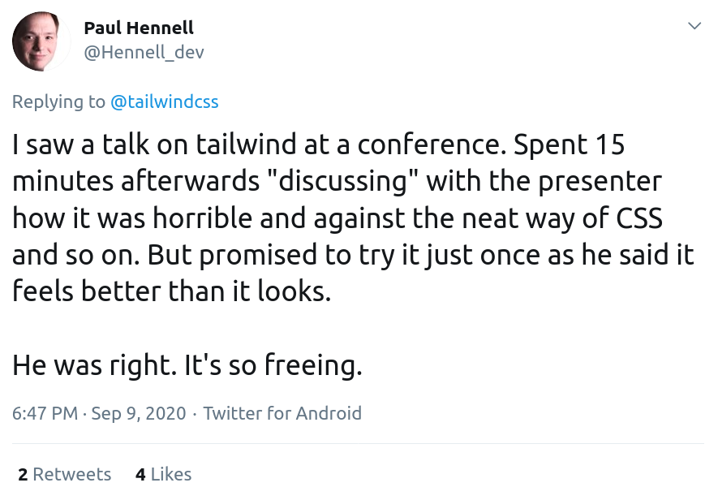

.. footer:: @opdavies

Taking Flight with Tailwind CSS 
################################

|

.. class:: titleslideinfo

Oliver Davies (@opdavies)

.. raw:: pdf

    TextAnnotation "I work primarily with Drupal and Symfony."
    TextAnnotation "I work for Inviqa, but this based on my personal and side projects."

.. page:: imagePage

.. image:: images/techs.png
    :width: 16cm 

.. include:: sections/intro.rst
.. include:: sections/usage.rst
.. include:: sections/installation.rst
.. include:: sections/interaction-states.rst
.. include:: sections/responsive.rst
.. include:: sections/customising.rst
.. include:: sections/file-size.rst
.. include:: sections/components.rst
.. include:: sections/plugins.rst

.. page:: titlePage

.. class:: centredtitle

Demo

.. page:: imagePage

.. page:: standardPage

Thanks!
=======

References:

* https://tailwindcss.com
* https://tailwindui.com
* https://www.youtube.com/c/TailwindLabs
* https://drupal.org/project/tailwindcss

|

Me:

* https://www.oliverdavies.uk
