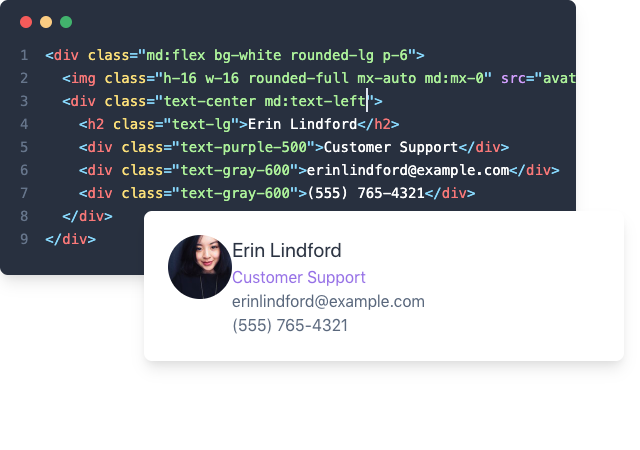
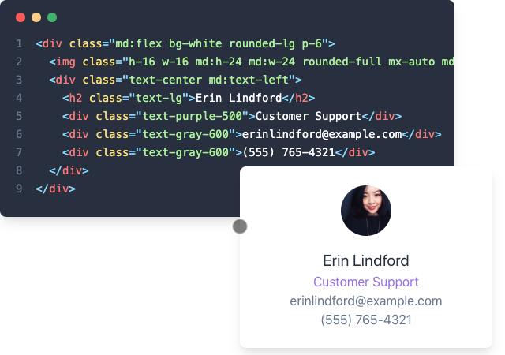

autoscale: true
theme: Plain Jane, 1

# **Taking Flight with <br>Tailwind CSS**


^ Tailwind CSS is a framework that I've been using for the last year and a half
Going to be using Tailwind 1.0 which was released recently (May 13th)

---

- PHP and Front End Developer
- System Administrator
- Senior Engineer at Inviqa
- Part-time freelancer
- Open sourcer
- @opdavies
- oliverdavies.uk


^ Co-organiser of PHP South Wales and DrupalCamp Bristol

---


---

# **What is Tailwind CSS?**

---

[.footer: tailwindcss.com]

# A **utility-first** CSS framework for rapidly building **custom designs**.

^ CSS utility class generator
PostCSS
Make different looking sites using the same class names
No "Tailwind looking site" like there is with Bootstrap

---

[.footer: tailwindcss.com]

# Tailwind CSS is a **highly customizable**, **low-level** CSS framework

^ No components like Bootstrap or Bulma
Configure it per project
Extendable if needed via additional plugins
Avoids the need to name things prematurely
Can extract components if needed (reusability)

---

[.footer: tailwindcss.com/docs/what-is-tailwind/#designed-to-be-customized]

# Tailwind is more than a CSS framework, it's an engine for <br>**creating design systems**.

^ Good default values provided - colours, fonts, padding, widths
Designing with constraints. Using inline styles, every value is a magic number. With utilities, you're choosing styles from a predefined design system, which makes it much easier to build visually consistent UIs.

---

- Text/border/background colours
- Font size/family/weight
- Alignment
- Padding/margin/negative margin
- Flexbox
- Positioning
- Lists
- z-index
- Opacity
- ...

^ All generated from a single, customisable configuration file.

---


---


---


---

# **How do I use Tailwind?**

^ From the new tailwindcss.com website

---

# With Tailwind, you style elements <br>by **applying pre-existing classes** directly in your HTML.

---

# Using **utility classes** to build custom designs **without writing CSS**

---

## **Benefits**
- You aren't wasting time and energy inventing class names
- Your CSS stops growing
- Making changes feels safer

^ No more adding silly class names like sidebar-inner-wrapper just to be able to style something, and no more agonizing over the perfect abstract name for something that's really just a flex container.

^ Using a traditional approach, your CSS files get bigger every time you add a new feature. With utilities, everything is reusable so you rarely need to write new CSS.

^ CSS is global and you never know what you're breaking when you make a change. Classes in your HTML are local, so you can change them without worrying about something else breaking.

---


---


^ Add padding with p-6

---


^ Rounded image - rounded-full

---


^ Centre image using mx-auto

---


^ Larger text - text-lg

---


^ Purple text - text-purple-500

---


^ Grey text - text-gray-600

---


^ Centre text - text-center

---


^ Responsive: enable flexbox on medium screens - md:flex

---


^ Remove margin around image - md:mx-0

---



^ Re-align text on medium screens - md:text-left

---


^ md:mr-6 - add margin to the side of the image on medium screens

---


^ Increase image size - md:h-24 md:w-24

---



^ Smaller view

---

# **How do I install Tailwind?**

---

# **1. Use the CDN**

---

[.footer: https://next.tailwindcss.com/docs/installation]

## **https://unpkg.com/tailwindcss/dist/tailwind.min.css**

---

[.footer: https://next.tailwindcss.com/docs/installation]

## **To get the most out of Tailwind, <br>you really should install it via npm.**

^ - You can't customize Tailwind's default theme
- You can't use any directives like *@apply*, *@variants*, etc.
- You can't enable features like *group-hover*
- You can't install third-party plugins

---

## **2. Installing Tailwind via NPM**

---

## `npm install --save-dev` <br>`tailwindcss`

## `yarn add -D tailwindcss`

^ Adds it as a dependency to your package.json file

---

## **Adding Tailwind to your CSS**

---

[.code-highlight: 2-7]

```css
# src/css/style.css

@tailwind base;

@tailwind components;

@tailwind utilities;
```

---

[.code-highlight: 5,9,13]

```
# app.css

@tailwind base;

# Custom base styles

@tailwind components;

# Custom components

@tailwind utilities;

# Custom utilities
```

---

## **Processing your CSS with Tailwind <br>with the build command**

^ Compile the generated CSS
Pass through PostCSS and Tailwind

---

# `npx tailwind build` <br>`src/css/app.css` <br>`-o dist/css/app.css`

---

```css
.text-left {
    text-align: left;
}

.text-center {
    text-align: center;
}

.text-right {
    text-align: right;
}

.text-justify {
    text-align: justify;
}
```

---

## **Processing your CSS with Tailwind <br>with Laravel Mix**

---

# `npm install --save-dev laravel-mix`

---

```js
const mix = require('laravel-mix')

mix.postCss('src/css/app.css', 'dist/css', [
  require('tailwindcss')()
])
```

^ PostCSS - useful if you're including other PostCSS plugins like PostCSS Nested

---

```js
const mix = require('laravel-mix')

require('laravel-mix-tailwind')

mix.postCss('src/css/app.css', 'dist/css')
  .tailwind()
```

---

```html
<!DOCTYPE html>
<html lang="en">
  <head>
    <meta charset="UTF-8">
    <title>My new website</title>
    <link rel="stylesheet" href="/dist/css/app.css">
  </head>
  <body>

  </body>
</html>
```

---

# `npm run dev`

# `npm run watch`

# `npm run prod`


---

# **Interaction states**
## hover, focus, group-hover, focus-within

^ Start to differ from inline styles

---

# `.[state][separator][class]`

^ State = hover, focus, group focus, focus within
Separator = configurable, colon by default
Class = the same utility class that you would have used normally

---

# `.hover:text-red-500`

---

```html
<a href="#" class="text-red-500 hover:text-red-800">
  Read more
</a>
```

---

```css
.text-red-500 {
  color: #f56565;
}

.hover\:text-red-500:hover {
  color: #f56565;
}

.focus\:text-red-500:focus {
  color: #f56565;
}
```

---

```js
// defaultConfig.stub.js

variants: {
  alignContent: ['responsive'],
  alignItems: ['responsive'],
  alignSelf: ['responsive'],
  appearance: ['responsive'],
  backgroundAttachment: ['responsive'],
  backgroundColor: ['responsive', 'hover', 'focus'],
  backgroundPosition: ['responsive'],
  backgroundRepeat: ['responsive'],
  ...
```

---

# **Responsive**

^ Mobile first

---

# [fit] `.[screen][separator][class]`

---

```js
// defaultConfig.stub.js

screens: {
  sm: '640px',
  md: '768px',
  lg: '1024px',
  xl: '1280px',
},
```

---

# `md:flex`

---

```html
<div class="block md:flex">
  <div class="w-full md:w-1/2">
    Column 1
  </div>

  <div class="w-full md:w-1/2">
    Column 2
  </div>
</div>
```

---

```css
.block {
  display: block;
}

@media (min-width: 640px) {
  .sm\:block {
    display: block;
  }
}

@media (min-width: 768px) {
  .md\:block {
    display: block;
  }
}
```

---

# **Keeping Things Small: <br>Controlling the File Size**

---

# Disabling unused variants <br>and core plugins

---

```js
// tailwind.config.js

variants: {
  alignContent: ['responsive'],
  alignItems: ['responsive'],
  alignSelf: ['responsive'],
  appearance: ['responsive'],
  backgroundAttachment: ['responsive'],
  backgroundColor: ['responsive', 'hover', 'focus'],
```

---

```diff
// tailwind.config.js

variants: {
  alignContent: ['responsive'],
  alignItems: ['responsive'],
- alignSelf: ['responsive'],
+ alignSelf: false,
  appearance: ['responsive'],
  backgroundAttachment: ['responsive'],
- backgroundColor: ['responsive', 'hover', 'focus'],
+ backgroundColor: ['responsive'],
```

---

# Manually removing unused or unwanted classes

---

```js
screens: {
  sm: '640px',
  md: '768px',
  lg: '1024px',
  xl: '1280px',
},
colors: {
  transparent: 'transparent',

  black: '#000',
  white: '#fff',

  gray: {
    100: '#f7fafc',
    200: '#edf2f7',
    300: '#e2e8f0',
    400: '#cbd5e0',
    500: '#a0aec0',
    600: '#718096',
    700: '#4a5568',
    800: '#2d3748',
    900: '#1a202c',
  },
```

---

```diff
screens: {
  sm: '640px',
  md: '768px',
  lg: '1024px',
- xl: '1280px',
},
colors: {
  transparent: 'transparent',

  black: '#000',
  white: '#fff',

  gray: {
    100: '#f7fafc',
-   200: '#edf2f7',
    300: '#e2e8f0',
-   400: '#cbd5e0',
-   500: '#a0aec0',
    600: '#718096',
    700: '#4a5568',
-   800: '#2d3748',
    900: '#1a202c',
  },
```

^ Needs to be done manually

---

# Automatically removing <br>unused classes

---

# `npm install --save-dev laravel-mix-purgecss`

---

```js
const mix = require('laravel-mix')

mix.postCss('src/css/site.css', 'dist/css')
  .purgeCss({
    folders: ['templates'],
    extensions: ['html', 'php', 'twig']
  })
```

---

[.code-highlight: 1,3,6-9]

```js
const mix = require('laravel-mix')

require('laravel-mix-purgecss')

mix.postCss('src/css/site.css', 'dist/css')
  .purgeCss({
    folders: ['templates'],
    extensions: ['html', 'php', 'twig']
  })
```

^ Can be tricky using Drupal/WordPress as you don't know where the classes could be coming from, no generated output directory

---

# **Avoiding Repetition: <br>Extracting Components**

---

# Does something **justify** <br>becoming a component?

---

# Could the duplication <br>**be moved elsewhere**?

^ Twig partials
Vue components
WordPress template parts

---

```twig
{# base.html.twig #}


  <a
    class="block py-3 px-4 text-sm text-gray-800"
    href="{{ item.url }}"
  >
   {{ item.title }}
  </a>

```

^ Using a loop

---

```twig
{# classes.html.twig #}

<h2>Adults</h2>



<h2>Kids</h2>


```

^ Move the duplicate markup into a partial, so there's only one version
Pass data in.

---

```css
a.btn {
  @apply text-sm no-underline font-bold;
  @apply rounded-full inline-block px-5 py-2;
  @apply text-white bg-blue-600;
}

a.btn:hover {
  @apply bg-blue-700;
}
```

^ Use utilities as mixins
Copy classes from markup
Still re-using the same design system and constraints as before

---

```css
a.btn {
  font-size: 0.875rem;
  text-decoration: none;
  font-weight: 700;
  border-radius: 9999px;
  display: inline-block;
  padding-left: 1.25rem;
  padding-right: 1.25rem;
  padding-top: 0.5rem;
  padding-bottom: 0.5rem;
  color: #fff;
  background-color: #3182ce;
}

a.btn:hover {
  background-color: #2b6cb0;
}
```

---

# **Customising Tailwind**

---

# `npx tailwind init`

---

```js
// tailwind.config.js

module.exports = {
  theme: {
    extend: {}
  },
  plugins: [],
  variants: {}
}
```
---

[.code-highlight: 5-7]

```js
// tailwind.config.js

module.exports = {
  theme: {
    colors: {
      inherit: 'inherit'
    },
    extend: {}
  },
  plugins: [],
  variants: {}
}
```

^ Overrides all colours.

---

[.code-highlight: 5-9]

```js
// tailwind.config.js

module.exports = {
  theme: {
    extend: {
      colors: {
        inherit: 'inherit'
      }
    }
  },
  plugins: [],
  variants: {}
}
```

^ Extends Tailwind's default colours

---

[.code-highlight: 1,4-5]

```js
// tailwind.config.js

module.exports = {
  prefix: '',
  important: false,
  theme: {
    extend: {}
  },
  plugins: [],
  variants: {}
}
```

---

# `npx tailwind init --full`

---

# **Extending Tailwind CSS <br>with Plugins**

---

# `npm install --save-dev tailwindcss-list-reset`

---

[.code-highlight: 7-9]

```js
// tailwind.config.js

module.exports = {
  theme: {
    extend: {}
  },
  plugins: [
    require('tailwindcss-list-reset')()
  ],
  variants: {}
}
```

---

```css
.list-reset {
  list-style: none;
  padding: 0;
}
```

---

```js
// index.js

module.exports = (variants) => ({ addUtilities }) => {
  addUtilities({
    '.list-reset': {
      listStyle: 'none',
      padding: 0
    }
  }, variants)
}
```

---

# **Demo**

---

## **Resources**

- tailwindcss.com
- tailwindcomponents.com
- builtwithtailwind.com
- github.com/aniftyco/awesome-tailwind
- youtube.com/adamwathan
- opdavi.es/tailwind-repos
- opdavi.es/tags/tailwind-css

---

# **Questions?**

---

# **Thanks!**
# opdavi.es/talks/tailwind
## _@opdavies_ <br>_oliverdavies.uk_

^ Find this talk at opdavi.es/talks/tailwind
Follow me on Twitter
oliverdavies.uk where I blog about PHP, Drupal, Symfony, automated testing, Tailwind etc.
Subscribe to the RSS feed
