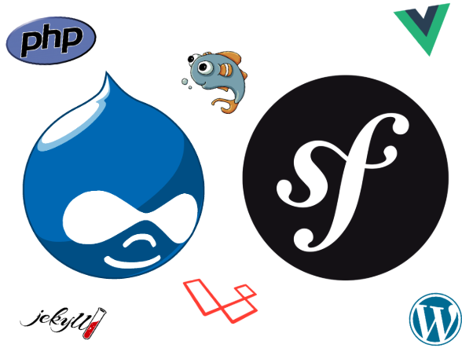

.. footer:: @opdavies

Taking Flight with Tailwind CSS 
################################

|

.. class:: titleslideinfo

Oliver Davies (@opdavies)

.. raw:: pdf

    TextAnnotation "I'll be talking about Tailwind CSS, which is a CSS framework that I've been using and I was an early adopter of."
    TextAnnotation ""
    TextAnnotation "Version 0.1.0 was tagged in November 2017, my first talk was January 2018, version 1.0.0 was released in May 2019."
    TextAnnotation ""
    TextAnnotation "I'm always updating the talk every time I give it as things change in the framework and ecosystem."

.. page:: imagePage

.. raw:: pdf

    TextAnnotation "I work primarily with Drupal and Symfony."

.. include:: sections/intro.rst
.. include:: sections/usage.rst
.. include:: sections/installation.rst
.. include:: sections/interaction-states.rst
.. include:: sections/responsive.rst
.. include:: sections/arbitrary-values.rst
.. include:: sections/components.rst
.. include:: sections/file-size.rst
.. include:: sections/customising.rst
.. include:: sections/adding-classes.rst
.. include:: sections/plugins.rst
.. include:: sections/existing-project.rst

.. page:: imagePage

.. image:: images/paul-hennell-tweet.png
    :width: 18cm

.. page:: standardPage

Thanks!
=======

References:

* https://tailwindcss.com
* https://tailwindui.com
* https://www.youtube.com/c/TailwindLabs
* https://www.protailwind.com
* https://drupal.org/project/tailwindcss

|

Me:

* https://www.oliverdavies.uk
