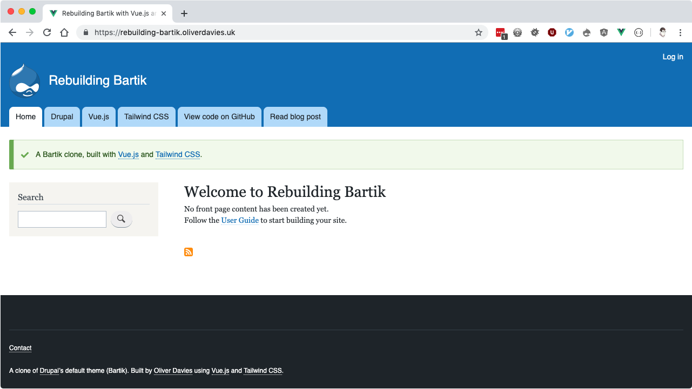
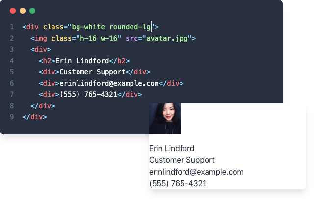
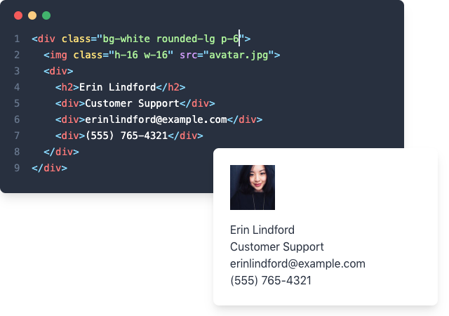
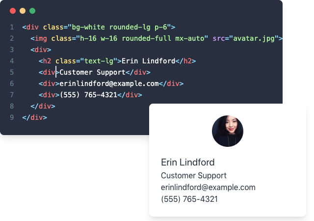
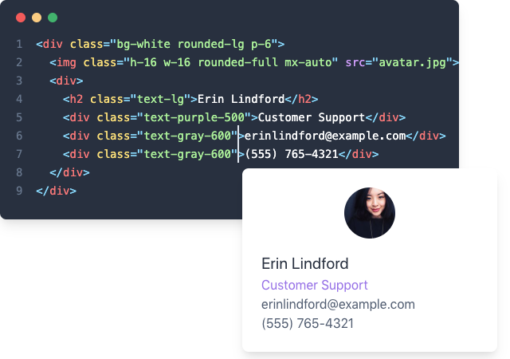
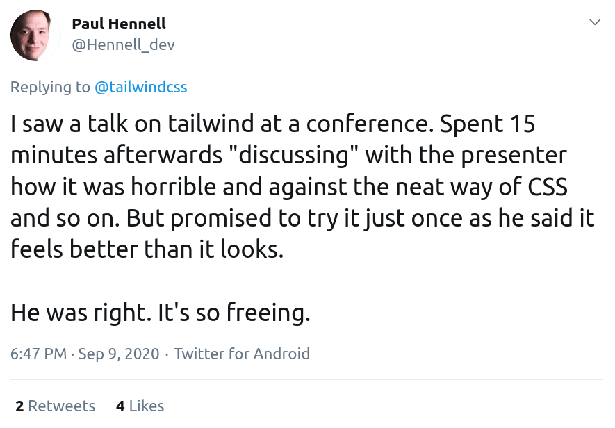

.. footer:: @opdavies

Taking Flight with Tailwind CSS 
################################

|

.. class:: titleslideinfo

Oliver Davies (@opdavies)

.. raw:: pdf

    TextAnnotation "I'll be talking about utility class styling and Tailwind CSS, which is a CSS framework that I've been using and I was an early adopter of."
    TextAnnotation ""
    TextAnnotation "I'm always updating the talk every time I give it as things change in the framework and ecosystem."

.. Switch to an image page.
.. raw:: pdf

  PageBreak imagePage

.. image:: images/techs.png
    :width: 16cm 

.. raw:: pdf

    TextAnnotation "I'm a Full Stack Software Developer. I work primarily with PHP and JavaScript, and specifically Drupal, Symfony and Vue.js."
    TextAnnotation "I can use Tailwind CSS on all of these projects."

.. Switch to a title page.
.. raw:: pdf

  PageBreak titlePage

.. class:: centredtitle

What is Tailwind CSS?

.. raw:: pdf

   PageBreak

.. class:: centredtitle

A utility-first CSS framework for rapidly building custom designs

.. raw:: pdf

    TextAnnotation "CSS utility class generator."
    TextAnnotation ""
    TextAnnotation "PostCSS plugin."
    TextAnnotation ""
    TextAnnotation "Make different looking sites using the same class names."
    TextAnnotation "No 'Tailwind looking site' like there is with Bootstrap."

.. raw:: pdf

  PageBreak

.. class:: centredtitle

Tailwind CSS is a highly customisable, low-level CSS framework

.. raw:: pdf

    TextAnnotation "No components like Bootstrap or Bulma."
    TextAnnotation "Configure it per project."
    TextAnnotation "Extendable if needed via additional plugins."
    TextAnnotation "Avoids the need to name things prematurely."
    TextAnnotation "Can extract components if needed (reusability)."

.. raw:: pdf

  PageBreak

.. class:: centredtitle

Tailwind is more than a CSS framework, it's an engine for creating design systems

.. raw:: pdf

    TextAnnotation "Good default values provided - colours, fonts, padding, widths"
    TextAnnotation "Designing with constraints."
    TextAnnotation "Using inline styles, every value is a magic number."
    TextAnnotation "With utilities, you're choosing styles from a predefined design system, which makes it much easier to build visually consistent UIs."

.. Switch to a standard page.
.. raw:: pdf

  PageBreak standardPage

- Text/border/background colours
- Font size/family/weight
- Alignment
- Padding/margin/negative margin
- Flexbox
- Positioning
- Lists
- z-index
- Opacity

.. raw:: pdf

    TextAnnotation "Some of the 'original' things that Tailwind would generate classes for."

.. raw:: pdf

  PageBreak

- Screenreader visibility
- Placeholder colour
- first-child, last-child, nth-child
- CSS Grid
- Transition
- Transform
- Spacing / Divide
- Focus ring
- Text clamping

.. raw:: pdf

    PageBreak titlePage
    TextAnnotation "All generated from a single, customisable configuration file."

.. class:: centredtitle

``block
inline
flex
grid``

.. raw:: pdf

   PageBreak

   TextAnnotation "Instead of component-level classes like 'navbar' and 'card', we have classes like 'block', 'inline', 'flex' and 'grid' that describe what an element looks like and not what it is."
   TextAnnotation ""
   TextAnnotation "A class that toggles a single CSS property."

.. class:: centredtitle

``text-sm
text-base
text-lg
text-xl
text-2xl``

.. raw:: pdf

    PageBreak
    TextAnnotation "T-shirt size arguments."

.. class:: centredtitle

``text-blue-50
text-blue-100
text-blue-200
text-blue-300
text-blue-400
text-blue-500``

.. raw:: pdf

    PageBreak imagePage
    TextAnnotation "Arguments for text colour and shade."

.. image:: images/screenshot-laravel-nova.png
    :width: 23cm

.. raw:: pdf

  PageBreak

.. image:: images/screenshot-send-firefox.png
    :width: 23cm

.. raw:: pdf

  PageBreak

.. Switch to a title page.
.. raw:: pdf

  PageBreak titlePage

.. class:: centredtitle

How to use Tailwind

.. raw:: pdf

  PageBreak

.. class:: centredtitle

Style elements by applying pre-existing classes directly in your HTML

.. raw:: pdf

   TextAnnotation "Instead of switching back and forth between HTML and CSS files, styling is done within the HTML markup by applying existing classes."

.. raw:: pdf

  PageBreak

.. class:: centredtitle

Using utility classes to build custom designs without writing CSS

.. Switch to a standard page.
.. raw:: pdf

  PageBreak standardPage

Benefits
========

- You don't waste time and energy inventing class names.
- No switching between CSS and HTML files.
- Your CSS stops growing.
- Reusability.
- Making changes feels (and is) safer.

.. raw:: pdf

    TextAnnotation "No more adding silly class names like sidebar-inner-wrapper just to be able to style something, and no more agonizing over the perfect abstract name for something that's really just a flex container."
    TextAnnotation "Using a traditional approach, your CSS files get bigger every time you add a new feature. With utilities, everything is reusable so you rarely need to write new CSS."
    TextAnnotation ""
    TextAnnotation "You can re-use components like a news card on events page as the classes aren't coupled to a specific component."
    TextAnnotation ""
    TextAnnotation "CSS is global and you never know what you're breaking when you make a change."
    TextAnnotation "Classes in your HTML are local, so you can change them without worrying about something else breaking."

.. Switch to an image page.
.. raw:: pdf

  PageBreak imagePage

.. raw:: pdf

  PageBreak

.. raw:: pdf

  PageBreak

.. image:: images/example/2.png
    :width: 18cm

.. raw:: pdf

  PageBreak

.. image:: images/example/3.png
    :width: 18cm

.. raw:: pdf

  PageBreak

.. raw:: pdf

  PageBreak

.. raw:: pdf

  PageBreak

.. raw:: pdf

  PageBreak

.. image:: images/example/7.png
    :width: 18cm

.. Switch to a title page.
.. raw:: pdf

  PageBreak titlePage

.. class:: centredtitle

Installation and Usage

.. raw:: pdf

  PageBreak

.. class:: centredtitle

``npm install --save-dev
tailwindcss``

.. raw:: pdf

    TextAnnotation "There is a CDN version available that provides everything but you can't customise it."
    TextAnnotation "There's also the play.tailwindcss.com website that you can use."
    TextAnnotation "Adds it as a dependency to your package.json file"

.. raw:: pdf

  PageBreak

.. class:: centredtitle

``npx tailwind
--content index.html
--output build/tailwind.css``

.. raw:: pdf

   TextAnnotation "tailwind.config.js is optional, and an input file is optional."

.. Switch to a title page.
.. raw:: pdf

  PageBreak titlePage

.. class:: centredtitle

Interaction states

.. raw:: pdf

   PageBreak

.. class:: centredtitle

``hover, focus, active, disabled, visited,
focus-within,
first-child, last-child``

.. raw:: pdf

  PageBreak

.. class:: centredtitle

``[state][separator][class]``

.. raw:: pdf

    TextAnnotation "State = hover, focus, group focus, focus within."
    TextAnnotation "Separator = configurable"
    TextAnnotation "Colon by default"
    TextAnnotation "Class = the same utility class that you would have used normally"

.. raw:: pdf

  PageBreak

.. class:: centredtitle

``hover:text-red-500``

|

.. class:: centredtitle

``focus:text-red-500``

.. Switch to a standard page.
.. raw:: pdf

  PageBreak standardPage

Interaction states in CSS
=========================

.. code-block:: css
    :include: code/9-hover-classes.txt
    :linenos:

Interaction states in HTML
==========================

.. code-block:: html
    :include: code/10-hover-class-example.txt
    :linenos:

.. Switch to a title page.
.. raw:: pdf

  PageBreak titlePage

.. class:: centredtitle

Responsive

.. raw:: pdf

    TextAnnotation "Mobile first by default"

.. raw:: pdf

  PageBreak

.. class:: centredtitle

``[screen][separator][class]``

.. Switch to a standard page.
.. raw:: pdf

  PageBreak standardPage

Screens (aka breakpoints)
=========================

.. code-block:: javascript
    :linenos:
    :include: code/12-default-screens.txt

.. Switch to a title page.
.. raw:: pdf

  PageBreak titlePage

.. class:: centredtitle

``md:flex``

|

.. class:: centredtitle

``md:hover:bg-red-500``

.. Switch to a standard page.
.. raw:: pdf

  PageBreak standardPage

Responsive classes in CSS
=========================

.. code-block:: css
    :linenos:
    :include: code/13-responsive-classes.txt

Responsive classes in HTML
==========================

.. code-block:: html
    :linenos:
    :include: code/14-responsive-class-example.txt

.. Switch to a title page.
.. raw:: pdf

   PageBreak titlePage

.. class:: centredtitle

Arbitrary values

.. raw:: pdf

   PageBreak

.. class:: centredtitle

``w-[23px] md:w-[250px]``
``text-[#abc123]``

.. raw:: pdf

   PageBreak

.. class:: centredtitle

``grid-cols-[fit-content(theme(spacing.32))]``

.. raw:: pdf

   PageBreak

.. class:: centredtitle

``lg:[&:nth-child(3)]:hover
:underline``

.. Switch to a title page.
.. raw:: pdf

  PageBreak titlePage

.. class:: centredtitle

How I deal with repetition?

.. raw:: pdf

  PageBreak

.. class:: centredtitle

Avoid repetition by extracting components

.. Switch to a standard page.
.. raw:: pdf

  PageBreak standardPage

Loops
=====

.. code-block:: twig 
    :linenos:
    :include: code/20-loops.txt

Loops
=====

.. code-block:: html
   :linenos:

    {navItems.map(item => (
       <a
         class="block py-3 px-4 text-sm text-gray-800"
         href={item.url}
       >
         {item.title}
       </a>
    ))}

Includes
========

.. code-block:: twig 
    :linenos:
    :include: code/21-includes.txt

.. raw:: pdf

    TextAnnotation "Move the duplicate markup into a partial, so there's only one version. Pass data in."

Includes
========

.. code-block:: html 
    :linenos:

    <h2>Adults</h2>

    <ClassList classes={classes} type="kids" />

    <h2>Kids</h2>

    <ClassList classes={classes} type="adults" />

Extracting CSS components
=========================

.. code-block:: css 
    :linenos:
    :include: code/css-apply-before.txt

Extracting CSS components
=========================

.. code-block:: css 
    :linenos:
    :include: code/css-apply-after.txt
  
.. Switch to a title page.
.. raw:: pdf

  PageBreak titlePage

.. class:: centredtitle

Keeping Things Small: Controlling the file size

.. raw:: pdf

  PageBreak titlePage

.. class:: centredtitle

Just in Time (JIT mode)

.. raw:: pdf

   TextAnnotation "Since the JIT mode was added and changed to be the default option, Tailwind only generates the classes that it needs to - i.e. only the classes in your HTML."

.. Switch to a title page.
.. raw:: pdf

  PageBreak standardPage

Content
=======

Tell Tailwind where it should look for utility classes.

|

.. code-block:: javascript
    :linenos:
    :include: code/tailwind-config-content.js

.. raw:: pdf

   TextAnnotation "Tailwind will scan the files within the content array and "

.. Switch to a title page.
.. raw:: pdf

  PageBreak titlePage

.. class:: centredtitle

Customising Tailwind

.. raw:: pdf

  PageBreak

.. class:: centredtitle

``npx tailwind init``

.. Switch to a standard page.
.. raw:: pdf

  PageBreak standardPage

tailwind.config.js
==================

.. code-block:: javascript
   :include: code/tailwind-basic-config.txt
   :linenos:

Overriding configuration
========================

.. code-block:: javascript
   :include: code/override-colours.txt
   :linenos:
   :hl_lines: 5 6 7

.. raw:: pdf

    TextAnnotation "Overrides all colours. Great for when you've been given a colour pallete for a project from a Designer."

Extending configuration
=======================

.. code-block:: javascript
   :linenos:
   :include: code/extending-colours.txt
   :hl_lines: 5 6 7 8 9

.. raw:: pdf

    TextAnnotation "Extends Tailwind's default colours."

.. Switch to a title page.
.. raw:: pdf

  PageBreak titlePage

.. class:: centredtitle

``npx tailwind init --full``

.. raw:: pdf

   PageBreak

.. class:: centredtitle

Adding Tailwind to your CSS

.. Switch to a standard page.
.. raw:: pdf

  PageBreak standardPage

Including Tailwind
==================

.. code-block:: css 
    :linenos:
    :include: code/1-adding-tailwind-directives.txt

Adding your own classes
=======================

.. code-block:: css
    :linenos:
    :include: code/2-adding-custom-classes.txt

Adding your own classes (with layers)
=====================================

.. code-block:: css
    :linenos:
    :include: code/3-layers.txt

.. raw:: pdf

    TextAnnotation "Automatically places your code in the right position."

.. Switch to a title page.
.. raw:: pdf

   PageBreak titlePage

.. class:: centredtitle

``npx tailwind
--input src/css/tailwind.pcss
--output dist/tailwind.css``

.. raw:: pdf

   TextAnnotation "As well as the output file, we need to specify the input file."

.. raw:: pdf

  PageBreak

.. class:: centredtitle

Extending Tailwind CSS with Plugins

.. raw:: pdf

  PageBreak

.. class:: centredtitle

``npm install --save-dev
tailwindcss-list-reset``

.. Switch to a standard page.
.. raw:: pdf

  PageBreak standardPage

Adding a plugin
===============

.. code-block:: javascript
    :linenos:
    :hl_lines: 7 8 9
    :include: code/plugins-add-plugin.txt

Generated CSS
=============

.. code-block:: css
   :linenos:
   :include: code/plugins-generated-css.txt

Writing plugins
===============

.. code-block:: javascript 
   :linenos:
   :include: code/writing-plugin-1.js
   :start-after: // Start require plugin
   :end-before: // End require plugin

.. raw:: pdf

   TextAnnotation "In a separate file or the plugins section of tailwind.config.js."

Writing plugins
===============

.. code-block:: javascript 
   :linenos:
   :hl_lines: 3 4 5
   :include: code/writing-plugin-1.js
   :start-after: // Start add function
   :end-before: // End add function

Writing plugins
===============

.. code-block:: javascript 
   :linenos:
   :hl_lines: 4 5 6 7 8 9
   :include: code/writing-plugin-1.js
   :start-after: // Start function contents
   :end-before: // End function contents

Writing plugins
===============

Adding `child` and `child-hover` variants:

|

.. code-block:: javascript 
   :linenos:
   :hl_lines: 3 4 5 6

   const plugin = require('tailwindcss/plugin');

   module.exports = plugin(({ addVariant }) => {
     addVariant('child', '& > *');
     addVariant('child-hover', '& > *:hover');
   });

Writing plugins
===============

Adding a `hocus` variant:

|

.. code-block:: javascript 
   :linenos:
   :hl_lines: 3 4 5 6

   const plugin = require('tailwindcss/plugin');

   module.exports = plugin(({ addVariant }) => {
     addVariant('hocus', ['&:hover', '&:focus']);
   });

Writing plugins
===============

Creating a button component:

|

.. code-block:: javascript 
   :linenos:
   :include: code/writing-plugin-2.js
   :start-after: // Start create plugin
   :end-before: // End create plugin

Writing plugins
===============

.. code-block:: javascript 
   :linenos:
   :hl_lines: 4 5 6 7 8 9 10 11 12 13 14 15 16 17 18 19 20
   :include: code/writing-plugin-2.js
   :start-after: // Start define styles
   :end-before: // End define styles

Writing plugins
===============

.. code-block:: javascript 
   :linenos:
   :hl_lines: 6 7 8 9 10 11
   :include: code/writing-plugin-2.js
   :start-after: // Start add components
   :end-before: // End add components

.. Switch to a title page.
.. raw:: pdf

   PageBreak titlePage

.. class:: centredtitle

Adding Tailwind CSS to an existing project

.. Switch to a standard page.
.. raw:: pdf

   PageBreak standardPage

Disabling the reset styles
==========================

.. code-block:: javascript
   :linenos:
   :hl_lines: 7 8 9

    /** @type {import('tailwindcss').Config} */
    module.exports = {
      content: [],
      theme: {
        extend: {},
      },
      corePlugins: {
        preflight: false,
      },
      plugins: [],
    }

Prefixing class names
=====================

Turn classes like ``flex`` into ``tw-flex``.

|

.. code-block:: javascript
   :linenos:
   :hl_lines: 3

    /** @type {import('tailwindcss').Config} */
    module.exports = {
      prefix: "tw-",
      content: [],
      theme: {
        extend: {},
      },
      plugins: [],
    }

!important
==========

.. code-block:: javascript
   :linenos:
   :hl_lines: 3

    /** @type {import('tailwindcss').Config} */
    module.exports = {
      important: true,
      content: [],
      theme: {
        extend: {},
      },
      plugins: [],
    }

!important
==========

.. code-block:: javascript
   :linenos:
   :hl_lines: 3

    /** @type {import('tailwindcss').Config} */
    module.exports = {
      important: "#app",
      content: [],
      theme: {
        extend: {},
      },
      plugins: [],
    }

!important
==========

|

|

.. class:: centredtitle

``!flex``

.. Switch to an image page.
.. raw:: pdf

  PageBreak imagePage

.. Switch to a title page.
.. raw:: pdf

   PageBreak titlePage

.. class:: centredtitle

Demo

.. Switch to a standard page.
.. raw:: pdf

  PageBreak standardPage

Thanks!
=======

References:

* https://tailwindcss.com
* https://tailwindui.com
* https://www.youtube.com/c/TailwindLabs
* https://www.protailwind.com
* https://drupal.org/project/tailwindcss

|

Me:

* https://www.oliverdavies.uk
