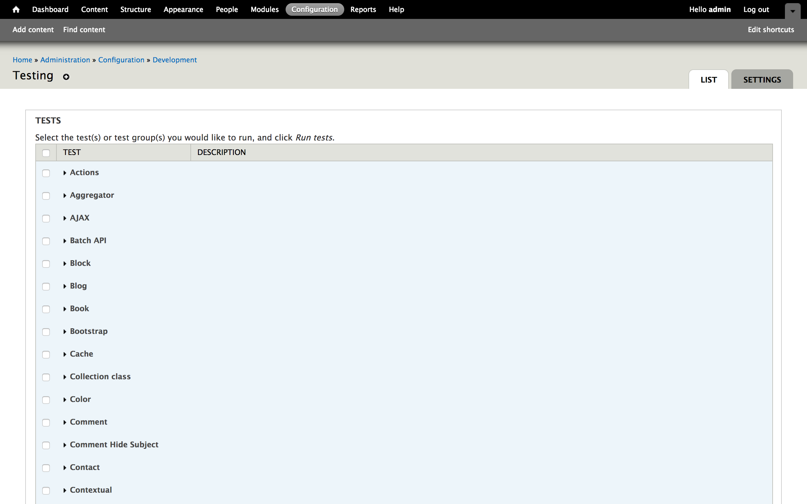
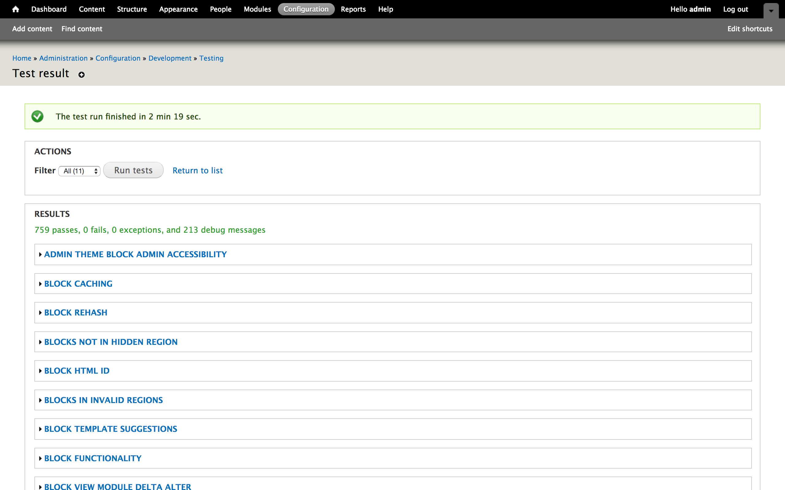
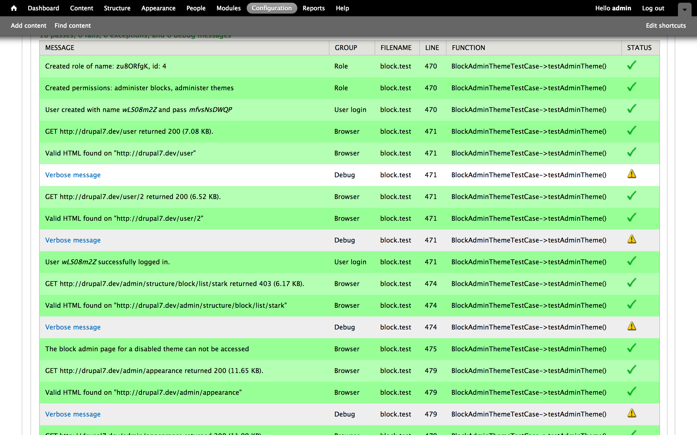
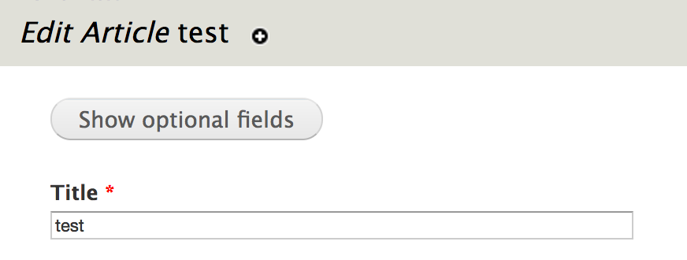
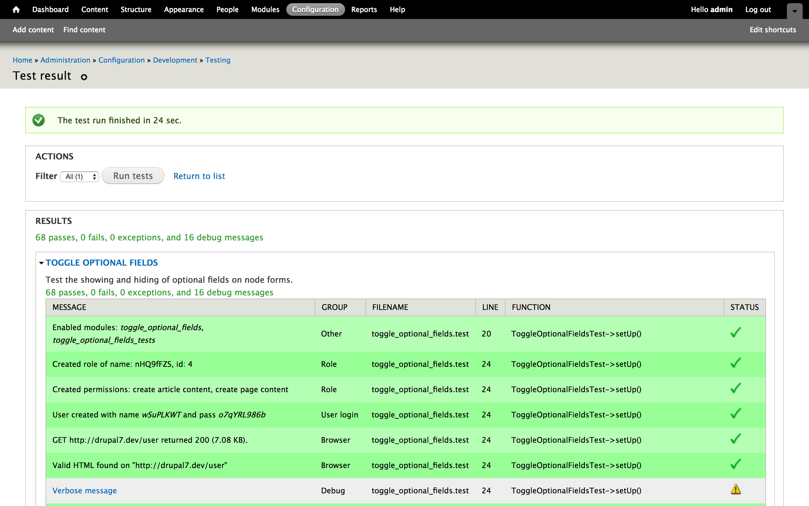

autoscale: true
build-lists: true
footer: @opdavies | oliverdavies.uk
theme: next, 8

[.hide-footer]

# Test Driven Drupal Development with SimpleTest and PHPUnit

---

## opdavies

- Web Developer and Linux System Administrator
- Drupal core contributor, mentor, contrib module maintainer
- Senior Drupal Developer, Appnovation

---

## Why Test?

- Write better code
- Write less code
- Piece of mind
- Ensure consistency
- Drupal core requirement - <https://www.drupal.org/core/gates#testing>

---

## Why Not Test?

No time/budget to write tests.

---

## Core Testing Gate

> New features should be accompanied by automated tests.
> If the feature does not have an implementation, provide a test implementation.
> Bug fixes should be accompanied by changes to a test (either modifying an existing test case or adding a new one) that demonstrate the bug.
-- https://www.drupal.org/core/gates#testing

---

## Testing in Drupal
### SimpleTest

- Based on <http://www.SimpleTest.org>
- In D7 core
- `*.test` files
- All test classes in one file

---

## Testing in Drupal
### PHPUnit

- Used in other PHP projects (e.g. Symfony, Laravel)
- In D8 core, but not default
- `*.php` files
- One test class per file

---

## The PHPUnit Initiative

- <https://www.drupal.org/node/2807237>
- D8 core tests to change to PHPUnit
- Deprecate SimpleTest, remove in D9
- "A big chunk of old tests" converted on Feb 21st

---

## The PHPUnit Initiative

> As part of the PHPUnit initiative __a considerable part of Simpletests will be converted to PHPUnit based browser tests on February 21st 2017__. A backwards compatibility layer has been implemented so that many Simpletests can be converted by just using the new BrowserTestBase base class and moving the test file. There is also a script to automatically convert test files in the conversion issue.
> __Developers are encouraged to use BrowserTestBase instead of Simpletest as of Drupal 8.3.0__, but both test systems are fully supported during the Drupal 8 release cycle.
> The timeline for the deprecation of Simpletest's WebTestBase is under discussion.
-- https://groups.drupal.org/node/516229

---

## Types of Tests
### Unit Tests

- Tests PHP logic
- No database interaction
- Fast to run

---

## Types of Tests
### Web Tests

- Tests functionality
- Interacts with database
- Slower to run

---

## Writing Testable Code

- Single responsibility principle
- DRY
- Dependency Injection
- Interfaces

---

## Test Driven Development (TDD)

- Write a test, see it fail
- Write code until test passes
- Repeat
- Refactor when tests are green

---

## Writing Tests

---

[.hide-footer]

```ini
# example.info

name = Example
core = 7.x
files[] = example.test
```

---

[.hide-footer]

```php
// example.test

class ExampleTestCase extends DrupalWebTestCase {

  public static function getInfo() {
    return array(
      'name' => 'Example tests',
      'description' => 'Web tests for the example module.',
      'group' => 'Example',
    );
  }

}
```

---

[.hide-footer]

```php
class ExampleTestCase extends DrupalWebTestCase {

  ...

  public function testSomething {
    $this->assertTrue(TRUE);
  }

}
```

---

[.hide-footer]

## Creating the World

```php
public function setUp() {
  // Enable any other required modules.
  parent::setUp(['foo', 'bar']);

  // Anything else we need to do.
}
```

---

[.hide-footer]

## Creating the World

```php
$this->drupalCreateUser();

$this->drupalLogin();

$this->drupalCreateNode();

$this->drupalLogout();
```

---

## Assertions

- assertTrue
- assertFalse
- assertNull
- assertNotNull
- assertEqual

---

## Assertions

- assertRaw
- assertResponse
- assertField
- assertFieldById
- assertTitle

---

[.hide-footer]

## Running Tests

---



---


---



---



---

## Running SimpleTest From The Command Line

[.hide-footer]

```bash
# Drupal 7
$ php scripts/run-tests.sh

# Drupal 8
$ php core/scripts/run-tests.sh
```

---

[.hide-footer]

## Running SimpleTest From The Command Line

```bash
--color

--verbose

--all

--module

--class

--file
```

---

[.hide-footer]

## Running PHPUnit From The Command Line

```bash
$ phpunit

$ phpunit [directory]

$ phpunit --filter [method]
```

---

## Example: Collection Class

---

## Collection Class

- <http://dgo.to/collection_class>
- Adds a `Collection` class, based on Laravel’s
- Provides helper methods for array methods

---

[.hide-footer]

```php
$collection = collect([1, 2, 3, 4, 5]);

// Returns all items.
$collection->all();

// Counts the number of items.
$collection->count();

// Returns the array keys.
$collection->keys();
```

---

[.hide-footer]

```php
namespace Drupal\collection_class;

class Collection implements \Countable, \IteratorAggregate {
  private $items;

  public function __construct($items = array()) {
    $this->items = is_array($items) ? $items
      : $this->getArrayableItems($items);
  }

  public function __toString() {
    return $this->toJson();
  }

  ...
```

---

[.hide-footer]

```php
public function all() {
  return $this->items;
}

public function count() {
  return count($this->items);
}


public function isEmpty() {
  return empty($this->items);
}

public function first() {
  return array_shift($this->items);
}
```

---

[.hide-footer]

## Testing

```php
public function setUp() {
  $this->firstCollection = collect(['foo', 'bar', 'baz']);

  $this->secondCollection = collect([
      array('title' => 'Foo', 'status' => 1),
      array('title' => 'Bar', 'status' => 0),
      array('title' => 'Baz', 'status' => 1)
  ]);

  parent::setUp();
}
```

---

[.hide-footer]

## Testing

```php
public function testCollectFunction() {
  $this->assertEqual(
    get_class($this->firstCollection),
    'Drupal\collection_class\Collection'
  );
}
```

---

[.hide-footer]

## Testing

```php
public function testAll() {
  $this->assertEqual(
    array('foo', 'bar', 'baz'),
    $this->firstCollection->all()
  );
}
```

---

[.hide-footer]

## Testing

```php
public function testCount() {
  $this->assertEqual(
    3,
    $this->firstCollection->count()
  );
}
```

---

[.hide-footer]

## Testing

```php
public function testMerge() {
  $first = collect(array('a', 'b', 'c'));
  $second = collect(array('d', 'e', 'f'));

  $this->assertEqual(
    array('a', 'b', 'c', 'd', 'e', 'f'),
    $first->merge($second)->all()
  );
}
```

---


---


---

[.hide-footer]

## Example: Toggle Optional Fields

---

## Toggle Optional Fields

- <http://dgo.to/toggle_optional_fields>
- Adds a button to toggle optional fields on node forms using form alters
- Possible to override using an custom alter hook
- Uses unit and web tests



---

[.hide-footer]

## Example

```php
// Looping through available form elements...

// Only affect fields.
if (!toggle_optional_fields_element_is_field($element_name)) {
  return;
}

$element = &$form[$element_name];

if (isset($overridden_fields[$element_name])) {
  return $element['#access'] = $overridden_fields[$element_name];
}

// If the field is not required, disallow access to hide it.
if (isset($element[LANGUAGE_NONE][0]['#required'])) {
  return $element['#access'] = !empty($element[LANGUAGE_NONE][0]['#required']);
}
```

---

## What to Test?

- **Functional:** Are the correct fields shown and hidden?
- **Unit:** Is the field name check returning correct results?

---

## Unit Tests

[.hide-footer]

```php
// Returns TRUE or FALSE to indicate if this is a field.

function toggle_optional_fields_element_is_field($name) {
  if (in_array($name, array('body', 'language'))) {
    return TRUE;
  }

  return substr($name, 0, 6) == 'field_';
}
```

---

[.hide-footer]

## Unit Tests

```php
$this->assertTrue(
  toggle_optional_fields_element_is_field('field_tags')
);

$this->assertTrue(
  toggle_optional_fields_element_is_field('body')
);

$this->assertFalse(
  toggle_optional_fields_element_is_field('title')
);
```

---


---

[.hide-footer]

## Web Tests

```php
public function setUp() {
  parent::setUp();

  $this->drupalLogin(
    $this->drupalCreateUser(array(
      'create article content',
      'create page content'
    ));
  );

  // Enable toggling on article node forms.
  variable_set('toggle_optional_fields_node_types', array('article'));

  $this->refreshVariables();
}
```

---

[.hide-footer]

## Custom Assertions

```php
private function assertTagsFieldNotHidden() {
  $this->assertFieldByName(
    'field_tags[und]',
    NULL,
    t('Tags field visible.')
  );
}
```

---

## Testing Hidden Fields

[.hide-footer]

```php
public function testFieldsHiddenByDefault() {
  variable_set('toggle_optional_fields_hide_by_default', TRUE);

  $this->refreshVariables();

  $this->drupalGet('node/add/article');

  $this->assertShowOptionalFieldsButtonFound();
  $this->assertHideOptionalFieldsButtonNotFound();
  $this->assertTagsFieldHidden();

  ...
```

---

[.hide-footer]

## Testing Hidden Fields

```php
  ...

  $this->drupalPost(
    'node/add/article',
    array(),
    t('Show optional fields')
  );

  $this->assertHideOptionalFieldsButtonFound();
  $this->assertShowOptionalFieldsButtonNotFound();
  $this->assertTagsFieldNotHidden();
}
```

---



---


---

## Take Aways

- Testing can produce better quality code
- Writing tests is an investment
- OK to start small, introduce tests gradually

---

## Questions?
