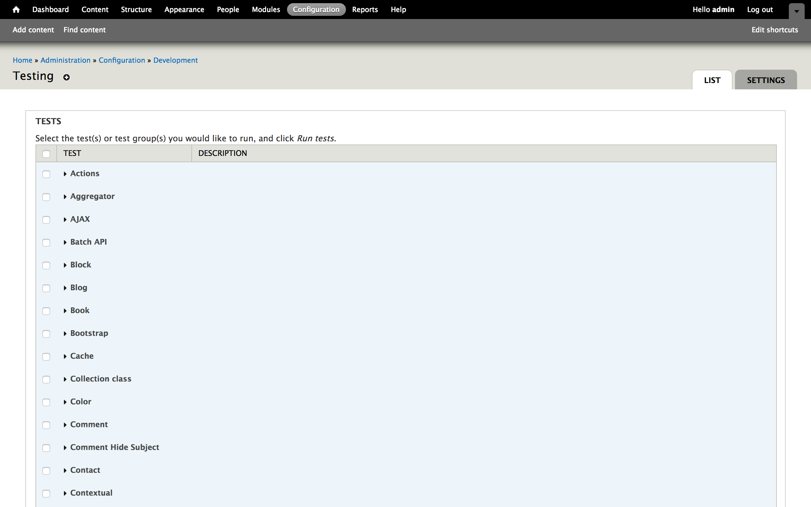

autoscale: true
build-lists: true
footer-style: alignment(left)
footer: @opdavies | oliverdavies.uk
header-emphasis: #53B0EB
header: alignment(left)
text: alignment(left)
text-emphasis: #53B0EB
theme: poster, 8

[.header: alignment(center)]


# _TDD:_ Test <br>Driven Drupal

---

[.background-color: #FFFFFF]
[.build-lists: false]
[.header: #111111]
[.text: #111111, alignment(left)]


- Full stack Web Developer & System Administrator
- Senior Developer at Microserve
- Part-time freelancer
- Acquia certified Drupal 8 Grand Master
- Drupal 7 & 8 core contributor
- opdavies (Drupal.org, GitHub, Twitter)
- www.oliverdavies.uk

^ Work at Microserve.
Maintain Drupal modules, PHP CLI tools and libraries
Blog on my website

---

[.header: alignment(center)]

## test_driven_drupal_.com_

---

[.header: alignment(center)]

## Why?
## _What?_
## How?

---

[.header: alignment(center)]

## I write _contrib modules_ for the community

---

[.header: alignment(center)]

## I write _custom modules_ for client projects

---

[.background-color: #FFFFFF]


---

## _Override Node Options_

- Become maintainer in 2012
- Had some existing tests
- First experience of testing with a real module
- Used on _11,046 sites_ in October 2012 (_84_ D5, _7,094_ D6, _3,868_ D7)
- Used on _29,023 sites_ in June 2018 (_9_ D5, _1,853_ D6, _23,602_ D7, _3,559_ D8)
- Crucial to preventing regressions when adding new features or fixing bugs
- Ensured consistency when porting to Drupal 8

^ Preventing regressions in my additions but also user submitted patches

---

[.header: alignment(center)]

## _Why_ write tests?

---

## _Why write tests?_

- Catch bugs earlier
- Piece of mind
- Prevent regressions
- Write less code
- Documentation
- Drupal core requirement - _<https://www.drupal.org/core/gates#testing>_
- More important with regular D8 releases

^ Dave Liddament talk - better and cheaper to catch bugs earlier (e.g. whilst developing rather than after it's been released)
Refer to tests when writing implementation code
ONO merge conflict

---

## _Core Testing Gate_

New features should be accompanied by automated tests.

If the feature does not have an implementation, provide a test implementation.

Bug fixes should be accompanied by changes to a test (either modifying an existing test case or adding a new one) that demonstrate the bug.

[.footer: https://www.drupal.org/core/gates#testing]

---

[.header: alignment(center)]

## _Testing may add time now,_ but save more <br>time in the future

---

[.header: alignment(center)]

## [fit] _How do you get quicker at writing tests?_
# [fit] By writing more tests

---

## _Testing in Drupal_

- _Drupal 7_ - Simpletest (testing) module provided as part of core
- _Drupal 8_ - PHPUnit added as a core dependency
- _PHPUnit Initiative_ - Simpletest to be deprecated and removed in Drupal 9

---

## _Setting up your environment_

- Drupal includes `core/phpunit.xml.dist`
- Copy to `core/phpunit.xml`
- Amend values as needed
  + Add base URL, database credentials
- Docksal - `fin addon install phpunit`

---

## _Writing Tests (Drupal 8)_

- PHP class with `.php` extension
- `tests/src` directory within each module
- Within the `Drupal\Tests\module_name` namespace
- Class name must match the filename
- Namespace must match the directory structure
- One test class per feature
- Each method must start with `test`

^ Different to D7

---

[.header: alignment(center)]

## _1._ Arrange
## _2._ Act
## _3._ Assert

---

[.hide-footer]

```php
<?php

// modules/example/tests/src/Functional/ExampleTest.php

namespace Drupal\Tests\example\Functional;

use Drupal\Tests\BrowserTestBase;

class ExampleTest extends BrowserTestBase {

  public function testSomething() {
    // Arrange

    // Act

    // Assert
  }

}
```

---

## _What to test?_

- What is the core piece of functionality?
- What provides the most value to the client?
- What would you not like to be fixing on a Friday afternoon or after hours?

---

[.background-color: #FFFFFF]


---

## _Types of tests_

- Functional / FunctionalJavascript (web, browser)
- Kernel (integration)
- Unit

---

## _Functional Tests_

- Tests functionality
- Interacts with database
- Full Drupal installation
- Slower to run
- With/without JavaScript

^ testing profile

---

[.hide-footer]

```php
<?php

// modules/phpunit_example/tests/src/Functional/PHPUnitExampleMenuTest.php

namespace Drupal\Tests\phpunit_example\Functional;

use Drupal\Tests\BrowserTestBase;

class PHPUnitExampleMenuTest extends BrowserTestBase {

  public static $modules = ['phpunit_example'];

  public function testPhpUnitExampleMenu() {
    $this->drupalGet('/examples/phpunit-example');

    $this->assertSession()->statusCodeEquals(200);
  }
}
```

---

[.hide-footer]

```php, [.highlight: 5]
<?php

// modules/phpunit_example/tests/src/Functional/PHPUnitExampleMenuTest.php

namespace Drupal\Tests\phpunit_example\Functional;

use Drupal\Tests\BrowserTestBase;

class PHPUnitExampleMenuTest extends BrowserTestBase {

  public static $modules = ['phpunit_example'];

  public function testPhpUnitExampleMenu() {
    $this->drupalGet('/examples/phpunit-example');

    $this->assertSession()->statusCodeEquals(200);
  }
}
```

---

[.hide-footer]

```php, [.highlight: 7-9]
<?php

// modules/phpunit_example/tests/src/Functional/PHPUnitExampleMenuTest.php

namespace Drupal\Tests\phpunit_example\Functional;

use Drupal\Tests\BrowserTestBase;

class PHPUnitExampleMenuTest extends BrowserTestBase {

  public static $modules = ['phpunit_example'];

  public function testPhpUnitExampleMenu() {
    $this->drupalGet('/examples/phpunit-example');

    $this->assertSession()->statusCodeEquals(200);
  }
}
```

---

[.hide-footer]

```php, [.highlight: 11]
<?php

// modules/phpunit_example/tests/src/Functional/PHPUnitExampleMenuTest.php

namespace Drupal\Tests\phpunit_example\Functional;

use Drupal\Tests\BrowserTestBase;

class PHPUnitExampleMenuTest extends BrowserTestBase {

  public static $modules = ['phpunit_example'];

  public function testPhpUnitExampleMenu() {
    $this->drupalGet('/examples/phpunit-example');

    $this->assertSession()->statusCodeEquals(200);
  }
}
```

---

[.hide-footer]

```php, [.highlight: 13-17]
<?php

// modules/phpunit_example/tests/src/Functional/PHPUnitExampleMenuTest.php

namespace Drupal\Tests\phpunit_example\Functional;

use Drupal\Tests\BrowserTestBase;

class PHPUnitExampleMenuTest extends BrowserTestBase {

  public static $modules = ['phpunit_example'];

  public function testPhpUnitExampleMenu() {
    $this->drupalGet('/examples/phpunit-example');

    $this->assertSession()->statusCodeEquals(200);
  }
}
```

---


## _Kernel Tests_

- Integration tests
- Can install modules, interact with services, container, database
- Minimal Drupal bootstrap
- Faster than functional tests
- More setup required

---

## _Unit Tests_

- Tests PHP logic
- No database interaction
- Fast to run
- Tightly coupled
- Complicated mocking

---

[.hide-footer]

```php
namespace Drupal\collection_class;

class Collection implements \Countable, \IteratorAggregate {
  private $items;

  public function __construct($items = array()) {
    $this->items = is_array($items) ? $items
      : $this->getArrayableItems($items);
  }

  public function __toString() {
    return $this->toJson();
  }

  public function all() {
    return $this->items;
  }

  public function count() {
    return count($this->items);
  }


  public function isEmpty() {
    return empty($this->items);
  }

  public function first() {
    return array_shift($this->items);
  }
}
```

---

[.hide-footer]

```php
$collection = new Collection([1, 2, 3, 4, 5]);

// Returns all items.
$collection->all();

// Counts the number of items.
$collection->count();

// Returns the array keys.
$collection->keys();
```

---

[.hide-footer]

```php
public function testAll() {
  $items = ['foo', 'bar', 'baz'];

  $collection = new Collection($items);

  $this->assertEqual($items, $collection->all());
}
```

---

[.header: #FFFFFF, alignment(left)]

### _How do I know_
## Which type of test to use?

---

### _Need a browser?_
## Use a functional test

---

### _Interact with other services?_
## Use a kernel test

---

### _Isolated PHP code?_
## Use a unit test

---

## _Setup (functional)_

[.hide-footer]

```
drupalCreateUser()
drupalCreateRole()

drupalLogin()
drupalLogout()

drupalGet()
drupalPost()
drupalPostForm()
```

---

## _Setup (kernel)_

```php
# UserCreationTrait
createUser()
createAdminRole()
createRole()
checkPermissions()

# CommentTestTrait
addDefaultCommentField()

# AssertMailTrait
getMails()
assertMail()
```

---

## _Assertions_

[.hide-footer]

```php
assertTrue()
assertFalse()

assertEquals()

assertNull()
assertNotNull()

assertCount()
assertEmpty()

assertArraySubset()
```

---

## _Assertions (functional)_

[.hide-footer]

```php
pageTextContains()
pageTextNotContains()

linkByHrefExists()
linkByHrefNotExists()

statusCodeEquals()
statusCodeNotEquals()
```

---

[.header: alignment(center)]

# _Real life_ example

---

[.background-color: #FFFFFF]
[.footer-style: #2F2F2F]


---

## _Specification_

- Job adverts created on third-party system, needs to create nodes in Drupal, links users to separate application system
- Adverts need to be linked to offices
- Advert length specified in number of days
- Path is specified as a field in the API
- Application URL constructed from domain, includes role ID as a GET parameter and optionally UTM parameters

---

[.hide-footer]

```php
$data = [
  'command' => 'add',
  'username' => 'bobsmith',
  'password' => 'p455w0rd',
  'active_for' => '365',
  'application_email' => 'bob.12345.123@smith.aplitrak.com',
  'branch_address' => '123 Fake St, Bristol, BS1 2AB',
  'branch_name' => 'Test',
  'contract' => 'Temporary',
  'details' => 'This is the detailed description.',
  'job_id' => 'abc123_1234567',
  'job_title' => 'Healthcare Assistant (HCA)',
  'job_type' => 'Care at Home',
  'keywords' => 'flexible, Bristol, part-time',
  'locations' => 'Bath, Devizes',
  'role_id' => 'A/52/86',
  'salary' => '32,000.00 per annum',
  'salary_prefix' => 'Basic Salary',
  'status' => 'Part time',
  'summary' => 'This is the short description.',
  'url_alias' => 'healthcare-assistant-aldershot-june17',
];
```

---

## _Implementation_

- Added route to accept data from API as XML
- Added user with API role to authenticate
- `active_for` converted from number of days to UNIX timestamp
- `branch_name` and `locations` converted from plain text to entity reference (job node to office node)
- `url_alias` property mapped to `path`

---

## _Goals_

- Ensure job nodes are _successfully created_
- Ensure that fields are _mapped correctly_
- Ensure that _calculations are correct_
- Ensure that entity references are _linked correctly_

---

## _Types of tests_

- _Unit:_ ensure number of days are converted to timestamps correctly
- _Kernel:_ job nodes can be added and deleted, expired job nodes are deleted, application URL is generated correctly
- _Functional:_ job nodes are created with the correct URL and the correct response code is returned
- _FunctionalJavaScript:_ application URL is updated with JavaScript based on UTM parameters (hosting)

---

## _Results_

- _0 bugs!_
- Reduced debugging time
- Easier to identify where issues occurred and responsibilities

---

[.header: alignment(center)]

## Running Tests

---



---


---


---


---

```
$ php core/scripts/run-tests.sh

$ php core/scripts/run-tests.sh --module example

$ php core/scripts/run-tests.sh --class ExampleTest
```

---

```
vendor/bin/phpunit -c core path/to/module

vendor/bin/phpunit -c core path/to/module --filter testSomething

vendor/bin/phpunit -c core path/to/module --verbose
```

---

[.header: alignment(center)]

## _Test Driven_<br> Development

---

## _Test Driven Development_

- Write a test
- See it fail
- Write code until test passes
- Refactor when tests are green
- Repeat

---

[.background-color: #FFFFFF]
[.footer: https://github.com/foundersandcoders/testing-tdd-intro]
[.footer-style: #2F2F2F]


---

[.header: alignment(center)]

## Red, Green, Refactor

---

## _Porting Modules to Drupal 8_

- Make a new branch
- Add/update the tests
- Write code to make the tests pass
- Refactor
- Repeat

---

## _How I Write Tests - "Outside In"_

- Start with functional tests
- Drop down to integration or unit tests where needed
- Programming by wishful thinking
- Write comments first, then fill in the code
- Write assertions first, sometimes

---

[.header: alignment(center)]

## Building a new _Drupal 8 Module_ with _TDD_

---

## _Acceptance criteria_

- As a site visitor
- I want to see a list of published articles at /blog
- Ordered by post date

---

## _Tasks_

- Ensure the blog page exists
- Ensure only published articles are shown
- Ensure the articles are shown in the correct order

---

## _Implementation_

- Use views module
- Do the mininum amount at each step, make no assumptions, let the tests guide us
- Start with functional test

---

[.hide-footer]

```yml
# tdd_blog.info.yml

name: 'TDD Example'
core: '8.x'
type: 'module'
```

---

### _Task 1:_
## Ensure the blog page exists

---

[.hide-footer]

```php
<?php

// tests/src/Functional/BlogPageTest.php

namespace Drupal\Tests\tdd_blog\Functional;

use Drupal\Tests\BrowserTestBase;

class BlogPageTest extends BrowserTestBase {

  protected static $modules = ['tdd_blog'];

  public function testBlogPageExists() {
    $this->drupalGet('/blog');

    $this->assertSession()->statusCodeEquals(200);
  }

}
```

---

[.hide-footer]

```php, [.highlight: 5]
<?php

// tests/src/Functional/BlogPageTest.php

namespace Drupal\Tests\tdd_blog\Functional;

use Drupal\Tests\BrowserTestBase;

class BlogPageTest extends BrowserTestBase {

  protected static $modules = ['tdd_blog'];

  public function testBlogPageExists() {
    $this->drupalGet('/blog');

    $this->assertSession()->statusCodeEquals(200);
  }

}
```

---

[.hide-footer]

```php, [.highlight: 7-9]
<?php

// tests/src/Functional/BlogPageTest.php

namespace Drupal\Tests\tdd_blog\Functional;

use Drupal\Tests\BrowserTestBase;

class BlogPageTest extends BrowserTestBase {

  protected static $modules = ['tdd_blog'];

  public function testBlogPageExists() {
    $this->drupalGet('/blog');

    $this->assertSession()->statusCodeEquals(200);
  }

}
```

---

[.hide-footer]

```php, [.highlight: 11]
<?php

// tests/src/Functional/BlogPageTest.php

namespace Drupal\Tests\tdd_blog\Functional;

use Drupal\Tests\BrowserTestBase;

class BlogPageTest extends BrowserTestBase {

  protected static $modules = ['tdd_blog'];

  public function testBlogPageExists() {
    $this->drupalGet('/blog');

    $this->assertSession()->statusCodeEquals(200);
  }

}
```

---

[.hide-footer]

```php, [.highlight: 13-17]
<?php

// tests/src/Functional/BlogPageTest.php

namespace Drupal\Tests\tdd_blog\Functional;

use Drupal\Tests\BrowserTestBase;

class BlogPageTest extends BrowserTestBase {

  protected static $modules = ['tdd_blog'];

  public function testBlogPageExists() {
    $this->drupalGet('/blog');

    $this->assertSession()->statusCodeEquals(200);
  }

}
```

---

[.hide-footer]

```bash, [.highlight: 1]
docker@cli:/var/www/web$ ../vendor/bin/phpunit -c core modules/custom/tdd_blog
PHPUnit 6.5.8 by Sebastian Bergmann and contributors.

Testing modules/custom/tdd_blog
E                                                                   1 / 1 (100%)

Time: 19.31 seconds, Memory: 6.00MB

There was 1 error:

1) Drupal\Tests\tdd_blog\Functional\BlogPageTest::testBlogPageExists
Behat\Mink\Exception\ExpectationException: Current response status code is 404, but 200 expected.

/var/www/vendor/behat/mink/src/WebAssert.php:768
/var/www/vendor/behat/mink/src/WebAssert.php:130
/var/www/web/modules/custom/tdd_blog/tests/src/Functional/BlogPageTest.php:13

ERRORS!
Tests: 1, Assertions: 3, Errors: 1.
```

---

[.hide-footer]

```bash, [.highlight: 4]
docker@cli:/var/www/web$ ../vendor/bin/phpunit -c core modules/custom/tdd_blog
PHPUnit 6.5.8 by Sebastian Bergmann and contributors.

Testing modules/custom/tdd_blog
E                                                                   1 / 1 (100%)

Time: 19.31 seconds, Memory: 6.00MB

There was 1 error:

1) Drupal\Tests\tdd_blog\Functional\BlogPageTest::testBlogPageExists
Behat\Mink\Exception\ExpectationException: Current response status code is 404, but 200 expected.

/var/www/vendor/behat/mink/src/WebAssert.php:768
/var/www/vendor/behat/mink/src/WebAssert.php:130
/var/www/web/modules/custom/tdd_blog/tests/src/Functional/BlogPageTest.php:13

ERRORS!
Tests: 1, Assertions: 3, Errors: 1.
```

---

[.hide-footer]

```bash, [.highlight: 5-13]
docker@cli:/var/www/web$ ../vendor/bin/phpunit -c core modules/custom/tdd_blog
PHPUnit 6.5.8 by Sebastian Bergmann and contributors.

Testing modules/custom/tdd_blog
E                                                                   1 / 1 (100%)

Time: 19.31 seconds, Memory: 6.00MB

There was 1 error:

1) Drupal\Tests\tdd_blog\Functional\BlogPageTest::testBlogPageExists
Behat\Mink\Exception\ExpectationException: Current response status code is 404, but 200 expected.

/var/www/vendor/behat/mink/src/WebAssert.php:768
/var/www/vendor/behat/mink/src/WebAssert.php:130
/var/www/web/modules/custom/tdd_blog/tests/src/Functional/BlogPageTest.php:13

ERRORS!
Tests: 1, Assertions: 3, Errors: 1.
```

---

[.hide-footer]

```bash, [.highlight: 14-16]
docker@cli:/var/www/web$ ../vendor/bin/phpunit -c core modules/custom/tdd_blog
PHPUnit 6.5.8 by Sebastian Bergmann and contributors.

Testing modules/custom/tdd_blog
E                                                                   1 / 1 (100%)

Time: 19.31 seconds, Memory: 6.00MB

There was 1 error:

1) Drupal\Tests\tdd_blog\Functional\BlogPageTest::testBlogPageExists
Behat\Mink\Exception\ExpectationException: Current response status code is 404, but 200 expected.

/var/www/vendor/behat/mink/src/WebAssert.php:768
/var/www/vendor/behat/mink/src/WebAssert.php:130
/var/www/web/modules/custom/tdd_blog/tests/src/Functional/BlogPageTest.php:13

ERRORS!
Tests: 1, Assertions: 3, Errors: 1.
```

---

[.hide-footer]

```bash, [.highlight: 18-19]
docker@cli:/var/www/web$ ../vendor/bin/phpunit -c core modules/custom/tdd_blog
PHPUnit 6.5.8 by Sebastian Bergmann and contributors.

Testing modules/custom/tdd_blog
E                                                                   1 / 1 (100%)

Time: 19.31 seconds, Memory: 6.00MB

There was 1 error:

1) Drupal\Tests\tdd_blog\Functional\BlogPageTest::testBlogPageExists
Behat\Mink\Exception\ExpectationException: Current response status code is 404, but 200 expected.

/var/www/vendor/behat/mink/src/WebAssert.php:768
/var/www/vendor/behat/mink/src/WebAssert.php:130
/var/www/web/modules/custom/tdd_blog/tests/src/Functional/BlogPageTest.php:13

ERRORS!
Tests: 1, Assertions: 3, Errors: 1.
```

---

- _The view has not been created_
- Create a new view
- Set the path
- Export the config
- Copy it into the module's `config/install` directory

---

[.hide-footer]

```[.highlight: 11-13]
docker@cli:/var/www/web$ ../vendor/bin/phpunit -c core modules/custom/tdd_blog
PHPUnit 6.5.8 by Sebastian Bergmann and contributors.

Testing modules/custom/tdd_blog
E                                                                   1 / 1 (100%)

Time: 16.02 seconds, Memory: 6.00MB

There was 1 error:

1) Drupal\Tests\tdd_blog\Functional\BlogPageTest::testBlogPageExists
Drupal\Core\Config\UnmetDependenciesException: Configuration objects provided by <em class="placeholder">tdd_blog</em>
have unmet dependencies: <em class="placeholder">views.view.blog (node.type.article, node, views)</em>

/var/www/web/core/lib/Drupal/Core/Config/UnmetDependenciesException.php:98
/var/www/web/core/lib/Drupal/Core/Config/ConfigInstaller.php:469
/var/www/web/core/lib/Drupal/Core/ProxyClass/Config/ConfigInstaller.php:132
/var/www/web/core/lib/Drupal/Core/Extension/ModuleInstaller.php:145
/var/www/web/core/lib/Drupal/Core/ProxyClass/Extension/ModuleInstaller.php:83
/var/www/web/core/lib/Drupal/Core/Test/FunctionalTestSetupTrait.php:437
/var/www/web/core/tests/Drupal/Tests/BrowserTestBase.php:1055
/var/www/web/core/tests/Drupal/Tests/BrowserTestBase.php:490

ERRORS!
Tests: 1, Assertions: 0, Errors: 1.
```

---

[.hide-footer]

```yml,[.highlight: 1, 7-10]
# tdd_blog.info.yml

name: 'TDD Dublin'
description: 'A demo module to show test driven module development.'
core: 8.x
type: module

dependencies:
  - 'drupal:node'
  - 'drupal:views'
```

---

[.hide-footer]

```[.highlight: 10-13]
docker@cli:/var/www/web$ ../vendor/bin/phpunit -c core modules/custom/tdd_blog
PHPUnit 6.5.8 by Sebastian Bergmann and contributors.

Testing modules/custom/tdd_blog
E                                                                   1 / 1 (100%)

Time: 20 seconds, Memory: 6.00MB

There was 1 error:

1) Drupal\Tests\tdd_blog\Functional\BlogPageTest::testBlogPageExists
Drupal\Core\Config\UnmetDependenciesException: Configuration objects provided by <em class="placeholder">tdd_blog</em>
have unmet dependencies: <em class="placeholder">views.view.blog (node.type.article)</em>

/var/www/web/core/lib/Drupal/Core/Config/UnmetDependenciesException.php:98
/var/www/web/core/lib/Drupal/Core/Config/ConfigInstaller.php:469
/var/www/web/core/lib/Drupal/Core/ProxyClass/Config/ConfigInstaller.php:132
/var/www/web/core/lib/Drupal/Core/Extension/ModuleInstaller.php:145
/var/www/web/core/lib/Drupal/Core/ProxyClass/Extension/ModuleInstaller.php:83
/var/www/web/core/lib/Drupal/Core/Test/FunctionalTestSetupTrait.php:437
/var/www/web/core/tests/Drupal/Tests/BrowserTestBase.php:1055
/var/www/web/core/tests/Drupal/Tests/BrowserTestBase.php:490

ERRORS!
Tests: 1, Assertions: 0, Errors: 1.
```

---

- Add the article content type

---

[.hide-footer]

```[.highlight: 5, 9]
docker@cli:/var/www/web$ ../vendor/bin/phpunit -c core modules/custom/tdd_blog
PHPUnit 6.5.8 by Sebastian Bergmann and contributors.

Testing modules/custom/tdd_blog
.                                                                   1 / 1 (100%)

Time: 23.36 seconds, Memory: 6.00MB

OK (1 test, 3 assertions)
```

---

## _Tasks_

- ~~Ensure the blog page exists~~
- Ensure only published articles are shown
- Ensure the articles are shown in the correct order

---

### _Task 2:_
## Ensure only published articles are shown

---

[.hide-footer]

```php
public function testOnlyPublishedArticlesAreShown() {
  // Given I have a mixture of published and unpublished articles,
  // as well as other types of content.

  // When I view the blog page.

  // I should only see the published articles.
}
```

---

[.header: alignment(center)]

### _Option 1:_ Functional tests

---

[.hide-footer]

```php,[.highlight: 1, 4-8]
// modules/custom/tdd_blog/tests/src/Functional/BlogPageTest.php

public function testOnlyPublishedArticlesAreShown() {
  // Given I have a mixture of published and unpublished articles,
  // as well as other types of content.
  $node1 = $this->drupalCreateNode(['type' => 'page', 'status' => 1]);
  $node2 = $this->drupalCreateNode(['type' => 'article', 'status' => 1]);
  $node3 = $this->drupalCreateNode(['type' => 'article', 'status' => 0]);

  // When I view the blog page.
  $this->drupalGet('/blog');

  // I should only see the published articles.
  $assert = $this->assertSession();
  $assert->pageTextContains($node2->label());
  $assert->pageTextNotContains($node1->label());
  $assert->pageTextNotContains($node3->label());
}
```

^ Different ways to achieve this. This is taking the functional test approach.

---

[.hide-footer]

```php,[.highlight: 10-12]
// modules/custom/tdd_blog/tests/src/Functional/BlogPageTest.php

public function testOnlyPublishedArticlesAreShown() {
  // Given I have a mixture of published and unpublished articles,
  // as well as other types of content.
  $node1 = $this->drupalCreateNode(['type' => 'page', 'status' => 1]);
  $node2 = $this->drupalCreateNode(['type' => 'article', 'status' => 1]);
  $node3 = $this->drupalCreateNode(['type' => 'article', 'status' => 0]);

  // When I view the blog page.
  $this->drupalGet('/blog');

  // I should only see the published articles.
  $assert = $this->assertSession();
  $assert->pageTextContains($node2->label());
  $assert->pageTextNotContains($node1->label());
  $assert->pageTextNotContains($node3->label());
}
```

---

[.hide-footer]

```php, [.highlight: 13-17]
// modules/custom/tdd_blog/tests/src/Functional/BlogPageTest.php

public function testOnlyPublishedArticlesAreShown() {
  // Given I have a mixture of published and unpublished articles,
  // as well as other types of content.
  $node1 = $this->drupalCreateNode(['type' => 'page', 'status' => 1]);
  $node2 = $this->drupalCreateNode(['type' => 'article', 'status' => 1]);
  $node3 = $this->drupalCreateNode(['type' => 'article', 'status' => 0]);

  // When I view the blog page.
  $this->drupalGet('/blog');

  // I should only see the published articles.
  $assert = $this->assertSession();
  $assert->pageTextContains($node2->label());
  $assert->pageTextNotContains($node1->label());
  $assert->pageTextNotContains($node3->label());
}
```

---

[.header: alignment(center)]

### _Option 2:_ Kernel tests

---

[.hide-footer]

```php
<?php

namespace Drupal\Tests\tdd_blog\Kernel;

use Drupal\KernelTests\Core\Entity\EntityKernelTestBase;
use Drupal\Tests\node\Traits\NodeCreationTrait;

class BlogPageTest extends EntityKernelTestBase {

  use NodeCreationTrait;

  public static $modules = ['node'];

  public function testOnlyPublishedArticlesAreShown() {
    $this->createNode(['type' => 'page', 'status' => 1]);
    $this->createNode(['type' => 'article', 'status' => 1]);
    $this->createNode(['type' => 'article', 'status' => 0]);
  }

}
```

^ Kernel test approach
Dropping down a level
No need for the brower, not asserting against HTML
Faster to run

---

[.hide-footer]

```php, [.highlight: 3-8]
<?php

namespace Drupal\Tests\tdd_blog\Kernel;

use Drupal\KernelTests\Core\Entity\EntityKernelTestBase;
use Drupal\Tests\node\Traits\NodeCreationTrait;

class BlogPageTest extends EntityKernelTestBase {

  use NodeCreationTrait;

  public static $modules = ['node'];

  public function testOnlyPublishedArticlesAreShown() {
    $this->createNode(['type' => 'page', 'status' => 1]);
    $this->createNode(['type' => 'article', 'status' => 1]);
    $this->createNode(['type' => 'article', 'status' => 0]);
  }

}
```

---

[.hide-footer]

```php, [.highlight: 10]
<?php

namespace Drupal\Tests\tdd_blog\Kernel;

use Drupal\KernelTests\Core\Entity\EntityKernelTestBase;
use Drupal\Tests\node\Traits\NodeCreationTrait;

class BlogPageTest extends EntityKernelTestBase {

  use NodeCreationTrait;

  public static $modules = ['node'];

  public function testOnlyPublishedArticlesAreShown() {
    $this->createNode(['type' => 'page', 'status' => 1]);
    $this->createNode(['type' => 'article', 'status' => 1]);
    $this->createNode(['type' => 'article', 'status' => 0]);
  }

}
```

---

[.hide-footer]

```php, [.highlight: 14-18]
<?php

namespace Drupal\Tests\tdd_blog\Kernel;

use Drupal\KernelTests\Core\Entity\EntityKernelTestBase;
use Drupal\Tests\node\Traits\NodeCreationTrait;

class BlogPageTest extends EntityKernelTestBase {

  use NodeCreationTrait;

  public static $modules = ['node'];

  public function testOnlyPublishedArticlesAreShown() {
    $this->createNode(['type' => 'page', 'status' => 1]);
    $this->createNode(['type' => 'article', 'status' => 1]);
    $this->createNode(['type' => 'article', 'status' => 0]);
  }

}
```

---

[.hide-footer]

```[.highlight: 9-16]
docker@cli:/var/www/web$ ../vendor/bin/phpunit -c core modules/custom/tdd_blog/tests/src/Kernel/
PHPUnit 6.5.8 by Sebastian Bergmann and contributors.

Testing modules/custom/tdd_blog/tests/src/Kernel/
E                                                                   1 / 1 (100%)

Time: 6.22 seconds, Memory: 6.00MB

There was 1 error:

1) Drupal\Tests\tdd_blog\Kernel\BlogPageTest::testOnlyPublishedArticlesAreShown
Error: Call to a member function id() on boolean

/var/www/web/core/modules/filter/filter.module:212
/var/www/web/core/modules/node/tests/src/Traits/NodeCreationTrait.php:73
/var/www/web/modules/custom/tdd_blog/tests/src/Kernel/BlogPageTest.php:13

ERRORS!
Tests: 1, Assertions: 2, Errors: 1.
```

---

[.hide-footer]

```php, [.highlight: 2]
public function testOnlyPublishedArticlesAreShown() {
  $this->installConfig(['filter']);

  $this->createNode(['type' => 'page', 'status' => 1]);
  $this->createNode(['type' => 'article', 'status' => 1]);
  $this->createNode(['type' => 'article', 'status' => 0]);
}
```

---

[.hide-footer]

```php, [.highlight: 8]
public function testOnlyPublishedArticlesAreShown() {
  $this->installConfig(['filter']);

  $this->createNode(['type' => 'page', 'status' => 1]);
  $this->createNode(['type' => 'article', 'status' => 1]);
  $this->createNode(['type' => 'article', 'status' => 0]);

  $results = views_get_view_result('blog');
}
```

---

[.hide-footer]

```php, [.highlight: 3]
...

public static $modules = ['node', 'tdd_blog', 'views'];

public function testOnlyPublishedArticlesAreShown() {
  $this->installConfig(['filter', 'tdd_blog']);

  $this->createNode(['type' => 'page', 'status' => 1]);
  $this->createNode(['type' => 'article', 'status' => 1]);
  $this->createNode(['type' => 'article', 'status' => 0]);

  $results = views_get_view_result('blog');

  $this->assertCount(1, $results);
  $this->assertEquals(2, $results[0]->_entity->id());
}
```

---

[.hide-footer]

```php, [.highlight: 6]
...

public static $modules = ['node', 'tdd_blog', 'views'];

public function testOnlyPublishedArticlesAreShown() {
  $this->installConfig(['filter', 'tdd_blog']);

  $this->createNode(['type' => 'page', 'status' => 1]);
  $this->createNode(['type' => 'article', 'status' => 1]);
  $this->createNode(['type' => 'article', 'status' => 0]);

  $results = views_get_view_result('blog');

  $this->assertCount(1, $results);
  $this->assertEquals(2, $results[0]->_entity->id());
}
```

---

[.hide-footer]

```php, [.highlight: 8-15]
...

public static $modules = ['node', 'tdd_blog', 'views'];

public function testOnlyPublishedArticlesAreShown() {
  $this->installConfig(['filter', 'tdd_blog']);

  $this->createNode(['type' => 'page', 'status' => 1]);
  $this->createNode(['type' => 'article', 'status' => 1]);
  $this->createNode(['type' => 'article', 'status' => 0]);

  $results = views_get_view_result('blog');

  $this->assertCount(1, $results);
  $this->assertEquals(2, $results[0]->_entity->id());
}
```

^ Assert
Should only be one result, should be node 2
Node IDs are reset on each test method

---

[.hide-footer]

```
PHPUnit 6.5.8 by Sebastian Bergmann and contributors.

Testing web/modules/custom/tdd_blog/tests/src/Kernel
F                                                                   1 / 1 (100%)

Time: 2.16 seconds, Memory: 6.00MB

There was 1 failure:

1) Drupal\Tests\tdd_blog\Kernel\BlogPageTest::testOnlyPublishedArticlesAreShown
Failed asserting that actual size 3 matches expected size 1.

/Users/opdavies/Code/drupal-testing-workshop/web/modules/custom/tdd_blog/tests/src/Kernel/BlogPageTest.php:23

FAILURES!
Tests: 1, Assertions: 4, Failures: 1.
```

---

[.hide-footer]

```[.highlight: 8-13]
PHPUnit 6.5.8 by Sebastian Bergmann and contributors.

Testing web/modules/custom/tdd_blog/tests/src/Kernel
F                                                                   1 / 1 (100%)

Time: 2.16 seconds, Memory: 6.00MB

There was 1 failure:

1) Drupal\Tests\tdd_blog\Kernel\BlogPageTest::testOnlyPublishedArticlesAreShown
Failed asserting that actual size 3 matches expected size 1.

/Users/opdavies/Code/drupal-testing-workshop/web/modules/custom/tdd_blog/tests/src/Kernel/BlogPageTest.php:23

FAILURES!
Tests: 1, Assertions: 4, Failures: 1.
```

---

>- _There are no filters on the view_
- Add the filters
- Export and save the view

---

```[.highlight: 3-8]
PHPUnit 6.5.8 by Sebastian Bergmann and contributors.

Testing web/modules/custom/tdd_blog/tests/src/Kernel
.                                                                   1 / 1 (100%)

Time: 2.02 seconds, Memory: 6.00MB

OK (1 test, 6 assertions)
```

---

## _Tasks_

- ~~Ensure the blog page exists~~
- ~~Ensure only published articles are shown~~
- Ensure the articles are shown in the correct order

---

### _Task 3:_
## Ensure the articles are shown in the correct order

---

[.hide-footer]

```php
// modules/custom/tdd_blog/tests/src/Kernel/BlogPageTest.php

public function testArticlesAreOrderedByDate() {
  // Given that I have numerous articles with different post dates.

  // When I go to the blog page.

  // The articles are ordered by post date.
}
```

---

[.hide-footer]

```php, [.highlight: 4-9]
// modules/custom/tdd_blog/tests/src/Kernel/BlogPageTest.php

public function testArticlesAreOrderedByDate() {
  // Given that I have numerous articles with different post dates.
  $this->createNode(['type' => 'article', 'created' => (new \DateTime())->modify('+1 day')->getTimestamp()]);
  $this->createNode(['type' => 'article', 'created' => (new \DateTime())->modify('+1 month')->getTimestamp()]);
  $this->createNode(['type' => 'article', 'created' => (new \DateTime())->modify('+3 days')->getTimestamp()]);
  $this->createNode(['type' => 'article', 'created' => (new \DateTime())->modify('+1 hour')->getTimestamp()]);

  // When I go to the blog page.

  // The articles are ordered by post date.
}
```

---

[.hide-footer]

```php, [.highlight: 10-11]
// modules/custom/tdd_blog/tests/src/Kernel/BlogPageTest.php

public function testArticlesAreOrderedByDate() {
  // Given that I have numerous articles with different post dates.
  $this->createNode(['type' => 'article', 'created' => (new \DateTime())->modify('+1 day')->getTimestamp()]);
  $this->createNode(['type' => 'article', 'created' => (new \DateTime())->modify('+1 month')->getTimestamp()]);
  $this->createNode(['type' => 'article', 'created' => (new \DateTime())->modify('+3 days')->getTimestamp()]);
  $this->createNode(['type' => 'article', 'created' => (new \DateTime())->modify('+1 hour')->getTimestamp()]);

  // When I go to the blog page.
  $results = views_get_view_result('blog');

  // The articles are ordered by post date.
}
```

---

[.hide-footer]

```php, [.highlight:10-15]
// modules/custom/tdd_blog/tests/src/Kernel/BlogPageTest.php

public function testArticlesAreOrderedByDate() {
  // Given that I have numerous articles with different post dates.
  $this->createNode(['type' => 'article', 'created' => (new \DateTime())->modify('+1 day')->getTimestamp()]);
  $this->createNode(['type' => 'article', 'created' => (new \DateTime())->modify('+1 month')->getTimestamp()]);
  $this->createNode(['type' => 'article', 'created' => (new \DateTime())->modify('+3 days')->getTimestamp()]);
  $this->createNode(['type' => 'article', 'created' => (new \DateTime())->modify('+1 hour')->getTimestamp()]);

  // When I go to the blog page.
  $results = views_get_view_result('blog');

  $nids = array_map(function(ResultRow $result) {
    return $result->_entity->id();
  }, $results);

  // The articles are ordered by post date.
}
```

---

[.hide-footer]

```php, [.highlight: 5-9, 17-18]
// modules/custom/tdd_blog/tests/src/Kernel/BlogPageTest.php

public function testArticlesAreOrderedByDate() {
  // Given that I have numerous articles with different post dates.
  $this->createNode(['type' => 'article', 'created' => (new \DateTime())->modify('+1 day')->getTimestamp()]);
  $this->createNode(['type' => 'article', 'created' => (new \DateTime())->modify('+1 month')->getTimestamp()]);
  $this->createNode(['type' => 'article', 'created' => (new \DateTime())->modify('+3 days')->getTimestamp()]);
  $this->createNode(['type' => 'article', 'created' => (new \DateTime())->modify('+1 hour')->getTimestamp()]);

  // When I go to the blog page.
  $results = views_get_view_result('blog');

  $nids = array_map(function(ResultRow $result) {
    return $result->_entity->id();
  }, $results);

  // The articles are ordered by post date.
  $this->assertEquals([4, 1, 3, 2], $nids);
}
```

---

[.hide-footer]

```
PHPUnit 6.5.8 by Sebastian Bergmann and contributors.

Testing web/modules/custom/tdd_blog/tests/src/Kernel
F                                                                   1 / 1 (100%)

Time: 1.42 seconds, Memory: 6.00MB

There was 1 failure:

1) Drupal\Tests\tdd_blog\Kernel\BlogPageTest::testArticlesAreOrderedByDate
Failed asserting that two arrays are equal.
--- Expected
+++ Actual
@@ @@
 Array (
-    0 => 4
-    1 => 1
-    2 => 3
-    3 => 2
+    0 => '3'
+    1 => '2'
+    2 => '4'
+    3 => '1'

/Users/opdavies/Code/drupal-testing-workshop/web/core/tests/Drupal/KernelTests/KernelTestBase.php:1114
/Users/opdavies/Code/drupal-testing-workshop/web/modules/custom/tdd_blog/tests/src/Kernel/BlogPageTest.php:43

FAILURES!
Tests: 1, Assertions: 4, Failures: 1.
```

---

[.hide-footer]

```[.highlight: 8-26]
PHPUnit 6.5.8 by Sebastian Bergmann and contributors.

Testing web/modules/custom/tdd_blog/tests/src/Kernel
F                                                                   1 / 1 (100%)

Time: 1.42 seconds, Memory: 6.00MB

There was 1 failure:

1) Drupal\Tests\tdd_blog\Kernel\BlogPageTest::testArticlesAreOrderedByDate
Failed asserting that two arrays are equal.
--- Expected
+++ Actual
@@ @@
 Array (
-    0 => 4
-    1 => 1
-    2 => 3
-    3 => 2
+    0 => '3'
+    1 => '2'
+    2 => '4'
+    3 => '1'

/Users/opdavies/Code/drupal-testing-workshop/web/core/tests/Drupal/KernelTests/KernelTestBase.php:1114
/Users/opdavies/Code/drupal-testing-workshop/web/modules/custom/tdd_blog/tests/src/Kernel/BlogPageTest.php:43

FAILURES!
Tests: 1, Assertions: 4, Failures: 1.
```

---

- _There is no sort order defined on the view_
- Add the sort order
- Re-export the view

---

```[.highlight:3-8]
PHPUnit 6.5.8 by Sebastian Bergmann and contributors.

Testing web/modules/custom/tdd_blog/tests/src/Kernel
.                                                                   1 / 1 (100%)

Time: 1.74 seconds, Memory: 6.00MB

OK (1 test, 5 assertions)
```

---

## _Tasks_

- ~~Ensure the blog page exists~~
- ~~Ensure only published articles are shown~~
- ~~Ensure the articles are shown in the correct order~~

---

[.header: alignment(center)]

## Take Aways

---

- Testing has made me a _better developer_
- Testing can produce _better quality code_
- Use the _right type of test_ for the right situation
- Use the _right base class_, use available _traits_
- Writing tests is an _investment_
- OK to _start small_, introduce tests gradually
- Easier to _refactor_
- Tests can pass, but things can _still be broken_. Tests only report on what they cover.

^ Made me think about how I'm going to do something more starting to do it
Less cruft, only write code that serves a purpose
Spending time writing tests pays dividends later on
Start by introducing tests for new features or regression tests when fixing bugs
If you know things pass, then you can refactor code knowing if something is broken
Manual testing is still important

---

[.hide-footer]
[.text: alignment(center)]

> 

---

## _Resources_

- github.com/opdavies/drupal-module-tdd-dublin
- drupalize.me/series/testing-drupal-7-simpletest
- lullabot.com/articles/an-overview-of-testing-in-drupal-8
- mediacurrent.com/blog/writing-simple-simpletest-tests-your-d7-module
- mediacurrent.com/blog/writing-simple-phpunit-tests-your-d8-module
- knpuniversity.com/screencast/phpunit
- adamwathan.me/test-driven-laravel
- laracasts.com

---

- oliverdavies.uk/_talks_
- oliverdavies.uk/_twitter_
- oliverdavies.uk/_drupal_
- oliverdavies.uk/_github_
- oliverdavies.uk/_youtube_

---

[.header: alignment(center)]

## Questions?

---

[.header: alignment(center)]

# Thanks
