theme: poster, 8
autoscale: true
build-lists: true
header-emphasis: #53B0EB
header: alignment(left)
text: alignment(left)
text-emphasis: #53B0EB
code: Monaco, #6699FF, #999999, #6666FF, #66FF66, #66FF66, line-height(1.3)

[.header: alignment(center)]


# _TDD:_ Test <br>Driven Drupal

---

[.header: alignment(center)]

## [fit] opdavi.es/_tdd-test-driven-drupal_

^ View on the website or click through to Speakerdeck

---

[.build-lists: false]

- Module and theme developers
- Want to know more about automated testing
- Looking to start writing your first tests
- Drupal 8
- PHPUnit

---

- Why write tests, and what to test
- Types of tests
- How to run tests
- Real life example
- Building a new module with TDD

---

[.background-color: #FFFFFF]
[.build-lists: false]
[.header: #111111]
[.text: #111111, alignment(left)]


- Full Stack Web Developer & System Administrator
- Senior Developer at Microserve
- Part-time freelancer
- Acquia certified Drupal 8 Grand Master
- Drupal 7 & 8 core contributor
- Drupal, Symfony, Laravel, Sculpin
- @opdavies
- www.oliverdavies.uk

^ Work at Microserve.
Maintain Drupal modules, PHP CLI tools and libraries
Blog on my website

---

[.build-lists: false]

- opdavi.es/_talks_
- opdavi.es/_twitter_
- opdavi.es/_drupal_
- opdavi.es/_github_

^ Example code on GitHub

---

[.background-color: #FFFFFF]
[.text: #111111, alignment(left)]


- https://microserve.io
- https://www.drupal.org/microserve
- https://github.com/microserve-io
- https://twitter.com/microserveltd
- https://www.linkedin.com/company/microserve-ltd

---

[.header: alignment(center)]

## test_driven_drupal_.com_

^ Book on automated testing in Drupal 8
Building a conference website

---


---

[.header: alignment(center)]

## Write custom modules and themes _for clients_

---

[.header: alignment(center)]

## Occassionally <br>contribute _to core_

---

[.header: alignment(center)]

## Maintain and contribute to _contrib projects_

---

[.background-color: #FFFFFF]


---

## _Override Node Options_

- Become maintainer in 2012
- Had some existing tests
- Used on _11,046 sites_ in October 2012 (_84_ D5, _7,094_ D6, _3,868_ D7)
- Used on _30,572 sites_ in March 2019 (_10_ D5, _1,180_ D6, _24,057_ D7, _5,335_ D8)
- _#230_ most used module on Drupal.org
- Crucial to preventing regressions

^ Preventing regressions when adding new features or fixing bugs, but also user submitted patches
First module I ported to Drupal 8, aided by tests

---

[.header: alignment(center)]

## _Why_ write tests?

---

## _Why write tests?_

- Catch bugs earlier
- Peace of mind
- Prevent regressions
- Write less code
- Documentation
- Drupal core requirement - _<https://www.drupal.org/core/gates#testing>_
- More important with regular D8 releases

^ Dave Liddament talk - better and cheaper to catch bugs earlier (e.g. whilst developing rather than after it's been released)
Refer to tests when writing implementation code
ONO merge conflict

---

## _Core Testing Gate_

- New features should be accompanied by automated tests.
- If the feature does not have an implementation, provide a test implementation.
- Bug fixes should be accompanied by changes to a test (either modifying an existing test case or adding a new one) that demonstrate the bug.

[.footer: https://opdavi.es/drupal-core-testing-gate]

---

[.background-color: #FFFFFF]


---

## _Testing in Drupal_

- _Drupal 7_ - SimpleTest (testing) module provided as part of core
- _Drupal 8_ - PHPUnit added as a core dependency
- _PHPUnit Initiative_ - SimpleTest to be deprecated and removed in Drupal 9

---

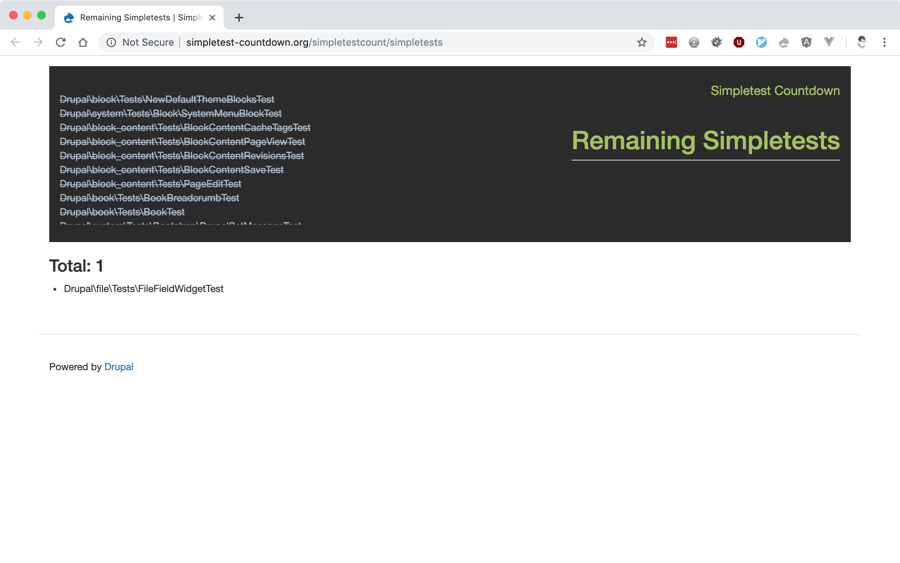

---

[.header: #53B0EB]

## Writing Tests (Drupal 8)

- PHP class with _.php_ extension
- _tests/src_ directory within each module
- Within the *Drupal\Tests\module_name* namespace
- Class name must match the filename
- Namespace must match the directory structure
- One test class per feature

^ Different to D7

---

[.header: alignment(center)]

## _1._ Arrange
## _2._ Act
## _3._ Assert

---

[.header: alignment(center)]

## _3._ Assert
## _2._ Act
## _1._ Arrange

---

```php
// modules/example/tests/src/Functional/ExampleTest.php

namespace Drupal\Tests\example\Functional;

use Drupal\Tests\BrowserTestBase;

class ExampleTest extends BrowserTestBase {

  public function testSomething() {
    // Arrange

    // Act

    // Assert
  }

}
```

^ PHP class
Filename matches class name
Namespace matches directory structure
Extend BrowserTestBase
Add test method

---

```php
public function testSomething() {}

public function test_something() {}

/** @test */
public function it_does_something() {}
```

---

[.header: #53B0EB]

## What to test?

- Creating nodes with data from an API
- Calculating attendance figures for an event
- Determining if an event is purchasble
- Promotions and coupons for new users
- Cloning events
- Queuing private message requests
- Emails for new memberships
- Closed support tickets are re-opened when comments are added
- Custom form validation rules

---

[.header: #53B0EB]

## What to test first?

- What is the core piece of functionality?
- What provides the most value to the client?
- What would you not like to be fixing on a Friday afternoon or after hours?

^ Payments! Anything related to money.
What would provide the largest negative impact to the client if it were to fail?

---

[.background-color: #FFFFFF]


---


[.header: #53B0EB]

## What to test first?

- Write a _new test_ when adding any _new functionality_
- Write a _regression test_ when _fixing a bug_

^ Use tests to replicate the bug
Could be a new test, or adding to an existing test
Test passes when the bug is fixed
That issue cannot be re-added without the test failing again

---

[.header: #53B0EB]

## Types of tests

- Unit
- Kernel _(integration)_
- Functional / FunctionalJavascript _(web, browser, feature)_

---

[.header: #53B0EB]

## Unit tests

- Tests PHP logic
- No database interaction
- Fast to run
- Need to mock dependencies
- Can become tightly coupled
- Can be hard to refactor

---

```php
// tests/src/Unit/JobTest.php

namespace Drupal\Tests\advancedqueue\Unit;

use Drupal\advancedqueue\Job;
use Drupal\Tests\UnitTestCase;

class JobTest extends UnitTestCase {

  public function testCreate() {
    $job = Job::create('test', ['my' => 'data']);

    $this->assertEquals('test', $job->getType());
    $this->assertEquals(['my' => 'data'], $job->getPayload());
    $this->assertEquals(Job::STATE_QUEUED, $job->getState());
  }

}
```

^ Within a Unit directory and namespace
Called JobTest because it's testing the Job class
Called testCreate because it's testing the create method

---

```php, [.highlight: 11]
// tests/src/Unit/JobTest.php

namespace Drupal\Tests\advancedqueue\Unit;

use Drupal\advancedqueue\Job;
use Drupal\Tests\UnitTestCase;

class JobTest extends UnitTestCase {

  public function testCreate() {
    $job = Job::create('test', ['my' => 'data']);

    $this->assertEquals('test', $job->getType());
    $this->assertEquals(['my' => 'data'], $job->getPayload());
    $this->assertEquals(Job::STATE_QUEUED, $job->getState());
  }

}
```

^ Create a job with the create method

---

```php, [.highlight: 13-15]
// tests/src/Unit/JobTest.php

namespace Drupal\Tests\advancedqueue\Unit;

use Drupal\advancedqueue\Job;
use Drupal\Tests\UnitTestCase;

class JobTest extends UnitTestCase {

  public function testCreate() {
    $job = Job::create('test', ['my' => 'data']);

    $this->assertEquals('test', $job->getType());
    $this->assertEquals(['my' => 'data'], $job->getPayload());
    $this->assertEquals(Job::STATE_QUEUED, $job->getState());
  }

}
```

^ Retrieve data from the object with getters
Asssert that the data is correct.

---

[.header: #53B0EB]

## Kernel Tests

- Integration tests
- Can install modules, interact with services, container, database
- Minimal Drupal bootstrap
- Faster than functional tests
- More setup required

---

```php
// tests/src/Kernel/ProcessorTest.php

namespace Drupal\Tests\advancedqueue\Kernel;

use Drupal\advancedqueue\Entity\Queue;
use Drupal\advancedqueue\Job;
use Drupal\KernelTests\KernelTestBase;

class ProcessorTest extends KernelTestBase {

  ...

}
```

---

```php
// tests/src/Kernel/ProcessorTest.php

protected function setUp() {
  parent::setUp();

  $this->installSchema('advancedqueue', ['advancedqueue']);

  $this->queue = Queue::create([
    'id' => 'test',
    'label' => 'Test queue',
    'backend' => 'database',
    'backend_configuration' => [
      'lease_time' => 5,
    ],
  ]);
  $this->queue->save();

  $this->processor = $this->container->get('advancedqueue.processor');
}
```

^ Steps that need to run before each test method

---

```php, [.highlight: 6]
// tests/src/Kernel/ProcessorTest.php

protected function setUp() {
  parent::setUp();

  $this->installSchema('advancedqueue', ['advancedqueue']);

  $this->queue = Queue::create([
    'id' => 'test',
    'label' => 'Test queue',
    'backend' => 'database',
    'backend_configuration' => [
      'lease_time' => 5,
    ],
  ]);
  $this->queue->save();

  $this->processor = $this->container->get('advancedqueue.processor');
}
```

^ Create the database tables

---

```php, [.highlight: 8-16]
// tests/src/Kernel/ProcessorTest.php

protected function setUp() {
  parent::setUp();

  $this->installSchema('advancedqueue', ['advancedqueue']);

  $this->queue = Queue::create([
    'id' => 'test',
    'label' => 'Test queue',
    'backend' => 'database',
    'backend_configuration' => [
      'lease_time' => 5,
    ],
  ]);
  $this->queue->save();

  $this->processor = $this->container->get('advancedqueue.processor');
}
```

^ Create and save a queue

---

```php, [.highlight: 18]
// tests/src/Kernel/ProcessorTest.php

protected function setUp() {
  parent::setUp();

  $this->installSchema('advancedqueue', ['advancedqueue']);

  $this->queue = Queue::create([
    'id' => 'test',
    'label' => 'Test queue',
    'backend' => 'database',
    'backend_configuration' => [
      'lease_time' => 5,
    ],
  ]);
  $this->queue->save();

  $this->processor = $this->container->get('advancedqueue.processor');
}
```

^ Because it's a kernel test, we have access to the container
to get the AdvancedQueue processor service.

---

```php
// tests/src/Kernel/ProcessorTest.php

public function testProcessor() {
  $first_job = Job::create('simple', [
    'test' => '1',
  ]);

  $second_job = Job::create('flexible', [
    'expected_state' => Job::STATE_SUCCESS,
    'expected_message' => 'Done!',
  ]);

  $third_job = Job::create(
    'flexible', ['expected_exception' => 'DB down!'],
  );

  $fourth_job = Job::create('flexible', [
    'expected_state' => Job::STATE_FAILURE,
    'expected_message' => 'Failed!',
  ]);

  ...
}
```

^ Start by creating some jobs.

---

```php, [.highlight: 6-10]
// tests/src/Kernel/ProcessorTest.php

public function testProcessor() {
  ...

  $this->queue->enqueueJob($first_job);
  $this->queue->enqueueJob($second_job);
  $this->queue->enqueueJob($third_job);
  $this->queue->enqueueJob($fourth_job);

  $num_processed = $this->processor->processQueue($this->queue);

  $this->assertEquals(4, $num_processed);
}
```

^ Add the jobs to the queue

---

```php, [.highlight: 11-13]
// tests/src/Kernel/ProcessorTest.php

public function testProcessor() {
  ...

  $this->queue->enqueueJob($first_job);
  $this->queue->enqueueJob($second_job);
  $this->queue->enqueueJob($third_job);
  $this->queue->enqueueJob($fourth_job);

  $num_processed = $this->processor->processQueue($this->queue);

  $this->assertEquals(4, $num_processed);
}
```

^ Process the queue, and check the number of processed items.

---

[.header: #53B0EB]

## Functional Tests

- Tests end-to-end functionality
- UI testing
- Interacts with database
- Full Drupal installation
- Slower to run
- With/without JavaScript

^ testing profile
Functional/FunctionalJavascript
Nightwatch

---

```php
// tests/src/Functional/QueueTest.php

namespace Drupal\Tests\advancedqueue\Functional;

use Drupal\advancedqueue\Entity\Queue;
use Drupal\advancedqueue\Entity\QueueInterface;
use Drupal\Tests\BrowserTestBase;

class QueueTest extends BrowserTestBase {
  ...
}
```

^ Extend BrowserTestBase

---

```php, [.highlight: 6-8]
// tests/src/Functional/QueueTest.php

protected function setUp() {
  parent::setUp();

  $this->placeBlock('local_tasks_block');
  $this->placeBlock('local_actions_block');
  $this->placeBlock('page_title_block');

  $this->adminUser = $this->drupalCreateUser(['administer advancedqueue']);
  $this->drupalLogin($this->adminUser);
}
```

^ We have the ability to place blocks
And create users with permissions and log them in

---

```php, [.highlight: 10-11]
// tests/src/Functional/QueueTest.php

protected function setUp() {
  parent::setUp();

  $this->placeBlock('local_tasks_block');
  $this->placeBlock('local_actions_block');
  $this->placeBlock('page_title_block');

  $this->adminUser = $this->drupalCreateUser(['administer advancedqueue']);
  $this->drupalLogin($this->adminUser);
}
```

---

```php, [.highlight: 4-11]
// tests/src/Functional/QueueTest.php

public function testQueueDeletion() {
  $queue = Queue::create([
    'id' => 'test',
    'label' => 'Test',
    'backend' => 'database',
    'processor' => QueueInterface::PROCESSOR_DAEMON,
    'processing_time' => 100,
  ]);
  $queue->save();
  $this->drupalGet('admin/config/system/queues/manage/' . $queue->id() . '/delete');
  $this->submitForm([], 'Delete');
  $this->assertSession()->addressEquals('admin/config/system/queues');

  $queue_exists = (bool) Queue::load('test');
  $this->assertEmpty($queue_exists, 'The queue has been deleted from the database.');
}
```

---
```php, [.highlight: 12-14]
// tests/src/Functional/QueueTest.php

public function testQueueDeletion() {
  $queue = Queue::create([
    'id' => 'test',
    'label' => 'Test',
    'backend' => 'database',
    'processor' => QueueInterface::PROCESSOR_DAEMON,
    'processing_time' => 100,
  ]);
  $queue->save();
  $this->drupalGet('admin/config/system/queues/manage/' . $queue->id() . '/delete');
  $this->submitForm([], 'Delete');
  $this->assertSession()->addressEquals('admin/config/system/queues');

  $queue_exists = (bool) Queue::load('test');
  $this->assertEmpty($queue_exists, 'The queue has been deleted from the database.');
}
```

^ I prefer to use the route name and Url::fromRoute

---

```php, [.highlight: 16-17]
// tests/src/Functional/QueueTest.php

public function testQueueDeletion() {
  $queue = Queue::create([
    'id' => 'test',
    'label' => 'Test',
    'backend' => 'database',
    'processor' => QueueInterface::PROCESSOR_DAEMON,
    'processing_time' => 100,
  ]);
  $queue->save();
  $this->drupalGet('admin/config/system/queues/manage/' . $queue->id() . '/delete');
  $this->submitForm([], 'Delete');
  $this->assertSession()->addressEquals('admin/config/system/queues');

  $queue_exists = (bool) Queue::load('test');
  $this->assertEmpty($queue_exists, 'The queue has been deleted from the database.');
}
```

---

[.header: #FFFFFF, alignment(left)]

### _How do I know_
## Which type of test to use?

---

### _Need a browser?_
## Use a functional test

---

### _Interact with other services?_
## Use a kernel test

---

### _Isolated PHP code?_
## Use a unit test

---

## _Should you test that_ <br>a block is rendered correctly?

---

## _Or should you test_ <br>your render array to generate the block?

^ The answer might be 'both'.
The right type of test to use might not be that obvious.
You may be able to use a different type of test if you take a different approach.

---

[.header: #53B0EB]

## Setup (functional)

```
drupalCreateUser()
drupalCreateRole()

drupalLogin()
drupalLogout()

drupalGet()
drupalPost()
drupalPostForm()
```

---

## _Setup (kernel)_

```php
# UserCreationTrait
createUser()
createAdminRole()
createRole()
checkPermissions()

# CommentTestTrait
addDefaultCommentField()

# AssertMailTrait
getMails()
assertMail()
```

---

[.header: #53B0EB]

## Assertions

```php
assertTrue()
assertFalse()

assertEquals()
assertSame()

assertNull()
assertNotNull()

assertCount()
assertEmpty()

assertArraySubset()
```

---

[.header: #53B0EB]

## Assertions (functional)

```php
assertSession()

pageTextContains()
pageTextNotContains()

linkByHrefExists()
linkByHrefNotExists()

statusCodeEquals()
statusCodeNotEquals()
```

---

[.header: alignment(center)]

# _Real life_ example

---

[.background-color: #FFFFFF]
[.footer-style: #2F2F2F]


---

[.header: #53B0EB]

## Specification

- Job adverts created in Broadbean UI, needs to create nodes in Drupal
- Application URL links users to separate application system
- Jobs need to be linked to offices
- Job length specified in number of days
- Path is specified as a field in the API
- Application URL constructed from domain, includes role ID as a GET parameter and optionally UTM parameters

---

[.background-color: #FFFFFF]


---

[.background-color: #FFFFFF]


---

```php
$data = [
  'command' => 'add',
  'username' => 'bobsmith',
  'password' => 'p455w0rd',
  'active_for' => '365',
  'application_email' => 'bob.12345.123@smith.aplitrak.com',
  'branch_address' => '123 Fake St, Bristol, BS1 2AB',
  'branch_name' => 'Test',
  'contract' => 'Temporary',
  'details' => 'This is the detailed description.',
  'job_id' => 'abc123_1234567',
  'job_title' => 'Healthcare Assistant (HCA)',
  'job_type' => 'Care at Home',
  'keywords' => 'flexible, Bristol, part-time',
  'locations' => 'Bath, Devizes',
  'role_id' => 'A/52/86',
  'salary' => '32,000.00 per annum',
  'salary_prefix' => 'Basic Salary',
  'status' => 'Part time',
  'summary' => 'This is the short description.',
  'url_alias' => 'healthcare-assistant-aldershot-june17',
];
```

---

[.header: #53B0EB]

## Implementation

- Added route to accept data from API as XML
- Added system user with API role to authenticate
- *active_for* converted from number of days to UNIX timestamp
- *branch_name* and *locations* converted from plain text to entity reference (job node to office node)
- *url_alias* property mapped to *path*

---

[.header: #53B0EB]

## Implementation

- If no error, create the job node, return OK response to Broadbean
- If an Exception is thrown, return an error code and message

^ Required field missing
Incorrect branch name

---

[.header: #53B0EB]

## Testing Goals

- Ensure job nodes are _successfully created_
- Ensure that fields are _mapped correctly_
- Ensure that _calculations are correct_
- Ensure that entity references are _linked correctly_

---

[.header: #53B0EB]

## Types of tests

- _Unit:_ ensure number of days are converted to timestamps correctly
- _Kernel:_ job nodes can be added and deleted, expired job nodes are deleted, application URL is generated correctly
- _Functional:_ job nodes are created with the correct URL and the correct response code is returned
- _FunctionalJavaScript:_ application URL is updated with JavaScript based on UTM parameters (hosting)

---

[.header: #53B0EB]

## Results

- _0 bugs!_
- Reduced debugging time
- Easier to identify where issues occurred and responsibilities

---

[.header: alignment(center)]

## Running Tests

---

### _Option 1_
## SimpleTest module (UI)

---

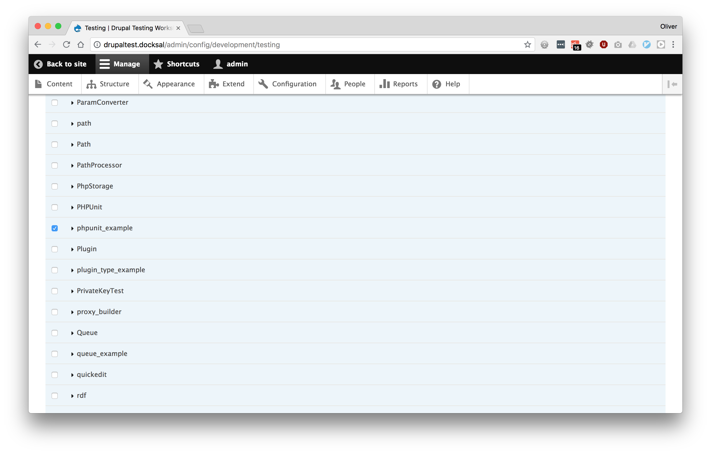

---


---

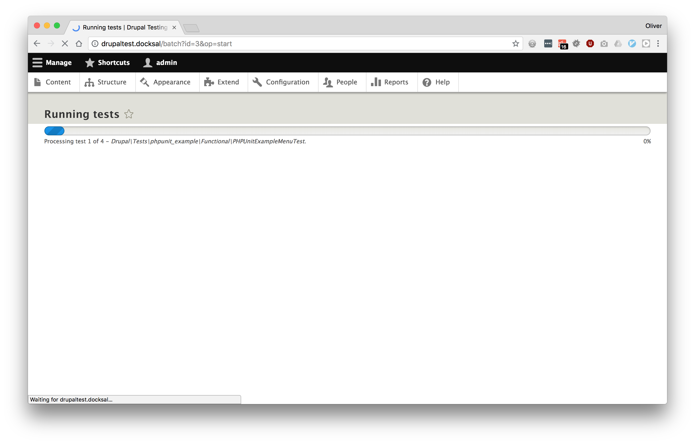

---

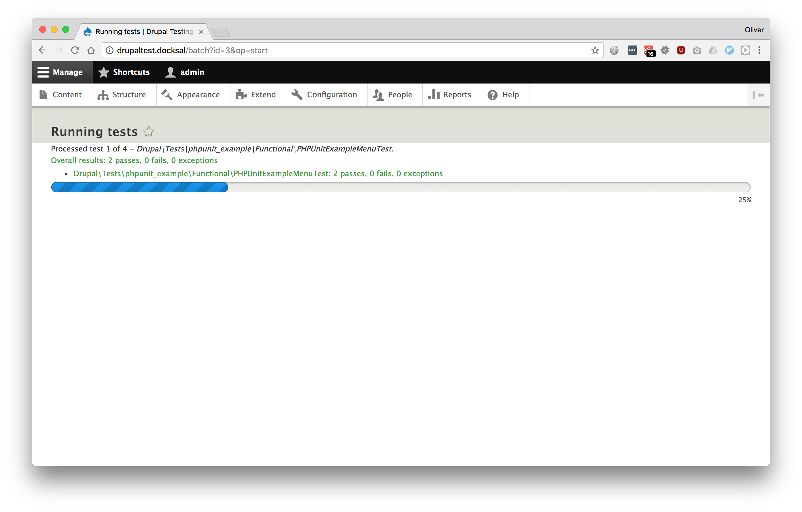

---


---

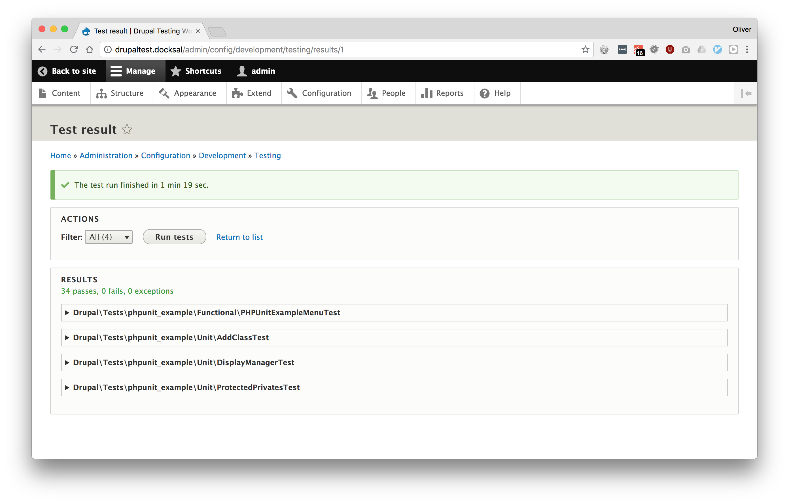

---


---

### _Option 2_
## Core script

---

```
$ php core/scripts/run-tests.sh

$ php core/scripts/run-tests.sh --module example

$ php core/scripts/run-tests.sh --class ExampleTest
```

---

### _Option 3_
## PHPUnit

---

## Prerequisite _(creating a phpunit.xml file)_

- Configures PHPUnit
- Needed to run some types of tests
- Ignored by Git by default
- Copy _core/phpunit.xml.dist_ to _core/phpunit.xml_
- Add and change as needed
  - `SIMPLETEST_BASE_URL`, `SIMPLETEST_DB`, `BROWSERTEST_OUTPUT_DIRECTORY`
  - `stopOnFailure="true"`

---

```
vendor/bin/phpunit \
-c core \
modules/contrib/examples/phpunit_example
```

---

```
cd core

../vendor/bin/phpunit \
../modules/contrib/examples/phpunit_example
```

---

```
--filter

--testsuite

--group

--colors

--stop-on-failure

--verbose --debug
```

---

# _Docksal_

```
fin addon install phpunit

fin phpunit modules/custom
```

^ Copies a stub phpunit.xml file or copies phpunit.xml.dist
Runs the phpunit command within the correct directory

---

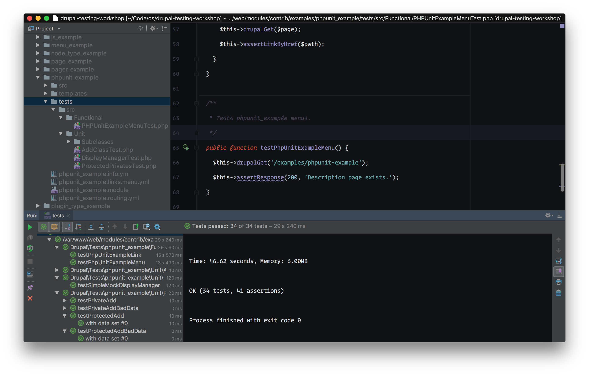

[.footer: opdavi.es/docksal-phpunit-phpstorm]

---

[.header: alignment(center)]

## _Test Driven_<br> Development

---

[.header: #53B0EB]

## Test Driven Development

- Write a test
- Test fails
- Write code
- Test passes
- Refactor
- Repeat

---

[.background-color: #FFFFFF]
[.footer: https://github.com/foundersandcoders/testing-tdd-intro]
[.footer-style: #2F2F2F]

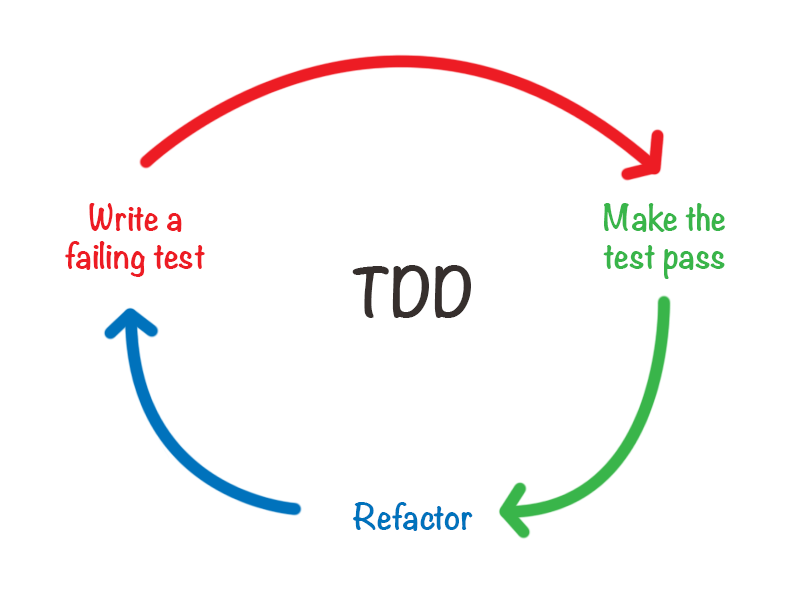

---

[.header: alignment(center)]

## Red, Green, Refactor

---

[.header: #53B0EB]

## Porting Modules to Drupal 8

- Make a new branch
- Add/update the tests
- Write code to make the tests pass
- Refactor
- Repeat

---

[.header: #53B0EB]

## How I Write Tests - "Outside In"

- Start with functional tests
- Drop down to integration or unit tests where needed
- Programming by wishful thinking
- Write comments first, then fill in the code
- Sometimes write assertions first

---

[.header: alignment(center)]

## [fit] _Building a new Drupal 8 Module with_
## [fit] test driven development

---

[.header: #53B0EB]

## Acceptance criteria

- As a site visitor
- I want to see a list of published articles at /blog
- Ordered by post date

---

[.header: #53B0EB]

## Tasks

- Ensure the blog page exists
- Ensure only published articles are shown
- Ensure the articles are shown in the correct order

---

[.header: #53B0EB]

## Implementation

- Use views module
- Do the mininum amount at each step, make no assumptions, let the tests guide us
- Start with functional test

---

### _Step 1_
## Create the module

---

```yml
# tdd_blog.info.yml

name: 'TDD Blog'
core: '8.x'
type: 'module'
```

---

### _Step 2_
## Ensure the blog page exists

---

```php
// tests/src/Functional/BlogPageTest.php

namespace Drupal\Tests\tdd_blog\Functional;

use Drupal\Tests\BrowserTestBase;

class BlogPageTest extends BrowserTestBase {

  protected static $modules = ['tdd_blog'];

  public function testBlogPageExists() {
    $this->drupalGet('/blog');

    $this->assertSession()->statusCodeEquals(200);
  }

}
```

---


```php, [.highlight: 3]
// tests/src/Functional/BlogPageTest.php

namespace Drupal\Tests\tdd_blog\Functional;

use Drupal\Tests\BrowserTestBase;

class BlogPageTest extends BrowserTestBase {

  protected static $modules = ['tdd_blog'];

  public function testBlogPageExists() {
    $this->drupalGet('/blog');

    $this->assertSession()->statusCodeEquals(200);
  }

}
```

---


```php, [.highlight: 5-7]
// tests/src/Functional/BlogPageTest.php

namespace Drupal\Tests\tdd_blog\Functional;

use Drupal\Tests\BrowserTestBase;

class BlogPageTest extends BrowserTestBase {

  protected static $modules = ['tdd_blog'];

  public function testBlogPageExists() {
    $this->drupalGet('/blog');

    $this->assertSession()->statusCodeEquals(200);
  }

}
```

---


```php, [.highlight: 9]
// tests/src/Functional/BlogPageTest.php

namespace Drupal\Tests\tdd_blog\Functional;

use Drupal\Tests\BrowserTestBase;

class BlogPageTest extends BrowserTestBase {

  protected static $modules = ['tdd_blog'];

  public function testBlogPageExists() {
    $this->drupalGet('/blog');

    $this->assertSession()->statusCodeEquals(200);
  }

}
```

---


```php, [.highlight: 11-15]
// tests/src/Functional/BlogPageTest.php

namespace Drupal\Tests\tdd_blog\Functional;

use Drupal\Tests\BrowserTestBase;

class BlogPageTest extends BrowserTestBase {

  protected static $modules = ['tdd_blog'];

  public function testBlogPageExists() {
    $this->drupalGet('/blog');

    $this->assertSession()->statusCodeEquals(200);
  }

}
```

---


```bash, [.highlight: 1]
docker@cli:/var/www/web$ ../vendor/bin/phpunit -c core modules/custom/tdd_blog
PHPUnit 6.5.8 by Sebastian Bergmann and contributors.

Testing modules/custom/tdd_blog
E                                                                   1 / 1 (100%)

Time: 19.31 seconds, Memory: 6.00MB

There was 1 error:

1) Drupal\Tests\tdd_blog\Functional\BlogPageTest::testBlogPageExists
Behat\Mink\Exception\ExpectationException: Current response status code is 404, but 200 expected.

/var/www/vendor/behat/mink/src/WebAssert.php:768
/var/www/vendor/behat/mink/src/WebAssert.php:130
/var/www/web/modules/custom/tdd_blog/tests/src/Functional/BlogPageTest.php:13

ERRORS!
Tests: 1, Assertions: 3, Errors: 1.
```

---


```bash, [.highlight: 4]
docker@cli:/var/www/web$ ../vendor/bin/phpunit -c core modules/custom/tdd_blog
PHPUnit 6.5.8 by Sebastian Bergmann and contributors.

Testing modules/custom/tdd_blog
E                                                                   1 / 1 (100%)

Time: 19.31 seconds, Memory: 6.00MB

There was 1 error:

1) Drupal\Tests\tdd_blog\Functional\BlogPageTest::testBlogPageExists
Behat\Mink\Exception\ExpectationException: Current response status code is 404, but 200 expected.

/var/www/vendor/behat/mink/src/WebAssert.php:768
/var/www/vendor/behat/mink/src/WebAssert.php:130
/var/www/web/modules/custom/tdd_blog/tests/src/Functional/BlogPageTest.php:13

ERRORS!
Tests: 1, Assertions: 3, Errors: 1.
```

---


```bash, [.highlight: 5-13]
docker@cli:/var/www/web$ ../vendor/bin/phpunit -c core modules/custom/tdd_blog
PHPUnit 6.5.8 by Sebastian Bergmann and contributors.

Testing modules/custom/tdd_blog
E                                                                   1 / 1 (100%)

Time: 19.31 seconds, Memory: 6.00MB

There was 1 error:

1) Drupal\Tests\tdd_blog\Functional\BlogPageTest::testBlogPageExists
Behat\Mink\Exception\ExpectationException: Current response status code is 404, but 200 expected.

/var/www/vendor/behat/mink/src/WebAssert.php:768
/var/www/vendor/behat/mink/src/WebAssert.php:130
/var/www/web/modules/custom/tdd_blog/tests/src/Functional/BlogPageTest.php:13

ERRORS!
Tests: 1, Assertions: 3, Errors: 1.
```

---


```bash, [.highlight: 14-16]
docker@cli:/var/www/web$ ../vendor/bin/phpunit -c core modules/custom/tdd_blog
PHPUnit 6.5.8 by Sebastian Bergmann and contributors.

Testing modules/custom/tdd_blog
E                                                                   1 / 1 (100%)

Time: 19.31 seconds, Memory: 6.00MB

There was 1 error:

1) Drupal\Tests\tdd_blog\Functional\BlogPageTest::testBlogPageExists
Behat\Mink\Exception\ExpectationException: Current response status code is 404, but 200 expected.

/var/www/vendor/behat/mink/src/WebAssert.php:768
/var/www/vendor/behat/mink/src/WebAssert.php:130
/var/www/web/modules/custom/tdd_blog/tests/src/Functional/BlogPageTest.php:13

ERRORS!
Tests: 1, Assertions: 3, Errors: 1.
```

---


```bash, [.highlight: 18-19]
docker@cli:/var/www/web$ ../vendor/bin/phpunit -c core modules/custom/tdd_blog
PHPUnit 6.5.8 by Sebastian Bergmann and contributors.

Testing modules/custom/tdd_blog
E                                                                   1 / 1 (100%)

Time: 19.31 seconds, Memory: 6.00MB

There was 1 error:

1) Drupal\Tests\tdd_blog\Functional\BlogPageTest::testBlogPageExists
Behat\Mink\Exception\ExpectationException: Current response status code is 404, but 200 expected.

/var/www/vendor/behat/mink/src/WebAssert.php:768
/var/www/vendor/behat/mink/src/WebAssert.php:130
/var/www/web/modules/custom/tdd_blog/tests/src/Functional/BlogPageTest.php:13

ERRORS!
Tests: 1, Assertions: 3, Errors: 1.
```

---

- _The view has not been created_
- Create a new view, page display
- Set the path
- Export the config
- Copy it into the module's `config/install` directory

---

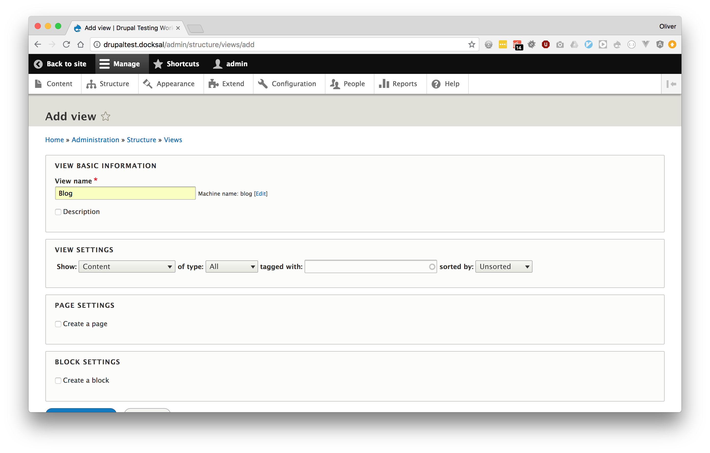

---


---

```
drush cex -y

cp ../config/default/views.view.blog.yml \
  modules/custom/tdd_blog/config/install
```

---

```diff
# views.view.blog.yml

- uuid: 84305edf-7aef-4109-bc93-e87f685fb678
langcode: en
status: true
dependencies:
  config:
    - node.type.article
  module:
    - node
    - user
- _core:
-   default_config_hash: iGZkqLWpwWNORq6_fy6v_Kn_KE4BjYHqj9vpgQsWJCs
id: blog
...
```

---

```[.highlight: 11-13]
docker@cli:/var/www/web$ ../vendor/bin/phpunit -c core modules/custom/tdd_blog
PHPUnit 6.5.8 by Sebastian Bergmann and contributors.

Testing modules/custom/tdd_blog
E                                                                   1 / 1 (100%)

Time: 16.02 seconds, Memory: 6.00MB

There was 1 error:

1) Drupal\Tests\tdd_blog\Functional\BlogPageTest::testBlogPageExists
Drupal\Core\Config\UnmetDependenciesException: Configuration objects provided by <em class="placeholder">tdd_blog</em>
have unmet dependencies: <em class="placeholder">views.view.blog (node.type.article, node, views)</em>

/var/www/web/core/lib/Drupal/Core/Config/UnmetDependenciesException.php:98
/var/www/web/core/lib/Drupal/Core/Config/ConfigInstaller.php:469
/var/www/web/core/lib/Drupal/Core/ProxyClass/Config/ConfigInstaller.php:132
/var/www/web/core/lib/Drupal/Core/Extension/ModuleInstaller.php:145
/var/www/web/core/lib/Drupal/Core/ProxyClass/Extension/ModuleInstaller.php:83
/var/www/web/core/lib/Drupal/Core/Test/FunctionalTestSetupTrait.php:437
/var/www/web/core/tests/Drupal/Tests/BrowserTestBase.php:1055
/var/www/web/core/tests/Drupal/Tests/BrowserTestBase.php:490

ERRORS!
Tests: 1, Assertions: 0, Errors: 1.
```

---


```yml,[.highlight: 1, 7-10]
# tdd_blog.info.yml

name: 'TDD Blog'
description: 'A demo module to show test driven module development.'
core: 8.x
type: module

dependencies:
  - 'drupal:node'
  - 'drupal:views'
```

---


```[.highlight: 10-13]
docker@cli:/var/www/web$ ../vendor/bin/phpunit -c core modules/custom/tdd_blog
PHPUnit 6.5.8 by Sebastian Bergmann and contributors.

Testing modules/custom/tdd_blog
E                                                                   1 / 1 (100%)

Time: 20 seconds, Memory: 6.00MB

There was 1 error:

1) Drupal\Tests\tdd_blog\Functional\BlogPageTest::testBlogPageExists
Drupal\Core\Config\UnmetDependenciesException: Configuration objects provided by <em class="placeholder">tdd_blog</em>
have unmet dependencies: <em class="placeholder">views.view.blog (node.type.article)</em>

/var/www/web/core/lib/Drupal/Core/Config/UnmetDependenciesException.php:98
/var/www/web/core/lib/Drupal/Core/Config/ConfigInstaller.php:469
/var/www/web/core/lib/Drupal/Core/ProxyClass/Config/ConfigInstaller.php:132
/var/www/web/core/lib/Drupal/Core/Extension/ModuleInstaller.php:145
/var/www/web/core/lib/Drupal/Core/ProxyClass/Extension/ModuleInstaller.php:83
/var/www/web/core/lib/Drupal/Core/Test/FunctionalTestSetupTrait.php:437
/var/www/web/core/tests/Drupal/Tests/BrowserTestBase.php:1055
/var/www/web/core/tests/Drupal/Tests/BrowserTestBase.php:490

ERRORS!
Tests: 1, Assertions: 0, Errors: 1.
```

---

- Add the article content type

---


```[.highlight: 5, 9]
docker@cli:/var/www/web$ ../vendor/bin/phpunit -c core modules/custom/tdd_blog
PHPUnit 6.5.8 by Sebastian Bergmann and contributors.

Testing modules/custom/tdd_blog
.                                                                   1 / 1 (100%)

Time: 23.36 seconds, Memory: 6.00MB

OK (1 test, 3 assertions)
```

---

[.build-lists: false]

## _Tasks_

- ~~Ensure the blog page exists~~
- Ensure only published articles are shown
- Ensure the articles are shown in the correct order

---

### _Step 3_
## Ensure only published articles are shown

---


```php
public function testOnlyPublishedArticlesAreShown() {
  // Given I have a mixture of published and unpublished articles,
  // as well as other types of content.

  // When I view the blog page.

  // I should only see the published articles.
}
```

---

### _Option 1_
## Functional tests

---


```php,[.highlight: 1, 4-8]
// modules/custom/tdd_blog/tests/src/Functional/BlogPageTest.php

public function testOnlyPublishedArticlesAreShown() {
  // Given I have a mixture of published and unpublished articles,
  // as well as other types of content.
  $node1 = $this->drupalCreateNode(['type' => 'page', 'status' => 1]);
  $node2 = $this->drupalCreateNode(['type' => 'article', 'status' => 1]);
  $node3 = $this->drupalCreateNode(['type' => 'article', 'status' => 0]);

  // When I view the blog page.
  $this->drupalGet('/blog');

  // I should only see the published articles.
  $assert = $this->assertSession();
  $assert->pageTextContains($node2->label());
  $assert->pageTextNotContains($node1->label());
  $assert->pageTextNotContains($node3->label());
}
```

^ Different ways to achieve this. This is taking the functional test approach.

---


```php,[.highlight: 10-12]
// modules/custom/tdd_blog/tests/src/Functional/BlogPageTest.php

public function testOnlyPublishedArticlesAreShown() {
  // Given I have a mixture of published and unpublished articles,
  // as well as other types of content.
  $node1 = $this->drupalCreateNode(['type' => 'page', 'status' => 1]);
  $node2 = $this->drupalCreateNode(['type' => 'article', 'status' => 1]);
  $node3 = $this->drupalCreateNode(['type' => 'article', 'status' => 0]);

  // When I view the blog page.
  $this->drupalGet('/blog');

  // I should only see the published articles.
  $assert = $this->assertSession();
  $assert->pageTextContains($node2->label());
  $assert->pageTextNotContains($node1->label());
  $assert->pageTextNotContains($node3->label());
}
```

---


```php, [.highlight: 13-17]
// modules/custom/tdd_blog/tests/src/Functional/BlogPageTest.php

public function testOnlyPublishedArticlesAreShown() {
  // Given I have a mixture of published and unpublished articles,
  // as well as other types of content.
  $node1 = $this->drupalCreateNode(['type' => 'page', 'status' => 1]);
  $node2 = $this->drupalCreateNode(['type' => 'article', 'status' => 1]);
  $node3 = $this->drupalCreateNode(['type' => 'article', 'status' => 0]);

  // When I view the blog page.
  $this->drupalGet('/blog');

  // I should only see the published articles.
  $assert = $this->assertSession();
  $assert->pageTextContains($node2->label());
  $assert->pageTextNotContains($node1->label());
  $assert->pageTextNotContains($node3->label());
}
```

---

### _Option 2_
## Kernel tests

---


```php
namespace Drupal\Tests\tdd_blog\Kernel;

use Drupal\KernelTests\Core\Entity\EntityKernelTestBase;
use Drupal\Tests\node\Traits\NodeCreationTrait;

class BlogPageTest extends EntityKernelTestBase {

  use NodeCreationTrait;

  public static $modules = ['node'];

  public function testOnlyPublishedArticlesAreShown() {
    $this->createNode(['type' => 'page', 'status' => 1]);
    $this->createNode(['type' => 'article', 'status' => 1]);
    $this->createNode(['type' => 'article', 'status' => 0]);
  }

}
```

^ Kernel test approach
Dropping down a level
No need for the brower, not asserting against HTML
Faster to run

---

```php, [.highlight: 1-6]
namespace Drupal\Tests\tdd_blog\Kernel;

use Drupal\KernelTests\Core\Entity\EntityKernelTestBase;
use Drupal\Tests\node\Traits\NodeCreationTrait;

class BlogPageTest extends EntityKernelTestBase {

  use NodeCreationTrait;

  public static $modules = ['node'];

  public function testOnlyPublishedArticlesAreShown() {
    $this->createNode(['type' => 'page', 'status' => 1]);
    $this->createNode(['type' => 'article', 'status' => 1]);
    $this->createNode(['type' => 'article', 'status' => 0]);
  }

}
```

---

```php, [.highlight: 8]
namespace Drupal\Tests\tdd_blog\Kernel;

use Drupal\KernelTests\Core\Entity\EntityKernelTestBase;
use Drupal\Tests\node\Traits\NodeCreationTrait;

class BlogPageTest extends EntityKernelTestBase {

  use NodeCreationTrait;

  public static $modules = ['node'];

  public function testOnlyPublishedArticlesAreShown() {
    $this->createNode(['type' => 'page', 'status' => 1]);
    $this->createNode(['type' => 'article', 'status' => 1]);
    $this->createNode(['type' => 'article', 'status' => 0]);
  }

}
```

---

```php, [.highlight: 12-16]
namespace Drupal\Tests\tdd_blog\Kernel;

use Drupal\KernelTests\Core\Entity\EntityKernelTestBase;
use Drupal\Tests\node\Traits\NodeCreationTrait;

class BlogPageTest extends EntityKernelTestBase {

  use NodeCreationTrait;

  public static $modules = ['node'];

  public function testOnlyPublishedArticlesAreShown() {
    $this->createNode(['type' => 'page', 'status' => 1]);
    $this->createNode(['type' => 'article', 'status' => 1]);
    $this->createNode(['type' => 'article', 'status' => 0]);
  }

}
```

---


```[.highlight: 9-16]
docker@cli:/var/www/web$ ../vendor/bin/phpunit -c core modules/custom/tdd_blog/tests/src/Kernel/
PHPUnit 6.5.8 by Sebastian Bergmann and contributors.

Testing modules/custom/tdd_blog/tests/src/Kernel/
E                                                                   1 / 1 (100%)

Time: 6.22 seconds, Memory: 6.00MB

There was 1 error:

1) Drupal\Tests\tdd_blog\Kernel\BlogPageTest::testOnlyPublishedArticlesAreShown
Error: Call to a member function id() on boolean

/var/www/web/core/modules/filter/filter.module:212
/var/www/web/core/modules/node/tests/src/Traits/NodeCreationTrait.php:73
/var/www/web/modules/custom/tdd_blog/tests/src/Kernel/BlogPageTest.php:13

ERRORS!
Tests: 1, Assertions: 2, Errors: 1.
```

---


```php, [.highlight: 2]
public function testOnlyPublishedArticlesAreShown() {
  $this->installConfig(['filter']);

  $this->createNode(['type' => 'page', 'status' => 1]);
  $this->createNode(['type' => 'article', 'status' => 1]);
  $this->createNode(['type' => 'article', 'status' => 0]);
}
```

---


```php, [.highlight: 8]
public function testOnlyPublishedArticlesAreShown() {
  $this->installConfig(['filter']);

  $this->createNode(['type' => 'page', 'status' => 1]);
  $this->createNode(['type' => 'article', 'status' => 1]);
  $this->createNode(['type' => 'article', 'status' => 0]);

  $results = views_get_view_result('blog');
}
```

---


```php, [.highlight: 3]
...

public static $modules = ['node', 'tdd_blog', 'views'];

public function testOnlyPublishedArticlesAreShown() {
  $this->installConfig(['filter', 'tdd_blog']);

  $this->createNode(['type' => 'page', 'status' => 1]);
  $this->createNode(['type' => 'article', 'status' => 1]);
  $this->createNode(['type' => 'article', 'status' => 0]);

  $results = views_get_view_result('blog');

  $this->assertCount(1, $results);
  $this->assertEquals(2, $results[0]->_entity->id());
}
```

---


```php, [.highlight: 6]
...

public static $modules = ['node', 'tdd_blog', 'views'];

public function testOnlyPublishedArticlesAreShown() {
  $this->installConfig(['filter', 'tdd_blog']);

  $this->createNode(['type' => 'page', 'status' => 1]);
  $this->createNode(['type' => 'article', 'status' => 1]);
  $this->createNode(['type' => 'article', 'status' => 0]);

  $results = views_get_view_result('blog');

  $this->assertCount(1, $results);
  $this->assertEquals(2, $results[0]->_entity->id());
}
```

---


```php, [.highlight: 8-15]
...

public static $modules = ['node', 'tdd_blog', 'views'];

public function testOnlyPublishedArticlesAreShown() {
  $this->installConfig(['filter', 'tdd_blog']);

  $this->createNode(['type' => 'page', 'status' => 1]);
  $this->createNode(['type' => 'article', 'status' => 1]);
  $this->createNode(['type' => 'article', 'status' => 0]);

  $results = views_get_view_result('blog');

  $this->assertCount(1, $results);
  $this->assertEquals(2, $results[0]->_entity->id());
}
```

^ Assert
Should only be one result, should be node 2
Node IDs are reset on each test method

---


```
PHPUnit 6.5.8 by Sebastian Bergmann and contributors.

Testing web/modules/custom/tdd_blog/tests/src/Kernel
F                                                                   1 / 1 (100%)

Time: 2.16 seconds, Memory: 6.00MB

There was 1 failure:

1) Drupal\Tests\tdd_blog\Kernel\BlogPageTest::testOnlyPublishedArticlesAreShown
Failed asserting that actual size 2 matches expected size 1.

/Users/opdavies/Code/drupal-testing-workshop/web/modules/custom/tdd_blog/tests/src/Kernel/BlogPageTest.php:23

FAILURES!
Tests: 1, Assertions: 4, Failures: 1.
```

---


```[.highlight: 8-13]
PHPUnit 6.5.8 by Sebastian Bergmann and contributors.

Testing web/modules/custom/tdd_blog/tests/src/Kernel
F                                                                   1 / 1 (100%)

Time: 2.16 seconds, Memory: 6.00MB

There was 1 failure:

1) Drupal\Tests\tdd_blog\Kernel\BlogPageTest::testOnlyPublishedArticlesAreShown
Failed asserting that actual size 2 matches expected size 1.

/Users/opdavies/Code/drupal-testing-workshop/web/modules/custom/tdd_blog/tests/src/Kernel/BlogPageTest.php:23

FAILURES!
Tests: 1, Assertions: 4, Failures: 1.
```

---


---

>- _There is no content type filter on the view_
- Add the filter
- Re-export and save the view

---


---

```[.highlight: 3-8]
PHPUnit 6.5.8 by Sebastian Bergmann and contributors.

Testing web/modules/custom/tdd_blog/tests/src/Kernel
.                                                                   1 / 1 (100%)

Time: 2.02 seconds, Memory: 6.00MB

OK (1 test, 6 assertions)
```

---

[.build-lists: false]

## _Tasks_

- ~~Ensure the blog page exists~~
- ~~Ensure only published articles are shown~~
- Ensure the articles are shown in the correct order

---

### _Step 4_
## Ensure the articles are ordered by date

---


```php
// modules/custom/tdd_blog/tests/src/Kernel/BlogPageTest.php

public function testArticlesAreOrderedByDate() {
  // Given that I have numerous articles with different post dates.

  // When I go to the blog page.

  // The articles are ordered by post date.
}
```

---


```php, [.highlight: 4-9]
// modules/custom/tdd_blog/tests/src/Kernel/BlogPageTest.php

public function testArticlesAreOrderedByDate() {
  // Given that I have numerous articles with different post dates.
  $this->createNode(['type' => 'article', 'created' => (new \DateTime('+1 day'))->getTimestamp()]);
  $this->createNode(['type' => 'article', 'created' => (new \DateTime('+1 month'))->getTimestamp()]);
  $this->createNode(['type' => 'article', 'created' => (new \DateTime('+3 days'))->getTimestamp()]);
  $this->createNode(['type' => 'article', 'created' => (new \DateTime('+1 hour'))->getTimestamp()]);

  // When I go to the blog page.

  // The articles are ordered by post date.
}
```

---

```php
$this->createNode([
  'type' => 'article',
  'created' => (new \DateTime())->modify('+1 day')->getTimestamp(),
]);
```

^ Array of default values

---


```php, [.highlight: 10-11]
// modules/custom/tdd_blog/tests/src/Kernel/BlogPageTest.php

public function testArticlesAreOrderedByDate() {
  // Given that I have numerous articles with different post dates.
  $this->createNode(['type' => 'article', 'created' => (new \DateTime())->modify('+1 day')->getTimestamp()]);
  $this->createNode(['type' => 'article', 'created' => (new \DateTime())->modify('+1 month')->getTimestamp()]);
  $this->createNode(['type' => 'article', 'created' => (new \DateTime())->modify('+3 days')->getTimestamp()]);
  $this->createNode(['type' => 'article', 'created' => (new \DateTime())->modify('+1 hour')->getTimestamp()]);

  // When I go to the blog page.
  $results = views_get_view_result('blog');

  // The articles are ordered by post date.
}
```

---

```php, [.highlight:10-15]
// modules/custom/tdd_blog/tests/src/Kernel/BlogPageTest.php

public function testArticlesAreOrderedByDate() {
  // Given that I have numerous articles with different post dates.
  $this->createNode(['type' => 'article', 'created' => (new \DateTime())->modify('+1 day')->getTimestamp()]);
  $this->createNode(['type' => 'article', 'created' => (new \DateTime())->modify('+1 month')->getTimestamp()]);
  $this->createNode(['type' => 'article', 'created' => (new \DateTime())->modify('+3 days')->getTimestamp()]);
  $this->createNode(['type' => 'article', 'created' => (new \DateTime())->modify('+1 hour')->getTimestamp()]);

  // When I go to the blog page.
  $results = views_get_view_result('blog');

  $nids = array_map(function(ResultRow $result) {
    return $result->_entity->id();
  }, $results);

  // The articles are ordered by post date.
}
```

---


```php, [.highlight: 5-9, 17-18]
// modules/custom/tdd_blog/tests/src/Kernel/BlogPageTest.php

public function testArticlesAreOrderedByDate() {
  // Given that I have numerous articles with different post dates.
  $this->createNode(['type' => 'article', 'created' => (new \DateTime())->modify('+1 day')->getTimestamp()]);
  $this->createNode(['type' => 'article', 'created' => (new \DateTime())->modify('+1 month')->getTimestamp()]);
  $this->createNode(['type' => 'article', 'created' => (new \DateTime())->modify('+3 days')->getTimestamp()]);
  $this->createNode(['type' => 'article', 'created' => (new \DateTime())->modify('+1 hour')->getTimestamp()]);

  // When I go to the blog page.
  $results = views_get_view_result('blog');

  $nids = array_map(function(ResultRow $result) {
    return $result->_entity->id();
  }, $results);

  // The articles are ordered by post date.
  $this->assertEquals([4, 1, 3, 2], $nids);
}
```

---


```
PHPUnit 6.5.8 by Sebastian Bergmann and contributors.

Testing web/modules/custom/tdd_blog/tests/src/Kernel
F                                                                   1 / 1 (100%)

Time: 1.42 seconds, Memory: 6.00MB

There was 1 failure:

1) Drupal\Tests\tdd_blog\Kernel\BlogPageTest::testArticlesAreOrderedByDate
Failed asserting that two arrays are equal.
--- Expected
+++ Actual
@@ @@
 Array (
-    0 => 4
-    1 => 1
-    2 => 3
-    3 => 2
+    0 => '1'
+    1 => '2'
+    2 => '3'
+    3 => '4'

/Users/opdavies/Code/drupal-testing-workshop/web/core/tests/Drupal/KernelTests/KernelTestBase.php:1114
/Users/opdavies/Code/drupal-testing-workshop/web/modules/custom/tdd_blog/tests/src/Kernel/BlogPageTest.php:43

FAILURES!
Tests: 1, Assertions: 4, Failures: 1.
```

---

[.text: comic sans]

```[.highlight: 8-26]
PHPUnit 6.5.8 by Sebastian Bergmann and contributors.

Testing web/modules/custom/tdd_blog/tests/src/Kernel
F                                                                   1 / 1 (100%)

Time: 1.42 seconds, Memory: 6.00MB

There was 1 failure:

1) Drupal\Tests\tdd_blog\Kernel\BlogPageTest::testArticlesAreOrderedByDate
Failed asserting that two arrays are equal.
--- Expected
+++ Actual
@@ @@
 Array (
-    0 => 4
-    1 => 1
-    2 => 3
-    3 => 2
+    0 => '1'
+    1 => '2'
+    2 => '3'
+    3 => '4'

/Users/opdavies/Code/drupal-testing-workshop/web/core/tests/Drupal/KernelTests/KernelTestBase.php:1114
/Users/opdavies/Code/drupal-testing-workshop/web/modules/custom/tdd_blog/tests/src/Kernel/BlogPageTest.php:43

FAILURES!
Tests: 1, Assertions: 4, Failures: 1.
```

---


---

- _There is no sort order defined on the view_
- Add the sort order
- Re-export the view

---

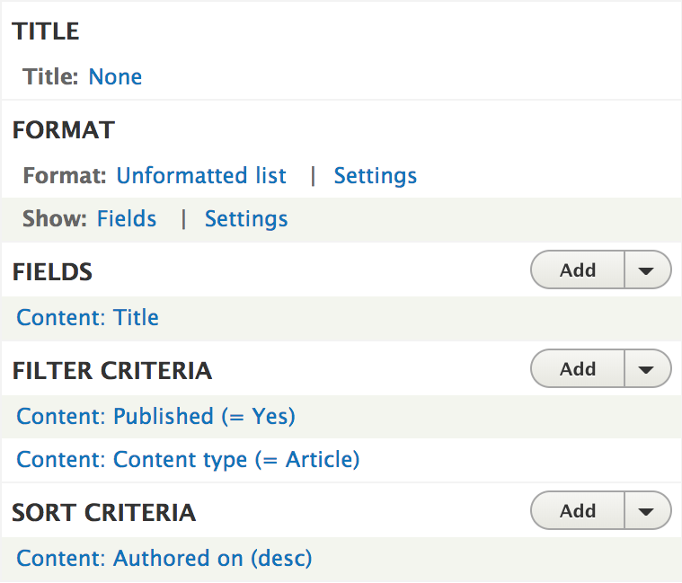

---

```[.highlight:3-8]
PHPUnit 6.5.8 by Sebastian Bergmann and contributors.

Testing web/modules/custom/tdd_blog/tests/src/Kernel
.                                                                   1 / 1 (100%)

Time: 1.74 seconds, Memory: 6.00MB

OK (1 test, 5 assertions)
```

---

[.build-lists: false]

## _Tasks_

- ~~Ensure the blog page exists~~
- ~~Ensure only published articles are shown~~
- ~~Ensure the articles are shown in the correct order~~

---

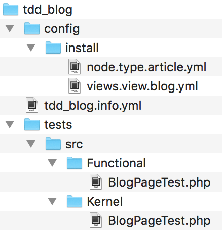

---

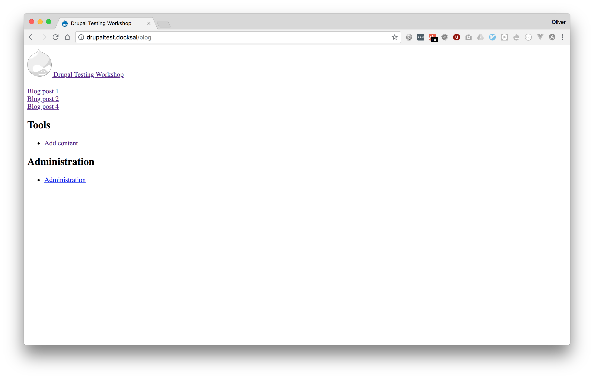

^ Using the minimal installation profile
Post 3 is unpublished

---


---

[.header: alignment(center)]

## Take Aways

---

- Testing has made me a _better developer_
- Testing can produce _better quality code_
- Use the _right type of test_ for the right situation
- Use the _right base class_, use available _traits_
- Writing tests is an _investment_
- OK to _start small_, introduce tests gradually
- Easier to _refactor_
- Tests can pass, but things can _still be broken_. Tests only report on what they cover.

^ Made me think about how I'm going to do something more starting to do it
Less cruft, only write code that serves a purpose
Spending time writing tests pays dividends later on
Start by introducing tests for new features or regression tests when fixing bugs
If you know things pass, then you can refactor code knowing if something is broken
Manual testing is still important

---

[.header: alignment(center)]

## [fit] _Having tests does not mean_
## [fit] there will be no bugs

^ Only means that the tests you wrote are passing
You may not have included a certain use case
Be sure to test in the UI!
We can test what happens in a test when a user has a permission, but in our site we still need to assign the permission to a role and the role to a user.

---

### _You might be testing the wrong thing_
## Maybe it doesn't work the way you think it does

---

### _Have you written enough assertions?_
## Have you only covered the 'happy path' scenarios?

^ If your tests are passing but there is an issue, maybe you haven't written enough assertions
Be sure to check for the negative use cases too
Check that something is not included as well as what should be included
What if you pass in an incorrect value?

---

### _Other modules can affect things_
## Tests may pass, but fail when other modules are enabled

---

[.header: alignment(center)]

## [fit] _Testing may add time now_
## [fit] but save more time in the future

---

[.header: alignment(center)]

## [fit] _How do you get quicker at writing tests?_
# [fit] By writing more tests

^ Practice makes perfect
Become more familar with and knowledge of recurring errors
Find better practices and approaches. Different base classes? Less setup steps. Less time, more productive.

---

## _Start small_
## Some tests are better than no tests

---


[.background-color: #FFFFFF]


---

[.background-color: #FFFFFF]


---

[.text: alignment(center)]

> 

---

[.header: alignment(center)]

# Questions?

---

[.header: alignment(center)]

# Thanks
### _@opdavies_
### _oliverdavies.uk_
