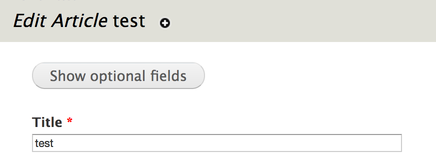
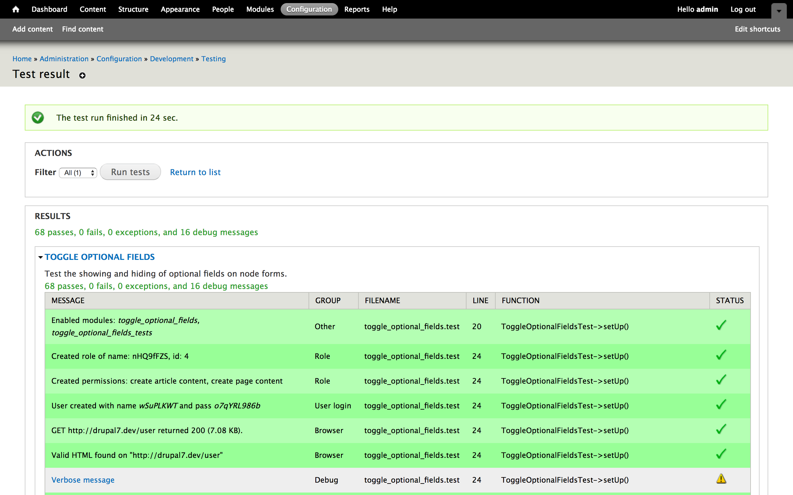

autoscale: true
build-lists: true
theme: next, 9


# [fit] TDD - Test <br>Driven Drupal

---

- PHP code
- Mixture of D7 and D8
- SimpleTest (D7)
- PHPUnit (D8)

---

[.build-lists: false]

- Senior Developer at Microserve
- Contrib module maintainer
- Occasional core contributor
- Sticker collector and elePHPant herder
- @opdavies
- oliverdavies.uk


---


^ First experience of testing with a real module.
Used on 11,046 sites (84 D5, 7,094 D6, 3,868 D7).
Currently used on 28,398 (10 D5, 2,207 D6, 23,206 D7, 2,975 D8).
Tests crucial to preventing regressions when adding new features or fixing bugs.

---

## Why Test?

- Catch bugs earlier
- Piece of mind
- Prevent regressions
- Write less code
- Documentation
- Drupal core requirement - <https://www.drupal.org/core/gates#testing>
- More important with regular D8 releases

^ Dave Liddament talk - better and cheaper to catch bugs earlier (e.g. whilst developing rather than after it's been released)
Refer to tests when writing implementation code
ONO merge conflict

---

## Why Not Test?

- Don't know how
- No time/budget to write tests

^ "I'd love to write tests, but I don't have the time to learn."

---

## Core Testing Gate

New features should be accompanied by automated tests.

If the feature does not have an implementation, provide a test implementation.

Bug fixes should be accompanied by changes to a test (either modifying an existing test case or adding a new one) that demonstrate the bug.

[.footer: https://www.drupal.org/core/gates#testing]

---

## Testing in Drupal - SimpleTest

- Based on <http://www.SimpleTest.org>
- In D7 core
- `*.test` files
- All test classes in one file

---

## Testing in Drupal - PHPUnit

- Used in other PHP projects (e.g. Symfony, Laravel)
- In D8 core, but not default
- `*.php` files
- One test class per file

---

## The PHPUnit Initiative

- <https://www.drupal.org/node/2807237>
- D8 core tests to change to PHPUnit
- Deprecate SimpleTest, remove in D9
- "A big chunk of old tests" converted on Feb 21st

---

## The PHPUnit Initiative

As part of the PHPUnit initiative __a considerable part of Simpletests will be converted to PHPUnit based browser tests on February 21st 2017__. A backwards compatibility layer has been implemented so that many Simpletests can be converted by just using the new BrowserTestBase base class and moving the test file. There is also a script to automatically convert test files in the conversion issue.

__Developers are encouraged to use BrowserTestBase instead of Simpletest as of Drupal 8.3.0__, but both test systems are fully supported during the Drupal 8 release cycle.

The timeline for the deprecation of Simpletest's WebTestBase is under discussion.

[.footer: https://groups.drupal.org/node/516229]

---

## Types of Tests
### Unit Tests

- `UnitTestCase`
- Tests PHP logic
- No database interaction
- Fast to run

---

## Types of Tests
### Unit Tests

Pros:

- Verify individual parts
- Quickly find problems in code
- Fast execution
- No system setup for the test run

---

## Types of Tests
### Unit Tests

Cons:

- Rewrite on every refactoring
- Complicated mocking
- No guarantee that the whole system actually works

---

## Types of Tests
### Kernel Tests

- Kernel tests are integration tests that test on components. You can install modules.
- `KernelTestBase`

[.footer: https://www.drupal.org/docs/8/testing/types-of-tests-in-drupal-8]

---

## Types of Tests
### Kernel Tests

Pros:

- Verify that components actually work together
- Somewhat easy to locate bugs

---

## Types of Tests
### Kernel Tests

Cons:

- Slower execution
- System setup required
- No guarantee that end user features actually work

---


## Types of Tests
### Web/Functional/FunctionalJavascript Tests

- `DrupalWebTestCase` (D7)
- `WebTestBase`, `BrowserTestBase`, `JavascriptTestBase` (D8)
- Tests functionality
- Interacts with database
- Slower to run
- With/without JavaScript (D8)

^ - Use JavascriptTestBase when you need to test how the system works for a user with Javascript enabled.

---

## Test Driven Development (TDD)

- Write a test, see it fail
- Write code until test passes
- Repeat
- Refactor when tests are green


[.footer: http://www.agilenutshell.com/assets/test-driven-development/tdd-circle-of-life.png]

^ "Grab for green."
Not the only way
Write code beforehand and test afterwards
Write code first, comment out/reset branch, then TDD

---

## Porting Modules to Drupal 8

- Make a new branch 
  `git checkout --orphan 8.x-1.x`
- Add/update the tests
- Write code to make the tests pass
- Refactor
- Repeat

---

## Writing Tests (SimpleTest)

---

[.hide-footer]

```ini
# example.info

name = Example
core = 7.x
files[] = example.test
```

---

[.hide-footer]

```php
// example.test

class ExampleTestCase extends DrupalWebTestCase {

  public static function getInfo() {
    return array(
      'name' => 'Example tests',
      'description' => 'Web tests for the example module.',
      'group' => 'Example',
    );
  }

}
```

---

[.hide-footer]

```php
class ExampleTestCase extends DrupalWebTestCase {

  ...

  public function testSomething {
    $this->assertTrue(TRUE);
  }

}
```

---

## Writing Tests (PHPUnit)

- No need to load test classes expicitly.
- Add classes into `tests/src` directory.
- Extend `BrowserTestBase`.
- No `getInfo` method.

^ Classes get autoloaded PSR-4

---

[.hide-footer]

## Creating the World

```php
public function setUp() {
  // Enable any other required modules.
  parent::setUp(['foo', 'bar']);

  // Anything else we need to do.
}
```

---

[.hide-footer]

## Creating the World

```php
$this->drupalCreateUser();

$this->drupalLogin();

$this->drupalCreateNode();

$this->drupalLogout();
```

---

## Assertions

- `assertTrue`
- `assertFalse`
- `assertNull`
- `assertNotNull`
- `assertEqual`
  `assertEquals`

---

## Assertions

- `assertRaw`
- `assertResponse`
  `assertSession()->statusCodeEquals()`
- `assertField`
- `assertFieldById`
- `assertTitle`

---

## [fit] Running Tests

---

## SimpleTest UI

---


---


---


---


---

## Running SimpleTest From The Command Line

[.hide-footer]

```bash
# Drupal 7
$ php scripts/run-tests.sh

# Drupal 8
$ php core/scripts/run-tests.sh
```

---

[.hide-footer]

## Running SimpleTest From The Command Line

```bash
--color

--verbose

--all

--module

--class

--file
```

---

[.hide-footer]

## Running PHPUnit From The Command Line

```bash
$ vendor/bin/phpunit

$ vendor/bin/phpunit [directory]

$ vendor/bin/phpunit --filter [method]
```

---

## Example: Collection Class

---

## Collection Class

- <http://dgo.to/collection_class>
- Adds a `Collection` class, based on Laravel’s
- Provides helper methods for array methods
- Drupal 7, uses xautoload

^ xautoload gives PSR-4 namespaces and autoloading similar to Drupal 8.

---

[.hide-footer]

```php
$collection = collect([1, 2, 3, 4, 5]);

// Returns all items.
$collection->all();

// Counts the number of items.
$collection->count();

// Returns the array keys.
$collection->keys();
```

---

[.hide-footer]

```php
namespace Drupal\collection_class;

class Collection implements \Countable, \IteratorAggregate {
  private $items;

  public function __construct($items = array()) {
    $this->items = is_array($items) ? $items
      : $this->getArrayableItems($items);
  }

  public function __toString() {
    return $this->toJson();
  }

  ...
```

---

[.hide-footer]

```php
public function all() {
  return $this->items;
}

public function count() {
  return count($this->items);
}


public function isEmpty() {
  return empty($this->items);
}

public function first() {
  return array_shift($this->items);
}
```

---

[.hide-footer]

## Testing

```php
public function setUp() {
  $this->firstCollection = collect(['foo', 'bar', 'baz']);

  $this->secondCollection = collect([
      array('title' => 'Foo', 'status' => 1),
      array('title' => 'Bar', 'status' => 0),
      array('title' => 'Baz', 'status' => 1)
  ]);

  parent::setUp();
}
```

---

[.hide-footer]

## Testing

```php
public function testCollectFunction() {
  $this->assertEqual(
    get_class($this->firstCollection),
    'Drupal\collection_class\Collection'
  );
}
```

---

[.hide-footer]

## Testing

```php
public function testAll() {
  $this->assertEqual(
    array('foo', 'bar', 'baz'),
    $this->firstCollection->all()
  );
}
```

---

[.hide-footer]

## Testing

```php
public function testCount() {
  $this->assertEqual(
    3,
    $this->firstCollection->count()
  );
}
```

---

[.hide-footer]

## Testing

```php
public function testMerge() {
  $first = collect(array('a', 'b', 'c'));
  $second = collect(array('d', 'e', 'f'));

  $this->assertEqual(
    array('a', 'b', 'c', 'd', 'e', 'f'),
    $first->merge($second)->all()
  );
}
```

---


---


---

[.hide-footer]

## Example: Toggle Optional Fields

---

## Toggle Optional Fields

- <http://dgo.to/toggle_optional_fields>
- Adds a button to toggle optional fields on node forms using form alters
- Possible to override using an custom alter hook
- Uses unit and web tests



---

[.hide-footer]

## Example

```php
// Looping through available form elements...

// Only affect fields.
if (!toggle_optional_fields_element_is_field($element_name)) {
  return;
}

$element = &$form[$element_name];

if (isset($overridden_fields[$element_name])) {
  return $element['#access'] = $overridden_fields[$element_name];
}

// If the field is not required, disallow access to hide it.
if (isset($element[LANGUAGE_NONE][0]['#required'])) {
  return $element['#access'] = !empty($element[LANGUAGE_NONE][0]['#required']);
}
```

---

## What to Test?

- **Functional:** Are the correct fields shown and hidden?
- **Unit:** Is the field name check returning correct results?

---

## Unit Tests

[.hide-footer]

```php
// Returns TRUE or FALSE to indicate if this is a field.

function toggle_optional_fields_element_is_field($name) {
  if (in_array($name, array('body', 'language'))) {
    return TRUE;
  }

  return substr($name, 0, 6) == 'field_';
}
```

---

[.hide-footer]

## Unit Tests

```php
$this->assertTrue(
  toggle_optional_fields_element_is_field('field_tags')
);

$this->assertTrue(
  toggle_optional_fields_element_is_field('body')
);

$this->assertFalse(
  toggle_optional_fields_element_is_field('title')
);
```

---


---

[.hide-footer]

## Web Tests

```php
public function setUp() {
  parent::setUp();

  $this->drupalLogin(
    $this->drupalCreateUser(array(
      'create article content',
      'create page content'
    ));
  );

  // Enable toggling on article node forms.
  variable_set('toggle_optional_fields_node_types', array('article'));

  $this->refreshVariables();
}
```

---

[.hide-footer]

## Custom Assertions

```php
private function assertTagsFieldNotHidden() {
  $this->assertFieldByName(
    'field_tags[und]',
    NULL,
    t('Tags field visible.')
  );
}
```

---

## Testing Hidden Fields

[.hide-footer]

```php
public function testFieldsHiddenByDefault() {
  variable_set('toggle_optional_fields_hide_by_default', TRUE);

  $this->refreshVariables();

  $this->drupalGet('node/add/article');

  $this->assertShowOptionalFieldsButtonFound();
  $this->assertHideOptionalFieldsButtonNotFound();
  $this->assertTagsFieldHidden();

  ...
```

---

[.hide-footer]

## Testing Hidden Fields

```php
  ...

  $this->drupalPost(
    'node/add/article',
    array(),
    t('Show optional fields')
  );

  $this->assertHideOptionalFieldsButtonFound();
  $this->assertShowOptionalFieldsButtonNotFound();
  $this->assertTagsFieldNotHidden();
}
```

---



---


---

## [fit] Building a new <br>D8 module <br>with TDD

---

As a site visitor

I want to see a list of all published pages at `/pages`

Ordered alphabetically by title.

---

```yml
# tdd_dublin.info.yml

name: DrupalCamp Dublin test
core: 8.x
type: module
```

---

```php
// tests/src/Functional/ListingPageTest.php

class ListingPageTest extends BrowserTestBase {

  protected static $modules = ['tdd_dublin'];

  public function testListingPageExists() {
    $this->drupalGet('pages');

    $this->assertSession()->statusCodeEquals(200);
  }
}
```

---

```
docker@cli:/var/www/core$ ../vendor/bin/phpunit ../modules/tdd_dublin/tests
PHPUnit 4.8.36 by Sebastian Bergmann and contributors.

Testing ../modules/tdd_dublin/tests/
E

Time: 25.94 seconds, Memory: 6.00MB

There was 1 error:

1) PageListTest::testListingPage
Behat\Mink\Exception\ExpectationException: Current response status code is 404,
but 200 expected.

/var/www/vendor/behat/mink/src/WebAssert.php:770
/var/www/vendor/behat/mink/src/WebAssert.php:130
/var/www/modules/tdd_dublin/tests/src/PageListTest.php:11
```

---

- Add the view.
- Copy the config into `config/install`.

---

```
docker@cli:/var/www/core$ ../vendor/bin/phpunit ../modules/tdd_dublin/tests
PHPUnit 4.8.36 by Sebastian Bergmann and contributors.

Testing ../modules/tdd_dublin/tests/
E

Time: 19.07 seconds, Memory: 6.00MB

There was 1 error:

1) PageListTest::testListingPage
Drupal\Core\Config\UnmetDependenciesException:
Configuration objects provided by <em class="placeholder">tdd_dublin</em>
have unmet dependencies:
<em class="placeholder">node.type.page (node),
views.view.pages (node, views)</em>
```

---

```yml
name: DrupalCamp Dublin tests
core: 8.x
type: module

dependencies:
  - drupal:node
  - drupal:views
```

---

```
docker@cli:/var/www/core$ ../vendor/bin/phpunit ../modules/tdd_dublin/tests
PHPUnit 4.8.36 by Sebastian Bergmann and contributors.

Testing ../modules/tdd_dublin/tests/
.

Time: 29.58 seconds, Memory: 6.00MB

OK (1 test, 1 assertion)
```

---

```php
public function testOnlyPublishedPagesAreShown() {
  // Given I have a mixture of published and unpublished pages,
  // as well as other types of content.

  // When I view the pages list.

  // I should only see the published pages.
}
```

---

```php
public function testOnlyPublishedPagesAreShown() {
  $this->drupalCreateContentType(['type' => 'article']);

  $this->drupalCreateNode(['type' => 'page', 'status' => TRUE]);

  $this->drupalCreateNode(['type' => 'article']);

  $this->drupalCreateNode(['type' => 'page', 'status' => FALSE]);

  // When I view the pages list.

  // I should only see the published pages.
}
```

---

```php
public function testOnlyPublishedPagesAreShown() {
  ...

  $results = views_get_view_result('pages');

  $nids = collect($results)->pluck('nid')->all();
  // [1, 3]

  // I should only see the published pages.
}
```

---

```php
public function testOnlyPublishedPagesAreShown() {
  ...

  $results = views_get_view_result('pages');

  $nids = collect($results)->pluck('nid')->all();
  // [1, 3]

  $this->assertEquals([1], $nids);
}
```

---

```
docker@cli:/var/www/core$ ../vendor/bin/phpunit ../modules/tdd_dublin/tests
--filter=testOnlyPublishedPagesAreShown
PHPUnit 4.8.36 by Sebastian Bergmann and contributors.

Testing ../modules/tdd_dublin/tests
F

Time: 26.4 seconds, Memory: 6.00MB

There was 1 failure:
```

---

```
1) PageListTest::testOnlyPublishedPagesAreShown
Failed asserting that two arrays are equal.
--- Expected
+++ Actual
@@ @@
 Array (
-    0 => 1
+    0 => '1'
+    1 => '3'
 )

/var/www/core/tests/Drupal/Tests/BrowserTestBase.php:1240
/var/www/modules/tdd_dublin/tests/src/PageListTest.php:25

FAILURES!
Tests: 1, Assertions: 3, Failures: 1.
```

---

[.build-lists: false]

- Edit the view
- Add the status filter
- Update the module config

---

```
docker@cli:/var/www/core$ ../vendor/bin/phpunit ../modules/tdd_dublin/tests
--filter=testOnlyPublishedPagesAreShown
PHPUnit 4.8.36 by Sebastian Bergmann and contributors.

Testing ../modules/tdd_dublin/tests
.

Time: 26.53 seconds, Memory: 6.00MB

OK (1 test, 3 assertions)
```

---

```php
public function testPagesAreOrderedAlphabetically() {
  // Given I have multiple pages with different titles.

  // When I view the pages list.

  // I see the pages in the correct order.
}
```

---

```php
public function testPagesAreOrderedAlphabetically() {
  $this->drupalCreateNode(['title' => 'Page A']);
  $this->drupalCreateNode(['title' => 'Page D']);
  $this->drupalCreateNode(['title' => 'Page B']);
  $this->drupalCreateNode(['title' => 'Page C']);

  $results = views_get_view_result('pages');

  $nids = collect($results)->pluck('nid')->all();

  $this->assertEquals([1, 3, 4, 2], $nids);
}
```

---

```
docker@cli:/var/www/core$ ../vendor/bin/phpunit ../modules/tdd_dublin/tests 
-filter=testPagesAreOrderedAlphabetically
PHPUnit 4.8.36 by Sebastian Bergmann and contributors.

Testing ../modules/tdd_dublin/tests
F

Time: 28.03 seconds, Memory: 6.00MB

There was 1 failure:
```

---

```
1) PageListTest::testPagesAreOrderedAlphabetically
Failed asserting that two arrays are equal.
--- Expected
+++ Actual
@@ @@
 Array (
-    0 => 1
-    1 => 3
-    2 => 4
-    3 => 2
+    0 => '1'
+    1 => '2'
+    2 => '3'
+    3 => '4'
 )

/var/www/core/tests/Drupal/Tests/BrowserTestBase.php:1240
/var/www/modules/tdd_dublin/tests/src/PageListTest.php:36
```

---

- Edit the view
- Remove the default sort criteria (created on)
- Add new sort criteria
- Update the module config

---

```
docker@cli:/var/www/core$ ../vendor/bin/phpunit ../modules/tdd_dublin/tests
--filter=testPagesAreOrderedAlphabetically
PHPUnit 4.8.36 by Sebastian Bergmann and contributors.

Testing ../modules/tdd_dublin/tests
.

Time: 27.67 seconds, Memory: 6.00MB

OK (1 test, 2 assertions)
```

---

```
docker@cli:/var/www/core$ ../vendor/bin/phpunit ../modules/tdd_dublin/tests
PHPUnit 4.8.36 by Sebastian Bergmann and contributors.

Testing ../modules/tdd_dublin/tests
...

Time: 1.17 minutes, Memory: 6.00MB

OK (3 tests, 6 assertions)
```

---

## Takeaways

- Testing has made me a better developer
- Testing can produce better quality code
- Writing tests is an investment
- OK to start small, introduce tests gradually
- Easier to refactor
- Tests can pass, but things can still be broken. Tests only report on what they cover.

^ Made me think about how I'm going to do something more starting to do it
Less cruft, only write code that serves a purpose
Spending time writing tests pays dividends later on
Start by introducing tests for new features or regression tests when fixing bugs
If you know things pass, then you can refactor code knowing if something is broken
Manual testing is still important

---

## Thanks!
# Questions?
### @opdavies
### oliverdavies.uk
