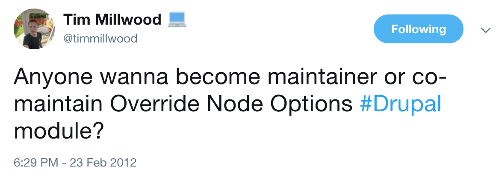
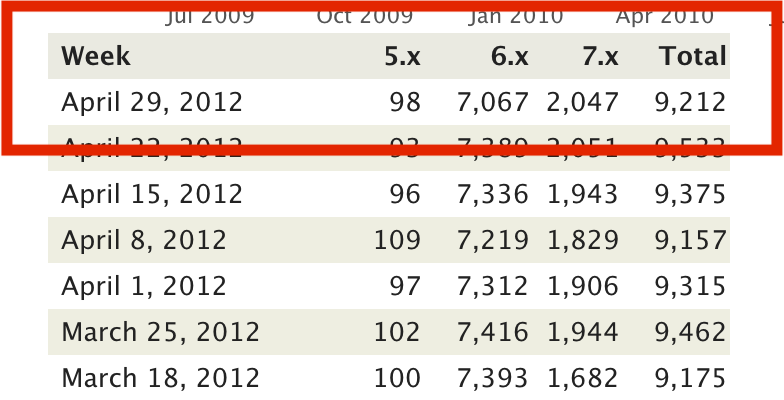
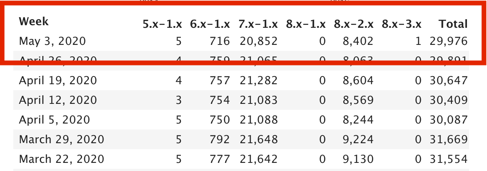
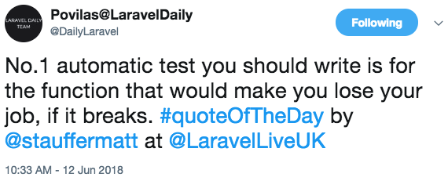
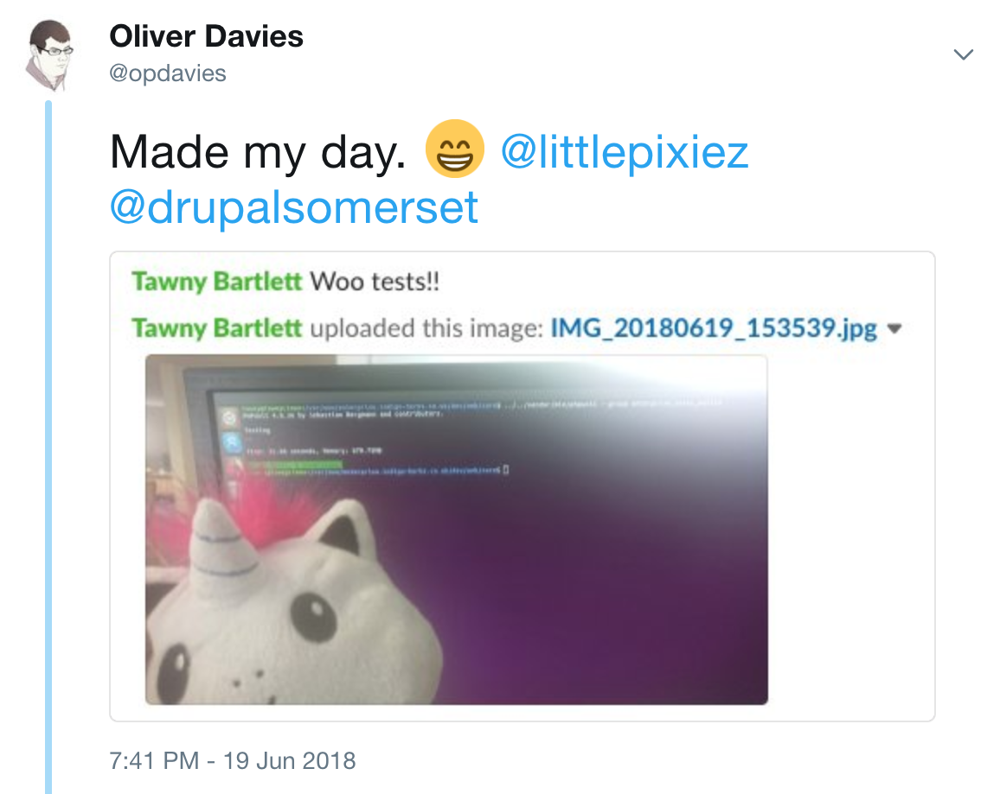

.. footer:: @opdavies

TDD: Test Driven Drupal
#######################

|

.. class:: titleslideinfo

Oliver Davies, Inviqa

.. page:: titlePage

.. class:: centredtitle

Software Engineer, open-source maintainer and contributor

.. raw:: pdf

  TextAnnotation "I develop Drupal applications for clients, including custom modules and themes."
  TextAnnotation "I contribute to open source projects including Drupal core."
  TextAnnotation "Different perspectives."

.. page:: imagePage

.. raw:: pdf

  TextAnnotation "Become maintainer in 2012"
  TextAnnotation "~223 most used module on Drupal.org"
  TextAnnotation "~30,000 sites - ~20,000 D7 and ~10,000 D8/9"

  TextAnnotation "Had some existing tests, crucial to preventing regressions"

.. page:: imagePage

.. page::

.. page:: standardPage

Why write tests?
================

* Peace of mind
* Prevent regressions
* Catch bugs earlier
* Write less code
* Documentation
* Drupal core requirement
* More important with regular D8/D9 releases and supporting multiple versions

.. raw:: pdf

    TextAnnotation "I don't want to break 30,000 Drupal sites when rolling a new release, or causing a regression in a client codebase."
    TextAnnotation "TDD often results in writing less code as you're figuring things out whilst writing the test, only writing code that's needed for the tests."
    TextAnnotation "Drupal core gates. Testing gate requires new tests for new features, failing test cases for bug fixes, and code coverage when refactoring code."
    TextAnnotation "Same projects can work for Drupal 8 and 9, and in theory 10."

Testing in Drupal
=================

* **Drupal 7** - SimpleTest (testing) module provided as part of core
* **Drupal 8** - PHPUnit added as a core dependency, later became the default via the PHPUnit initiative
* **Drupal 9** - SimpleTest removed from core, moved back to contrib

Writing Tests (Drupal 8/9)
==========================

* PHP class with ``.php`` extension
* ``tests/src`` directory within each module
* Within the ``Drupal\Tests\module_name`` namespace
* Class name must match the filename
* Namespace must match the directory structure
* One test class per feature

.. raw:: pdf

    TextAnnotation "PSR-4 autoloading."
    TextAnnotation "Different to D7."

.. page:: titlePage

.. class:: centredtitle

Arrange, Act, Assert

.. page::

.. class:: centredtitle

Given, When, Then

.. raw:: pdf

  TextAnnotation "Given the About page exists..."
  TextAnnotation "When I go to that page..."
  TextAnnotation "I should see 'About me' on the page."

.. page:: standardPage

What to test?
=============

* Creating nodes with data from an API
* Calculating attendance figures for an event
* Determining if an event is purchasable
* Promotions and coupons for new users
* Cloning events
* Queuing private message requests
* Re-opening closed support tickets when comments are added

.. raw:: pdf

  TextAnnotation "Examples of some things that I tested on a previous project."

.. page:: imagePage

.. page:: standardPage

What does a test look like?
===========================

.. code-block:: php
    :include: code/1-example-test.txt
    :linenos:
    :startinline: true

Writing test methods
====================

.. code-block:: php
    :include: code/2-test-methods.txt
    :linenos:
    :startinline: true

Types of Tests
==============

* **Functional/FunctionalJavascript** (web, browser, feature)
* **Kernel** (integration)
* **Unit**

Functional Tests
================

* Tests end-to-end functionality
* UI testing
* Interacts with database
* Full Drupal installation
* Slower to run
* With/without JavaScript

Kernel tests
============

* Integration tests
* Can install modules, interact with services, container, database
* Minimal Drupal bootstrap
* Faster than functional tests
* More setup required

.. raw:: pdf

    TextAnnotation "Can still access services like \Drupal::messenger()."

Unit Tests
==========

* Tests PHP logic
* No database interaction
* Fast to run
* Need to mock dependencies
* Can become tightly coupled
* Can be hard to refactor

.. page:: titlePage

.. class:: centredtitle

Running Tests

.. page:: standardPage

Core script
===========

.. code-block:: shell

    $ php core/scripts/run-tests.sh

    $ php core/scripts/run-tests.sh --module example

    $ php core/scripts/run-tests.sh --class ExampleTest

PHPUnit
=======

.. code-block:: shell

   $ vendor/bin/phpunit \
    -c core \
    modules/contrib/examples/phpunit_example 

.. raw:: pdf

    TextAnnotation "Update the phpunit path and config file path for your project."
    TextAnnotation "-c not needed if the phpunit.xml.dist or phpunit.xml is in the same directory."

Creating a phpunit.xml file
===========================

- Configures PHPUnit
- Needed to run some types of tests
- Ignored by Git by default
- Copy ``core/phpunit.xml.dist`` to ``core/phpunit.xml``
- Add and change as needed

    - ``SIMPLETEST_BASE_URL``, ``SIMPLETEST_DB``, ``BROWSERTEST_OUTPUT_DIRECTORY``
    - ``stopOnFailure="true"``

.. page:: titlePage

.. class:: centredtitle

Example

.. page:: imagePage

.. image:: images/broadbean-website.png
    :width: 20cm

.. page:: standardPage

Specification
=============

* Job adverts created in Broadbean UI, create nodes in Drupal.
* Application URL links users to separate application system.
* Constructed from domain, includes role ID as a GET parameter and optionally UTM parameters.
* Jobs need to be linked to offices.
* Job length specified in number of days.
* Path is specified as a field in the API.

.. raw:: pdf

    TextAnnotation "Jobs added to a different system by the client, data POSTed to Drupal."
    TextAnnotation "Job applicants would visit the job on the Drupal site, click the application URL and go to another (CRM) system to apply."
    TextAnnotation "Client wanted to be able to specify the Drupal path in advance."

.. page:: imagePage

.. image:: images/broadbean-drupal-flow-2.png
    :width: 20cm

.. page:: standardPage

Implementation
==============

* Added route to accept data from API as XML
* Added system user with API role to authenticate
* ``active_for`` converted from number of days to UNIX timestamp
* ``branch_name`` and ``locations`` converted from plain text to entity reference (job node to office node)
* ``url_alias`` property mapped to ``path``

.. raw:: pdf

    TextAnnotation "Required field missing."
    TextAnnotation "Incorrect branch name."

Incoming data
=============

.. code-block:: php
    :startinline: true

    $data = [
      'command' => 'add',
      'username' => 'bobsmith',
      'password' => 'p455w0rd',
      'active_for' => '365',
      'details' => 'This is the detailed description.',
      'job_title' => 'Healthcare Assistant (HCA)',
      'locations' => 'Bath, Devizes',
      'role_id' => 'A/52/86',
      'summary' => 'This is the short description.',
      'url_alias' => 'healthcare-assistant-aldershot-june17',
      // ...
    ];

.. raw:: pdf

    TextAnnotation "Some pf the information sent to our endpoint."

Implementation
==============

* If no error, create the job node, return OK response to Broadbean
* If an Exception is thrown, return an error code and message

.. raw:: pdf

    TextAnnotation "Required field missing."
    TextAnnotation "Branch name incorrect, Exception caught."

Types of tests
==============

* **Functional**: job nodes are created with the correct URL and the correct response code is returned
* **FunctionalJavaScript**: application URL is updated with JavaScript based on UTM parameters (hosting)
* **Kernel**: job nodes can be added and deleted, expired job nodes are deleted, application URL is generated correctly
* **Unit**: ensure number of days are converted to timestamps correctly

Results
=======

* 0 bugs!
* Easier to identify where issues occurred and responsibilities
* Reduced debugging time
* Added more tests for any bugs to prevent regressions

.. raw:: pdf

    TextAnnotation "Best case scenario."
    TextAnnotation "Just because there are tests, it doesn't mean that everything works and everything's passing - just the tests that you wrote are passing."

Test Driven Development
=======================

* Write a failing test
* Write code until the test passes
* Refactor
* Repeat

.. raw:: pdf

    TextAnnotation "Write enough of a test so that it fails."
    TextAnnotation "Write enough code so that the test passes."
    TextAnnotation "Refactor if needed."
    TextAnnotation "Repeat."

.. page:: titlePage

.. class:: centredtitle

Red, Green, Refactor

.. page:: standardPage

Porting Modules to Drupal 8
===========================

- Make a new branch
- Add/update the tests
- Write code to make the tests pass
- Refactor
- Repeat

.. raw:: pdf

    TextAnnotation "Similar to the TDD workflow."

How I Write Tests - "Outside In"
================================

- Start with functional tests
- Drop down to integration or unit tests where needed
- Programming by wishful thinking
- Write comments first, then fill in the code
- Sometimes write assertions first

.. raw:: pdf

    TextAnnotation "Write the code in your test that you wish you had, and let the tests tell you what's missing."

.. page:: titlePage

.. class:: centredtitle

Demo: Building a blog module

.. page:: standardPage

Acceptance criteria
===================

- As a site visitor
- I want to see a list of published articles at ``/blog``
- Ordered by post date, most recent first

Tasks
=====

- Ensure the blog page exists
- Ensure only published articles are shown
- Ensure the articles are shown in the correct order

.. page:: imagePage

.. page:: standardPage

Thanks!
=======

References:

* https://opdavi.es/testing-workshop
* https://testdrivendrupal.com

|

Me:

* https://www.oliverdavies.uk
