.. footer:: @opdavies

Upgrading to Drupal 9
#####################

|

.. class:: titleslideinfo

Oliver Davies, Inviqa

.. raw:: pdf

  PageBreak imagePage

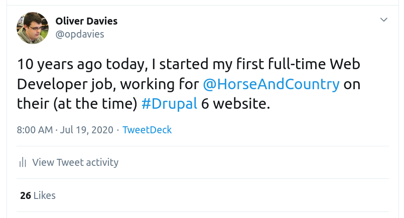

.. raw:: pdf

    TextAnnotation "Recently, I passed 10 years working full-time with Drupal and PHP (I'd been working with it for a few years prior to this too)."
    TextAnnotation "Worked with Drupal 6, 7, 8 and 9."
    TextAnnotation "Worked on a number of D6 to D7, and D8 to D9 upgrades"

    PageBreak standardPage

The D7 release cycle
====================

* One long-running branch
* Minor versions for bug fixes (7.73)
* No big, new features
* Long time for changes to get committed to core

.. raw:: pdf

    TextAnnotation "Before we get into the D9 stuff."
    TextAnnotation "D7 and earlier..."

The D8 release cycle
====================

* Semantic versioning for core
* Minor release (new features) every 6 months
* Patch release (bug fixes) every month
* Multiple supported versions of core (8.8, 8.9, 9.0)

.. raw:: pdf

    TextAnnotation "Drupal 8 onwards..."
    TextAnnotation "Minor release = new functionality"
    TextAnnotation "Patch release = bug fixes"
    TextAnnotation "Change from 'it will be ready when it's ready' (D7) to a fixed release cycle and schedule, and what makes it in time will be added."

.. raw:: pdf

    PageBreak imagePage

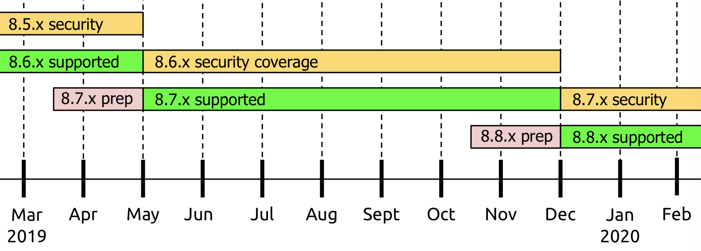

.. raw:: pdf

    PageBreak standardPage

Drupal 8 vs Drupal 9
====================

* No new functionality
* Deprecated code removed
* PHP required version increased
* Major versions of dependencies updated

.. raw:: pdf

    TextAnnotation "Different to previous major version updates"
    TextAnnotation "Symfony upgraded from 3 to 4."

Previous upgrade issues
=======================

* Lots of breaking changes
* Core released, but contrib takes time to catch up

.. raw:: pdf

    TextAnnotation "Lots of breaking changes, large rebuilds and migrations"
    TextAnnotation "6(?) months between D7 core and Views being released, prevents adoption"
    TextAnnotation "Jeff Geerling blog post 'Did breaking backwards compatibility kill Drupal?'"

Contrib improvements
====================

* Minimal code changes required
* Single release can support multiple versions of core
* Semantic versioning enabled for contrib projects

.. raw:: pdf

    TextAnnotation "Need to fix deprecation notices, and replace deprecated code with the suggested replacements"
    TextAnnotation "Modules, themes and distributions can now work with multiple versions of Drupal core in the same release"
    TextAnnotation "`core` key replaced with `core_version_requirement`"

    PageBreak imagePage

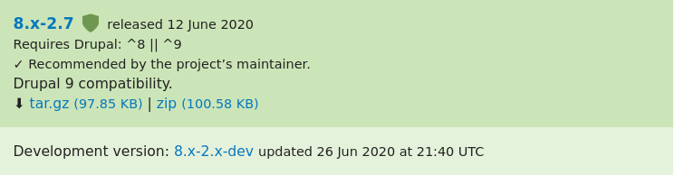

|

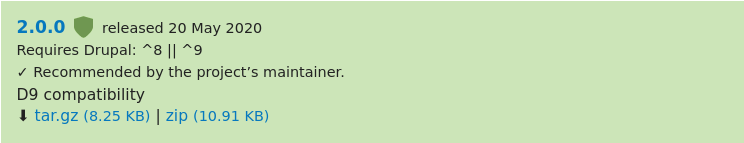

.. raw:: pdf

    PageBreak titlePage

.. class:: centredtitle

The difference  is deprecated code

.. raw:: pdf

    TextAnnotation "Code that has been replaced by newer code and marked to be removed."
    TextAnnotation "Not removed immediately to keep backwards compatibility."
    TextAnnotation "A backwards compatibility break would require a major version change rather than a minor one."

    PageBreak standardPage

Deprecation example
===================

.. code-block:: php
    :startinline: true

    function drupal_set_message($message = NULL, $type = 'status', $repeat = FALSE) {
      @trigger_error('drupal_set_message() is deprecated in Drupal 8.5.0 and will
      be removed before Drupal 9.0.0. Use \Drupal\Core\Messenger\MessengerInterface
      ::addMessage() instead. See https://www.drupal.org/node/2774931',
      E_USER_DEPRECATED);

      $messenger = \Drupal::messenger();
      if (isset($message)) {
          $messenger->addMessage($message, $type, $repeat);
      }
      return $messenger->all();
    }

.. raw:: pdf

    TextAnnotation "drupal_set_message has been replaced by a Messenger service, this should be used instead."
    TextAnnotation "Works but triggers an error in 8.9, breaks in 9.0."
    TextAnnotation "To ensure D9 compatibility, update all of the deprecated code."

    PageBreak titlePage

.. class:: centredtitle

How do I find it?

.. raw:: pdf

    PageBreak standardPage

Drupal Check
============

- Developed by Matt Glaman
- "Built on PHPStan, this static analysis tool will check for correctness (e.g. using a class that doesn't exist), deprecation errors, and more."
- https://github.com/mglaman/drupal-check

.. raw:: pdf

    PageBreak titlePage

.. class:: centredtitle

``composer global require
mglaman/drupal-check``

.. page::
.. class:: centredtitle

``drupal-check web/modules/custom``

.. raw:: pdf

    PageBreak imagePage

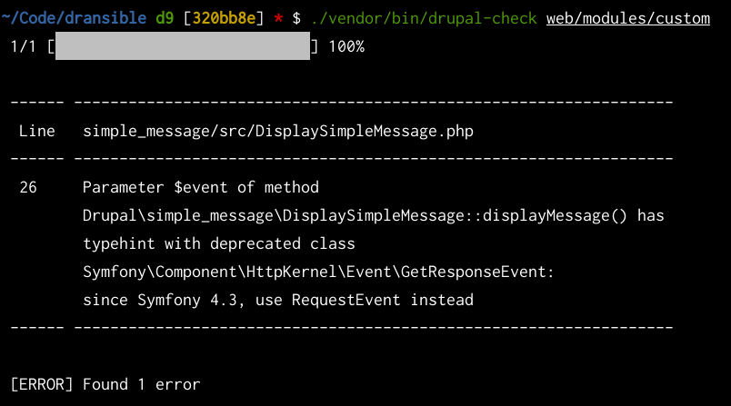

.. raw:: pdf

    PageBreak titlePage

.. class:: centredtitle

Upgrade Status module

.. raw:: pdf

    PageBreak imagePage

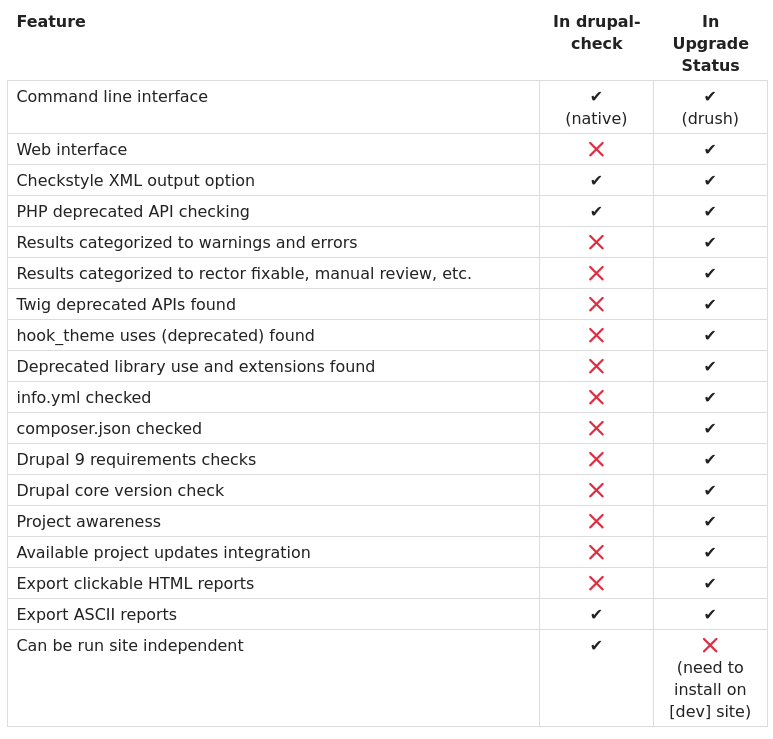

.. raw:: pdf

    PageBreak standardPage

PHPUnit Bridge
==============

- Drupal 8 uses Symfony's PHPUnit Bridge
- Includes a 'Deprecation Helper'
- Displays deprecation notices in test output

.. raw:: pdf

    PageBreak imagePage

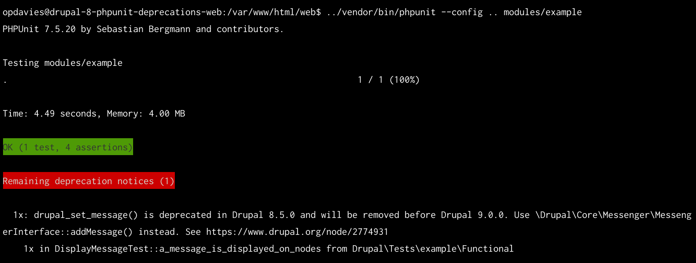

.. raw:: pdf

    PageBreak standardPage

Fixing deprecations
===================

.. code-block:: diff

    - drupal_set_message($text);
    + Drupal::messenger()->addMessage($text);

.. image:: images/logo-composer-transparent.png
    :width: 10cm

Composer
========

- Dependency management tool for PHP
- My preferred way to manage Drupal codebases
- composer.json lists your dependencies and version constraints
- composer.lock stores the installed dependencies and versions
- Separate packages for ``core-recommended``, ``core-dev`` and ``core-composer-scaffold``

.. raw:: pdf

    TextAnnotation "Used by the majority of PHP frameworks and projects (Symfony, Laravel, Drush, Drupal Console)."

    PageBreak titlePage

.. class:: centredtitle

``composer require
drupal/admin_toolbar:^2.0``

.. page::
.. class:: centredtitle

``composer install``

.. page::
.. class:: centredtitle

``composer update
drupal/admin_toolbar``

.. page::
.. class:: centredtitle

Always add '--no-dev' in production

.. raw:: pdf

    PageBreak titlePage
    TextAnnotation "Prevents development dependencies from being installed, and potential security exploits from being added."

.. class:: centredtitle

An Example: Dransible

.. class:: centred

https://github.com/opdavies/dransible

.. raw:: pdf

    PageBreak imagePage

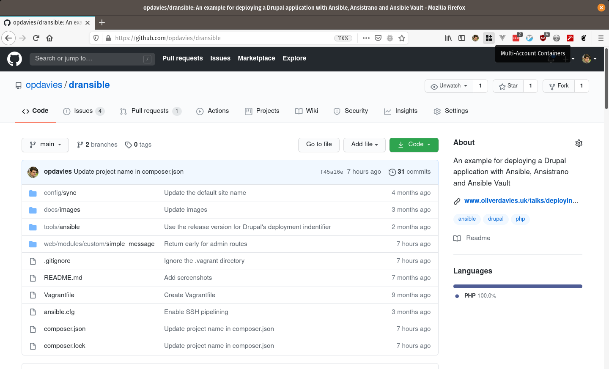

.. raw:: pdf

    PageBreak standardPage

Upgrading Dransible
===================

- Remove Drush (temporarily)
- Update from Drupal 8.8 to 8.9
- Add Upgrade Status module
- Update contrib modules to D9 compatible versions
- Remove incompatible contrib modules (if possible)
- Fix deprecations in custom code
- Upgrade from Drupal 8.9 to 9.0

.. raw:: pdf

    TextAnnotation "Without removing Drush, 8.9.0-beta2 rather than 8.9.2"
    TextAnnotation "Updated Admin Toolbar module to a D9 compatible version"
    TextAnnotation "Removed Config Installer as no longer needed"
    TextAnnotation "Fixed deprecation warnings in custom code"
    TextAnnotation "Installed Drush 10, removed and uninstalled Upgrade Status module"

    PageBreak titlePage

.. class:: centredtitle

``composer update drupal/core-*
--with-dependencies``

.. page::
.. class:: centredtitle

``composer require
drupal/upgrade_status``

.. raw:: pdf

    PageBreak imagePage

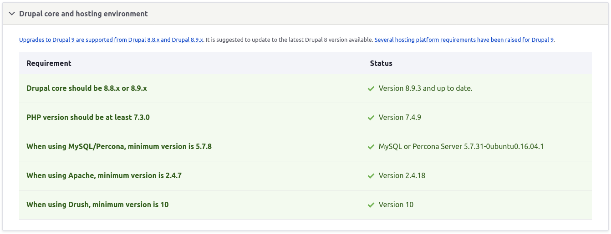

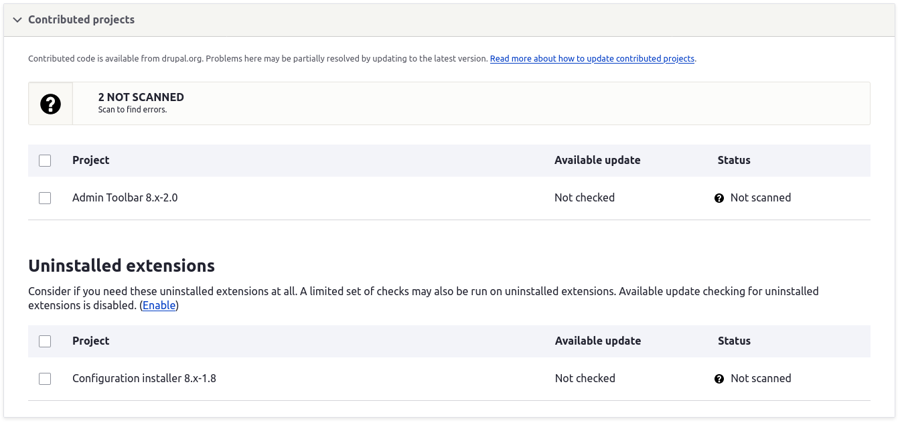

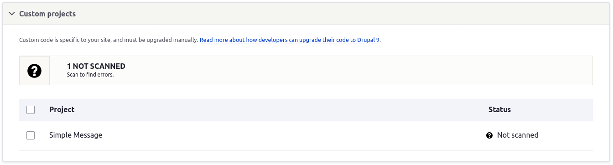

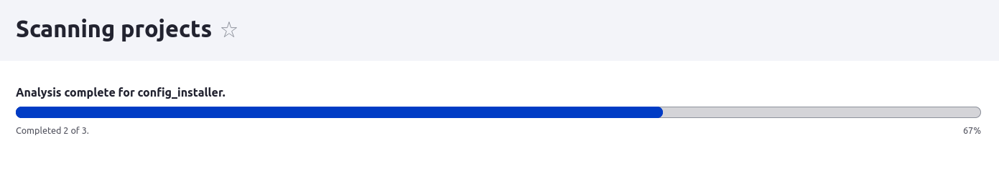

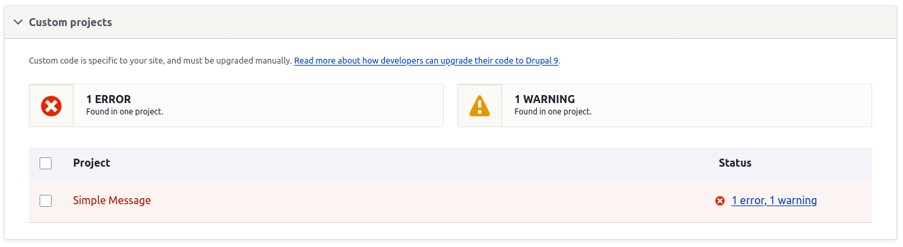

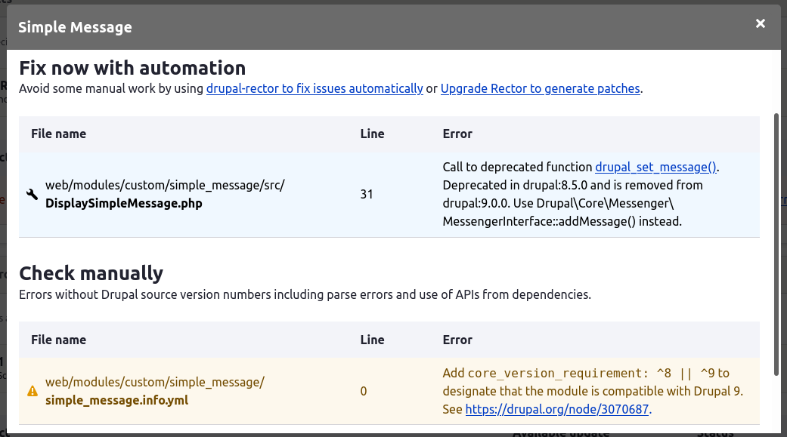

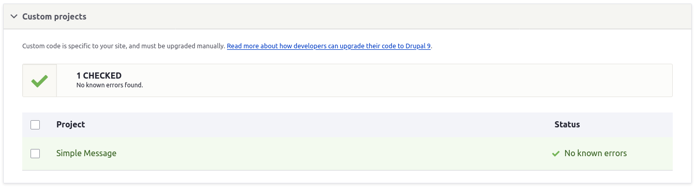

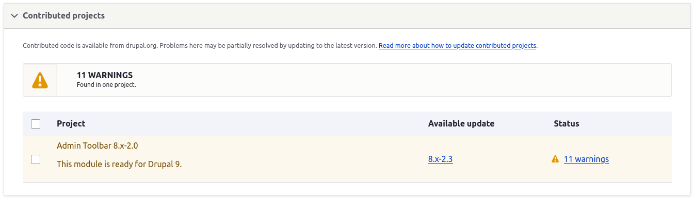

.. raw:: pdf

    PageBreak titlePage

.. class:: centredtitle

``composer update drupal/core-*
--with-dependencies``

.. raw:: pdf

    PageBreak imagePage

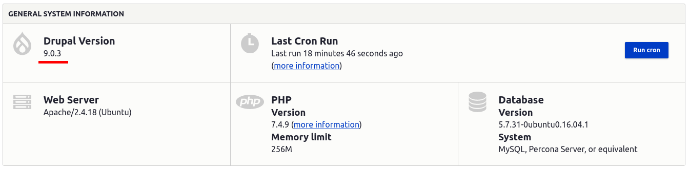

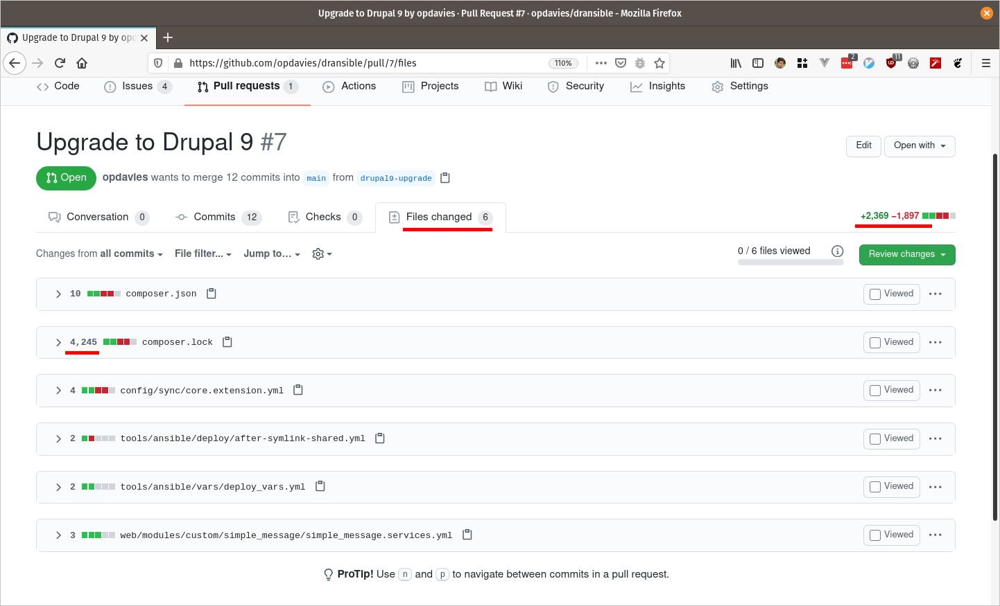

.. raw:: pdf

    TextAnnotation "Only 6 files changed rather than hundreds or thousands"
    TextAnnotation "Vast majority of the changes in composer.lock (to be expected)"
    TextAnnotation "Half of the changed files are project specific. Could have been 2 or 3 files changed on some projects."

    PageBreak titlePage

.. class:: centredtitle

There were some autowiring gotchas...

.. raw:: pdf

    PageBreak

``Error: Class 'Symfony\Component\Config\Resource\ClassExistenceResource' not found in Symfony\Component\DependencyInjection\Compiler\AutowirePass->createTypeNotFoundMessage()``

.. page::

.. class:: centredtitle

``composer require
symfony/config:^4``

.. raw:: pdf

    TextAnnotation "Composer tried installing version 5 by default, so locked to 4.x."

    PageBreak titlePage

``Cannot autowire service "Drupal\simple_message\DisplaySimpleMessage": argument "$messenger" of method "__construct()" references interface "Drupal\Core\Messenger\MessengerInterface" but no such service exists. You should maybe alias this interface to the existing "messenger" service``

.. raw:: pdf

    PageBreak standardPage

Fixing autowiring
=================

.. code-block:: yaml

    services:
      Drupal\simple_message\DisplaySimpleMessage:
        autowire: true
        tags:
          - { name: event_subscriber }

Fixing autowiring
=================

.. code-block:: diff

      services:
    +   Drupal\Core\Messenger\MessengerInterface:
    +     alias: messenger
    +     private: true

        Drupal\simple_message\DisplaySimpleMessage:
          autowire: true
          tags:
            - { name: event_subscriber }

.. raw:: pdf

    PageBreak titlePage

..

    The big deal about Drupal 9 is... that it should not be a big deal

    -- Dries Buytaert

.. raw:: pdf

    TextAnnotation "Dransible updated in 1-2 hours."
    TextAnnotation "No big rewrite."
    TextAnnotation "Smallest core update PR ever!"

    PageBreak standardPage

Drupal 10
=========

- Released around June 2022
- Drupal 9 EOL around November 2023
- Symfony 4 EOL in November 2023
- Another easy upgrade

.. raw:: pdf

    TextAnnotation "Need to keep up to date with dependencies."

Thanks!
=======

References:

* https://www.drupal.org/docs/understanding-drupal
* https://dri.es/drupal-9-0-0-released
* https://dri.es/drupal-10-target-release-date-and-drupal-9-end-of-life
* https://github.com/opdavies/dransible

|

Me:

* https://www.oliverdavies.uk
