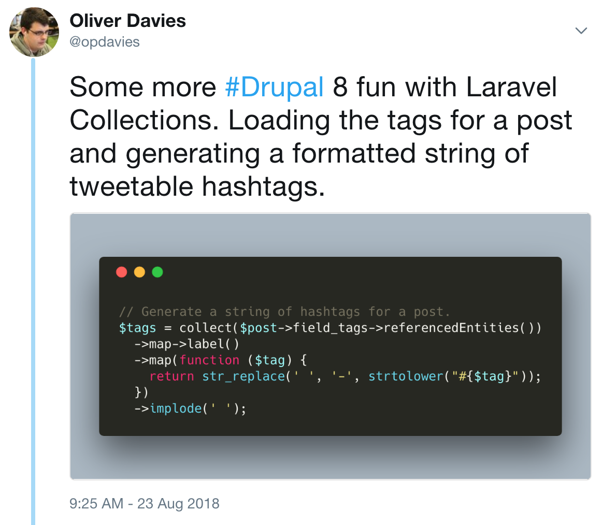
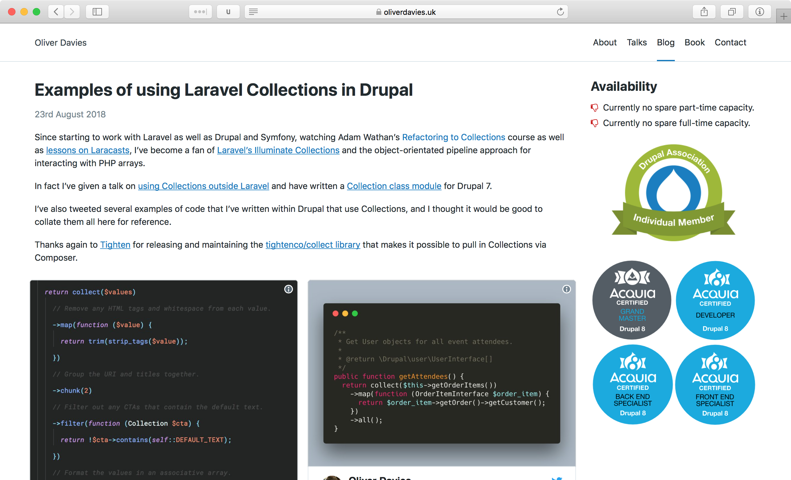

theme: poster, 8
autoscale: true
build-lists: true
header-emphasis: #53B0EB
header: alignment(left)
text: alignment(left)
text-emphasis: #53B0EB
code: Operator Mono, line-height(1.5)

[.background-color: #FFFFFF]
[.hide-footer]
[.header: #111111, alignment(center)]

## Using Laravel Collections... <br>Outside Laravel


---

[.header: alignment(center)]

## Collections :thumbsup:

^ Became a fan of Collections whilst learning Laravel
Powerful object orientated way to interact with arrays
Store items within the collection, run methods, chainable
More readable, less temporary variables
Video on Laracasts, Adam Wathan's refactoring to Collections
Wanted to use them with different PHP projects e.g. Drupal

---

```php
collect(['foo', 'bar']); // ['foo', 'bar']

collect('foobar'); // ['foobar']

$object = new stdClass();
$object->foo = 'bar'; 
collect($object); // ['foo' => 'bar']
collect($object)->get('foo'); // bar
```

^ How do you make a collection?
collect function is provided
String, array or object
Stored as items within the Collection object

---

```php
$collection = collect(['a', 'b', 1, 'c', 2, 'd', 'e', 3, 4]);

$collection->count(); // 9

$collection->first(); // a

$collection->first(function ($item) {
  return is_numeric($item);
}); // 1

$collection->contains(2); // true

$collection->contains([2, 10]); // false

$collection->filter(function ($item) {
  return $item > 2;
}); // [3, 4]
```

^ Once you have a collection, what can you do with it?
"contains" - no more needle/haystack, haystack/needle
"filter" - filters false, null values
Can pass callbacks to `first` and `filter`, return true or false as needed.

---

```php
$collection = collect([
    ['name' => 'John', 'email' => 'john@example.com', 'age' => 31],
    ['name' => 'Jane', 'email' => 'jane@example.com', 'age' => 27],
]);

$collection->pluck('name'); // ['John', 'Jane']

$collection->pluck('name')->sort(); // ['Jane', 'John']

$collection->filter(function ($person) {
    return $person['age'] >= 30;
})->pluck('name'); // ['John']
```

---

[.background-color: #FFFFFF]


^ This is great, but how can I do that in my Drupal code?
How can I do that?

---

## There’s a module for that!
### _- Drupalers_

---

[.text: alignment(center)]

## [fit] There's not a module for that. :disappointed:
### _- Me_

---


^ Drupal 7

---


### _Version 1.0_
## Write my own Collection class

^ Wrote my own Collection class
Wrote my own tests

---


^ Maybe 70% of what Laravel's could do.

---


^ Can't remember how, but then I found this.

---


### Collect - Illuminate Collections as a separate package.
#### _https://packagist.org/packages/tightenco/collect_

---

### Import Laravel's Collections into non-Laravel packages easily, without needing to require the entire Illuminate\Support package.
#### _https://packagist.org/packages/tightenco/collect_

---

[.background-color: #FFFFFF]


^ Can install via Composer

---

## _composer require_<br>tightenco/collect

---


---


---

### _Version 2.0_
## Use someone else’s Collection class

^ More fully featured, less code to maintain

---

[.background-color: #FFFFFF]


---

[.build-lists: false]

- Install Composer
- Require `tightenco/collect`
- Include `autoload.php`
- `collect()` away!

---

[.build-lists: false]

- Install Composer
- Require `tightenco/collect`
- Include `autoload.php`
- `collect()` away!


---

```php
// index.php

require __DIR__ . '/vendor/autoload.php';

$collection = collect(['foo', 'bar']);

$collection->each(function ($item) {
    // Do something.
});
```

^ Require/include autoload.php
Start using Collections!
`collect` function is autoloaded

---

[.background-color: #FFFFFF]


^ Drupal 8, Sculpin site, PHP libraries

---

[.background-color: #FFFFFF]



---



---

[.header: alignment(center)]

# Thanks!
### _@opdavies_
### _oliverdavies.uk_
