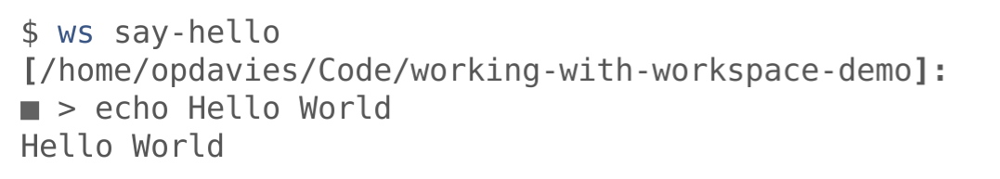

.. footer:: @opdavies

Working with Workspace
######################

|

.. class:: titleslideinfo

Oliver Davies, Inviqa

.. raw:: pdf

    TextAnnotation "Full stack Developer and Systems Administrator"
    TextAnnotation "Organiser of PHP South Wales"

.. page:: standardPage

What is Workspace?
==================

* A tool that we use and maintain at Inviqa
* Primarily for building and managing Docker Compose environments
* Built on Symfony
* Create custom commands for your project environments
* Alternative to a bash script or a Makefile
* And more...

.. raw:: pdf

    TextAnnotation "Available on GitHub, MIT licensed."
    TextAnnotation "Uses Config, Console, Dependency Injection, Expression Language, Finder and YAML components, as well as Twig."
    TextAnnotation "Replacement for commands like 'make build'"
    TextAnnotation "Useful for simplifying long, complicated commands, e.g. Docker, Ansible."

Features
========

* Commands
* Functions
* Attributes
* Encrypting/decrypting secrets
* Generating configuration files
* Global services: logging, mail, proxy

.. raw:: pdf

    TextAnnotation "Generating settings.php files, Dockerfiles and Docker Compose from a central set of attributes."
    TextAnnotation "Logging with kibana, mailhog, Traefik proxy."

Installation
============

.. code-block:: bash
    :include: code/installation.txt

.. page:: imagePage

.. image:: images/output-simple.png
    :width: 15cm

.. page:: titlePage

.. class:: centredtitle

Replacing your Makefile

.. page:: standardPage

Running simple commands
=======================

.. code-block:: yaml
    :include: code/simple-command.txt
    :linenos:

.. page:: imagePage

.. page:: standardPage

'run' vs. 'passthru'
====================

.. code-block:: yaml
    :include: code/run-passthru.txt

Attributes
==========

.. code-block:: yaml
    :include: code/attributes.txt
    :linenos:

Arguments
=========

.. code-block:: yaml
    :include: code/arguments.txt
    :linenos:

Environment variables
=====================

.. code-block:: yaml
    :include: code/environment-variables.txt
    :linenos:

Managing secrets
================

.. code-block:: yaml
    :include: code/secrets.txt

.. raw:: pdf

    TextAnnotation "Shortened for slides"
    TextAnnotation "Store default key in an overrides file that's ignored from Git, and somewhere secure like a password manager."

.. page:: titlePage

.. class:: centredtitle

Example: building slides from rst2pdf

.. page:: standardPage

Attributes
==========

.. code-block:: yaml
    :include: code/workspace-talks.txt
    :end-before: command('pdf generate <talk>'): |

Generating PDFs
===============

.. code-block:: yaml
    :include: code/workspace-talks.txt
    :start-at: command('pdf generate <talk>'): |
    :end-before: command('thumbnail <talk>'):

Generating thumbnails
=====================

.. code-block:: yaml
    :include: code/workspace-talks.txt
    :start-at: command('thumbnail <talk>'):

.. page:: titlePage

.. class:: centredtitle

Configuration files

.. page:: standardPage

Using confd
===========

.. code-block:: yaml
    :include: code/confd.txt
    :linenos:

.. raw:: pdf

    TextAnnotation ".twig file extension is assumed."

vhost.conf.twig
===============

The source file.

|

.. code-block:: twig
    :include: code/nginx-vhost.txt
    :end-before: # output
    :linenos:

default.conf
============

The generated file.

|

.. code-block:: nginx
    :include: code/nginx-vhost.txt
    :start-after: # output
    :linenos:

.. page:: titlePage

.. class:: centredtitle

Demo: "Workspacing" my site

.. page:: standardPage

Thanks!
=======

References:

* https://github.com/my127/workspace
* https://oliverdavies.link/workspace-demo
* https://oliverdavies.link/workspacing-site

|

Me:

* https://www.oliverdavies.uk
